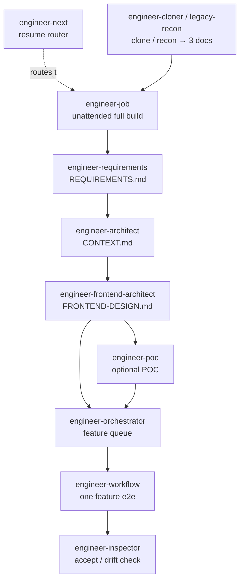

# iannil/skills

**A composable AI engineering skill chain that builds whole projects unattended — from vague idea to shipped code.**

**English** | [简体中文](README.zh-CN.md)

[](LICENSE)
[](#available-skills)
[](package.json)
[](#install)


19 installable skills for AI coding agents (Claude Code, Codex, Cursor, and more). The centerpiece is a **13-skill engineering chain** built on the "Implementation-Planning-Driven AI-Assisted Programming" methodology: describe what you want, and the chain runs requirements → architecture → frontend design → orchestrated development → inspection, unattended, enforcing three hard disciplines that stop architecture drift. Also ships product-analysis and RC-philosophy skill sets.

Each skill uses the standard `skills/<name>/SKILL.md` layout compatible with the broader skills ecosystem (including the `vercel-labs/skills` installer), so it drops into any compliant agent.

## How the engineering chain fits together



Enter at whichever box matches your situation — every skill knows how to hand off to the next. Not sure where you are? Start with `engineer-next`.

## Quick Start

```bash
# Install ALL skills into Claude Code (~/.claude/skills)
git clone https://github.com/iannil/skills && cd skills
./install.sh
```

Then in your agent, just describe the project — e.g. *"build me a task-tracker from scratch, unattended"* — and `engineer-job` takes it from there. No `npx`, no download; `install.sh` is zero-dependency and re-run-to-update.

Prefer a package installer instead? `npx iannil/skills install all` — see [Install](#install) for every option.

⭐ If this saves you a weekend of scaffolding, a star helps others find it.

## Available Skills

### Engineering Skills

Based on the "Implementation Planning-Driven AI-Assisted Programming in Practice" methodology, the complete engineering development skill chain:

- `engineer-job` — **AI Project Auto-Build Engine** (P0). Meta-orchestrator that automatically executes the full project lifecycle: scaffolding → architecture design → multi-feature development → integration testing → deployment config generation. Supports `--auto` (auto-confirm) and `--silent` (silent) modes for unattended project building.
- `engineer-next` — **AI Resume Router**. The universal "continue from wherever I am" entry point. Reads the engineer-* state fingerprint (`.agents/job.state.json`, `.agents/progress.json`, `CONTEXT.md`, `REQUIREMENTS.md`, `project-metadata.json`, code volume), diagnoses where the project stopped, and hands off to the right skill to resume — `engineer-job` (re-invokes its Workflow with reconstructed args, skipping done phases), `engineer-orchestrator` (milestone-level recovery when development is mid-flight — never re-invokes job, which would redo milestones), `engineer-architect` (blueprint gap, or reverse-engineering a foreign project), or `engineer-requirements`. Foreign projects with no engineer-* artifacts onboard adaptively: near-empty → fresh `engineer-job`, substantial existing code → reverse-engineer a blueprint first. Pure router — it never re-implements phases or writes progress files.
- `engineer-cloner` — **AI Reverse Site-Clone Front-End Engine**. Given an authorized target URL and a full-access account, reverse-observes the running site via `agent-browser` (login → loop-until-dry traversal → feature ledger → API/design extraction), then produces `REQUIREMENTS.md` / `CONTEXT.md` / `FRONTEND-DESIGN.md` plus an honest `CLONE-FIDELITY.md` (observable-exact / inferred / unobservable), and hands off to `engineer-job` for a full-lifecycle, high-precision clone. Does design-language reconstruction + modern-stack rebuild — never raw-asset copying or backend-source claims.
- `engineer-legacy-recon` — **AI Legacy-System Static-Recon Front-End** (offline sibling of `engineer-cloner`). When you can't reach the live system but the user **pastes the legacy system's page content + navigation menus** (or screenshots / exported HTML), this skill treats that material as the sole source of truth — **no browsing, no `agent-browser`** — and statically infers the module map, entity fields, actions, state machines, and role/permission split. Grades every finding as `明示 / Stated`, `推断 / Inferred`, or `缺口 / Gap`, produces `REQUIREMENTS.md` / `CONTEXT.md` / `FRONTEND-DESIGN.md` plus a `RECON-FIDELITY.md` (with a gap list to ask the user about), then hands off to `engineer-job`. Escalate to `engineer-cloner` only if the user explicitly wants live verification with an authorized account.
- `engineer-requirements` — **AI Requirements Analyst**. Decomposes vague user requirements into a structured requirements document using Event Storming + DDD strategic design — bounded contexts, business events, functional dependencies, and key state machines. Outputs `REQUIREMENTS.md` for `engineer-architect` to consume. Triggers for complex, multi-module, or multi-end systems (2+ frontends or 5+ feature modules).
- `engineer-architect` — **AI Architect** (P0). Translates vague user requirements into a structured CONTEXT.md blueprint. Automatically researches, analyzes, and proposes technical solutions, generating an executable blueprint that includes system overview, data models, API contracts, and milestone dependency tree.
- `engineer-frontend-architect` — **AI Frontend Architect**. Detailed frontend design performed *after* the system architecture is complete. Outputs `FRONTEND-DESIGN.md` with page tree, component tree, state-management architecture, UI state machines, and design-system tokens — for multi-surface systems (Web / mini-program / mobile). Must run after `engineer-architect`; auto-triggers when a project has 2+ frontend surfaces.
- `engineer-poc` — **AI High-Fidelity POC Engine**. Turns requirements into a runnable, **pure-frontend, evolutionary** prototype: reads `REQUIREMENTS.md` + `FRONTEND-DESIGN.md` (+ `CONTEXT.md`), identifies the industry and applies a built-in pattern library, then builds every page with all UI states (loading/empty/error/normal/edge) on a swappable mock-adapter seam — full-function coverage guaranteed by a `.agents/poc.ledger.json` + loop-until-dry + coverage critic. Outputs `POC-MANIFEST.md` (mock→real evolution map) and an honest `POC-FIDELITY.md` (`真实交互` / `mock 数据` / `占位未实现`). Slots into `engineer-job` as optional Phase 3.5 — the project can **stop at the POC**, **skip it**, or **continue** as Phase 4 evolves the mock layer into a real backend. No backend required.
- `engineer-orchestrator` — **AI Project Orchestration Engine** (P0). Receives the project blueprint, automatically decomposes it into a feature-level task queue, invokes engineer-workflow one by one in dependency order, and manages cross-feature integration acceptance, context reset, and cross-session progress persistence.
- `engineer-workflow` — **AI Coding Fully Automated Workflow Engine**. Takes a single feature requirement as input and automatically executes: milestone breakdown → dispatch instructions → coding → acceptance → branch decision → commit consolidation → update blueprint.
- `engineer-coach` — **AI Coding Process Coach**. A six-step SOP guides users through AI-assisted programming: breakdown → dispatch instructions → coding → acceptance → branch decision → consolidation.
- `engineer-inspector` — **AI Code Architecture Inspector**. Detects three major signals of architecture drift (foundation tampering / over-engineering / size runaway) and outputs a structured acceptance report.
- `engineer-advisor` — **AI Coding Knowledge Advisor**. Diagnoses conversation health, evaluates whether context reset, instruction elevation, or complete rebuild is needed.

### Project & Product Skills

- `init-project` - Complete project initialization workflow with docs, memory, release structure, observability conventions, and language-specific scaffolding.
- `product-analysis-framework` - Structured product and startup analysis framework with market evidence, user pain, moat, business model, risks, and reusable startup patterns.

### RC Philosophy Skills

- `rc-tutor` - Teach the RC (Observational Convergence) philosophical framework to complete beginners — zero philosophy background assumed.
- `rc-application-tool` - Apply RC to diagnose real-world problems (decisions, teams, strategy) and analyze/rewrite marketing copy.
- `rc-philosophy-advisor` - Discuss deep philosophical questions through the RC lens and generate new RC-style aphorisms and fragments.
- `rc-text-assistant` - Write, reference, cite, search, and translate content related to the RC philosophical framework.

## Best Practices

### Pick the right entry skill

The engineering skills form a chain. Enter at the point that matches your situation — each skill knows how to hand off to the next:

| Your situation | Start here | Produces |
|---|---|---|
| "Build the whole project from scratch, unattended" | `engineer-job` | full project |
| "Continue from where I stopped" / don't know which skill / resume | `engineer-next` | routes to the right resume point |
| Clone an existing running site you're authorized to rebuild | `engineer-cloner` | three docs → `engineer-job` |
| Rebuild a legacy system from pasted page content + menus (no live access) | `engineer-legacy-recon` | three docs + gap list → `engineer-job` |
| Complex / multi-module / multi-end system, requirements still fuzzy | `engineer-requirements` | `REQUIREMENTS.md` |
| Clear business goal, no architecture blueprint yet | `engineer-architect` | `CONTEXT.md` |
| Architecture done, project has a frontend (esp. 2+ surfaces) | `engineer-frontend-architect` | `FRONTEND-DESIGN.md` |
| Want a high-fidelity clickable prototype before real implementation | `engineer-poc` | runnable pure-frontend POC + `POC-MANIFEST.md` → `engineer-job` |
| Blueprint exists, deliver the whole project feature-by-feature | `engineer-orchestrator` | integrated project |
| One feature, end-to-end | `engineer-workflow` | shipped feature |
| You want to drive coding yourself, with guidance | `engineer-coach` | — |

`init-project` is for **scaffolding conventions only**; for a full build use `engineer-job`.

### Follow the three disciplines (red lines)

These are the methodology's non-negotiables — the skills enforce them, and you should too:

- *no work without a blueprint* — Don't start coding before `requirements` / `architect` / `frontend-architect` have produced their design docs.
- *no consolidation without verification* — Never commit or "consolidate" generated code before acceptance. Run `engineer-inspector` first.
- *rebuild on chaos* — When a session turns into a tangled mess, reset context and rebuild from the persisted blueprint. Don't power through.

### Install the chain, not just one skill

The engineering skills are designed to compose: `requirements → architect → frontend-architect → orchestrator → workflow → inspector`. Installing only a subset can break the handoff contracts between them, so prefer installing all of them (`./install.sh` with no args).

### Keep context lean

These skills emit many artifacts (`CONTEXT.md`, `REQUIREMENTS.md`, `FRONTEND-DESIGN.md`, `.agents/` state). When a conversation grows long, start a fresh session and point it at the persisted blueprint/state instead of continuing in a bloated context. `engineer-advisor` can diagnose when a reset is warranted.

### Accept before you advance

After any generated code, review and accept (`engineer-inspector`) **before** saying "continue" or committing. Saying "continue" without review is how architecture drift compounds.

## Install

Install all skills with the package-specific CLI:

```bash
npx iannil/skills install all
```

Install one skill:

```bash
npx iannil/skills install init-project
npx iannil/skills install product-analysis-framework
npx iannil/skills install rc-tutor
```

Preview without changing anything:

```bash
npx iannil/skills install --dry-run
```

## Local Install (offline, with auto-update)

A dependency-free `install.sh` is bundled for offline install. It copies the skills into your agent's skills directory, and **overwrites on re-run — so re-running after `git pull` updates every skill to the latest copy**.

```bash
# Install/update ALL skills into Claude Code (~/.claude/skills)
./install.sh

# Install/update specific skills only
./install.sh init-project engineer-architect

# Target a different agent — or both
./install.sh --agent codex
./install.sh --agent all            # Claude Code + Codex

# Custom directory / preview / list
./install.sh --target ~/my/skills
./install.sh --dry-run
./install.sh --list
```

Update to the latest version any time:

```bash
git pull && ./install.sh
```

It works offline (no `npx`, no download), is macOS bash 3.2 compatible, and preserves the `rc-text-assistant → rc-philosophy-advisor` symlink.

## Standard Skills Installer

For the widest AI tool compatibility, use the standard `skills` installer directly:

```bash
npx skills add iannil/skills --skill '*'
npx skills add iannil/skills --skill init-project
npx skills add iannil/skills --skill product-analysis-framework
npx skills add iannil/skills --skill rc-tutor
```

The standard installer handles the target agent layout for tools such as Claude Code, Codex CLI, Cursor, Gemini CLI, Continue, Windsurf, OpenCode, Qwen Code, and other compatible AI coding tools.

## Local Development

List skills:

```bash
node bin/skills.js list
```

Run dry-run install:

```bash
node bin/skills.js install all --dry-run
```

Run tests:

```bash
npm test
```

## Repository Layout

```text
skills/
├── engineer-job/
│   └── SKILL.md                    # P0 — meta-orchestrator / unattended full-project build
├── engineer-next/
│   ├── SKILL.md                    # resume router — detects state, hands off to the right skill
│   └── references/                 # resume-logic.js (pure), detect-resume.js (CLI), handoff-protocol.md
├── engineer-requirements/
│   └── SKILL.md                    # requirements decomposition / Event Storming + DDD
├── engineer-architect/
│   └── SKILL.md                    # P0 — requirements → blueprint auto-generation
├── engineer-frontend-architect/
│   └── SKILL.md                    # frontend detailed design / FRONTEND-DESIGN.md
├── engineer-poc/
│   ├── SKILL.md                    # high-fidelity pure-frontend POC engine / optional Phase 3.5
│   └── references/                 # industry-patterns, poc-ledger schema, mock-layer guide, templates, pipeline
├── engineer-orchestrator/
│   └── SKILL.md                    # P0 — project-level orchestration engine
├── engineer-workflow/
│   └── SKILL.md                    # fully-automated feature development engine
├── engineer-coach/
│   └── SKILL.md                    # process coach / six-step SOP
├── engineer-inspector/
│   └── SKILL.md                    # code architecture inspector
├── engineer-advisor/
│   └── SKILL.md                    # coding knowledge advisor
├── init-project/
│   ├── SKILL.md
│   └── references/
│       └── conventions-guide.md
├── product-analysis-framework/
│   └── SKILL.md
├── rc-application-tool/
│   ├── SKILL.md
│   └── evals/
│       └── evals.json
├── rc-philosophy-advisor/
│   ├── SKILL.md
│   ├── evals/
│   │   └── evals.json
│   └── references/
│       └── philosophy-corpus.md
├── rc-text-assistant/
│   ├── SKILL.md
│   ├── evals/
│   │   └── evals.json
│   └── references/
│       └── philosophy-corpus.md → (symlink to ../rc-philosophy-advisor/references/)
└── rc-tutor/
    ├── SKILL.md
    └── evals/
        └── evals.json
```

## License

MIT
