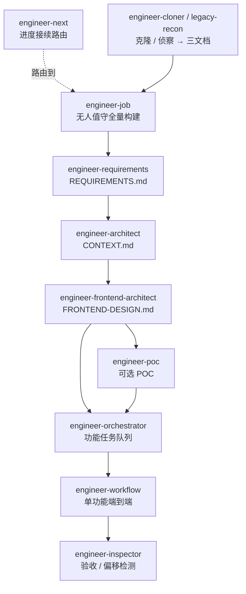

# iannil/skills

**一条可组合的 AI 工程技能链，无人值守地把一个模糊想法做成上线代码。**

[English](README.md) | **简体中文**

[](LICENSE)
[](#可用技能)
[](package.json)
[](#安装)


面向 AI 编码 Agent（Claude Code、Codex、Cursor 等）的 19 个可安装技能。核心是一条 **13 个技能组成的工程链**，基于"实现规划驱动的 AI 辅助编程"方法论：描述你想要什么，这条链就自动跑完 需求 → 架构 → 前端设计 → 编排开发 → 验收，无人值守，并强制执行三条阻止"架构偏移"的硬纪律。此外还附带产品分析与 RC 哲学两套技能。

每个技能都遵循标准 `skills/<name>/SKILL.md` 目录结构，兼容更广泛的技能生态（含 `vercel-labs/skills` 安装器），可直接接入任何兼容的 Agent。

## 工程链如何串起来



从最贴近你处境的那个节点进入——每个技能都知道如何交接给下一个。不知道自己在哪一步？先用 `engineer-next`。

## 快速开始

```bash
# 安装全部技能到 Claude Code（~/.claude/skills）
git clone https://github.com/iannil/skills && cd skills
./install.sh
```

然后在你的 Agent 里直接描述项目——例如*"帮我从零无人值守做一个任务管理工具"*——`engineer-job` 会接管一切。无需 `npx`、无需下载；`install.sh` 零依赖，重跑即更新。

想用包安装器？`npx iannil/skills install all`——完整选项见[安装](#安装)。

⭐ 如果它帮你省下一个周末的脚手架时间，点个 star 能让更多人找到它。

## 可用技能

### 工程类技能

基于"实现规划驱动的 AI 辅助编程实战"方法论，构成完整的工程开发技能链：

- `engineer-job` — **AI 项目全自动构建引擎**（P0）。元编排引擎，自动执行完整项目生命周期：脚手架 → 架构设计 → 多功能开发 → 集成验收 → 部署配置生成。支持 `--auto`（自动确认）与 `--silent`（静默）模式，实现无人值守的项目构建。
- `engineer-next` — **AI 进度接续路由引擎**。"随时随地接着上次继续"的万能入口。读取 engineer* 状态指纹（`.agents/job.state.json`、`.agents/progress.json`、`CONTEXT.md`、`REQUIREMENTS.md`、`project-metadata.json`、代码体量），诊断项目停在哪，路由到正确技能接续——`engineer-job`（重建参数重调其 Workflow，跳过已完成阶段）、`engineer-orchestrator`（开发进行中走里程碑级恢复，绝不重调 job 以免重跑里程碑）、`engineer-architect`（缺蓝图，或对外来项目逆向建模）、`engineer-requirements`。零 engineer* 产物的外来项目按代码量自适应接入：近乎为空→engineer-job 全新；大量代码→先逆向出蓝图。纯路由——不重写阶段、不写进度文件。
- `engineer-cloner` — **AI 逆向站点克隆前置引擎**。给定授权的目标站点地址与完整权限账号，经 `agent-browser` 逆向观测线上站点（登录 → loop-until-dry 遍历 → 功能账本 → API/设计提取），产出 `REQUIREMENTS.md` / `CONTEXT.md` / `FRONTEND-DESIGN.md` 与诚实的 `CLONE-FIDELITY.md`（可观测精确 / 推断 / 不可观测），再交棒 `engineer-job` 完成全功能、全生命周期、高精度克隆。做设计语言重建 + 现代栈重建，不拷贝原始资产、不声称复制后端源码。
- `engineer-legacy-recon` — **AI 遗留系统静态侦察前置引擎**（`engineer-cloner` 的离线兄弟）。当你进不去线上系统、但用户**把遗留系统的页面内容 + 导航菜单贴给你**（或截图 / 导出 HTML）时，本技能把这些既有材料当作唯一真相源——**不联网、不用 `agent-browser`**——静态推断出模块地图、实体字段、操作、状态机、角色权限划分。逐项标 `明示 / 推断 / 缺口`，产出 `REQUIREMENTS.md` / `CONTEXT.md` / `FRONTEND-DESIGN.md` 与 `RECON-FIDELITY.md`（含待用户补全的缺口清单），再交棒 `engineer-job`。仅当用户明确要用授权账号对照线上核实时，才升级到 `engineer-cloner`。
- `engineer-requirements` — **AI 需求分析师**。基于 Event Storming + DDD 战略设计方法论，将模糊的用户需求深度拆解为结构化需求文档——识别有界上下文、业务事件、功能依赖与关键状态机。输出 `REQUIREMENTS.md` 供 `engineer-architect` 使用。当系统复杂、多模块或多端（2 个以上前端端或 5 个以上功能模块）时触发。
- `engineer-architect` — **AI 架构师**（P0）。将模糊的用户需求转化为结构化的 CONTEXT.md 蓝图。自动调研、分析并提议技术方案，生成可执行的架构蓝图，包含系统全景、数据模型、API 契约与里程碑依赖树。
- `engineer-frontend-architect` — **AI 前端架构师**。在系统架构完成*之后*进行的前端详细设计。输出 `FRONTEND-DESIGN.md`，包含页面树、组件树、状态管理架构、UI 状态机与设计系统 Token——适用于多端系统（Web / 小程序 / 移动端）。必须在 `engineer-architect` 之后执行；当项目有 2 个以上前端端时自动触发。
- `engineer-poc` — **AI 高保真 POC 生成引擎**。把需求变成可运行的**纯前端演进式**原型：读取 `REQUIREMENTS.md` + `FRONTEND-DESIGN.md`（+ `CONTEXT.md`），识别行业并套用内置模式库，在可替换的 mock 数据接缝上把每个页面的全 UI 状态（loading/empty/error/normal/edge）做出来——全功能覆盖由 `.agents/poc.ledger.json` + loop-until-dry + coverage critic 保证。产出 `POC-MANIFEST.md`（mock→真实演进映射）与诚实的 `POC-FIDELITY.md`（`真实交互` / `mock 数据` / `占位未实现`）。作为 `engineer-job` 的可选 Phase 3.5 接入——工程可**停在 POC**、可**跳过**、也可**接着** Phase 4 把 mock 层演进为真实后端。无需后端。
- `engineer-orchestrator` — **AI 项目编排引擎**（P0）。接收项目蓝图，自动分解为功能级任务队列，按依赖顺序逐一调用 engineer-workflow，并管理跨功能集成验收、上下文重置与跨会话进度持久化。
- `engineer-workflow` — **AI 编码全自动工作流引擎**。以单个功能需求为输入，自动执行：里程碑拆解 → 下发指令 → 编码 → 验收 → 分支判断 → 提交固化 → 更新蓝图。
- `engineer-coach` — **AI 编码流程教练**。以六步 SOP 引导用户完成 AI 辅助编程：拆解 → 下发指令 → 编码 → 验收 → 分支判断 → 固化。
- `engineer-inspector` — **AI 代码架构监理**。检测架构偏移的三大信号（篡改地基 / 过度设计 / 体积失控），输出结构化验收报告。
- `engineer-advisor` — **AI 编码知识顾问**。诊断对话健康度，评估是否需要重置上下文、升维指令或彻底重建。

### 项目与产品类技能

- `init-project` - 完整的项目初始化工作流，包含文档、记忆、发布结构、可观测性约定，以及按语言类型的脚手架。
- `product-analysis-framework` - 结构化的产品与创业分析框架，覆盖市场证据、用户痛点、护城河、商业模式、风险，以及可复用的创业模式。

### RC 哲学类技能

- `rc-tutor` - 向零基础学习者讲授 RC（观测收敛）哲学框架——不预设任何哲学背景。
- `rc-application-tool` - 用 RC 诊断现实问题（决策、团队、战略），并分析/改写营销文案。
- `rc-philosophy-advisor` - 在 RC 视角下探讨深层哲学问题，并生成新的 RC 风格箴言与片段。
- `rc-text-assistant` - 撰写、引用、检索、翻译与 RC 哲学框架相关的内容。

## 最佳实践

### 选对入口技能

工程类技能构成一条链。从最贴近你当前处境的入口进入——每个技能都知道如何向下一个交接：

| 你的处境 | 从这里开始 | 产出 |
|---|---|---|
| "从零一气呵成做完整个项目，无人值守" | `engineer-job` | 完整项目 |
| "接着上次继续"/不知道用哪个技能/恢复进度 | `engineer-next` | 路由到正确的接续点 |
| 克隆一个你有权重建的线上站点 | `engineer-cloner` | 三文档 → `engineer-job` |
| 从粘贴的页面内容 + 菜单重建遗留系统（无线上访问） | `engineer-legacy-recon` | 三文档 + 缺口清单 → `engineer-job` |
| 复杂 / 多模块 / 多端系统，需求仍模糊 | `engineer-requirements` | `REQUIREMENTS.md` |
| 业务目标清晰，但还没有架构蓝图 | `engineer-architect` | `CONTEXT.md` |
| 架构已完成，项目有前端（尤其 2 个以上端） | `engineer-frontend-architect` | `FRONTEND-DESIGN.md` |
| 正式实现前想先要一个高保真可点击原型 | `engineer-poc` | 可运行纯前端 POC + `POC-MANIFEST.md` → `engineer-job` |
| 蓝图已就绪，按功能逐个交付整个项目 | `engineer-orchestrator` | 集成后的项目 |
| 单个功能，端到端完成 | `engineer-workflow` | 上线的功能 |
| 你想自己驱动编码，仅需引导 | `engineer-coach` | — |

`init-project` 仅用于**脚手架约定**；若要从零做完整项目，请使用 `engineer-job`。

### 遵守三条纪律（红线）

这些是方法论中不可妥协的底线——技能会强制执行，你也应当如此：

- *无图纸不开工* — 在 `requirements` / `architect` / `frontend-architect` 产出设计文档之前，不要开始编码。
- *无验证不固化* — 永远不要在验收之前提交或"固化"生成的代码。先跑 `engineer-inspector`。
- *逢混乱必重建* — 当会话变成一团乱麻时，重置上下文并从持久化的蓝图重建。不要硬撑下去。

### 整链安装，而非只装一个

工程类技能是为组合而设计的：`requirements → architect → frontend-architect → orchestrator → workflow → inspector`。只装一部分可能会破坏它们之间的交接契约，因此建议全部安装（直接运行 `./install.sh`，不带参数）。

### 保持上下文精简

这些技能会产出大量产物（`CONTEXT.md`、`REQUIREMENTS.md`、`FRONTEND-DESIGN.md`、`.agents/` 状态）。当对话变得很长时，开启一个新会话并指向持久化的蓝图/状态，而不是在臃肿的上下文里继续。`engineer-advisor` 可以诊断何时该重置。

### 先验收，再推进

在任意生成的代码之后，先评审并验收（`engineer-inspector`），**再**说"继续"或提交。不经评审就说"继续"，正是架构偏移不断累积的根源。

## 安装

用本包自带的 CLI 安装全部技能：

```bash
npx iannil/skills install all
```

安装单个技能：

```bash
npx iannil/skills install init-project
npx iannil/skills install product-analysis-framework
npx iannil/skills install rc-tutor
```

预览而不改动任何东西：

```bash
npx iannil/skills install --dry-run
```

## 本地安装（离线，自动更新）

仓库内置了一个无依赖的 `install.sh`，用于离线安装。它会把技能复制到你 Agent 的技能目录，并且**重跑即覆盖——因此在 `git pull` 之后重跑，就能把每个技能更新到最新版本**。

```bash
# 安装/更新全部技能到 Claude Code（~/.claude/skills）
./install.sh

# 只安装/更新指定技能
./install.sh init-project engineer-architect

# 安装到其他 Agent——或两者都装
./install.sh --agent codex
./install.sh --agent all            # Claude Code + Codex

# 自定义目录 / 预览 / 列出
./install.sh --target ~/my/skills
./install.sh --dry-run
./install.sh --list
```

随时更新到最新版：

```bash
git pull && ./install.sh
```

它完全离线工作（无需 `npx`、无需下载），兼容 macOS 自带的 bash 3.2，并会保留 `rc-text-assistant → rc-philosophy-advisor` 的符号链接。

## 标准技能安装器

若要获得最广泛的 AI 工具兼容性，可直接使用标准的 `skills` 安装器：

```bash
npx skills add iannil/skills --skill '*'
npx skills add iannil/skills --skill init-project
npx skills add iannil/skills --skill product-analysis-framework
npx skills add iannil/skills --skill rc-tutor
```

标准安装器会为 Claude Code、Codex CLI、Cursor、Gemini CLI、Continue、Windsurf、OpenCode、Qwen Code 等兼容的 AI 编码工具处理目标 Agent 的目录布局。

## 本地开发

列出技能：

```bash
node bin/skills.js list
```

运行预览安装：

```bash
node bin/skills.js install all --dry-run
```

运行测试：

```bash
npm test
```

## 仓库结构

```text
skills/
├── engineer-job/
│   └── SKILL.md                    # P0 — 元编排引擎 / 全自动项目构建
├── engineer-next/
│   ├── SKILL.md                    # 进度接续路由——诊断状态，交接给正确的技能
│   └── references/                 # resume-logic.js(纯函数)、detect-resume.js(CLI)、handoff-protocol.md
├── engineer-requirements/
│   └── SKILL.md                    # 需求拆解 / Event Storming + DDD
├── engineer-architect/
│   └── SKILL.md                    # P0 — 需求→蓝图自动生成
├── engineer-frontend-architect/
│   └── SKILL.md                    # 前端详细设计 / FRONTEND-DESIGN.md
├── engineer-poc/
│   ├── SKILL.md                    # 高保真纯前端 POC 引擎 / 可选 Phase 3.5
│   └── references/                 # 行业模式库、账本 schema、mock 层规范、模板、流水线
├── engineer-orchestrator/
│   └── SKILL.md                    # P0 — 项目级编排引擎
├── engineer-workflow/
│   └── SKILL.md                    # 全自动功能开发引擎
├── engineer-coach/
│   └── SKILL.md                    # 流程教练 / 六步 SOP
├── engineer-inspector/
│   └── SKILL.md                    # 代码架构监理
├── engineer-advisor/
│   └── SKILL.md                    # 编码知识顾问
├── init-project/
│   ├── SKILL.md
│   └── references/
│       └── conventions-guide.md
├── product-analysis-framework/
│   └── SKILL.md
├── rc-application-tool/
│   ├── SKILL.md
│   └── evals/
│       └── evals.json
├── rc-philosophy-advisor/
│   ├── SKILL.md
│   ├── evals/
│   │   └── evals.json
│   └── references/
│       └── philosophy-corpus.md
├── rc-text-assistant/
│   ├── SKILL.md
│   ├── evals/
│   │   └── evals.json
│   └── references/
│       └── philosophy-corpus.md → (符号链接，指向 ../rc-philosophy-advisor/references/)
└── rc-tutor/
    ├── SKILL.md
    └── evals/
        └── evals.json
```

## 许可证

MIT
