# 工程化技能链增强 Implementation Plan

> **For agentic workers:** REQUIRED SUB-SKILL: Use superpowers:subagent-driven-development (recommended) or superpowers:executing-plans to implement this plan task-by-task. Steps use checkbox (`- [ ]`) syntax for tracking.

**Goal:** 新增 engineer-requirements 和 engineer-frontend-architect 两个技能，改进 engineer-architect 的架构模式决策，扩展 engineer-job 为 8 阶段编排。

**Architecture:** 8 tasks covering 5 new files creation and 3 existing files modification. Tasks are independent and can be executed in order. Task 4 and Task 6-7 modify existing files and should be done after the reference/docs are created.

**Tech Stack:** Markdown (SKILL.md files + reference docs), JavaScript (run.wf.js)

## Global Constraints

1. SKILL.md 文件以 `---` 包裹的 YAML frontmatter 开头，包含 `name`、`description`、`compatibility` 字段
2. SKILL.md 内容为中文 + English 双语（中文为主，英文关键术语在括号中）
3. 三文档体系：REQUIREMENTS.md (Phase 1) → CONTEXT.md (Phase 2) → FRONTEND-DESIGN.md (Phase 3)
4. run.wf.js 必须向后兼容已有的 job.state.json（init/architect/development/finalize/deploy/report 作为旧键名映射）
5. run.wf.js 必须支持简单项目跳过 Phase 1 和 Phase 3 的检测逻辑

---

## 文件结构总览

### 新建文件 (5 个)

| # | 文件 | 用途 |
|:-:|------|------|
| 1 | `skills/engineer-architect/references/enterprise-architecture-patterns.md` | 企业架构模式参考（BFF/事件驱动/CQRS/多租户/Saga） |
| 2 | `skills/engineer-requirements/SKILL.md` | 需求分析技能主文档 |
| 3 | `skills/engineer-requirements/references/requirements-template.md` | REQUIREMENTS.md 模板 |
| 4 | `skills/engineer-frontend-architect/SKILL.md` | 前端架构设计技能主文档 |
| 5 | `skills/engineer-frontend-architect/references/frontend-design-template.md` | FRONTEND-DESIGN.md 模板 |

### 修改文件 (3 个)

| # | 文件 | 改动 |
|:-:|------|:-----|
| 6 | `skills/engineer-architect/SKILL.md` | 新增"架构模式决策"阶段 + "部署架构"阶段 + 里程碑并行 |
| 7 | `skills/engineer-job/run.wf.js` | 6→8 阶段，新增 Phase 1(requirements) + Phase 3(frontend) |
| 8 | `skills/engineer-job/SKILL.md` | 更新阶段序列和编排说明 |

---

### Task 1: 创建企业架构模式参考文档

**Files:**
- Create: `skills/engineer-architect/references/enterprise-architecture-patterns.md`

**Interfaces:**
- Consumes: 现有的 engineer-architect SKILL.md（了解当前上下文和格式）
- Produces: engineer-architect SKILL.md 在"技术选型"之后会引用此文档

- [ ] **Step 1: 创建 enterprise-architecture-patterns.md**

创建 `skills/engineer-architect/references/enterprise-architecture-patterns.md`，内容结构如下：

```markdown
# 企业架构模式参考 / Enterprise Architecture Patterns

> 适用于多端、多模块、多租户的企业级系统。
> engineer-architect 在"架构模式决策"阶段参考此文档。

## 1. BFF (Backend For Frontend) 模式

### 定义
为每个前端端（Web / 小程序 / 移动端）提供一个专属的后端 API 层。

### 适用场景
- 不同前端端有不同的数据展示需求
- 不同前端端有不同的数据聚合粒度
- 需要为特定端做 API 适配（如小程序 API 的限制）

### 推荐实现
- 每个端一个独立的 BFF 服务（或目录）
- BFF 负责：数据聚合、格式转换、裁剪字段、端特有的认证逻辑
- 不建议 BFF 包含业务逻辑 — 业务逻辑在领域服务层

### 与 API Gateway 的关系
```
客户端 → API Gateway (认证/路由/限流) → BFF (聚合/转换) → 领域服务 (业务逻辑) → 数据库
```

## 2. 事件驱动架构 (Event-Driven Architecture)

### 定义
服务间通过异步事件进行通信，不直接调用。

### 适用场景
- 跨模块长流程（如：考试申请→审核→成绩同步→证书生成）
- 需要异步处理的操作（如：批量证书打印、快递对接）
- 跨模块最终一致性需求

### 事件定义规范
- **事件名**: 过去时态的动宾短语，如 `ExamApplicationSubmitted`
- **负载**: 包含事件 ID、时间戳、业务 ID、必要数据
- **幂等性**: 消费者必须支持重复事件处理（通过事件 ID 去重）

### 推荐实现
- 事件总线: RabbitMQ / Redis Streams（轻量级）/ Kafka（大规模）
- 事件存储: 所有事件持久化到事件表，用于审计和恢复

## 3. CQRS (Command Query Responsibility Segregation) 模式

### 定义
命令（写）和查询（读）使用不同的数据模型和通道。

### 适用场景
- 读多写少的场景（报表、看板、统计）
- 查询和写入的数据形状差异大
- 需要对相同数据有不同的访问模式

### 实现级别
- **轻量级**: 同一数据库，但不同模型（ORM 的读模型 vs 写模型分离）
- **完全 CQRS**: 不同数据库（读库同步写库的事件）

### 不适用场景
- 简单的 CRUD 系统（增加不必要的复杂度）

## 4. 多租户架构 (Multi-Tenancy)

### 定义
一个应用实例服务多个租户，每个租户数据隔离。

### 隔离策略

| 策略 | 隔离级别 | 成本 | 复杂度 | 适用 |
|:----|:--------:|:----:|:------:|:----|
| 数据库级 | ⭐⭐⭐ | 高 | 低 | 安全要求高 |
| Schema 级 | ⭐⭐ | 中 | 中 | PaaS 平台 |
| 行级 (Tenant ID) | ⭐ | 低 | 高 | 大多数 SaaS |

### 推荐
- 大多数企业系统使用**行级隔离**（tenant_id 字段）
- 租户上下文通过 JWT 或请求头传递
- 所有查询自动附加 `WHERE tenant_id = :current_tenant`（通过中间件实现）

## 5. Saga 模式 (分布式事务)

### 定义
通过一系列本地事务 + 补偿事务来实现跨服务的最终一致性。

### 两种风格

| 风格 | 描述 | 适合 |
|:----|:-----|:-----|
| 编排型 (Choreography) | 每个服务发布事件，下一个服务监听并响应 | 简单线性流程 |
| 协调型 (Orchestration) | 一个协调器（Orchestrator）管理每个步骤 | 复杂分支流程 |

### 推荐
- 线性流程用编排型（基于事件驱动）
- 复杂分支用协调型（单独的状态机服务）

## 6. DDD 分层架构 (Domain-Driven Design Layered Architecture)

### 标准分层

```
Interface (Controller/API)
    → Application (Service/UseCase)
        → Domain (Entity/ValueObject/Aggregate/DomainService)
            → Infrastructure (Repository/DB/External)
```

### 依赖规则
- Interface 依赖 Application
- Application 依赖 Domain
- Infrastructure 实现 Domain 定义的接口
- Domain 层零外部依赖

### 适用场景
- 业务逻辑复杂的系统（财务规则、考试流程、证书状态机）
- 长期维护的企业应用

---

## 模式选择指南

根据项目特征推荐模式：

| 项目特征 | 推荐模式 |
|---------|---------|
| 多个前端端（Web/小程序/移动） | BFF + API Gateway |
| 异步长流程（审批链、多步骤） | 事件驱动 + Saga |
| 大量报表/统计查询 | CQRS（轻量级） |
| 一个平台管理多个客户 | 多租户（行级） |
| 核心业务逻辑复杂 | DDD 分层 |
| 以上全部（完整企业系统） | BFF + 事件驱动 + CQRS + 多租户 + DDD |
```

- [ ] **Step 2: Commit**

```bash
git add skills/engineer-architect/references/enterprise-architecture-patterns.md
git commit -m "feat: add enterprise architecture patterns reference for multi-portal systems

- Covers: BFF, Event-Driven, CQRS, Multi-Tenancy, Saga, DDD layered architecture
- Selection guide by project characteristics
- Used by engineer-architect in new architecture pattern decision phase

Co-Authored-By: Claude <noreply@anthropic.com>"
```

---

### Task 2: 创建 engineer-requirements 主技能文档

**Files:**
- Create: `skills/engineer-requirements/SKILL.md`

**Interfaces:**
- Produces: 完整的需求分析技能定义，引用 requirements-template.md

- [ ] **Step 1: 创建 SKILL.md 文件**

创建 `skills/engineer-requirements/SKILL.md`，基于以下结构：

```markdown
---
name: engineer-requirements
description: >
  AI需求分析师 — 将模糊的用户需求深度拆解为结构化需求文档。
  基于 Event Storming + DDD 战略设计方法论，识别有界上下文、
  业务事件、功能依赖、关键状态机。输出 REQUIREMENTS.md 供后续
  architect 使用。
  TRIGGERS: 用户描述了一个复杂多模块/多端系统时。当需求涉及
  2 个以上前端端或 5 个以上功能模块时触发。也触发于：
  "帮我分析需求""需求拆解""梳理需求""先做需求分析"。
  当用户提供的是完整业务领域描述（而非单功能需求）时。
  当 engineer-architect 检测到需求复杂度较高时自动推荐触发。
compatibility: "read, write, edit"
---

# engineer-requirements — AI 需求分析师 / AI Requirements Analyst

> **来源声明**: 本 skill 的方法论结合了 Event Storming 和《基于实现规划的 AI 辅助编程实战》。
>
> **参考文档**: `references/requirements-template.md`（REQUIREMENTS.md 模板）

---

## 🎯 核心理念 / Core Philosophy

大多数 AI 编码项目失败不是因为代码写得不好，而是**需求没有被充分分解**。

模糊的需求 → 模糊的架构 → 模糊的代码 → 漫长的返工。

这个 skill 存在的唯一理由：**在架构师开始画蓝图之前，先把需求的每一层纹理摊开。**

### 四条核心原则

#### 原则一：角色旅程先行 / Journey First

不同角色看到的是不同的系统。先按角色走通核心旅程，再谈功能拆解。

AOPA 示例 — 机构管理员旅程：
> 注册/资质申请 → 学员录入 → 考试申请 → 上传资料包 → 查看成绩 → 财务对账

AOPA 示例 — AOPA 管理员旅程：
> 审核机构资质 → 审核考试申请 → 审核视频 → 管理证书打印 → 财务报表

#### 原则二：事件驱动发现 / Events Drive Discovery

业务事件是理解系统的入口。先找出"发生了什么"，再往回推导"为什么会发生"和"发生后会怎样"。

**什么是业务事件？** 领域专家关心的、有业务意义的事情。不是技术事件（"数据库写入成功"），而是业务事件（"考试申请已提交"）。

#### 原则三：状态即骨架 / States Are the Skeleton

有审批流转的系统，状态机是需求文档的核心骨架。确定一个业务对象的所有可能状态和合法转移，比列出所有功能更重要。

**AOPA 关键状态机示例 — 考试申请**：
```
草稿 → 已提交 → 审核中 → 审核通过 → 已安排考试 → 考试完成 → 成绩已同步
                  ├→ 审核驳回 → 草稿（修改后可重新提交）
```

#### 原则四：可验证性 / Verifiability

每条需求都应附带一个可验证的验收条件。验收条件是"一句人话"——让人类（和 AI）都能判断这个功能是否已完成。

> ✅ 机构提交提现申请 → 管理端审核通过 → 财务打款 → 机构端看到流水记录
> ❌ "提现功能完整"

---

## 🚦 触发条件 / When to Trigger

**必须触发**此 skill 当以下条件满足：

**新项目场景（与 architect 配合）：**
- 用户描述了一个多模块/多端系统（2+ 前端端，或 5+ 功能模块）
- 用户说"需求拆解"、"分析需求"、"梳理需求"
- 用户提供了较长的需求文档（如本文档的 AOPA 需求长度）
- engineer-architect 在初步需求收敛后判断复杂度较高

**不触发：**
- 单功能需求（直接转 engineer-workflow）
- 用户已经提供了结构清晰的需求文档，只需开始设计
- 用户明确说"不用分析，直接做"

---

## ⚙️ 模式选择 / Mode Selection

通过 `--mode` 参数控制确认程度（默认 normal）：

| 模式 | 行为 |
|:----:|------|
| normal | 每步展示待确认；关键状态机需要用户验证 |
| auto | 使用 AI 推荐的默认值自动推进 |
| silent | 全部自动，仅记录日志 |

---

## 🏗️ 需求分析工作流 / Requirements Analysis Workflow

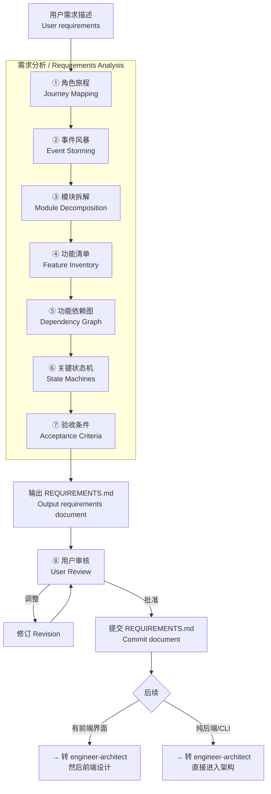

### 第一步：角色旅程 / Journey Mapping

**目标**：识别所有用户角色，为每个角色绘制端到端核心业务流程。

**行动**：
1. 从需求中提取所有用户角色
2. 为每个角色画出 1-2 个核心旅程
3. 标记每个旅程涉及的系统端

**输出格式**：

```markdown
## 角色旅程 / User Journeys

### 角色总览

| 角色 | 使用端 | 核心目标 |
|:----|:------|:---------|
| [角色名] | [PC / 小程序 / 移动端] | [一句话描述核心目标] |

### [角色名] — 核心旅程

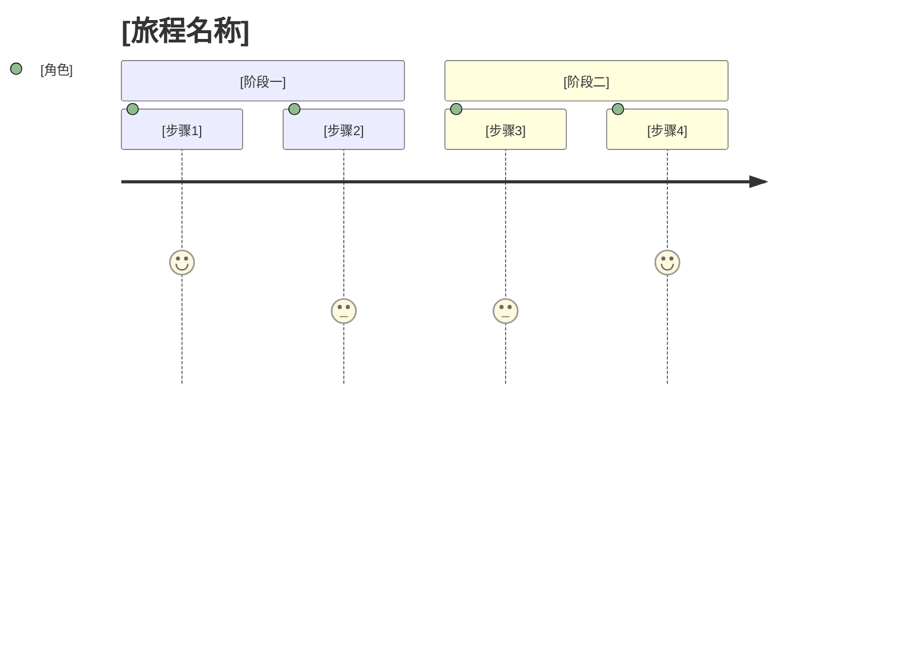
```

示例（AOPA — 机构管理员核心旅程）：
```markdown
### 机构管理员 — 考试申请旅程

1. 登录机构端 → 2. 管理学员（确认学员已录入） → 3. 选择考试类型
→ 4. 提交考试申请 → 5. 上传资料包（合同+名单+培训资料）
→ 6. 等待管理端审核 → 7. 查看考次安排 → 8. 通知学员参加考试
→ 9. 查看考试成绩
```

### 第二步：事件风暴 / Event Storming

**目标**：识别关键业务事件，建立事件流。

**行动**：
1. 列出所有业务事件（橙色便签）
2. 每个事件追溯触发它的命令（蓝色便签）
3. 每个事件识别由哪个聚合处理（黄色便签）
4. 对事件按时间线排序

**输出格式**：

```markdown
## 事件风暴 / Event Storming

### 关键业务事件

| 事件 | 触发命令 | 处理聚合 | 后续事件 |
|:----|:--------|:--------|:---------|
| [事件名] | [命令] | [聚合名] | [下一个事件] |

### 事件流

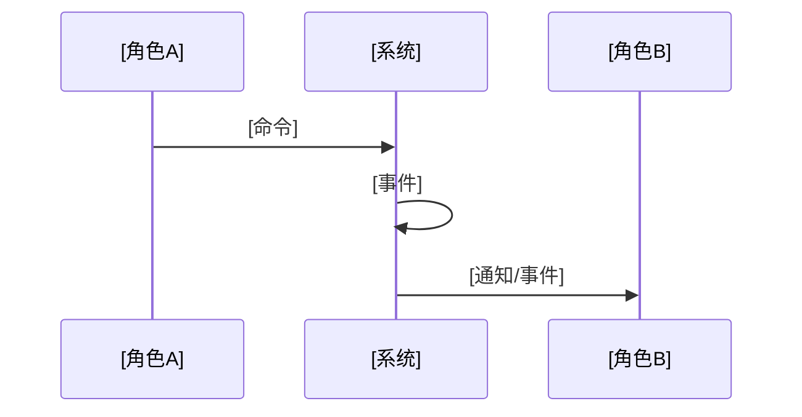
```

### 第三步：模块拆解 / Module Decomposition

**目标**：识别有界上下文（Bounded Context），将系统拆分为独立模块。

**行动**：
1. 按业务领域而非技术层次划分模块
2. 识别模块间的关系（上下游、共享内核、发布语言等）
3. 模块数量 3-8 个为宜，超过 8 个考虑是否需要合并

**输出格式**：

```markdown
## 模块拆解 / Module Decomposition

### 模块总览

| 模块 | 英文名 | 核心职责 | 涵盖功能数 | 涉及端 |
|:----|:------|:--------|:---------:|:------|
| [模块名] | [English] | [一句话职责] | N | [端列表] |

### 模块间依赖

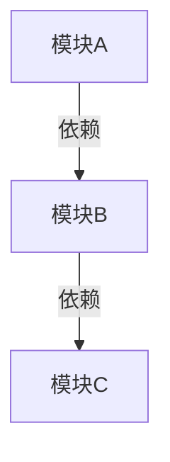

### 模块间契约
| 提供模块 | 消费模块 | 契约形式 | 说明 |
|---------|---------|---------|------|
| [模块A] | [模块B] | [API/事件/共享模型] | [说明] |
```

如果模块超过 3 个，**自动生成 CONTEXT-MAP.md** 作为副产品。

### 第四步：功能清单 / Feature Inventory

**目标**：完整列出每条功能，标注归属端、CRUD 类型、优先级。

**行动**：
1. 按模块列出所有功能
2. 每条功能标注所属端
3. 标注 CRUD 类型
4. MVP 优先

**输出格式**：

```markdown
## 功能清单 / Feature Inventory

### [模块名]

| # | 功能 | 归属端 | CRUD | 优先级 | 备注 |
|:-:|:----|:------|:----:|:------:|:-----|
| 1 | [功能名] | [机构端/管理端/...] | C/R/U/D | P0/P1/P2 | [补充说明] |
```

### 第五步：功能依赖图 / Dependency Graph

**目标**：识别功能之间的依赖关系，计算 DAG。

**行动**：
1. 对每条功能，确定其前置功能
2. 构建有向无环图
3. 标记关键路径（最长依赖链）

**输出格式**：

```markdown
## 功能依赖图 / Dependency Graph

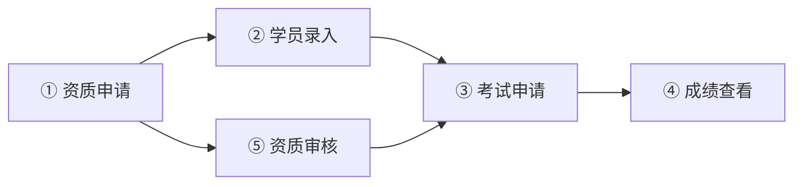
```

### 第六步：关键状态机 / State Machines

**目标**：定义核心业务对象的状态流转。

**行动**：
1. 识别有状态流转的业务对象
2. 列出所有可能状态
3. 定义合法转移路径
4. 定义每个状态下的可见操作

**输出格式**：

```markdown
## 关键状态机 / State Machines

### [业务对象名] — 状态机

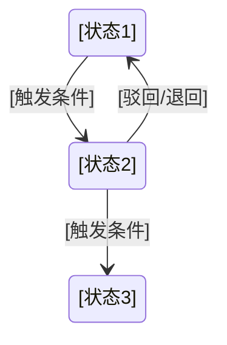

| 当前状态 | 允许操作 | 下一状态 | 触发条件 | 执行者 |
|---------|:--------|:--------|---------|:------|
| [状态1] | [操作] | [状态2] | [条件] | [角色] |
```

AOPA 示例 — 考试申请状态机：
```markdown
stateDiagram-v2
    draft --> submitted : 机构提交申请
    submitted --> under_review : 管理端开始审核
    under_review --> approved : 审核通过
    under_review --> rejected : 审核驳回
    rejected --> draft : 机构修改后重提
    approved --> exam_scheduled : 安排考试
    exam_scheduled --> exam_completed : 考试完成
    exam_completed --> results_synced : 成绩同步
```

### 第七步：验收条件 / Acceptance Criteria

**目标**：每条功能附带可验证的验收条件。

**原则**：
- 一句话描述（不写 Given/When/Then）
- 可以被人类和非技术人员理解
- 覆盖核心路径 + 1 个主要异常路径

**异常路径示例**：
> 机构提交考试申请时缺少资料包 → 系统提示"请上传完整资料包" → 申请无法提交

**输出格式**：

```markdown
## 验收条件 / Acceptance Criteria

| # | 功能 | 核心验收条件 | 异常路径 |
|:-:|:----|:------------|:---------|
| 1 | [功能名] | [核心路径描述] | [异常1: 处理方式] |
```

---

## 输出：REQUIREMENTS.md

完整的 `REQUIREMENTS.md` 文档格式详见 `references/requirements-template.md`。

---

## 与 engineer-architect 的衔接

Phase 1（engineer-requirements）完成后：

1. `REQUIREMENTS.md` 保存到项目根目录
2. Phase 2（engineer-architect）读取 `REQUIREMENTS.md` 作为输入
3. architect 的"词汇表"直接从 REQUIREMENTS.md 的模块拆解和业务事件中提取

---
<end of SKILL.md> 
```

- [ ] **Step 2: Commit**

```bash
git add skills/engineer-requirements/SKILL.md
git commit -m "feat: add engineer-requirements skill for deep requirement decomposition

- Event Storming + DDD strategic design methodology
- 7-step workflow: journey mapping, event storming, module decomposition,
  feature inventory, dependency graph, state machines, acceptance criteria
- Outputs REQUIREMENTS.md as input for engineer-architect
- Handles complex multi-portal systems like AOPA

Co-Authored-By: Claude <noreply@anthropic.com>"
```

---

### Task 3: 创建 REQUIREMENTS.md 模板

**Files:**
- Create: `skills/engineer-requirements/references/requirements-template.md`

**Interfaces:**
- Consumes: engineer-requirements SKILL.md（了解模板的引用上下文）
- Produces: 完整的 REQUIREMENTS.md 文档模板

- [ ] **Step 1: 创建 requirements-template.md**

```markdown
# REQUIREMENTS.md 模板 / Requirements Document Template

> 由 engineer-requirements 技能在 Phase 1 生成。
> 用作 engineer-architect（Phase 2）的输入文档。

---

# [项目名称] — 需求分析文档 / Requirements Analysis

## 1. 角色定义 / User Roles

| 角色 | 使用端 | 核心职责 |
|:----|:------|:---------|
| [角色A] | [PC / Mobile / 小程序] | [一句话职责] |
| [角色B] | [PC / Mobile / 小程序] | [一句话职责] |

## 2. 角色旅程 / User Journeys

### [角色A] — 核心旅程

```
[步骤1] → [步骤2] → [步骤3] → [步骤4]
```

### [角色B] — 核心旅程

```
[步骤1] → [步骤2] → [步骤3]
```

...

## 3. 事件风暴 / Event Storming

### 关键业务事件

| 事件 | 触发者 | 触发命令 | 后续事件 |
|:----|:------|:--------|:---------|
| [事件名] | [角色] | [操作] | [下一个事件] |

### 事件流

[事件流描述或图表]

## 4. 模块拆解 / Module Decomposition

### 模块总览

| 模块 | 英文名 | 核心职责 | 功能数 | 涉及端 |
|:----|:------|:--------|:------:|:------|
| [模块名] | [English] | [一句话职责] | N | [端列表] |

### 模块间依赖

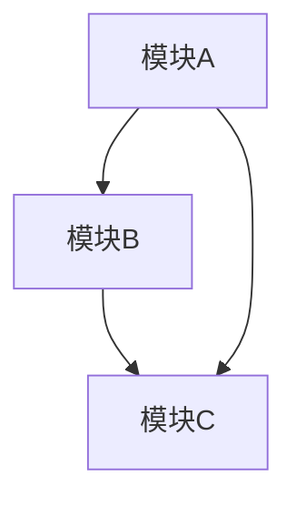

### 模块间契约

| 提供方 | 消费方 | 契约形式 | 说明 |
|--------|--------|---------|------|
| [模块A] | [模块B] | API / Events | [说明] |

## 5. 功能清单 / Feature Inventory

### [模块名]

| # | 功能 | 归属端 | CRUD | 优先级 |
|:-:|:----|:------|:----:|:------:|
| 1 | [功能名] | [端] | C | P0 |
| 2 | [功能名] | [端] | R | P0 |
| ... | ... | ... | ... | ... |

## 6. 功能依赖图 / Dependency Graph

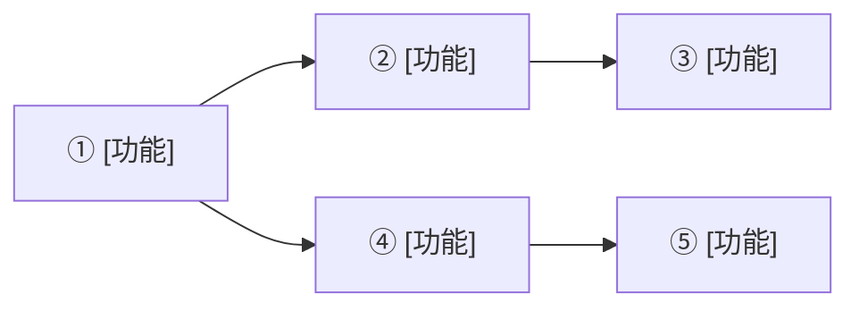

**关键路径**: [最长依赖链的描述]

## 7. 关键状态机 / State Machines

### [业务对象] — 状态机

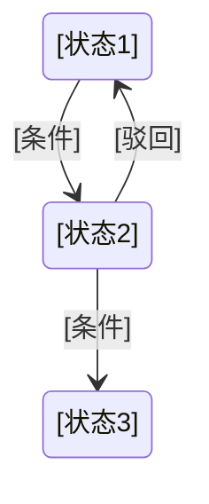

| 当前状态 | 允许操作 | 下一状态 | 条件 | 执行者 |
|---------|:--------|:--------|------|:------|
| [状态1] | [操作] | [状态2] | [条件] | [角色] |

## 8. 验收条件 / Acceptance Criteria

| # | 功能 | 核心路径 | 异常路径 |
|:-:|:----|:---------|:---------|
| 1 | [功能名] | [核心路径描述] | [异常及处理] |
| 2 | [功能名] | [核心路径描述] | [异常及处理] |

---

## 附录：术语表 / Glossary

| 领域术语 | 英文 | 定义 | 所属模块 |
|---------|------|:----|:--------|
| [术语] | [English] | [定义] | [模块] |
```

- [ ] **Step 2: Commit**

```bash
git add skills/engineer-requirements/references/requirements-template.md
git commit -m "docs: add REQUIREMENTS.md template for engineer-requirements skill

- Standard template covering: roles, journeys, event storming,
  module decomposition, features, dependencies, state machines, acceptance criteria
- Used as engineer-architect input document

Co-Authored-By: Claude <noreply@anthropic.com>"
```

---

### Task 4: 创建 engineer-frontend-architect 主技能文档

**Files:**
- Create: `skills/engineer-frontend-architect/SKILL.md`

**Interfaces:**
- Produces: 前端架构设计技能定义，引用 frontend-design-template.md

- [ ] **Step 1: 创建 SKILL.md 文件**

```markdown
---
name: engineer-frontend-architect
description: >
  AI前端架构师 — 在系统架构完成后的前端详细设计。
  输出 FRONTEND-DESIGN.md，包含页面树、组件树、状态管理架构、
  UI 状态机、设计系统 Token。用于多端系统（Web/小程序/移动端）
  的前端设计。需在 engineer-architect 完成之后执行。
  TRIGGERS: 项目包含前端界面且需要详细前端设计时触发。
  当项目有多个前端端（2+）时自动触发。
  也触发于用户说"设计前端""前端架构""前端设计""页面设计"。
compatibility: "read, write, edit"
---

# engineer-frontend-architect — AI 前端架构师 / AI Frontend Architect

> **来源声明**: 本 skill 的设计方法论来自前端工程化实践和《基于实现规划的 AI 辅助编程实战》。

---

## 🎯 核心理念 / Core Philosophy

大多数 AI 生成的前端代码看起来"千篇一律"——不是因为 AI 不会设计，而是**前端设计的目标没有被分解到足够细的层次**。

架构师画了后端蓝图，然后 workflow 直接开始写前端代码。问题是：workflow 不知道数据应该在页面加载时获取还是用户操作时获取，不知道空表格应该显示什么，不知道失败时怎么降级。

这个 skill 存在的理由：**在 workflow 写前端代码之前，把前端的设计颗粒度拉到和后端一样的细度。**

### 四条核心原则

#### 原则一：先定系统，再定页面 / System Before Pages

在多端系统中，前端设计的第一步不是"设计这个按钮"而是"决定四个端共用哪些设计 Token、各自有哪些特殊 Token"。系统级设计决策先于页面级。

#### 原则二：状态覆盖所有路径 / States Cover Every Path

**Happy path 不是唯一路径。** 每个页面、每个组件都有：
- **Loading**: 第一次加载、刷新加载、部分加载
- **Empty**: 无数据、数据清零、搜索无结果
- **Error**: 网络错误、权限不足、服务端异常
- **Partial**: 部分数据成功、部分组件失败
- **Edge**: 超出边界（分页结尾、最大长度、频控）

只画了 happy path 的设计不是设计。

#### 原则三：设计系统 Token > 手工样式 / Token System > Hand-Written Styles

所有颜色、间距、字体用 Token 定义。不允 workflow 在前端编码时直接写颜色值。Token 确保：
- 端间视觉统一（共享 Token）
- 端特有差异明确（端特有 Token）
- 后期修改只需改 Token 定义

#### 原则四：数据从哪里来 / Where Does Data Come From

每个页面标注数据来源——是 SSR 渲染、客户端 fetch、还是 WebSocket 推送？是当前页面自己加载还是父页面传递？这个决定影响页面架构、加载策略、错误处理方式。

---

## 🚦 触发条件 / When to Trigger

**必须触发**：

- 项目包含前端界面（CONTEXT.md 中 has_frontend: true）
- 项目有多个前端端（2+，如 Web 管理端 + 小程序学员端）
- 用户说"前端设计"、"设计前端"、"前端架构"、"页面设计"

**可选触发**：

- 单端管理后台（由用户判断是否需要详细设计）
- 第三方确认后执行

**不触发**：
- 纯后端 / CLI 项目
- 用户已有完整前端设计稿

---

## ⚙️ 模式选择 / Mode Selection

与 engineer-architect 一致：

| 模式 | 行为 |
|:----:|------|
| normal | 每步展示待确认；设计 Token 和状态机需用户验证 |
| auto | AI 推荐的默认值自动推进 |
| silent | 全部自动，仅记录日志 |

---

## 🏗️ 前端架构设计工作流 / Frontend Architecture Workflow

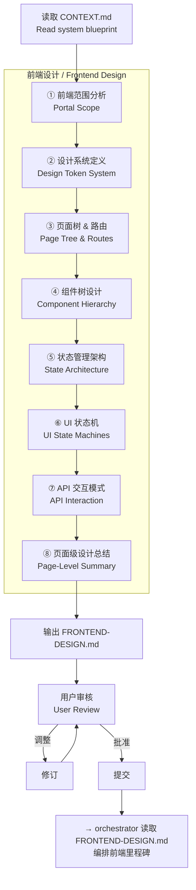

### 第一步：前端范围分析 / Portal Scope

**目标**：确定有多少个前端端，每个端的技术选项、设备类型、用户群体。

**输入**：CONTEXT.md（系统定义），REQUIREMENTS.md（如果存在）

**输出格式**：

```markdown
### 前端范围表

| 端 | 技术栈 | 设备 | 用户角色 | 设计系统 | 关键约束 |
|:--|:------|:-----|:--------|:--------|:---------|
| [端名] | [框架/CSS库] | [PC/平板/手机] | [角色] | [共享/特有] | [如：小程序包大小限制] |
```

### 第二步：设计系统定义 / Design Token System

**目标**：定义跨端共享的和端特有的设计 Token。

**输出格式**：

```markdown
### 共享 Token（所有端共用）

| Token | 值 | 用途 |
|:-----|:--|:-----|
| color-primary | #0057B7 | 主色按钮、链接、品牌标识 |
| color-accent | #FF6600 | 操作强调、选中状态 |
| font-heading | Inter / Noto Sans SC | 标题字体 |
| font-body | -apple-system / Noto Sans SC | 正文字体 |
| spacing-scale | 4/8/12/16/24/32/48 | 间距基准 |
| radius-sm | 4px | 小圆角 |
| radius-md | 8px | 卡片圆角 |

### [端名] 特有 Token

| Token | 值 | 原因 |
|:-----|:--|:-----|
| [token] | [值] | [与共享 Token 的差异理由] |
```

### 第三步：页面树 & 路由设计 / Page Tree & Routes

**目标**：为每个端绘制完整的页面树，标注路由路径。

**输出格式**（每个端一个树）：

```
### [端名] — 页面树

/dashboard              → 仪表盘
├── /exams              → 考试管理
│   ├── /exams/apply    → 考试申请（多步表单）
│   └── /exams/:id      → 考试详情
├── /students           → 学员管理
│   ├── /students/list  → 学员列表（表格+筛选）
│   ├── /students/import → 批量导入（文件上传）
│   └── /students/:id   → 学员详情
...
```

### 第四步：组件树设计 / Component Hierarchy

**目标**：按层次梳理组件体系。

**层次定义**：
```
Layout → Page → Feature Component → UI Component
```

**输出格式**：

```markdown
### 通用 UI 组件 / Shared UI Components

| 组件 | 用途 | 状态覆盖 |
|:----|:-----|:---------|
| DataTable | 带筛选/排序/分页的表格 | loading / empty / error / normal |
| FormWizard | 多步骤表单 | step 1..N / validation / submitting / error |
| FileUploader | 文件上传（含资料包类型） | idle / uploading / success / error / progress |
| StatusBadge | 状态标签（颜色编码） | [多种状态色] |

### 业务组件 / Feature Components

| 组件 | 所属页面 | 依赖 |
|:----|:--------|:-----|
| CertificateCard | 证书列表 | StatusBadge |
| ExamApplyForm | 考试申请 | FormWizard, FileUploader |
| StudentImportDropzone | 批量导入 | FileUploader |

### 页面组件 / Page Components

每个端的主要页面及其使用的组件。
```

### 第五步：状态管理架构 / State Architecture

**目标**：定义全局状态 vs 局部状态的边界划分。

**分类**：

| 状态类型 | 管理方式 | 示例 | 存放位置 |
|:--------|:--------|:-----|:---------|
| 服务端数据 | SWR / React Query / TanStack Query | 学员列表、考试记录 | 缓存层 |
| 全局 UI 状态 | Zustand / Context | 当前用户、权限、侧栏折叠 | 全局 Store |
| 局部 UI 状态 | useState / useReducer | 表单输入、弹窗开关 | 组件内 |

**状态图**（可选）：
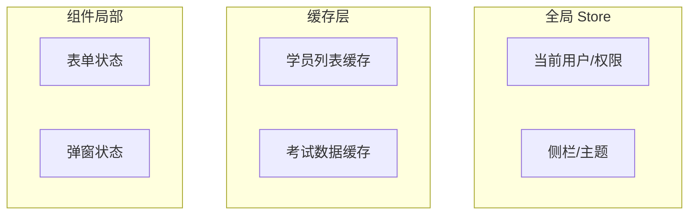

### 第六步：UI 状态机设计 / UI State Machines

**目标**：为每个核心页面定义完整的 UI 状态覆盖。

**核心原则**：每个页面必须覆盖以下状态：
- **loading**: 数据正在加载
- **empty**: 数据为空
- **error**: 数据加载失败
- **normal (happy)**: 数据正常展示
- **edge**: 边界情况（如翻完最后一页）

**输出格式**：

```markdown
### [页面名] — UI 状态机

| 状态 | 触发条件 | UI 表现 |
|:----|:---------|:--------|
| loading | 首次加载/Mutation 中 | Skeleton 骨架屏 / 行内 Spin |
| empty | 列表无数据 | 空状态插画 + "暂无数据，请先[操作]" |
| error | 接口返回 500/网络断开 | 错误提示 + "重试"按钮 |
| normal | 数据正常 | 正常内容展示 |
| edge | 分页到末尾 | "已加载全部"提示 |
```

### 第七步：API 交互模式 / API Interaction

**目标**：定义每个页面的数据获取和变更策略。

| 页面 | 获取策略 | 变更策略 | 理由 |
|:----|:--------|:--------|:-----|
| [页面] | SSR / SWR / Static | optimistic / pessimistic | [理由] |

### 第八步：页面级设计总结 / Page-Level Summary

**目标**：每页一句设计要点，确保 workflow 不会跑偏。

**输出格式**：

```markdown
### [页面名]

**设计要点**: [1-2 句话]
**数据需求**: [需要的 API 数据]
**状态覆盖**: [需要特别关注的 UI 状态]
```

---

## 输出：FRONTEND-DESIGN.md

完整的 `FRONTEND-DESIGN.md` 文档格式详见 `references/frontend-design-template.md`。

---

## 与 orchestrator/workflow 的衔接

Phase 3（engineer-frontend-architect）完成后：

1. `FRONTEND-DESIGN.md` 保存到项目根目录
2. Phase 4（orchestrator）读取 `FRONTEND-DESIGN.md` 获取前端里程碑定义
3. orchestrator 将前端里程碑和后端里程碑并行编排
4. workflow 在前端编码时读取 `FRONTEND-DESIGN.md` 获取精确的页面/组件/状态规范
5. 现有 `frontend-guide.md` 保留为组件目录规范和框架推荐的轻量参考
```
```

- [ ] **Step 2: Commit**

```bash
git add skills/engineer-frontend-architect/SKILL.md
git commit -m "feat: add engineer-frontend-architect skill for frontend design

- 8-step frontend design workflow: portal scope, design tokens, page tree,
  component hierarchy, state architecture, UI state machines, API interaction, page summary
- Covers all UI states: loading, empty, error, edge cases
- Outputs FRONTEND-DESIGN.md for orchestrator/frontend milestones
- Design Token system for multi-portal consistency

Co-Authored-By: Claude <noreply@anthropic.com>"
```

---

### Task 5: 创建 FRONTEND-DESIGN.md 模板

**Files:**
- Create: `skills/engineer-frontend-architect/references/frontend-design-template.md`

- [ ] **Step 1: 创建 frontend-design-template.md**

```markdown
# FRONTEND-DESIGN.md 模板 / Frontend Design Document Template

> 由 engineer-frontend-architect 技能在 Phase 3 生成。
> 用作 engineer-orchestrator（Phase 4）的前端里程碑编排输入。

---

# [项目名称] — 前端设计文档 / Frontend Design Document

## 1. 前端范围 / Portal Scope

| 端 | 技术栈 | 设备 | 用户角色 | 设计系统 | 约束 |
|:--|:------|:-----|:--------|:--------|:-----|
| [端A] | [框架+UI库] | [PC] | [角色] | [共享/特有] | [约束] |
| [端B] | [框架+UI库] | [Mobile] | [角色] | [共享/特有] | [约束] |

## 2. 设计系统 Token / Design Token System

### 共享 Token

| Token | 值 | 用途 |
|:-----|:--|:------|
| color-primary | #HEX | 主色按钮、品牌标识 |
| color-accent | #HEX | 操作强调 |
| font-heading | [字体栈] | 标题 |
| font-body | [字体栈] | 正文 |
| spacing-base | 4px | 间距基准 |
| radius-md | 8px | 卡片/按钮圆角 |

### [端A] 特有 Token

| Token | 值 | 理由 |
|:-----|:--|:------|

## 3. 页面树 & 路由 / Page Tree & Routes

### [端A]

```
/page         → 页面名（一句话说明）
├── /page/sub → 子页面
└── /page/:id → 详情页
```

### [端B]

```
/page → 页面名
```

## 4. 组件树 / Component Hierarchy

### 通用 UI 组件

| 组件 | 用途 | 状态覆盖 |
|:----|:-----|:---------|
| [Component] | [用途] | [loading/empty/error] |

### 业务组件

| 组件 | 所属页面 | 依赖组件 |
|:----|:--------|:---------|

## 5. 状态管理架构 / State Architecture

| 类型 | 管理方式 | 示例 |
|:----|:--------|:-----|
| 服务端数据 | [SWR/React Query] | [数据示例] |
| 全局 UI | [Zustand/Context] | [状态示例] |
| 局部 UI | useState | [状态示例] |

## 6. UI 状态机 / UI State Machines

### [页面名]

| 状态 | 触发条件 | UI 表现 |
|:----|:---------|:--------|
| loading | [条件] | [表现] |
| empty | [条件] | [表现] |
| error | [条件] | [表现] |
| normal | [条件] | [表现] |

### [页面名]

...

## 7. API 交互模式 / API Interaction

| 页面 | 获取策略 | 变更策略 | 理由 |
|:----|:--------|:--------|:------|
| [页面] | [SSR/SWR/Static] | [optimistic/pessimistic] | [理由] |

## 8. 页面级设计总结 / Page-Level Summary

### [页面名]

**设计要点**: [一句话]
**数据需求**: [API 数据]
**状态覆盖**: [特别关注的状态]
```

- [ ] **Step 2: Commit**

```bash
git add skills/engineer-frontend-architect/references/frontend-design-template.md
git commit -m "docs: add FRONTEND-DESIGN.md template for frontend architect skill

- Template covers: portal scope, design tokens, page tree, component hierarchy,
  state architecture, UI state machines, API interaction, page-level summary

Co-Authored-By: Claude <noreply@anthropic.com>"
```

---

### Task 6: 增强 engineer-architect SKILL.md

**Files:**
- Modify: `skills/engineer-architect/SKILL.md`（新增"架构模式决策阶段" + "部署架构阶段" + 里程碑并行）

**Interfaces:**
- Consumes: enterprise-architecture-patterns.md（参考文档）
- Produces: 改进的 architect 工作流，包含多端架构模式选择和部署架构

- [ ] **Step 1: 在架构图中添加两个新阶段**

找到 `skills/engineer-architect/SKILL.md` 中的 Mermaid 架构图，在"技术选型提议"之后插入"架构模式决策"，在"API 契约设计"之后插入"部署架构设计"：

```diff
    H -->|"✅ 是"| I["⑦ 前端设计方向<br/>Frontend design direction"]
    I --> J["⑧ 里程碑拆解<br/>Milestone decomposition"]
    H -->|"❌ 纯后端/CLI"| J
+++ I2["⑦ 架构模式决策<br/>Architecture Pattern Decision"]
+++ I2 --> I
+++ J2["⑨ 部署架构设计<br/>Deployment Architecture"]
+++ J2 --> I2
```

实际上我更正一下，流程图应该这样调整：

原始流程：
```
E["⑤ 数据模型设计"] → F["⑥ API契约设计"] → G{"需要前端界面？"} → H["⑦ 前端设计方向"]
```

改为：
```
E["⑤ 架构模式决策"] → F["⑥ 数据模型设计"] → G["⑦ API契约设计"] → H{"需要前端界面？"} → I["⑧ 前端设计方向"] → J["⑨ 部署架构设计"] → K["⑩ 里程碑拆解"]
```

需要在 SKILL.md 中找到 flow 图并更新。

- [ ] **Step 2: 在技术选型提议之后、数据模型设计之前，插入"架构模式决策"章节**

找到 SKILL.md 中"数据模型设计"章节之前，插入：

```markdown
### 第四步：架构模式决策 / Architecture Pattern Decision

> 在技术选型确认后、数据模型设计前，为多端/多模块系统选择架构模式。
> 对于单端单体系统（如单个 API 服务），此步骤可选。

当系统包含多个前端端或多个模块时，架构模式的选择会显著影响后续的数据模型和 API 设计。
因此架构模式决策在数据模型设计之前执行。

**模式选择指南**：

| 项目特征 | 推荐模式 | 适用场景 |
|---------|:--------|:---------|
| 多个前端端 | BFF + API Gateway | 用户端(Web)+管理端(Web)+学员端(小程序)+考试员端(移动) |
| 异步长流程 | 事件驱动 + Saga | 审批链、考试申请→审核→成绩同步→证书生成 |
| 大量报表/统计 | CQRS（轻量级） | 财务报表、证书统计、数据看板 |
| 多机构管理 | 多租户（行级隔离） | 一个管理端管理多个机构 |
| 业务逻辑复杂 | DDD 分层 | 财务规则、证书状态机、考试流程 |

**输出格式**：

```markdown
### 架构模式 / Architecture Patterns

| 模式 | 是否采用 | 说明 |
|:----|:-------:|:-----|
| BFF | ✅ | 每个前端端一个专属 BFF |
| 事件驱动 | ✅ | 考试申请→审核→成绩→证书 异步流程 |
| CQRS | ❌ | 当前阶段不需要，后续迭代可选 |
| 多租户 | ✅ | 行级 tenant_id 隔离 |
| DDD 分层 | ✅ | 应用层/领域层/基础设施层分离 |

### 架构图

[Deployment architecture Mermaid diagram]
```

**参考**：详细模式定义见 `references/enterprise-architecture-patterns.md`。
```

---

- [ ] **Step 3: 在 API 契约设计之后、前端设计方向之前，插入"部署架构设计"章节**

```markdown
### 第 N 步：部署架构设计 / Deployment Architecture

> 对应多端系统的部署拓扑。此处的架构图会直接影响后续部署配置生成（Phase 6）。

**输出格式**：

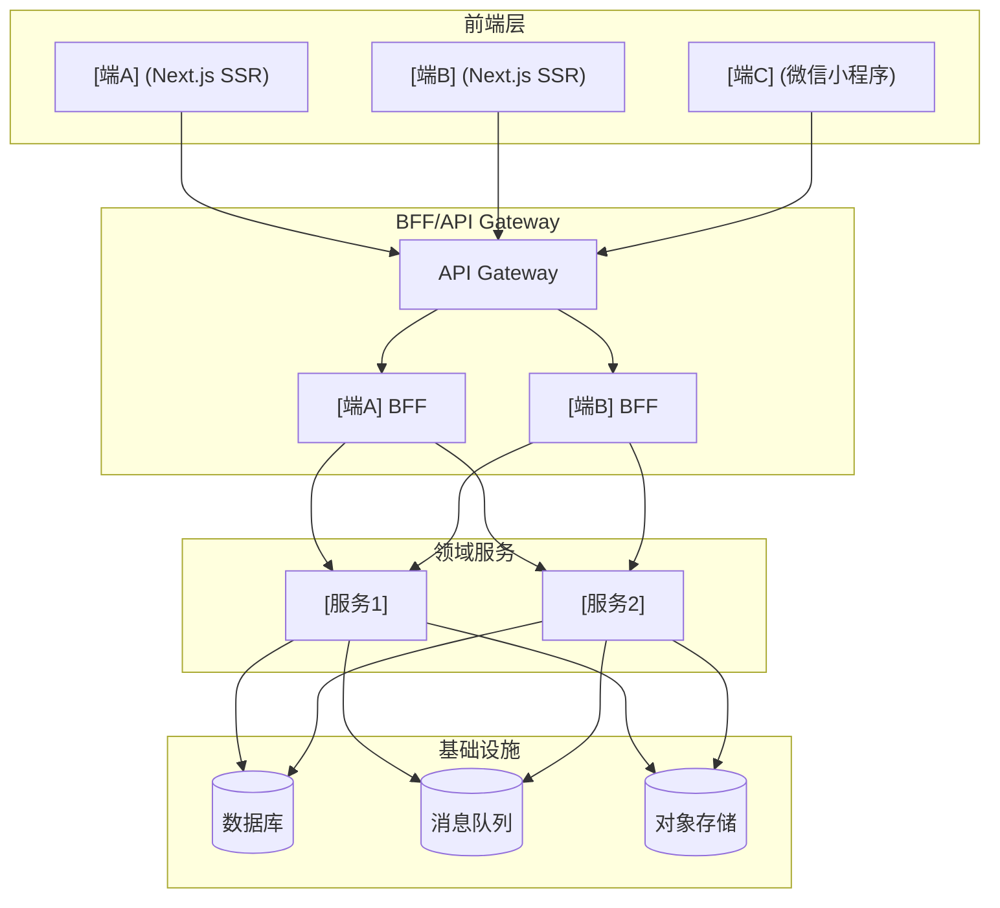

```
```

---

- [ ] **Step 4: 在里程碑拆解中增加前后端并行支持**

找到里程碑拆解的规则描述，增加一条：

```diff
**里程碑依赖规则：**
- 数据模型必须先于业务逻辑
- 核心功能必须先于横切面（鉴权/缓存/日志）
- 后端 API 必须先于前端 UI
+++ - **后端里程碑和前端里程碑可并行**（如 M1 数据模型 与 P1 设计系统同时开发）
+++ - 里程碑仅在有直接 API/数据依赖时才需要等待另一端
```

- [ ] **Step 5: 在 CONTEXT.md 模板中增加架构模式和部署架构章节**

在 CONTEXT.md 模板的"系统全景"中增加两行：

```diff
### [实体2]
...
+
+## 架构模式 / Architecture Patterns
+
+| 模式 | 状态 | 说明 |
+|:----|:----:|:------|
+| [BFF] | [✅/❌] | [说明] |
+
+## 部署架构 / Deployment Architecture
+
+[Mermaid 部署架构图]
```

- [ ] **Step 6: Commit**

```bash
git add skills/engineer-architect/SKILL.md
git commit -m "feat: enhance engineer-architect with architecture patterns and deployment architecture

- Add architecture pattern decision phase before data model design
- Add deployment architecture phase after API contract design
- Add parallel milestone support (backend + frontend)
- Reference enterprise-architecture-patterns.md for pattern details
- Update CONTEXT.md template with architecture and deployment sections

Co-Authored-By: Claude <noreply@anthropic.com>"
```

---

### Task 7: 扩展 engineer-job run.wf.js 为 8 阶段

**Files:**
- Modify: `skills/engineer-job/run.wf.js`

**Interfaces:**
- Consumes: 现有的 run.wf.js 逻辑，保持向后兼容
- Produces: 8 阶段编排，新增 Phase 1 (requirements) + Phase 3 (frontend)，自动跳过逻辑

- [ ] **Step 1: 重命名阶段索引并更新 meta**

找到 `export const meta` 块，更新描述和 phases 数组：

```javascript
export const meta = {
  name: 'engineer-job-run',
  description: 'AI Project Auto-Build Engine — 8-phase orchestration. Scaffolds, analyzes requirements, architects, designs frontend, develops, integrates, deploys, and reports.',
  phases: [
    { title: 'Scaffold', detail: 'init-project scaffolding + project-metadata.json' },
    { title: 'Requirements', detail: 'engineer-requirements deep requirement decomposition' },
    { title: 'Architect', detail: 'engineer-architect blueprint design with architecture patterns' },
    { title: 'Frontend', detail: 'engineer-frontend-architect frontend design' },
    { title: 'Develop', detail: 'engineer-orchestrator multi-feature development' },
    { title: 'Integrate', detail: 'integration testing & production readiness' },
    { title: 'Deploy', detail: 'deployment configuration generation' },
    { title: 'Report', detail: 'final report generation' },
  ],
}
```

- [ ] **Step 2: 更新协议流注释**

找到 protocol flow 注释块，更新为：

```javascript
// Protocol flow:
//   init-project  ──►  project-metadata.json  ──►  engineer-requirements
//   engineer-requirements  ──►  REQUIREMENTS.md  ──►  engineer-architect
//   engineer-architect  ──►  CONTEXT.md  ──►  engineer-frontend-architect
//   engineer-frontend-architect  ──►  FRONTEND-DESIGN.md  ──►  engineer-orchestrator
//   engineer-orchestrator  ──►  .agents/progress.json  ──►  engineer-workflow × N
```

- [ ] **Step 3: 添加简单项目跳过逻辑**

在所有 phase 执行之前，添加检测逻辑：

```javascript
// ── Simple Project Detection ──────────────────────────
// If the project is simple (no frontend, few modules), skip
// requirements analysis and frontend design phases.

const isSimpleProject = (() => {
  // Explicit skip from args
  if (args.skip_requirements || args.skip_frontend) return true
  // No explicit indication — assume complex (safe default, normal flow)
  return false
})()

if (isSimpleProject) {
  log('Simple project detected — skipping Phase 1 (requirements) and Phase 3 (frontend design)')
}
```

- [ ] **Step 4: 插入 engineer-requirements 新 Phase 1**

在 Phase 0 (Scaffold) 之后、原 Phase 1 (Architect) 之前，插入新的 Phase 1：

```javascript
// ═══════════════════════════════════════════════════════════
//  Phase 1 — engineer-requirements: 需求深度拆解
//  Input:  project-metadata.json (on disk, from Phase 0)
//  Output: REQUIREMENTS.md (需求分析文档)
// ═══════════════════════════════════════════════════════════

phase('Requirements')
if (!isDone('requirements') && !isSimpleProject) {
  log('Phase 1: engineer-requirements — deep requirement decomposition')

  let result = await agent(
    ctx('engineer-requirements', `=== DEEP REQUIREMENT DECOMPOSITION ===

Read "project-metadata.json" from disk for project context.

Execute the engineer-requirements process:
1. Identify all user roles and their core journeys
2. Run event storming — identify key business events
3. Decompose into bounded contexts / modules
4. Build full feature inventory with CRUD matrix
5. Create feature dependency DAG
6. Define state machines for key business objects
7. Write acceptance criteria for each feature

Output: Write REQUIREMENTS.md to project root with ALL sections filled.
Update .agents/job.state.json requirements phase to DONE.
Append to .agents/job.progress.md.

Return structured result with summary.`),
    { schema: PHASE_RESULT, label: 'engineer-requirements', phase: 'Requirements' }
  )

  if (result?.status === 'BLOCKED') {
    log('Phase 1 failed, retrying once...')
    result = await agent(
      `Retry: requirements decomposition. Requirements: "${REQUIREMENTS}". Generate a minimal REQUIREMENTS.md with at least role definitions and feature list.`,
      { schema: PHASE_RESULT, label: 'requirements-retry', phase: 'Requirements' }
    )
  }

  if (!result || result.status === 'BLOCKED') {
    // Degrade: generate minimal requirements
    await agent(
      `Generate a minimal REQUIREMENTS.md with role definitions and basic feature list extracted from: "${REQUIREMENTS}". Update job.state.json requirements as DONE_WITH_CONCERNS.`,
      { schema: PHASE_RESULT, label: 'requirements-degrade', phase: 'Requirements' }
    )
    log('Phase 1 degraded: minimal requirements generated')
  } else {
    log('Phase 1 complete: REQUIREMENTS.md generated')
  }

  phasesDone.add('requirements')
} else if (isSimpleProject) {
  log('Phase 1 skipped (simple project)')
}
```

- [ ] **Step 5: 更新现有的 Phase 1 (Architect) 为 Phase 2，增强其 prompt**

将现有的 architect phase（原 Phase 1）重命名为 Phase 2，并在 prompt 中加入读取 REQUIREMENTS.md 的指令：

```javascript
// ═══════════════════════════════════════════════════════════
//  Phase 2 — engineer-architect: 架构蓝图（改进版）
//  Input:  project-metadata.json + REQUIREMENTS.md (on disk)
//  Output: CONTEXT.md (含架构模式 + 部署架构)
// ═══════════════════════════════════════════════════════════

phase('Architect')
if (!isDone('architect')) {
  log('Phase 2: engineer-architect — generating blueprint')

  let result = await agent(
    ctx('engineer-architect', `=== GENERATE PROJECT BLUEPRINT ===

Read "project-metadata.json" from disk for technical context.
Read "REQUIREMENTS.md" from disk if it exists (for feature definitions, state machines, role journeys).
Read the existing project file tree.

Generate a complete CONTEXT.md blueprint:
1. System overview, tech stack, architectural red lines
2. Architecture pattern decisions (BFF / Event-Driven / CQRS / Multi-Tenancy / DDD)
   — Reference enterprise-architecture-patterns.md for pattern details
3. Deployment architecture topology diagram
4. Domain glossary (core terms with English names)
5. Core data models (entities, fields, indexes)
6. API contracts (routes, requests, responses, errors)
7. Milestone plan (dependency-ordered, backend and frontend milestones CAN be parallel)
8. Testing strategy, docs convention, deployment plan

Read project-metadata.json has_frontend field. If true, also generate:
- Frontend Design Direction section in CONTEXT.md
- frontend-spec.json with basic design tokens

AFTER generating CONTEXT.md, UPDATE project-metadata.json with architect results.
UPDATE .agents/job.state.json architect phase to "DONE".
APPEND to .agents/job.progress.md.`),
    { schema: PHASE_RESULT, label: 'engineer-architect', phase: 'Architect' }
  )

  // ... (retry and degrade logic same as before)
```

- [ ] **Step 6: 插入 engineer-frontend-architect 新 Phase 3**

在 architect phase 之后、development phase 之前，插入新的 Phase 3：

```javascript
// ═══════════════════════════════════════════════════════════
//  Phase 3 — engineer-frontend-architect: 前端详细设计
//  Input:  CONTEXT.md (on disk, from Phase 2)
//  Output: FRONTEND-DESIGN.md (前端设计文档)
// ═══════════════════════════════════════════════════════════

phase('Frontend')
// Phase 3 runs by default for non-simple projects.
// The sub-agent reads CONTEXT.md and detects has_frontend on its own.
// If no frontend, it generates a minimal FRONTEND-DESIGN.md noting no frontend needed.
// Skip via isSimpleProject (passed through args) or explicit args.skip_frontend.

if (!isDone('frontend') && !isSimpleProject && !args.skip_frontend) {
  log('Phase 3: engineer-frontend-architect — frontend design')

  let result = await agent(
    ctx('engineer-frontend-architect', `=== FRONTEND ARCHITECTURE DESIGN ===

Read "CONTEXT.md" from disk for system architecture, tech stack, and frontend direction.
Read "REQUIREMENTS.md" from disk if it exists (for user roles and journeys).

Execute the engineer-frontend-architect process:
1. Portal scope analysis — identify all frontend portals, their tech stacks, devices, users
2. Design token system — shared tokens + portal-specific tokens (colors, fonts, spacing)
3. Page tree & routes — complete page tree per portal with route paths
4. Component hierarchy — UI components → feature components → page components
5. State architecture — global vs local vs server state boundaries
6. UI state machines — loading, empty, error, edge cases for every core page
7. API interaction patterns — data fetching strategy per page
8. Page-level design summary — one-liner per core page

Output: Write FRONTEND-DESIGN.md to project root with ALL sections filled.
Update .agents/job.state.json frontend phase to DONE.
Append to .agents/job.progress.md.

Return structured result.`),
    { schema: PHASE_RESULT, label: 'engineer-frontend-architect', phase: 'Frontend' }
  )

  if (result?.status === 'BLOCKED') {
    log('Phase 3 failed, retrying once...')
    result = await agent(
      `Retry: frontend design. Generate at minimum a FRONTEND-DESIGN.md with portal scope, page tree, and design token system.`,
      { schema: PHASE_RESULT, label: 'frontend-retry', phase: 'Frontend' }
    )
  }

  if (!result || result.status === 'BLOCKED') {
    await agent(
      `Generate minimal FRONTEND-DESIGN.md with portal definitions and page tree. Mark as degraded.`,
      { schema: PHASE_RESULT, label: 'frontend-degrade', phase: 'Frontend' }
    )
    log('Phase 3 degraded: minimal frontend design generated')
  } else {
    log('Phase 3 complete: FRONTEND-DESIGN.md generated')
  }

  phasesDone.add('frontend')
} else {
  log('Phase 3 skipped (no frontend or simple project)')
}
```

- [ ] **Step 7: 重命名后续 Phase 索引并更新 prompt**

将原 Phase 2 (Development) 改为 Phase 4，在 prompt 中加入读取 FRONTEND-DESIGN.md 的支持：

在 development phase 的 agent prompt 中，增加：
```diff
Read CONTEXT.md for the milestone DAG and technical specifications.
Read project-metadata.json for the milestone list, glossary, and frontend direction.
Read frontend-spec.json if it exists (may contain design tokens).
+++ Read FRONTEND-DESIGN.md if it exists (for frontend milestone definitions, components, state machines).
```

将原 Phase 3 (Integration) 改为 Phase 5，Phase 4 (Deploy) 改为 Phase 6，Phase 5 (Report) 改为 Phase 7。

- [ ] **Step 8: 更新完成日志**

```javascript
// Completion
log(`All ${isSimpleProject ? '6' : '8'} phases completed. Project build finished.`)
log(`Mode: ${MODE}`)
log(`Phases completed: ${[...phasesDone].filter(Boolean).join(', ')}`)
```

- [ ] **Step 9: Commit**

```bash
git add skills/engineer-job/run.wf.js
git commit -m "feat: expand engineer-job to 8-phase orchestration with requirements and frontend design

- Insert Phase 1 (engineer-requirements) for deep requirement decomposition
- Insert Phase 3 (engineer-frontend-architect) for frontend architecture design
- Update architect Phase 2 to read REQUIREMENTS.md and include architecture patterns
- Update development Phase 4 to read FRONTEND-DESIGN.md for frontend milestones
- Add simple project skip detection for Phase 1 and Phase 3
- Renumber existing phases 2→4, 3→5, 4→6, 5→7
- Backward compatible with existing job.state.json

Co-Authored-By: Claude <noreply@anthropic.com>"
```

---

### Task 8: 更新 engineer-job SKILL.md

**Files:**
- Modify: `skills/engineer-job/SKILL.md`

**Interfaces:**
- Consumes: 现有 SKILL.md 内容
- Produces: 更新阶段序列、三文档体系说明

- [ ] **Step 1: 更新 6 阶段总览表为 8 阶段**

找到 SKILL.md 中的"六阶段编排工作流"部分，更新为"八阶段编排工作流"。

更新阶段总览表：

```markdown
### 阶段总览 / Phase Overview

| 阶段 | 名称 | 调用技能 | 输入 → 输出 | 失败处理 |
|:----:|:----:|:---------:|:-----------:|:--------:|
| 0 | init | `init-project` | 用户需求 → 文件树 + project-metadata.json | 重试 1 次，失败则终止 |
| 1 | requirements | `engineer-requirements` | project-metadata.json → REQUIREMENTS.md | 重试 1 次，失败则降级最小需求 |
| 2 | architect | `engineer-architect` | project-metadata.json + REQUIREMENTS.md → CONTEXT.md | 重试 1 次，失败则降级骨架蓝图 |
| 3 | frontend | `engineer-frontend-architect` | CONTEXT.md + REQUIREMENTS.md → FRONTEND-DESIGN.md | 重试 1 次，失败则降级最小设计 |
| 4 | orchestrate | `engineer-orchestrator` + `engineer-workflow` × N | 蓝图 + 前端设计 → 完整代码 | 里程碑级自动自愈 |
| 5 | integrate | 内置集成测试 | 代码 → 测试报告 | 记录失败，不阻塞 |
| 6 | deploy | 内置部署生成 | 蓝图部署方案 → 部署配置 | 记录警告，不阻塞 |
| 7 | report | 内置报告生成 | 所有以上 → 最终报告 | — |
```

- [ ] **Step 2: 更新 Mermaid 架构图**

在六阶段编排工作流中添加 Phase 1 和 Phase 3：

```diff
- subgraph "Phase 0: 项目初始化 / init"
- subgraph "Phase 1: 架构设计 / architect"
- subgraph "Phase 2: 功能开发 / development"
+ subgraph "Phase 0: 项目初始化 / init"
+ subgraph "Phase 1: 需求分析 / requirements"
+ subgraph "Phase 2: 架构设计 / architect"
+ subgraph "Phase 3: 前端设计 / frontend"
+ subgraph "Phase 4-7: 开发-收尾 / development-finalize"
```

- [ ] **Step 3: 增加三文档体系说明**

在"数据流"或"核心理念"部分增加：

```markdown
### 三文档体系 / Three-Document System

engineer-job 在 Phase 1-3 构建三份核心文档，串联整个构建流程：

```
REQUIREMENTS.md   ← Phase 1 (需求分析)
    ↓ 架构师读取
CONTEXT.md         ← Phase 2 (架构蓝图)
    ↓ 前端架构师读取
FRONTEND-DESIGN.md ← Phase 3 (前端设计)
    ↓ 编排器/工作流读取
工程代码
```

**各文档职责**：
- **REQUIREMENTS.md**: 回答"要做什么"——角色旅程、功能清单、状态机、验收条件
- **CONTEXT.md**: 回答"怎么做"——技术栈、数据模型、API 契约、架构模式、里程碑
- **FRONTEND-DESIGN.md**: 回答"前端长什么样"——页面树、组件树、状态管理、UI 状态机

**简单项目跳过**：当项目没有前端界面或模块较少时，自动跳过 Phase 1 和 Phase 3。
```

- [ ] **Step 4: 更新 Workflow 脚本调用示例**

在"快速执行"部分，更新 Workflow 调用示例为 8 阶段：

```javascript
Workflow({
  script: "skills/engineer-job/run.wf.js",
  args: {
    requirements: "做一个博客系统，CRUD 功能，Python FastAPI + SQLite",
    mode: "auto",
    projectName: "blog-system",
    skip_requirements: false,  // 简单项目设为 true
    skip_frontend: true,       // 无前端界面时设为 true
  }
})
```

- [ ] **Step 5: Commit**

```bash
git add skills/engineer-job/SKILL.md
git commit -m "docs: update engineer-job SKILL.md for 8-phase orchestration

- Updated phase overview table from 6 to 8 phases
- Added three-document system section (REQUIREMENTS.md, CONTEXT.md, FRONTEND-DESIGN.md)
- Updated Mermaid architecture diagram
- Added simple project skip documentation
- Updated Workflow invocation example

Co-Authored-By: Claude <noreply@anthropic.com>"
```

---

## 执行顺序

```
Task 1: 企业架构模式参考    ← 独立，可先做
Task 2: engineer-requirements skill ← 独立
Task 3: requirements-template       ← 独立，Task 2 之后
Task 4: engineer-frontend-architect skill ← 独立
Task 5: frontend-design-template    ← 独立，Task 4 之后
Task 6: engineer-architect enhancement ← 依赖 Task 1（引用模式文档）
Task 7: engineer-job run.wf.js 8-phase ← 依赖 Task 2/4（新增 phase）
Task 8: engineer-job SKILL.md update ← 依赖 Task 7
```

Tasks 1-5 可以并行创建。Task 6-8 顺序执行。
