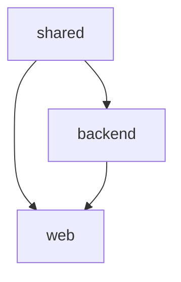

# Skills 工程短板补齐 — Implementation Plan

> **For agentic workers:** REQUIRED SUB-SKILL: Use superpowers:subagent-driven-development (recommended) or superpowers:executing-plans to implement this plan task-by-task. Steps use checkbox (`- [ ]`) syntax for tracking.

**Goal:** Fill 6 identified gaps in the iannil/skills package: test patterns, migration strategy, cascade failure handling, frontend guidance, multi-module (CONTEXT-MAP), and production readiness.

**Architecture:** Add 6 reference documents under `skills/*/references/` + 5 SKILL.md files with minimal inline edits. No new skills created.

**Tech Stack:** Markdown documents + SKILL.md YAML frontmatter edits

## Global Constraints

1. All reference documents must follow the same format as `skills/init-project/references/conventions-guide.md`
2. SKILL.md edits must be minimal — insert the smallest possible change at the right point
3. Each reference doc must be self-contained (other skills can read it standalone)
4. All paths relative to `skills/` directory
5. Cascade failure logic must not break existing orchestrator behavior — it's additive only

---

### Task 1: test-patterns.md + workflow & inspector edits

**Files:**
- Create: `skills/init-project/references/test-patterns.md`
- Modify: `skills/engineer-workflow/SKILL.md` — Line 267-271 (test generation guidance)
- Modify: `skills/engineer-inspector/SKILL.md` — Line 227-235 (test compliance criteria)

**Interfaces:**
- Consumes: N/A (independent task)
- Produces: `test-patterns.md` at known path, referenced by workflow and inspector

---

- [ ] **Step 1: Create `init-project/references/test-patterns.md`**

Write the test patterns reference document covering:

```markdown
# 测试模式库 / Test Patterns

> 按项目类型定义测试的最低覆盖标准。各 skill（engineer-workflow、engineer-inspector）
> 在每个里程碑的测试生成和验收环节参考此文件。

## 通用原则 / General Principles

1. **分层测试**：单元测试覆盖核心逻辑，集成测试覆盖 API/数据库，E2E 覆盖关键用户链路
2. **边界优先**：每个核心函数的测试 = 1 个正常路径 + 至少 2 个边界条件（空输入、异常参数、极限值）
3. **无测试不提交**：测试与实现代码同为里程碑的交付物

## 按项目类型的最低标准

### API 服务 / API Server

| 测试类型 | 最低标准 | 覆盖目标 |
|---------|---------|---------|
| 单元测试 | 每核心函数: 1 happy + 2 edge | 核心业务逻辑覆盖率 > 80% |
| 集成测试 | 每端点: 1 成功响应 + 2 异常路径（400/404/500） | CRUD 端点全覆盖 |
| E2E | 1 条核心用户链路 | 创建→读取→更新→删除 全流程 |

### CLI 工具 / CLI Tool

| 测试类型 | 最低标准 | 覆盖目标 |
|---------|---------|---------|
| 单元测试 | 每子命令: 1 happy + 1 edge | 核心逻辑覆盖率 > 80% |
| 集成测试 | CLI 输出断言 + 退出码验证（0=成功, 非0=错误） | 所有子命令 |
| E2E | 1 条完整使用场景 | 安装→运行→输出验证 |

### Web 应用 / Web App

| 测试类型 | 最低标准 | 覆盖目标 |
|---------|---------|---------|
| 单元测试 | 每组件: render + interaction | 组件覆盖率 > 70% |
| 集成测试 | API 端点覆盖同 API 服务标准 | 所有 API 端点 |
| E2E | 1-3 条关键用户链路 | 登录→核心操作→登出 |

### 数据模型层 / Data Model

| 测试类型 | 最低标准 | 覆盖目标 |
|---------|---------|---------|
| 单元测试 | create / query / constraint 三重验证 | 所有实体 |
| 迁移测试 | up 迁移执行 + down 迁移回滚验证 | 每次迁移修改 |

### 库/工具包 / Library

| 测试类型 | 最低标准 | 覆盖目标 |
|---------|---------|---------|
| 单元测试 | 公共 API 全覆盖（每个导出函数/类） | 覆盖率 > 90% |
| 集成测试 | 无（纯单元测试即可） | — |

## 测试结构规范 / Test Structure

```
tests/
├── unit/           # 单元测试 — 按模块组织
│   └── test_{module}.py / test_{module}.rs / {module}.test.ts
├── integration/    # 集成测试 — 需要真实数据库/网络
│   └── test_api.py / test_api.rs / api.test.ts
└── e2e/            # E2E 测试（仅 Web 应用）
    └── test_scenarios.py
```

## 验收量化指标 / Inspection Metrics

| 级别 | 条件 | inspector 判定 |
|:----:|------|:--------------:|
| ✅ 充分 | 按上述标准完全覆盖，测试全部通过 | ✅ 合规 |
| ⚠️ 基本 | 有测试文件，但覆盖率不足标准 50% | ⚠️ 需要补充 |
| 🔴 缺失 | 无测试文件，或覆盖率严重不足 | 🔴 必须补充 |
```

- [ ] **Step 2: Edit `engineer-workflow/SKILL.md` — Add test-patterns reference to Step 6**

Replace lines 267-271 (the bullet points in the "请生成" list):

Old:
```
请生成：
1. 单元测试覆盖核心逻辑函数
2. 边界条件测试（空输入、异常参数、极限值）
3. [如适用] 集成测试覆盖 API 端点
```

New:
```
请生成（参考 `init-project/references/test-patterns.md` 中 `{项目类型}` 的标准）：
1. 单元测试覆盖核心逻辑函数 — 每个核心函数至少 1 happy + 2 edge
2. 边界条件测试（空输入、异常参数、极限值）
3. [如适用] 集成测试覆盖 API 端点 — 覆盖 1 成功 + 2 异常路径
```

- [ ] **Step 3: Edit `engineer-inspector/SKILL.md` — Add quantitative metrics to Signal 6**

Replace the "判断标准" table at lines 227-235 with an expanded version:

Old:
```markdown
**判断标准**:

| 检查项 | 严重程度 | 行动 |
|--------|:--------:|------|
| 没有测试文件 | ⚠️ 需要补充 | 建议生成测试后再提交 |
| 测试文件存在但覆盖率明显不足 | ⚠️ 需要补充 | "只测了正常路径，缺少边界条件测试" |
| 测试运行失败 | 🔴 必须修复 | "N 个测试失败，原因：[...]" |
| 项目已有测试且新代码未破坏任何测试 | ✅ 合规 | 通过 |
| CONTEXT.md 未定义测试策略 | 📝 建议补充 | 没有测试策略，无法做合规性检查 |
```

New:
```markdown
**判断标准**（按 `init-project/references/test-patterns.md` 量化指标）：

| 检查项 | 严重程度 | 行动 |
|--------|:--------:|------|
| 没有测试文件 | 🔴 必须补充 | "无测试不提交。请生成测试后再提交。" |
| 测试文件存在但覆盖率 < 50% 标准 | ⚠️ 需要补充 | 按 test-patterns.md 的类型标准补充边界条件测试 |
| 测试文件存在且覆盖率 ≥ 50% 标准 | ✅ 基本合规 | 建议继续补充到全覆盖 |
| 测试运行失败 | 🔴 必须修复 | "N 个测试失败，原因：[...]" |
| 项目已有测试且新代码未破坏任何测试 | ✅ 合规 | 通过 |
| CONTEXT.md 未定义测试策略 | 📝 建议补充 | 没有测试策略，按 test-patterns.md 通用标准检查 |
```

- [ ] **Step 4: Commit**

```bash
git add skills/init-project/references/test-patterns.md skills/engineer-workflow/SKILL.md skills/engineer-inspector/SKILL.md
git commit -m "feat: add test-patterns reference with quantitative coverage metrics"
```

---

### Task 2: migration-strategy.md + architect & workflow edits

**Files:**
- Create: `skills/init-project/references/migration-strategy.md`
- Modify: `skills/engineer-architect/SKILL.md` — Insert migration strategy section in CONTEXT.md template
- Modify: `skills/engineer-workflow/SKILL.md` — Add migration compliance to acceptance criteria (Step 4)

**Interfaces:**
- Consumes: N/A
- Produces: migration-strategy.md, referenced in CONTEXT.md template

---

- [ ] **Step 1: Create `init-project/references/migration-strategy.md`**

```markdown
# 数据库迁移策略 / Database Migration Strategy

> 定义项目中数据库迁移的规范、工具和纪律。在 architect 设计蓝图时引用此文件生成
> CONTEXT.md 的"数据库迁移策略"章节，在 workflow 开发时作为迁移文件合规性检查依据。

## 三条铁律 / Three Iron Rules

### 铁律一：可回滚 / Every Up Has a Down

每条 `up` 迁移（应用变更）**必须**提供对应的 `down` 迁移（撤销变更）。

```
✅ 正确：
  20260713000001_create_users_table.up.sql   → CREATE TABLE users ...
  20260713000001_create_users_table.down.sql → DROP TABLE users ...

❌ 错误：
  20260713000001_create_users_table.sql  ← 没有 down 文件，无法回滚
```

**例外**：仅当数据库不支持回滚（如某些 SQLite 模式）时，需在迁移文件中写明 `-- IRREVERSIBLE: <理由>`。

### 铁律二：不可改写 / Never Rewrite a Published Migration

已经合并到主分支的迁移文件**严禁修改**。

- 发现错误 → 创建新的迁移文件来修正，而不是编辑已发布的文件
- 修正迁移中写明：`-- FIX: migration 20260713000001 created wrong column type`
- 这条纪律确保了团队协作时迁移哈希一致性

### 铁律三：命名规范 / Naming Convention

```
格式: YYYYMMDDHHMMSS_description.{up|down}.{ext}
示例: 20260713000001_create_users_table.up.sql
      20260713000001_create_users_table.down.sql
```

- 时间戳确保全局有序
- description 使用 snake_case 英文
- ext 根据数据库选择（`.sql` 通用，Python 可能用 `.py`）

## 数据库类型适配表 / Per-Database Guide

| 数据库 | 推荐工具 | 迁移目录 | 回滚机制 |
|--------|---------|---------|---------|
| SQLite | 手动 SQL / `sqlx` migrate | `db/migrations/` | 手写 up/down SQL |
| PostgreSQL | `sqlx` / `goose` / `Alembic` | `db/migrations/` | 工具原生回滚命令 |
| MySQL | `golang-migrate` / Flyway | `db/migrations/` | 工具原生回滚命令 |
| MongoDB | `migrate-mongo` | `db/migrations/` | down 脚本 |
| SQLite (Rust) | `diesel` / `sqlx` | `migrations/` | 工具原生回滚 |
| PostgreSQL (Rust) | `diesel` / `sqlx` | `migrations/` | 工具原生回滚 |

## 迁移文件内容规范 / Migration Content

**up 迁移**:
```sql
-- 20260713000001_create_users_table.up.sql
CREATE TABLE users (
    id UUID PRIMARY KEY DEFAULT gen_random_uuid(),
    email VARCHAR(255) NOT NULL UNIQUE,
    name VARCHAR(255) NOT NULL,
    created_at TIMESTAMPTZ NOT NULL DEFAULT now(),
    updated_at TIMESTAMPTZ NOT NULL DEFAULT now()
);
CREATE INDEX idx_users_email ON users(email);
```

**down 迁移**:
```sql
-- 20260713000001_create_users_table.down.sql
DROP TABLE IF EXISTS users;
```

## 验收检查清单 / Inspection Checklist

workflow 验收时对照检查：
- [ ] 本次所有迁移文件都有对应的 down 文件？
- [ ] 没有修改已发布的迁移文件？（检查 git diff 中是否包含已有的迁移文件）
- [ ] 迁移文件命名符合时间戳前缀规范？
- [ ] 如果是修正迁移，说明了修正原因？
```

- [ ] **Step 2: Edit `engineer-architect/SKILL.md` — Add migration strategy to CONTEXT.md template**

Insert between "文档规范" section (ends at line 673) and "部署方案" section (starts at line 675). Add:

```markdown
## 数据库迁移策略 / Database Migration Strategy

参考 `init-project/references/migration-strategy.md`。

- **迁移工具**: [工具名，如 sqlx / Alembic / goose]
- **迁移目录**: `db/migrations/`
- **命名规范**: `YYYYMMDDHHMMSS_description.{up|down}.sql`
- **回滚纪律**: 所有 up 迁移必须提供对应 down 迁移，已发布迁移严禁修改
- **修正策略**: 发现错误时创建新迁移修正，不修改已发布文件
```

- [ ] **Step 3: Edit `engineer-workflow/SKILL.md` — Add migration compliance to Step 4's acceptance criteria**

In Step 4 (line ~238): The acceptance criteria already has a checklist. Add migration items. Let me add them after "8. **设计合规性**":

Old (lines 233-237):
```
8. **设计合规性**（仅前端里程碑） — UI 实现必须遵循 CONTEXT.md "前端设计方向"章节中定义的色彩、排版和设计原则。如果蓝图没有设计方向，在开始前端编码前先补充
```

New:
```
8. **设计合规性**（仅前端里程碑） — UI 实现必须遵循 CONTEXT.md "前端设计方向"章节中定义的色彩、排版和设计原则。如果蓝图没有设计方向，在开始前端编码前先补充
9. **迁移合规性**（如涉及数据库变更） — 参照 `init-project/references/migration-strategy.md` 的铁律：
   - 每条 up 迁移必须有对应的 down 迁移
   - 不得修改已发布的迁移文件
   - 迁移文件命名符合时间戳前缀规范
```

- [ ] **Step 4: Commit**

```bash
git add skills/init-project/references/migration-strategy.md skills/engineer-architect/SKILL.md skills/engineer-workflow/SKILL.md
git commit -m "feat: add migration-strategy reference with three iron rules and DB adapter table"
```

---

### Task 3: cascade-failure.md + orchestrator edit

**Files:**
- Create: `skills/engineer-orchestrator/references/cascade-failure.md`
- Modify: `skills/engineer-orchestrator/SKILL.md` — Add cascade cancel logic after Step 8 (line ~579)

**Interfaces:**
- Consumes: N/A
- Produces: cascade-failure.md, cascade logic added to orchestrator's blocking flow

---

- [ ] **Step 1: Create `engineer-orchestrator/references/cascade-failure.md`**

```markdown
# 级联失败处理 / Cascade Failure Handling

> 当编排器中某个里程碑失败（BLOCKED / SKIPPED）时，定义其依赖链的传播规则。
> 防止"一个功能失败导致整个编排计划混乱"。

## 依赖类型 / Dependency Type

在里程碑定义时，每个依赖标注类型：

| 类型 | 标识 | 含义 | 示例 |
|:----:|:----:|------|------|
| **hard** | 默认 | 必须完成才能开始下游。下游无法在上游缺失时独立工作 | M1 创建了 User 表，M2 的 API 需要 User 表才能工作 |
| **soft** | `(soft)` | 建议但非必需。下游可以独立启动，功能可能部分受限 | M3 添加通知功能，M4 的 UI 可以没有通知也能渲染 |

## 级联传播规则 / Cascade Propagation Rules

| 上游状态 | 直接下游默认行为 | 间接下游默认行为 | 用户可覆盖 |
|:--------:|:---------------:|:---------------:|:---------:|
| `DONE` | 正常执行 | 正常执行 | — |
| `DEGRADED` | 继续执行（标记"上游降级"） | 继续执行 | 可暂停审查 |
| `BLOCKED` | hard 依赖 → 自动标记 `BLOCKED (cascade)` | 同左递归 | 可强制继续 |
| `BLOCKED` | soft 依赖 → 保持 `TODO`，标记"上游阻塞" | 保持 `TODO` | — |
| `SKIPPED` | hard 依赖 → `BLOCKED (cascade)` | 同左递归 | 可改 soft |
| `SKIPPED` | soft 依赖 → 保持 `TODO`，标记"上游跳过" | 保持 `TODO` | — |
| `IN_PROGRESS` | 排队等待 | 排队等待 | 可调整顺序 |

## 级联影响报告 / Cascade Impact Report

当发生级联阻塞时，在最终报告中输出依赖树截断摘要：

```markdown
## ⛓️ 级联影响 / Cascade Impact

M2 (BLOCKED: 编译失败) ─hard──→ M3 (BLOCKED by cascade)
                                 └─soft──→ M5 (TODO, unaffected)

M4 (SKIPPED: 用户要求跳过) ─hard──→ M6 (BLOCKED by cascade)

**摘要**: 6 个里程碑中，因级联影响额外阻塞 2 个。
**建议**: 修复 M2 后级联阻塞自动解除。
```

## 恢复策略 / Recovery Strategy

1. **修复根因** — 解决 BLOCKED 的根因里程碑后，级联 BLOCKED 的里程碑自动恢复为 TODO
2. **强制继续** — 用户可选择将 hard 依赖临时降级为 soft，继续执行下游
3. **重排计划** — 如果大量里程碑级联阻塞，建议重新审视蓝图并重排里程碑
```

- [ ] **Step 2: Create references directory for orchestrator**

```bash
mkdir -p skills/engineer-orchestrator/references
```

- [ ] **Step 3: Edit `engineer-orchestrator/SKILL.md` — Add cascade cancel logic after Step 8**

Insert after the "请选择处理方式。" block (after line 578) and before "### 第九步：标记完成 & 更新进度" (line 581):

```markdown
### 级联取消逻辑 / Cascade Cancel Logic

当一个里程碑被标记为 `BLOCKED` 或 `SKIPPED` 后，自动执行以下级联处理（参考 `engineer-orchestrator/references/cascade-failure.md`）：

1. **识别受影响的下游** — 扫描依赖图，找出所有直接或间接依赖本里程碑的任务
2. **按依赖类型处理**：
   - **hard 依赖**（默认）→ 自动标记为 `BLOCKED (cascade)`，记录根因里程碑 ID
   - **soft 依赖** → 保留 `TODO` 状态，标注"上游 [里程碑ID] 已阻塞"
3. **更新依赖树状态** — 在 progress.json / job.state.json 中标记所有级联阻塞的任务
4. **生成级联摘要**（追加到当前错误报告末尾）：

```markdown
### 级联影响 / Cascade Impact

[BLOCKED/SKIPPED 里程碑] ─[hard/soft]──→ [受影响里程碑] → [受影响里程碑状态]

**总计**: N 个里程碑受级联影响
```

**用户可覆盖**：在 `normal` 模式下，用户可选择将 hard 依赖临时降级为 soft，继续执行下游。
```

- [ ] **Step 4: Commit**

```bash
git add skills/engineer-orchestrator/references/cascade-failure.md skills/engineer-orchestrator/SKILL.md
git commit -m "feat: add cascade-failure reference with hard/soft dependency propagation rules"
```

---

### Task 4: frontend-guide.md + architect edit

**Files:**
- Create: `skills/init-project/references/frontend-guide.md`
- Modify: `skills/engineer-architect/SKILL.md` — Add reference to frontend-guide.md at Step 7's end (lines 521-524)

**Interfaces:**
- Consumes: N/A
- Produces: frontend-guide.md, referenced by architect's frontend design direction

---

- [ ] **Step 1: Create `init-project/references/frontend-guide.md`**

```markdown
# 前端实现指引 / Frontend Implementation Guide

> 在 architect 的前端设计方向和 workflow 的编码之间搭桥。
> 帮助 workflow 将蓝图中的设计基调、色彩、排版转化为实际的组件代码。

## 组件目录规范 / Component Directory Convention

```
src/
├── components/
│   ├── ui/           # 通用 UI 组件（按钮、输入框、卡片…）
│   │   ├── Button.tsx
│   │   ├── Card.tsx
│   │   └── Input.tsx
│   └── features/     # 业务组件（UserCard、OrderTable…）
│       ├── UserCard.tsx
│       └── OrderTable.tsx
├── layouts/          # 布局组件
│   ├── MainLayout.tsx
│   └── AuthLayout.tsx
├── pages/            # 页面组件
│   └── HomePage.tsx
├── hooks/            # 自定义 Hooks
│   └── useUser.ts
├── styles/           # 样式
│   └── globals.css
├── lib/              # 工具函数
│   └── api.ts
└── types/            # TypeScript 类型
    └── index.ts
```

## 框架生态推荐 / Framework Recommendations

| 场景 | 推荐 | 替代方案 |
|------|------|---------|
| React SPA | Next.js + shadcn/ui + Tailwind CSS | Vite + React Router |
| Vue SPA | Nuxt + shadcn-vue + Tailwind CSS | Vite + Vue Router |
| 静态站点 | Next.js (SSG) / Astro | Hugo / Jekyll |
| 移动端 | React Native / Expo | Flutter |
| 组件库 | shadcn/ui（默认推荐） | Radix UI + Tailwind |

**原则**：用成熟组件库处理 80% 的通用 UI（按钮、表格、弹窗），自定义 20% 的业务独特样式。

## 设计方向 → 代码映射 / Design-to-Code Mapping

当 architect 在 CONTEXT.md 中定义了前端设计方向后，workflow 编码时按以下规则映射：

| 蓝图定义 | 代码实现 |
|---------|---------|
| 主色 `#1a1a2e` | `tailwind.config.ts`: `theme.extend.colors.primary: '#1a1a2e'` → CSS 类 `bg-primary` / `text-primary` |
| 标题字体 Inter | `tailwind.config.ts`: `theme.extend.fontFamily.heading: ['Inter', 'sans-serif']` |
| "数据优先"原则 | 页面布局按"核心数据 → 操作 → 辅助信息"顺序排列 |

## 设计原则检查清单 / Design Principles Checklist

每个前端里程碑编码时对照检查：
- [ ] 色彩使用仅限蓝图色板？超出色板的新颜色是否必要？
- [ ] 字体使用是否=蓝图定义的字体系列？
- [ ] 排版层次（标题/正文/辅助文字）是否清晰？
- [ ] 交互反馈（悬停/点击/加载/错误状态）是否完整？
- [ ] 移动端响应式是否适配？

## 与 frontend-design 技能的联动

对于需要深度 UI 设计的项目，可以在 architect 阶段完成后调用 `frontend-design` 技能：
1. frontend-design 输出设计系统 Token（色板/排版/间距的精确值）
2. 将这些 Token 回写到 `CONTEXT.md` 的设计方向章节
3. workflow 编码时直接使用 Token 定义的 CSS 变量
```

- [ ] **Step 2: Edit `engineer-architect/SKILL.md` — Add reference to frontend-guide.md**

In Step 7 (Frontend Design Direction), after the closing paragraph (lines 521-524), add:

Old (lines 521-524):
```
完整的 UI 设计可以调用 `frontend-design` 技能在前端开发阶段细化。此处只记录方向性决策。
```

**注意**：不要在这里做完整 UI 设计。目标是让后续的开发者（或 AI）在看到代码之前，先了解设计的意图和方向。完整的视觉设计是 `frontend-design` 技能的职责，在具体的前端开发阶段执行。
```

New:
```
完整的 UI 设计可以调用 `frontend-design` 技能在前端开发阶段细化。此处只记录方向性决策。
前端组件的目录规范、框架选择、设计方向到代码的映射参考 `init-project/references/frontend-guide.md`。
```

**注意**：不要在这里做完整 UI 设计。目标是让后续的开发者（或 AI）在看到代码之前，先了解设计的意图和方向。完整的视觉设计是 `frontend-design` 技能的职责，在具体的前端开发阶段执行。
```

- [ ] **Step 3: Commit**

```bash
git add skills/init-project/references/frontend-guide.md skills/engineer-architect/SKILL.md
git commit -m "feat: add frontend-guide reference with design-to-code mapping and component conventions"
```

---

### Task 5: context-map-template.md + architect & orchestrator edits

**Files:**
- Create: `skills/engineer-architect/references/context-map-template.md`
- Modify: `skills/engineer-architect/SKILL.md` — Expand edge case for multiple subsystems (line 900)
- Modify: `skills/engineer-orchestrator/SKILL.md` — Add multi-module recognition in Step 1 (after line ~285)

**Interfaces:**
- Consumes: N/A
- Produces: context-map-template.md, multi-module recognition in both architect and orchestrator

---

- [ ] **Step 1: Create `engineer-architect/references/context-map-template.md`**

```markdown
# CONTEXT-MAP.md 模板 / Context Map Template

> 当项目涉及多个子系统/模块时，使用 CONTEXT-MAP.md 作为项目级入口文件，
> 指向每个子系统的 CONTEXT.md。编排器在检测到 CONTEXT-MAP.md 时按模块间依赖顺序编排。

## 模板 / Template

```markdown
# [项目名称] — Context Map

## 模块概览 / Module Overview

| 模块名 | 子目录 | 技术栈 | 描述 |
|--------|--------|--------|------|
| [模块1] | `packages/backend/` | [技术栈] | [一句话描述] |
| [模块2] | `packages/web/` | [技术栈] | [一句话描述] |
| [模块3] | `packages/shared/` | [技术栈] | [一句话描述] |

## 模块间依赖 / Inter-Module Dependencies



## 模块间契约 / Inter-Module Contracts

| 提供方 | 消费方 | 契约形式 | 说明 |
|--------|--------|---------|------|
| backend | web | REST API (OpenAPI) | 后端提供数据 API |
| shared | backend, web | TypeScript 类型 | 共享类型定义 |

## 开发顺序 / Build Order

建议按依赖关系自底向上开发：

1. **shared** — 基础类型 + 工具函数（无外部依赖）
2. **backend** — API 服务（依赖 shared）
3. **web** — 前端界面（依赖 backend + shared）
```

## 使用指引 / Usage Guide

当 architect 检测到项目有多个有界上下文时：

1. 创建项目根目录下的 `CONTEXT-MAP.md`（使用以上模板）
2. 为每个子系统创建独立的 `packages/{name}/CONTEXT.md`
3. 每个子系统的 CONTEXT.md 遵循标准格式
4. 每个子系统有独立的 `docs/adr/` 目录
5. MVP 阶段只聚焦一个子系统

orchestrator 读取 CONTEXT-MAP.md 后：
- 按模块间依赖顺序确定模块开发顺序
- 每个模块内部调用一次 orchestrator 处理其里程碑
- 跨模块集成测试在所有模块完成后执行
```

- [ ] **Step 2: Create references directory for architect**

```bash
mkdir -p skills/engineer-architect/references
```

- [ ] **Step 3: Edit `engineer-architect/SKILL.md` — Expand multiple subsystems edge case**

Replace line 900 with expanded text:

Old:
```
| **项目涉及多个子系统** | 先识别是否有多个有界上下文。如果存在，创建 CONTEXT-MAP.md 指向每个子系统的 CONTEXT.md，每个子系统内有自己的 `docs/adr/` 目录。MVP 阶段只聚焦一个子系统 |
```

New:
```
| **项目涉及多个子系统** | 先识别是否有多个有界上下文。如果存在，参考 `engineer-architect/references/context-map-template.md` 创建 CONTEXT-MAP.md，指向每个子系统的 CONTEXT.md。每个子系统有独立的 `docs/adr/` 目录。MVP 阶段只聚焦一个子系统。编排器在检测到 CONTEXT-MAP.md 时按模块间依赖顺序编排。 |
```

- [ ] **Step 4: Edit `engineer-orchestrator/SKILL.md` — Add multi-module recognition in Step 1**

In Step 1 (Parse Feature DAG), after the glossary check section (after line ~278), add:

```markdown
### 多模块检查 / Multi-Module Check

在解析功能依赖图之前，检查是否存在 `CONTEXT-MAP.md`：

- [ ] 如果存在 → 这是多模块项目。按 CONTEXT-MAP.md 中定义的"开发顺序"字段确定模块执行顺序
- [ ] 如果不存在 → 单模块项目，正常解析 CONTEXT.md 中的里程碑

**多模块编排流程**（仅当 CONTEXT-MAP.md 存在时）：
1. 读取 CONTEXT-MAP.md，获取模块列表和依赖关系
2. 按依赖顺序逐个模块编排（每个模块执行完整的 orchestrator 流程）
3. 跨模块集成测试在最后一个模块完成后执行
4. 最终报告汇总所有模块的完成状态
```

- [ ] **Step 5: Commit**

```bash
git add skills/engineer-architect/references/context-map-template.md skills/engineer-architect/SKILL.md skills/engineer-orchestrator/SKILL.md
git commit -m "feat: add context-map-template for multi-module projects with orchestrator recognition"
```

---

### Task 6: production-readiness.md + job edit

**Files:**
- Create: `skills/init-project/references/production-readiness.md`
- Modify: `skills/engineer-job/SKILL.md` — Add optional production readiness step to Phase 3

**Interfaces:**
- Consumes: N/A
- Produces: production-readiness.md, optional step in engineer-job's integrate phase

---

- [ ] **Step 1: Create `init-project/references/production-readiness.md`**

```markdown
# 生产就绪基准 / Production Readiness Baseline

> 按项目类型定义生产环境的安全、监控、错误处理最低标准。
> 在 engineer-job 的集成阶段（Phase 3）作为可选检查步骤执行。

## 服务端应用 / Server Application

### 安全 / Security
- [ ] 敏感信息通过环境变量注入（无硬编码密钥、Token、连接字符串）
- [ ] 健康检查端点：`/health`（存活检查）和 `/ready`（就绪检查）
- [ ] CORS 配置为白名单模式（无 `Access-Control-Allow-Origin: *`）
- [ ] 输入验证层（请求体 schema 校验，拒绝格式错误的数据）
- [ ] Rate Limiting（防止单 IP 高频请求压垮服务）

### 可观测性 / Observability
- [ ] 结构化日志（JSON 格式，每行包含 `timestamp`, `level`, `message`, `trace_id`）
- [ ] 统一错误响应格式（`{ error: { code, message, details? } }`）
- [ ] 全局异常捕获（未 catch 的异常返回 500 + 日志记录，不暴露堆栈给客户端）

### 依赖安全 / Dependency Security
- [ ] 运行依赖漏洞扫描：
  - Node.js: `npm audit`
  - Python: `pip-audit` 或 `safety check`
  - Rust: `cargo audit`
  - Go: `govulncheck`

## Web 应用 / Web Application

在服务端应用全部检查项之上，额外检查：
- [ ] CSP（Content-Security-Policy）头已配置
- [ ] X-Frame-Options: `DENY` 或 `SAMEORIGIN`
- [ ] X-Content-Type-Options: `nosniff`
- [ ] HSTS 头（`Strict-Transport-Security`）已配置
- [ ] 输出编码（HTML 实体编码防止 XSS）
- [ ] 构建产物体积优化（Tree Shaking / 代码分割 / 懒加载）

## CLI 工具 / CLI Tool

- [ ] 友好的错误输出（使用 stderr 输出错误信息，不是 panic/crash）
- [ ] 退出码语义：0=成功, 1=运行时错误, 2=参数错误
- [ ] `--help` 输出完整且格式整齐
- [ ] 所有错误都有用户可读的消息（无笼统的 "Error: something went wrong"）

## 库 / Library

- [ ] 公共 API 有完整的 JSDoc / doc comment
- [ ] 所有 panic/unwrap 已消除（Rust: 返回 Result，Go: 返回 error）
- [ ] 无硬编码的全局状态或单例（影响库的多次实例化）

## 执行方式

在 engineer-job 的 Phase 3（集成阶段）作为可选子步骤：
1. 读取本文件，按项目类型找到对应的检查清单
2. 逐项检查。通过则标记 ✅，不通过则记录到"建议改进"清单
3. 对安全类失败（硬编码密钥、无输入验证、CORS 全开）标记为 **必须修复**
4. 将检查结果合并到最终报告中
```

- [ ] **Step 2: Edit `engineer-job/SKILL.md` — Add optional production readiness step to Phase 3**

In the "阶段总览 / Phase Overview" table (line 161), update Phase 3 description:

Old:
```
| 3 | integrate | 内置集成测试 | 代码 → 测试报告 | 记录失败，不阻塞 |
```

New:
```
| 3 | integrate | 内置集成测试 + [可选]生产就绪检查 | 代码 → 测试报告 + 生产就绪报告 | 记录失败，不阻塞；生产检查只记录不阻塞 |
```

Then, in the detailed Phase 3 section (around line 146-151 in the diagram area, but more specifically in the "子代理调度模式 / Sub-Agent Dispatch Pattern" section), after the "Phase 3: 集成测试" description or in the "阶段总览" section after the table, add a brief note:

Add after the phase overview table (after line 163):

```
**可选增强 — Phase 3 生产就绪检查**：
在 `--auto` 或 `--silent` 模式下，如果项目是服务端/Web 应用，Phase 3 会额外执行生产就绪检查。
读取 `init-project/references/production-readiness.md` 按项目类型运行检查清单，
未通过项记录到最终报告的"建议改进"部分，不阻塞流程。
纯 CLI/库项目自动跳过此步骤。
```

- [ ] **Step 3: Commit**

```bash
git add skills/init-project/references/production-readiness.md skills/engineer-job/SKILL.md
git commit -m "feat: add production-readiness reference with security and observability checklists"
```
