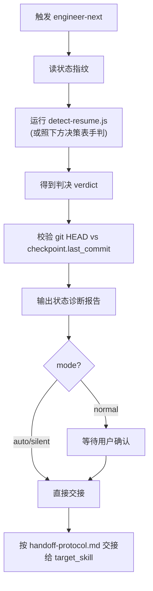

# engineer-next Implementation Plan

> **For agentic workers:** REQUIRED SUB-SKILL: Use superpowers:subagent-driven-development (recommended) or superpowers:executing-plans to implement this plan task-by-task. Steps use checkbox (`- [ ]`) syntax for tracking.

**Goal:** Add `engineer-next`, a pure-router skill that detects where an engineer-* project stopped and hands off to the right downstream skill to resume — including foreign projects with no engineer-* artifacts.

**Architecture:** A thin detection+routing skill. Determinism lives in `references/resume-logic.js` (pure functions, unit-tested, mirroring `engineer-job/references/detection-logic.js`). A CLI wrapper `detect-resume.js` reads the cwd fingerprint and prints a JSON verdict; `SKILL.md` documents the same decision table as a fallback. Execution stays with existing skills (job/orchestrator/architect/requirements) — engineer-next never re-implements phases or writes progress files.

**Tech Stack:** Node.js (CommonJS), `node:test` + `node:assert/strict`, Markdown SKILL.md.

## Global Constraints

- `resume-logic.js` is **pure only**: no `require('fs')`, no I/O, no argless `new Date()`. It exports exactly `detectResumePoint` and `assessCodeVolume`.
- `detect-resume.js` (CLI) **may** use `node:fs` (it is not a workflow script). No argless `new Date()`.
- Tests use `node:test` + `node:assert/strict`; run via `npm test` (= `node --test tests/*.test.js`). CommonJS (`module.exports`/`require`). Node ≥18.
- `SKILL.md` frontmatter must include `name`, `description` (with TRIGGERS), and `compatibility` containing `bash` or `agent` (engineer-* convention). Section headers bilingual 中/EN, matching sibling skills.
- engineer-next has **no `run.wf.js`**.
- Commit messages end with `Co-Authored-By: Claude <noreply@anthropic.com>`.

---

## File Structure

| File | Responsibility |
|:--|:--|
| `skills/engineer-next/SKILL.md` | Frontmatter, trigger conditions, §6 decision table, mode selection, diagnosis report template, edge cases. The model follows this when the CLI is unavailable. |
| `skills/engineer-next/references/resume-logic.js` | Pure single source of truth: `detectResumePoint(state)` + `assessCodeVolume(stats)`. No I/O. |
| `skills/engineer-next/references/detect-resume.js` | CLI wrapper: reads cwd fingerprint → calls `detectResumePoint` → prints JSON verdict. Uses fs. |
| `skills/engineer-next/references/handoff-protocol.md` | Per-scenario handoff instructions + arg reconstruction rules. |
| `skills/engineer-next/evals/resume-cases.json` | Detection test cases (fingerprint → expected verdict). |
| `tests/test-resume.test.js` | `assessCodeVolume` + `detectResumePoint` unit tests, structural guards for SKILL.md/references, CLI smoke test. |
| `README.md`, `README.zh-CN.md` (modify) | Register engineer-next in skill list + decision table + file tree. |

---

## Task 1: `assessCodeVolume` + establish `resume-logic.js` and test harness

**Files:**
- Create: `skills/engineer-next/references/resume-logic.js`
- Create: `tests/test-resume.test.js`

**Interfaces:**
- Produces: `assessCodeVolume({ sourceFiles: number, totalLoc: number }) -> 'substantial' | 'near-empty'` (exported from `resume-logic.js`).

- [ ] **Step 1: Write the failing tests**

Create `tests/test-resume.test.js`:

```js
const { test } = require('node:test')
const assert = require('node:assert/strict')
const fs = require('node:fs')
const path = require('node:path')
const { detectResumePoint, assessCodeVolume } = require('../skills/engineer-next/references/resume-logic.js')

test('assessCodeVolume: near-empty (9 files)', () => {
  assert.equal(assessCodeVolume({ sourceFiles: 9, totalLoc: 400 }), 'near-empty')
})

test('assessCodeVolume: substantial by file count (10)', () => {
  assert.equal(assessCodeVolume({ sourceFiles: 10, totalLoc: 100 }), 'substantial')
})

test('assessCodeVolume: substantial by LOC (500)', () => {
  assert.equal(assessCodeVolume({ sourceFiles: 3, totalLoc: 500 }), 'substantial')
})

test('assessCodeVolume: just below LOC (499)', () => {
  assert.equal(assessCodeVolume({ sourceFiles: 3, totalLoc: 499 }), 'near-empty')
})

test('assessCodeVolume: null stats defaults to near-empty', () => {
  assert.equal(assessCodeVolume(null), 'near-empty')
})
```

- [ ] **Step 2: Run test to verify it fails**

Run: `npm test`
Expected: FAIL — `Cannot find module '../skills/engineer-next/references/resume-logic.js'`

- [ ] **Step 3: Write minimal implementation**

Create `skills/engineer-next/references/resume-logic.js`:

```js
// skills/engineer-next/references/resume-logic.js
// 纯函数单一真源：项目接续点检测。无 fs / 无 I/O。
// 由 tests/test-resume.test.js 守护。与 engineer-job/references/detection-logic.js 同构。

// 外来项目代码体量评估（场景 6a/6b 分界）。
// 统计时由 CLI 忽略 node_modules/.git/target/dist/build/.venv 等依赖目录。
function assessCodeVolume(stats) {
  const files = (stats && stats.sourceFiles) || 0
  const loc = (stats && stats.totalLoc) || 0
  return (files >= 10 || loc >= 500) ? 'substantial' : 'near-empty'
}

// detectResumePoint 在 Task 2 实现；此处先只导出 assessCodeVolume，
// 避免 exports 引用未定义符号导致模块加载即抛 ReferenceError。
module.exports = { assessCodeVolume }
```

- [ ] **Step 4: Run test to verify it passes**

Run: `npm test`
Expected: the 5 `assessCodeVolume` tests PASS. (`detectResumePoint` is `undefined` in the destructure but unused at this stage — no throw.)

- [ ] **Step 5: Commit**

```bash
git add skills/engineer-next/references/resume-logic.js tests/test-resume.test.js
git commit -m "feat(engineer-next): add resume-logic.js with assessCodeVolume + test harness

Co-Authored-By: Claude <noreply@anthropic.com>"
```

---

## Task 2: `detectResumePoint` decision function (driven by resume-cases.json)

**Files:**
- Create: `skills/engineer-next/evals/resume-cases.json`
- Modify: `skills/engineer-next/references/resume-logic.js` (implement `detectResumePoint`)
- Modify: `tests/test-resume.test.js` (add case-driven tests)

**Interfaces:**
- Consumes: `assessCodeVolume` from Task 1.
- Produces: `detectResumePoint(state) -> verdict`, where:
  - `state = { cwdName, jobState|null, progress(bool), metadata|null, context(bool), contextMap(bool), requirements(bool), frontendDesign(bool), pocManifest(bool), codeStats|{sourceFiles,totalLoc}|null }`
  - `verdict = { scenario, resume_point, target_skill, handoff, reconstructed_args|null, reasoning }`
  - `scenario ∈ {"1a","1b","1c","1d","1e","2","3","4","5","6a","6b","7"}`
  - `target_skill ∈ {"engineer-job","engineer-orchestrator","engineer-architect","engineer-requirements",null}`
  - `handoff ∈ {"reinvoke-job-workflow","route-orchestrator","route-architect","route-architect-reverse","route-requirements","report-complete","report-blocked"}`

- [ ] **Step 1: Write the test cases file**

Create `skills/engineer-next/evals/resume-cases.json`:

```json
[
  {
    "label": "1a-architect-pending",
    "state": {
      "cwdName": "demo",
      "jobState": { "project": "demo", "mode": "auto", "checkpoint": { "last_phase": "requirements" },
        "phases": { "init": {"status":"DONE"}, "requirements": {"status":"DONE"}, "architect": {"status":"TODO"}, "frontend": {"status":"TODO"}, "poc": {"status":"TODO"}, "development": {"status":"TODO"}, "run_gate": {"status":"TODO"}, "finalize": {"status":"TODO"}, "deploy": {"status":"TODO"}, "report": {"status":"TODO"} } },
      "metadata": { "project": { "name": "demo", "description": "a demo app", "features": ["posts","auth"] } },
      "progress": false, "context": false, "contextMap": false, "requirements": false,
      "frontendDesign": false, "pocManifest": false, "codeStats": null
    },
    "expected": { "scenario": "1a", "target_skill": "engineer-job", "handoff": "reinvoke-job-workflow" }
  },
  {
    "label": "1b-dev-mixed-milestones",
    "state": {
      "cwdName": "demo",
      "jobState": { "project": "demo", "mode": "auto", "checkpoint": { "last_phase": "development" },
        "phases": { "init": {"status":"DONE"}, "requirements": {"status":"DONE"}, "architect": {"status":"DONE"}, "frontend": {"status":"DONE"}, "poc": {"status":"DONE"},
          "development": {"status":"IN_PROGRESS","features":{"M1":{"status":"DONE"},"M2":{"status":"IN_PROGRESS"}}},
          "run_gate": {"status":"TODO"}, "finalize": {"status":"TODO"}, "deploy": {"status":"TODO"}, "report": {"status":"TODO"} } },
      "metadata": null, "progress": true, "context": true, "contextMap": false,
      "requirements": false, "frontendDesign": true, "pocManifest": false, "codeStats": null
    },
    "expected": { "scenario": "1b", "target_skill": "engineer-orchestrator", "handoff": "route-orchestrator" }
  },
  {
    "label": "1b-dev-not-started",
    "state": {
      "cwdName": "demo",
      "jobState": { "project": "demo", "mode": "normal", "checkpoint": { "last_phase": "poc" },
        "phases": { "init": {"status":"DONE"}, "requirements": {"status":"DONE"}, "architect": {"status":"DONE"}, "frontend": {"status":"DONE"}, "poc": {"status":"DONE"},
          "development": {"status":"TODO"}, "run_gate": {"status":"TODO"}, "finalize": {"status":"TODO"}, "deploy": {"status":"TODO"}, "report": {"status":"TODO"} } },
      "metadata": null, "progress": false, "context": true, "contextMap": false,
      "requirements": false, "frontendDesign": true, "pocManifest": false, "codeStats": null
    },
    "expected": { "scenario": "1b", "target_skill": "engineer-orchestrator", "handoff": "route-orchestrator" }
  },
  {
    "label": "1c-finalize-pending",
    "state": {
      "cwdName": "demo",
      "jobState": { "project": "demo", "mode": "auto", "checkpoint": { "last_phase": "development" },
        "phases": { "init": {"status":"DONE"}, "requirements": {"status":"DONE"}, "architect": {"status":"DONE"}, "frontend": {"status":"DONE"}, "poc": {"status":"DONE"},
          "development": {"status":"DONE"}, "run_gate": {"status":"DONE"}, "finalize": {"status":"TODO"}, "deploy": {"status":"TODO"}, "report": {"status":"TODO"} } },
      "metadata": { "project": { "name": "demo", "description": "a demo app", "features": ["x"] } },
      "progress": true, "context": true, "contextMap": false,
      "requirements": false, "frontendDesign": true, "pocManifest": false, "codeStats": null
    },
    "expected": { "scenario": "1c", "target_skill": "engineer-job", "handoff": "reinvoke-job-workflow" }
  },
  {
    "label": "1d-all-done",
    "state": {
      "cwdName": "demo",
      "jobState": { "project": "demo", "mode": "auto", "checkpoint": { "last_phase": "report" },
        "phases": { "init": {"status":"DONE"}, "requirements": {"status":"DONE"}, "architect": {"status":"DONE"}, "frontend": {"status":"DONE"}, "poc": {"status":"DONE"},
          "development": {"status":"DONE"}, "run_gate": {"status":"DONE"}, "finalize": {"status":"DONE"}, "deploy": {"status":"DONE"}, "report": {"status":"DONE"} } },
      "metadata": null, "progress": true, "context": true, "contextMap": false,
      "requirements": false, "frontendDesign": true, "pocManifest": false, "codeStats": null
    },
    "expected": { "scenario": "1d", "target_skill": null, "handoff": "report-complete" }
  },
  {
    "label": "1e-architect-blocked",
    "state": {
      "cwdName": "demo",
      "jobState": { "project": "demo", "mode": "normal", "checkpoint": { "last_phase": "architect" },
        "phases": { "init": {"status":"DONE"}, "requirements": {"status":"DONE"}, "architect": {"status":"BLOCKED"}, "frontend": {"status":"TODO"}, "poc": {"status":"TODO"},
          "development": {"status":"TODO"}, "run_gate": {"status":"TODO"}, "finalize": {"status":"TODO"}, "deploy": {"status":"TODO"}, "report": {"status":"TODO"} } },
      "metadata": null, "progress": false, "context": false, "contextMap": false,
      "requirements": false, "frontendDesign": false, "pocManifest": false, "codeStats": null
    },
    "expected": { "scenario": "1e", "target_skill": null, "handoff": "report-blocked" }
  },
  {
    "label": "2-progress-only",
    "state": {
      "cwdName": "demo", "jobState": null, "metadata": null,
      "progress": true, "context": true, "contextMap": false,
      "requirements": false, "frontendDesign": false, "pocManifest": false, "codeStats": null
    },
    "expected": { "scenario": "2", "target_skill": "engineer-orchestrator", "handoff": "route-orchestrator" }
  },
  {
    "label": "3-context-only",
    "state": {
      "cwdName": "demo", "jobState": null, "metadata": null,
      "progress": false, "context": true, "contextMap": false,
      "requirements": false, "frontendDesign": false, "pocManifest": false, "codeStats": null
    },
    "expected": { "scenario": "3", "target_skill": "engineer-orchestrator", "handoff": "route-orchestrator" }
  },
  {
    "label": "3-context-multi-module",
    "state": {
      "cwdName": "demo", "jobState": null, "metadata": null,
      "progress": false, "context": true, "contextMap": true,
      "requirements": false, "frontendDesign": false, "pocManifest": false, "codeStats": null
    },
    "expected": { "scenario": "3", "target_skill": "engineer-orchestrator", "handoff": "route-orchestrator" }
  },
  {
    "label": "4-requirements-only",
    "state": {
      "cwdName": "demo", "jobState": null, "metadata": null,
      "progress": false, "context": false, "contextMap": false,
      "requirements": true, "frontendDesign": false, "pocManifest": false, "codeStats": null
    },
    "expected": { "scenario": "4", "target_skill": "engineer-architect", "handoff": "route-architect" }
  },
  {
    "label": "5-metadata-only",
    "state": {
      "cwdName": "demo", "jobState": null,
      "metadata": { "project": { "name": "demo", "type": "cli-tool" } },
      "progress": false, "context": false, "contextMap": false,
      "requirements": false, "frontendDesign": false, "pocManifest": false, "codeStats": null
    },
    "expected": { "scenario": "5", "target_skill": "engineer-requirements", "handoff": "route-requirements" }
  },
  {
    "label": "6a-foreign-near-empty",
    "state": {
      "cwdName": "demo", "jobState": null, "metadata": null,
      "progress": false, "context": false, "contextMap": false,
      "requirements": false, "frontendDesign": false, "pocManifest": false,
      "codeStats": { "sourceFiles": 3, "totalLoc": 120 }
    },
    "expected": { "scenario": "6a", "target_skill": "engineer-job", "handoff": "reinvoke-job-workflow" }
  },
  {
    "label": "6b-foreign-substantial",
    "state": {
      "cwdName": "demo", "jobState": null, "metadata": null,
      "progress": false, "context": false, "contextMap": false,
      "requirements": false, "frontendDesign": false, "pocManifest": false,
      "codeStats": { "sourceFiles": 15, "totalLoc": 800 }
    },
    "expected": { "scenario": "6b", "target_skill": "engineer-architect", "handoff": "route-architect-reverse" }
  },
  {
    "label": "7-empty-dir",
    "state": {
      "cwdName": "demo", "jobState": null, "metadata": null,
      "progress": false, "context": false, "contextMap": false,
      "requirements": false, "frontendDesign": false, "pocManifest": false,
      "codeStats": { "sourceFiles": 0, "totalLoc": 0 }
    },
    "expected": { "scenario": "7", "target_skill": "engineer-job", "handoff": "reinvoke-job-workflow" }
  }
]
```

- [ ] **Step 2: Add the case-driven tests**

Append to `tests/test-resume.test.js` (after the `assessCodeVolume` tests):

```js
// detectResumePoint — 用例驱动
const cases = JSON.parse(fs.readFileSync(path.join(__dirname, '..', 'skills', 'engineer-next', 'evals', 'resume-cases.json'), 'utf8'))
for (const c of cases) {
  test(`detectResumePoint: ${c.label}`, () => {
    const v = detectResumePoint(c.state)
    assert.equal(v.scenario, c.expected.scenario, `scenario for "${c.label}"`)
    assert.equal(v.target_skill, c.expected.target_skill, `target_skill for "${c.label}"`)
    assert.equal(v.handoff, c.expected.handoff, `handoff for "${c.label}"`)
  })
}
```

- [ ] **Step 3: Run tests to verify they fail**

Run: `npm test`
Expected: FAIL — `detectResumePoint is not a function` (the case loop calls it and throws).

- [ ] **Step 4: Implement `detectResumePoint`**

Replace the entire contents of `skills/engineer-next/references/resume-logic.js` with:

```js
// skills/engineer-next/references/resume-logic.js
// 纯函数单一真源：项目接续点检测。无 fs / 无 I/O。
// 由 tests/test-resume.test.js 守护。与 engineer-job/references/detection-logic.js 同构。

// 外来项目代码体量评估（场景 6a/6b 分界）。
// 统计时由 CLI 忽略 node_modules/.git/target/dist/build/.venv 等依赖目录。
function assessCodeVolume(stats) {
  const files = (stats && stats.sourceFiles) || 0
  const loc = (stats && stats.totalLoc) || 0
  return (files >= 10 || loc >= 500) ? 'substantial' : 'near-empty'
}

// job.state.json 阶段规范顺序
const PHASE_ORDER = ['init', 'requirements', 'architect', 'frontend', 'poc', 'development', 'run_gate', 'finalize', 'deploy', 'report']
const DESIGN_PHASES = ['requirements', 'architect', 'frontend', 'poc']
const REINVOKE_PHASES = ['init', 'requirements', 'architect', 'frontend', 'poc']
const CLOSURE_PHASES = ['run_gate', 'finalize', 'deploy', 'report']

function phaseStatus(jobState, name) {
  const p = jobState && jobState.phases && jobState.phases[name]
  return p ? p.status : 'TODO'
}

function featuresHaveMixed(features) {
  if (!features) return false
  const vals = Object.values(features).map((f) => f && f.status)
  const hasDone = vals.includes('DONE')
  const hasPending = vals.some((v) => v === 'TODO' || v === 'IN_PROGRESS')
  return hasDone && hasPending
}

function nextTodoFeature(features) {
  if (!features) return null
  for (const id of Object.keys(features)) {
    const st = features[id] && features[id].status
    if (st === 'TODO' || st === 'IN_PROGRESS') return id
  }
  return null
}

// 重建重调/新建 engineer-job 的参数。
// fresh=true：全新型（6a/7），requirements 留空交由用户/job 补。
// fresh=false：接续型（1a/1c），从 job.state.json + project-metadata.json 重建。
function buildReconstructedArgs(state, fresh) {
  const js = state.jobState
  const meta = state.metadata
  const projectName = (js && js.project) || (meta && meta.project && meta.project.name) || state.cwdName || 'unnamed-project'
  const mode = (js && js.mode) || 'normal'
  let requirements = ''
  let skipRequirements = false
  let skipFrontend = false
  if (!fresh) {
    const desc = meta && meta.project && meta.project.description
    const feats = meta && meta.project && meta.project.features
    requirements = [desc, feats && feats.length ? feats.join('、') : null].filter(Boolean).join('；') || ''
    skipRequirements = !!(meta && meta.project && meta.project.skip_requirements)
    skipFrontend = !!(meta && meta.project && meta.project.skip_frontend)
  }
  return {
    mode,
    projectName,
    requirements,
    skip_requirements: skipRequirements,
    skip_frontend: skipFrontend,
    skip_poc: skipFrontend,
    stop_at_poc: false,
  }
}

function detectResumePoint(state) {
  const s = state || {}
  const js = s.jobState

  // 场景 1a–1e：job.state.json 存在
  if (js) {
    const statuses = PHASE_ORDER.map((name) => ({ name, status: phaseStatus(js, name) }))

    // 1e：任一阶段 BLOCKED
    const blocked = statuses.find((p) => p.status === 'BLOCKED')
    if (blocked) {
      return { scenario: '1e', resume_point: `阶段 ${blocked.name} 阻塞`, target_skill: null, handoff: 'report-blocked', reconstructed_args: null, reasoning: `job.state.json 中阶段 ${blocked.name} 为 BLOCKED` }
    }

    // 1d：全阶段 DONE
    if (statuses.every((p) => p.status === 'DONE')) {
      return { scenario: '1d', resume_point: '已完成', target_skill: null, handoff: 'report-complete', reconstructed_args: null, reasoning: 'job.state.json 全部阶段 DONE' }
    }

    const firstNonDone = statuses.find((p) => p.status !== 'DONE')
    const devStatus = phaseStatus(js, 'development')
    const devFeatures = js.phases && js.phases.development && js.phases.development.features

    // 1b：development 为首个未完成阶段（TODO 起步或 IN_PROGRESS）——走 orchestrator 里程碑级恢复，
    // 避免重调 job 在 development 阶段把里程碑状态初始化为全 TODO 重跑。
    if (firstNonDone.name === 'development') {
      const resumeId = nextTodoFeature(devFeatures)
      return {
        scenario: '1b',
        resume_point: resumeId ? `里程碑 ${resumeId}` : '首个里程碑',
        target_skill: 'engineer-orchestrator',
        handoff: 'route-orchestrator',
        reconstructed_args: null,
        reasoning: `development 为 ${devStatus}${featuresHaveMixed(devFeatures) ? '（部分里程碑已完成）' : ''}；走 orchestrator 里程碑级恢复，避免重调 job 重跑已完成里程碑`,
      }
    }

    // 1a：首个未完成阶段在 init/设计期——重调 job Workflow 自动跳过 DONE 阶段
    if (REINVOKE_PHASES.includes(firstNonDone.name)) {
      return { scenario: '1a', resume_point: `阶段 ${firstNonDone.name}`, target_skill: 'engineer-job', handoff: 'reinvoke-job-workflow', reconstructed_args: buildReconstructedArgs(s, false), reasoning: `下一个未完成阶段为 ${firstNonDone.name}；重调 job Workflow 自动跳过 DONE 阶段` }
    }

    // 1c：development 已 DONE，收尾阶段未完成——重调 job 跑 run-gate/integrate/deploy/report（不重跑里程碑）
    if (CLOSURE_PHASES.includes(firstNonDone.name)) {
      return { scenario: '1c', resume_point: `收尾阶段 ${firstNonDone.name}`, target_skill: 'engineer-job', handoff: 'reinvoke-job-workflow', reconstructed_args: buildReconstructedArgs(s, false), reasoning: `development 已 DONE，下一个未完成为收尾 ${firstNonDone.name}；重调 job 跑 run-gate/integrate/deploy/report` }
    }
  }

  // 场景 2：仅有 progress.json
  if (s.progress) {
    return { scenario: '2', resume_point: '下一个 TODO 里程碑', target_skill: 'engineer-orchestrator', handoff: 'route-orchestrator', reconstructed_args: null, reasoning: '无 job.state.json 但存在 progress.json；走 orchestrator 恢复流程' }
  }

  // 场景 3：蓝图就绪未开发
  if (s.context) {
    const multi = !!s.contextMap
    return { scenario: '3', resume_point: multi ? '首个模块' : '首个里程碑', target_skill: 'engineer-orchestrator', handoff: 'route-orchestrator', reconstructed_args: null, reasoning: `蓝图 CONTEXT.md 就绪${multi ? '（多模块，有 CONTEXT-MAP.md）' : ''}；走 orchestrator 开始里程碑` }
  }

  // 场景 4：仅有需求文档
  if (s.requirements) {
    return { scenario: '4', resume_point: '架构设计', target_skill: 'engineer-architect', handoff: 'route-architect', reconstructed_args: null, reasoning: '仅有 REQUIREMENTS.md；路由 architect 生成 CONTEXT.md' }
  }

  // 场景 5：仅脚手架元数据
  if (s.metadata) {
    return { scenario: '5', resume_point: '需求/架构', target_skill: 'engineer-requirements', handoff: 'route-requirements', reconstructed_args: null, reasoning: '仅有 project-metadata.json（脚手架）；路由 requirements（简单项目可由其转 architect）' }
  }

  // 场景 6a/6b/7：零 engineer* 产物（外来项目 / 空目录）
  const stats = s.codeStats || null
  if (stats && assessCodeVolume(stats) === 'substantial') {
    return { scenario: '6b', resume_point: '逆向建模', target_skill: 'engineer-architect', handoff: 'route-architect-reverse', reconstructed_args: null, reasoning: `零 engineer* 产物且代码体量大（${stats.sourceFiles} 文件 / ${stats.totalLoc} LOC）；路由 architect 逆向建模出蓝图` }
  }
  const isEmpty = stats && stats.sourceFiles === 0 && stats.totalLoc === 0
  if (isEmpty) {
    return { scenario: '7', resume_point: '从零开始', target_skill: 'engineer-job', handoff: 'reinvoke-job-workflow', reconstructed_args: buildReconstructedArgs(s, true), reasoning: '完全空目录；路由 engineer-job 全新（无需求则先问最少问题）' }
  }
  return { scenario: '6a', resume_point: '从零开始', target_skill: 'engineer-job', handoff: 'reinvoke-job-workflow', reconstructed_args: buildReconstructedArgs(s, true), reasoning: '零 engineer* 产物且代码近乎为空；路由 engineer-job 全新，既有零散文件当作脚手架' }
}

module.exports = { detectResumePoint, assessCodeVolume }
```

- [ ] **Step 5: Run tests to verify they pass**

Run: `npm test`
Expected: all `assessCodeVolume` + 14 `detectResumePoint` case tests PASS.

- [ ] **Step 6: Commit**

```bash
git add skills/engineer-next/references/resume-logic.js skills/engineer-next/evals/resume-cases.json tests/test-resume.test.js
git commit -m "feat(engineer-next): implement detectResumePoint decision function + cases

Co-Authored-By: Claude <noreply@anthropic.com>"
```

---

## Task 3: `detect-resume.js` CLI wrapper + smoke test

**Files:**
- Create: `skills/engineer-next/references/detect-resume.js`
- Modify: `tests/test-resume.test.js` (add structural + smoke tests)

**Interfaces:**
- Consumes: `detectResumePoint` from Task 2.
- Produces: a CLI `node skills/engineer-next/references/detect-resume.js [projectDir]` that prints the verdict JSON to stdout.

- [ ] **Step 1: Write the failing tests**

Append to `tests/test-resume.test.js`:

```js
test('resume-logic.js exports both functions', () => {
  const src = fs.readFileSync(path.join(__dirname, '..', 'skills', 'engineer-next', 'references', 'resume-logic.js'), 'utf8')
  assert.ok(src.includes('function detectResumePoint'), 'defines detectResumePoint')
  assert.ok(src.includes('function assessCodeVolume'), 'defines assessCodeVolume')
  assert.ok(/module\.exports\s*=\s*\{\s*detectResumePoint/.test(src), 'exports detectResumePoint')
  assert.ok(!src.includes('require('), 'resume-logic.js must be pure (no require)')
})

test('detect-resume.js CLI uses fs and has no argless new Date()', () => {
  const src = fs.readFileSync(path.join(__dirname, '..', 'skills', 'engineer-next', 'references', 'detect-resume.js'), 'utf8')
  assert.ok(src.includes("require('node:fs')") || src.includes('require("node:fs")'), 'uses node:fs')
  assert.ok(!/new Date\(\)/.test(src), 'no argless new Date()')
  assert.ok(src.includes('detectResumePoint'), 'calls detectResumePoint')
})

test('detect-resume.js CLI smoke: empty dir -> scenario 7', () => {
  const { execSync } = require('node:child_process')
  const os = require('node:os')
  const tmp = fs.mkdtempSync(path.join(os.tmpdir(), 'engineer-next-'))
  const cli = path.join(__dirname, '..', 'skills', 'engineer-next', 'references', 'detect-resume.js')
  const out = execSync(`node ${JSON.stringify(cli)} ${JSON.stringify(tmp)}`, { encoding: 'utf8' })
  const verdict = JSON.parse(out)
  assert.equal(verdict.scenario, '7', 'empty dir should be scenario 7')
  assert.equal(verdict.target_skill, 'engineer-job')
})
```

- [ ] **Step 2: Run tests to verify they fail**

Run: `npm test`
Expected: FAIL — `detect-resume.js` does not exist (readFileSync ENOENT; smoke execSync ENOENT).

- [ ] **Step 3: Implement the CLI wrapper**

Create `skills/engineer-next/references/detect-resume.js`:

```js
#!/usr/bin/env node
// skills/engineer-next/references/detect-resume.js
// CLI 包装：读 cwd（或传入目录）的状态指纹 -> 调 detectResumePoint -> 打印 JSON 判决。
// 这是普通 node 脚本（非 workflow 脚本），可以使用 fs。
// 用法: node detect-resume.js [projectDir]

const fs = require('node:fs')
const path = require('node:path')
const { detectResumePoint } = require('./resume-logic.js')

// 统计代码体量时忽略的目录与计数的源码扩展名
const IGNORED_DIRS = new Set([
  'node_modules', '.git', 'target', 'dist', 'build', '.venv', 'venv',
  '__pycache__', '.next', '.cache', 'coverage', '.idea', '.vscode',
])
const CODE_EXT = new Set([
  '.js', '.jsx', '.ts', '.tsx', '.mjs', '.cjs', '.py', '.rs', '.go',
  '.java', '.kt', '.rb', '.php', '.c', '.cc', '.cpp', '.h', '.hpp',
  '.cs', '.swift', '.m', '.vue', '.svelte', '.scala',
])

function readJson(file) {
  try { return JSON.parse(fs.readFileSync(file, 'utf8')) } catch { return null }
}
function exists(file) {
  try { return fs.existsSync(file) } catch { return false }
}

// 递归统计非依赖目录下的源文件数与总行数
function countCode(root) {
  let sourceFiles = 0
  let totalLoc = 0
  const walk = (dir) => {
    let entries
    try { entries = fs.readdirSync(dir, { withFileTypes: true }) } catch { return }
    for (const e of entries) {
      if (e.name.startsWith('.')) continue
      const full = path.join(dir, e.name)
      if (e.isDirectory()) {
        if (!IGNORED_DIRS.has(e.name)) walk(full)
      } else if (CODE_EXT.has(path.extname(e.name).toLowerCase())) {
        sourceFiles++
        try { totalLoc += fs.readFileSync(full, 'utf8').split('\n').length } catch { /* ignore unreadable */ }
      }
    }
  }
  walk(root)
  return { sourceFiles, totalLoc }
}

function main() {
  const root = process.argv[2] ? path.resolve(process.argv[2]) : process.cwd()
  const agents = path.join(root, '.agents')
  const state = {
    cwdName: path.basename(root) || 'unnamed-project',
    jobState: readJson(path.join(agents, 'job.state.json')),
    progress: exists(path.join(agents, 'progress.json')),
    metadata: readJson(path.join(root, 'project-metadata.json')),
    context: exists(path.join(root, 'CONTEXT.md')),
    contextMap: exists(path.join(root, 'CONTEXT-MAP.md')),
    requirements: exists(path.join(root, 'REQUIREMENTS.md')),
    frontendDesign: exists(path.join(root, 'FRONTEND-DESIGN.md')),
    pocManifest: exists(path.join(root, 'POC-MANIFEST.md')),
    codeStats: countCode(root),
  }
  const verdict = detectResumePoint(state)
  process.stdout.write(JSON.stringify(verdict, null, 2) + '\n')
}

main()
```

- [ ] **Step 4: Run tests to verify they pass**

Run: `npm test`
Expected: the 3 new tests PASS (and all prior tests still PASS).

- [ ] **Step 5: Commit**

```bash
git add skills/engineer-next/references/detect-resume.js tests/test-resume.test.js
git commit -m "feat(engineer-next): add detect-resume.js CLI wrapper + smoke test

Co-Authored-By: Claude <noreply@anthropic.com>"
```

---

## Task 4: `handoff-protocol.md`

**Files:**
- Create: `skills/engineer-next/references/handoff-protocol.md`
- Modify: `tests/test-resume.test.js` (add structural guard)

**Interfaces:**
- Consumes: the verdict shape from Task 2.
- Produces: human-readable handoff instructions referenced by `SKILL.md` (Task 5).

- [ ] **Step 1: Write the failing test**

Append to `tests/test-resume.test.js`:

```js
test('handoff-protocol.md documents every handoff kind', () => {
  const md = fs.readFileSync(path.join(__dirname, '..', 'skills', 'engineer-next', 'references', 'handoff-protocol.md'), 'utf8')
  for (const h of ['reinvoke-job-workflow', 'route-orchestrator', 'route-architect', 'route-architect-reverse', 'route-requirements', 'report-complete', 'report-blocked']) {
    assert.ok(md.includes(h), `handoff-protocol.md covers ${h}`)
  }
  assert.ok(md.includes('reconstructed_args') || md.includes('重建参数') || md.includes('参数重建'), 'documents arg reconstruction')
})
```

- [ ] **Step 2: Run test to verify it fails**

Run: `npm test`
Expected: FAIL — `handoff-protocol.md` ENOENT.

- [ ] **Step 3: Write `handoff-protocol.md`**

Create `skills/engineer-next/references/handoff-protocol.md`:

````markdown
# engineer-next 交接协议 / Handoff Protocol

`detectResumePoint` 返回的判决里有 `handoff` 字段，决定 engineer-next 怎么把控制权交给下游。本文逐种 handoff 给出确切指令。所有交接前先输出 §9 状态诊断报告；normal 模式等用户确认，auto/silent 直接交接。交接时把同一 `--mode` 透传给下游。

## 通用前置

1. 读取判决（`node skills/engineer-next/references/detect-resume.js [dir]` 或照 SKILL.md 决策表手判）。
2. 校验 `git rev-parse HEAD` 与 `job.state.json.checkpoint.last_commit`：偏差在诊断报告标 ⚠️，normal 模式询问用户。
3. 输出诊断报告，按 mode 决定是否等待确认。

## reinvoke-job-workflow（场景 1a / 1c / 6a / 7）

重调 `engineer-job` 的 Workflow，**复用它已有的阶段跳过与自愈**，不在 engineer-next 里重做。

- **1a/1c（接续型）**：判决里的 `reconstructed_args` 已从 `job.state.json` + `project-metadata.json` 重建好（mode/projectName/requirements/skip_*）。
- **6a/7（全新型）**：`reconstructed_args.requirements` 为空——**先从用户本次输入补全 requirements**；若用户没给，按 auto/silent 交由 engineer-job 问最少问题。开工前若需求文本明显是纯后端/CLI，可把 `skip_frontend`/`skip_poc` 设 true（参照 `engineer-job/references/detection-logic.js` 的 `detectComplexity`）。

调用形式：

```javascript
Workflow({
  script: "skills/engineer-job/run.wf.js",
  args: {
    requirements: "<reconstructed_args.requirements 或用户输入>",
    mode: "<reconstructed_args.mode>",
    projectName: "<reconstructed_args.projectName>",
    skip_requirements: <bool>,
    skip_frontend: <bool>,
    skip_poc: <bool>,
    stop_at_poc: false,
  }
})
```

Workflow 工具不可用时，退回 engineer-job 的"手动子代理调度"模式，按相同 args 启动。

## route-orchestrator（场景 1b / 2 / 3）

把控制权交给 `engineer-orchestrator` 的恢复流程。**不要重调 engineer-job 的 Workflow**——job 在 development 阶段会把里程碑状态初始化为全 TODO 重跑已完成里程碑，orchestrator 才有里程碑级恢复（读 `.agents/progress.json`）。

启动指令（向 orchestrator 下发）：

```markdown
继续项目 [名称] 的开发。蓝图：CONTEXT.md（当前目录）。从下一个 TODO 里程碑继续：
读取 .agents/progress.json（或 job.state.json.development.features）确定断点；
git log 验证当前 commit；运行测试基线；然后从下一个 TODO 里程碑接续 engineer-workflow。
[有 CONTEXT-MAP.md 时] 这是多模块项目，按 CONTEXT-MAP.md 的开发顺序编排。
```

## route-architect（场景 4）

仅有 `REQUIREMENTS.md`，路由 `engineer-architect` 产出 `CONTEXT.md`：

```markdown
读取当前目录的 REQUIREMENTS.md，生成完整 CONTEXT.md 蓝图（系统概览/技术栈/数据模型/API 契约/里程碑依赖树/词汇表）。
完成后交回 engineer-next（或直接由 orchestrator 接续开发）。
```

## route-architect-reverse（场景 6b）

零 engineer* 产物且代码体量大（外来项目）。遵守"无蓝图不开工"——**先逆向建模，再继续**，不在无蓝图代码上直接开干。

```markdown
这是已有大量代码但无 engineer* 产物的外来项目。执行逆向分析：
1. 扫描现有文件结构与代码，推断技术栈、数据模型、API、模块边界。
2. 生成 REQUIREMENTS.md（从代码反推的角色/功能/状态机）与 CONTEXT.md（既有代码作为地基）。
3. 诚实标注哪些是"明示/observed"、哪些是"推断/inferred"、哪些是"缺口/gap"（缺口列出来问用户）。
完成后交回 engineer-next，按场景 3 路由 orchestrator 接续开发。
```

## route-requirements（场景 5）

只有 `project-metadata.json`（脚手架已就绪），路由 `engineer-requirements` 做需求拆解（产出 REQUIREMENTS.md）。若项目明显简单（单功能/CRUD），可直接路由 `engineer-architect` 一步出 CONTEXT.md。

## report-complete（场景 1d）

`job.state.json` 全阶段 DONE。不交接——输出"项目已完成"，建议：运行 `engineer-advisor` 诊断后续方向，或追加新功能走 `engineer-architect` 更新蓝图。

## report-blocked（场景 1e）

某阶段 BLOCKED。不自动交接——输出阻塞信息（阶段名 + job.state.json 里的错误记录），建议：路由该阶段对应技能带阻塞上下文重试，或 `engineer-advisor` 诊断。normal 模式询问用户选择。

## 参数重建对照表（reconstructed_args）

| 参数 | 接续型(1a/1c)来源 | 全新型(6a/7)来源/兜底 |
|:--|:--|:--|
| mode | jobState.mode | 用户指定 / normal |
| projectName | jobState.project → metadata.project.name → cwdName | 同左兜底链 |
| requirements | metadata.project.description + features 拼接 | 用户本次输入 / 空（交 job 询问） |
| skip_requirements / skip_frontend / skip_poc | metadata 的 skip_*/has_frontend | 默认 false（交 job 自检测） |
| stop_at_poc | 固定 false | 固定 false |
````

- [ ] **Step 4: Run test to verify it passes**

Run: `npm test`
Expected: the handoff-protocol test PASS.

- [ ] **Step 5: Commit**

```bash
git add skills/engineer-next/references/handoff-protocol.md tests/test-resume.test.js
git commit -m "docs(engineer-next): add handoff-protocol.md

Co-Authored-By: Claude <noreply@anthropic.com>"
```

---

## Task 5: `SKILL.md`

**Files:**
- Create: `skills/engineer-next/SKILL.md`
- Modify: `tests/test-resume.test.js` (add SKILL.md structural guards)

**Interfaces:**
- Consumes: `resume-logic.js`, `detect-resume.js`, `handoff-protocol.md`.
- Produces: the skill's frontmatter + playbook. The repo's `tests/engineer-job.test.js` "all skills" loop auto-discovers this dir and checks frontmatter.

- [ ] **Step 1: Write the failing tests**

Append to `tests/test-resume.test.js`:

```js
test('SKILL.md frontmatter is valid', () => {
  const md = fs.readFileSync(path.join(__dirname, '..', 'skills', 'engineer-next', 'SKILL.md'), 'utf8')
  const fm = md.match(/^---\n([\s\S]*?)\n---/)
  assert.ok(fm, 'has frontmatter')
  assert.ok(/^name:\s*engineer-next/m.test(fm[1]), 'name: engineer-next')
  assert.ok(/compatibility:.*(?:bash|agent)/.test(fm[1]), 'compatibility includes bash or agent')
})

test('SKILL.md has decision table, modes, triggers, references', () => {
  const md = fs.readFileSync(path.join(__dirname, '..', 'skills', 'engineer-next', 'SKILL.md'), 'utf8')
  assert.ok(md.includes('## ⚙️ 模式选择'), 'mode selection section')
  for (const k of ['1a', '1b', '1c', '1d', '1e', '2', '3', '4', '5', '6a', '6b', '7']) {
    assert.ok(md.includes(k), `decision table covers scenario ${k}`)
  }
  for (const k of ['job.state.json', 'progress.json', 'CONTEXT.md', 'REQUIREMENTS.md']) {
    assert.ok(md.includes(k), `references ${k}`)
  }
  assert.ok(/继续|接着|next|continue|resume/i.test(md), 'has resume trigger phrases')
  assert.ok(md.includes('resume-logic.js'), 'references resume-logic.js')
  assert.ok(md.includes('detect-resume.js'), 'references detect-resume.js')
  assert.ok(md.includes('handoff-protocol.md'), 'references handoff-protocol.md')
})
```

- [ ] **Step 2: Run tests to verify they fail**

Run: `npm test`
Expected: FAIL — `SKILL.md` ENOENT.

- [ ] **Step 3: Write `SKILL.md`**

Create `skills/engineer-next/SKILL.md`:

````markdown
---
name: engineer-next
description: >
  【强触发 / Strong trigger】"继续 / 接着做 / next / continue / resume / 恢复进度"——
  任意工作目录下，快速诊断项目停在哪一格，并把控制权交接给正确的 engineer* 下游技能接续开发。
  AI 进度接续路由引擎 — 读取 engineer* 系列的状态指纹（job.state.json / progress.json /
  CONTEXT.md / REQUIREMENTS.md / project-metadata.json / 代码体量），判定断点，路由到
  engineer-job / engineer-orchestrator / engineer-architect / engineer-requirements。
  纯路由 skill：只做"判断准 + 转发对"，不重写阶段逻辑、不写进度文件、不跑构建测试。
  TRIGGERS: 用户说"继续""接着做""继续[项目]开发""恢复进度""接着干""接着上次的进度"
  "continue""next""resume""pick up where I left off""keep going"——
  当用户想接着上次的进度继续、但不确定停在哪、也不指定具体技能时触发。
  ROUTING RULE: 用户明确指定了起点（"从零做完整项目"→engineer-job；"实现某功能"→engineer-workflow；
  "画蓝图"→engineer-architect）时让位给那个技能；只有"不确定在哪、想接着继续"时才用本技能。
compatibility: "agent, bash, write, edit, read"
---

# engineer-next — AI 进度接续路由引擎 / AI Resume Router

> **来源声明**: 本 skill 的方法论来源于《基于实现规划的 AI 辅助编程实战》。更多内容请访问 [zhurongshuo.com]。
>
> **Source**: The methodology of this skill originates from "AI-Assisted Programming Practice Based on Implementation Planning".

---

## 🎯 核心理念 / Core Philosophy

engineer-next 是一个**精准的调度员**：用最小代价搞清楚"项目现在停在哪一格"，然后把球传给最该接手的那个人，自己从不亲自下场砌墙。

| 角色 | 职责 |
|------|------|
| **调度员** engineer-next | 诊断断点 → 路由到正确技能 |
| 总包/包工头/队长/监理/顾问 | 实际执行（既有 engineer* 技能） |

**engineer-workflow/orchestrator/job 负责干活。engineer-next 负责判断该谁接着干、从哪接着干。**

> **The other engineer-* skills do the work. engineer-next decides who resumes, and from where.**

### 三条核心原则

1. **状态即文件，诊断即读文件 / State Is Files** —— 只读既有 `job.state.json` / `progress.json` / `project-metadata.json` / `CONTEXT.md` / `REQUIREMENTS.md` / `FRONTEND-DESIGN.md` / `POC-MANIFEST.md`，不写自己的进度。检测优先级：`job.state.json → progress.json → CONTEXT.md → 用户`。
2. **复用既有恢复，绝不重跑 / Reuse Recovery, Never Redo** —— 接续的命门是"从断点继续"。典型陷阱：重调 `engineer-job` 在 development 阶段会重跑所有里程碑——所以"开发进行中"必须走 `engineer-orchestrator` 的里程碑级恢复。
3. **降级优于阻塞 / Degrade Over Block** —— 状态文件损坏/检测歧义，按既定优先级降级判定，只在 normal 模式提示用户。

---

## 🚦 触发条件 / When to Trigger

**必须触发**（万能继续入口）：
- "继续 / 接着做 / 继续[项目/功能] / 接着开发 / 恢复进度 / 接着干"
- "continue / next / resume / pick up where I left off / keep going"

**链式触发**：上下文重置/新会话后用户说"继续项目 [名称]"。

**不触发**（让位给具体技能）：
- "实现登录功能"（明确单功能）→ engineer-workflow
- "从零做一个完整项目"（明确从零）→ engineer-job
- "画蓝图/做架构"（明确要设计）→ engineer-architect

---

## ⚙️ 模式选择 / Mode Selection

与家族一致（默认 normal）：

| 模式 | 行为 |
|:----:|------|
| normal | 出状态诊断报告，等待用户确认后再交接；检测不确定（如 git 偏差）时询问。 |
| auto | 出诊断摘要后直接交接，不确定性按默认降级。 |
| silent | 静默诊断 + 交接，仅记日志，末尾输出交接摘要。 |

**mode 透传**：交接时把同一 `--mode` 透传给 target_skill。

---

## 🔍 诊断流程 / Diagnosis Flow



### 状态指纹（读哪些文件）

| 文件 | 用途 |
|------|------|
| `.agents/job.state.json` | 全生命周期状态（phases + checkpoint） |
| `.agents/progress.json` | orchestrator 里程碑跟踪 |
| `project-metadata.json` | init→architect→orchestrator 协议 |
| `CONTEXT.md` / `CONTEXT-MAP.md` | 蓝图 / 多模块地图 |
| `REQUIREMENTS.md` / `FRONTEND-DESIGN.md` / `POC-MANIFEST.md` | 设计产物 |
| 代码体量统计 | 外来项目判定（忽略 node_modules/.git/target/dist/build/.venv 等） |

### 运行诊断（推荐）

```bash
node skills/engineer-next/references/detect-resume.js [projectDir]
```

打印 JSON 判决 `{scenario, resume_point, target_skill, handoff, reconstructed_args, reasoning}`。CLI 不可用时，照下方决策表手动判定——判决逻辑的单一真源是 `references/resume-logic.js`（纯函数，单测守护）。

---

## 🗺️ 检测→路由决策表 / Detection→Routing Decision Table

按优先级从高到低。完整交接指令见 `references/handoff-protocol.md`。

| 优先级 | Scenario（看什么产物） | resume_point | target_skill / 交接方式 |
|:-:|---|---|---|
| 1a | `job.state.json` 在，下一个未完成阶段是 **init/设计期**（requirements/architect/frontend/poc） | 该阶段 | **重调 engineer-job run.wf.js**（自动跳过 DONE 阶段）；从 job.state.json+project-metadata.json 重建参数 |
| 1b | `job.state.json` 在，`development` 为首个未完成阶段（TODO 起步或 IN_PROGRESS） | 下一个 TODO 里程碑 | **路由 engineer-orchestrator**（里程碑级恢复）。⚠️ 不重调 job，否则重跑已完成里程碑 |
| 1c | `job.state.json` 在，`development` DONE，但 run_gate/finalize/deploy/report 未完成 | 收尾阶段 | **重调 engineer-job run.wf.js**（不重跑里程碑） |
| 1d | `job.state.json` 全阶段 DONE | （已完成） | 报告"已完成"，建议 engineer-advisor 或追加功能走 architect |
| 1e | 某阶段 BLOCKED | 该阶段 | 报告阻塞 + 路由该技能/advisor |
| 2 | 无 job.state，但有 `.agents/progress.json` | 下一个 TODO 里程碑 | **路由 engineer-orchestrator** 恢复 |
| 3 | 无 job.state/progress，但有 `CONTEXT.md`（蓝图就绪） | 首个里程碑/模块 | **路由 engineer-orchestrator**（有 CONTEXT-MAP.md 走多模块） |
| 4 | 无 job.state/progress/CONTEXT，但有 `REQUIREMENTS.md` | 架构设计 | **路由 engineer-architect** 产 CONTEXT.md |
| 5 | 只有 `project-metadata.json`（仅脚手架） | 需求/架构 | **路由 engineer-requirements**（简单项目→architect） |
| 6a | **零 engineer* 产物 + 代码近乎为空**（<10 文件 且 <500 LOC） | 从零开始 | **路由 engineer-job 全新**（既有零散文件当脚手架） |
| 6b | **零 engineer* 产物 + 已有大量代码**（外来项目） | 逆向建模 | **路由 engineer-architect 逆向分析** → 生成 REQUIREMENTS.md+CONTEXT.md → 再接 orchestrator |
| 7 | 完全空目录 | 从零开始 | **路由 engineer-job 全新**（无需求则先问最少问题） |

**两条贯穿原则**：复用既有恢复绝不重跑（1b 是关键）；外来项目遵守"无蓝图不开工"（6b 先逆向出蓝图）。

---

## 📋 状态诊断报告 / Diagnosis Report

交接前输出（模板）：

```markdown
## 🔍 状态诊断 / State Diagnosis

**项目**: [名称]　**检测场景**: [scenario + resume_point]
**判定依据**: [verdict.reasoning]

### 已完成
1. ✅ [阶段/里程碑...]

### 待续
2. [ ] [下一个动作]　→ 路由到 **[target_skill]**

### 验证
- git HEAD vs checkpoint.last_commit: [一致 ✅ / 偏差 ⚠️]
- （若适用）测试基线: [N/N 通过]

### 下一步
[normal] 确认后我将交接给 [target_skill]...
[auto] 直接交接。
```

---

## ⚠️ 边界情况 / Edge Cases

| 场景 | 处理 |
|------|------|
| `job.state.json` 损坏/无法解析 | 降级到 progress.json → CONTEXT.md → 外来项目判定 |
| git HEAD 与 `checkpoint.last_commit` 偏差 | 诊断报告标 ⚠️；normal 模式询问 |
| 恢复时用户给了**新需求** | 新功能→路由 orchestrator 追加；改范围→路由 architect |
| `CONTEXT-MAP.md` 在（多模块） | 交 orchestrator 多模块编排 |
| 检测歧义 | 严格按决策表优先级（2 > 4 等） |
| 外来项目体量在阈值附近 | 保守走逆向(6b)——宁可有蓝图 |

---

## 🚫 非目标 / Non-Goals

1. 不重实现任何阶段（init/requirements/architect/dev/...）。
2. 不写自己的进度文件（只读既有）。
3. 不自己跑构建/测试。
4. 不自带 `run.wf.js`。
5. 不做语义级"下一个具体 TODO"推荐——只做技能/阶段/里程碑级路由。
````

- [ ] **Step 4: Run tests to verify they pass**

Run: `npm test`
Expected: the 2 SKILL.md tests PASS.

- [ ] **Step 5: Commit**

```bash
git add skills/engineer-next/SKILL.md tests/test-resume.test.js
git commit -m "feat(engineer-next): add SKILL.md playbook

Co-Authored-By: Claude <noreply@anthropic.com>"
```

---

## Task 6: Register in README (EN + zh-CN)

**Files:**
- Modify: `README.md`
- Modify: `README.zh-CN.md`
- Modify: `tests/test-resume.test.js` (add README guard)

**Interfaces:**
- Consumes: the skill name `engineer-next`.

- [ ] **Step 1: Write the failing test**

Append to `tests/test-resume.test.js`:

```js
test('README registers engineer-next in list + decision table + tree', () => {
  const en = fs.readFileSync(path.join(__dirname, '..', 'README.md'), 'utf8')
  assert.ok(/`engineer-next`/.test(en), 'README skill list mentions engineer-next')
  assert.ok(/继续|continue|resume/i.test(en) && /engineer-next/.test(en), 'README decision table references engineer-next for resume')
  assert.ok(en.includes('engineer-next/'), 'README file tree has engineer-next/')
})

test('README.zh-CN registers engineer-next', () => {
  const zh = fs.readFileSync(path.join(__dirname, '..', 'README.zh-CN.md'), 'utf8')
  assert.ok(/`engineer-next`/.test(zh), 'README.zh-CN mentions engineer-next')
  assert.ok(zh.includes('engineer-next/'), 'README.zh-CN file tree has engineer-next/')
})
```

- [ ] **Step 2: Run tests to verify they fail**

Run: `npm test`
Expected: FAIL — README does not yet mention engineer-next.

- [ ] **Step 3: Update `README.md`**

Three edits (match existing structure):

(a) In the Engineering Skills bullet list (after the `engineer-job` bullet, as the chain's resume entry), add:

```markdown
- `engineer-next` — **AI Resume Router**. The universal "continue from wherever I am" entry point. Reads the engineer-* state fingerprint (`.agents/job.state.json`, `.agents/progress.json`, `CONTEXT.md`, `REQUIREMENTS.md`, `project-metadata.json`, code volume), diagnoses where the project stopped, and hands off to the right skill to resume — `engineer-job` (re-invokes its Workflow with reconstructed args, skipping done phases), `engineer-orchestrator` (milestone-level recovery when development is mid-flight — never re-invokes job, which would redo milestones), `engineer-architect` (blueprint gap, or reverse-engineering a foreign project), or `engineer-requirements`. Foreign projects with no engineer-* artifacts onboard adaptively: near-empty → fresh `engineer-job`, substantial existing code → reverse-engineer a blueprint first. Pure router — it never re-implements phases or writes progress files.
```

(b) In the decision table ("Pick the right entry skill"), add a row near the top:

```markdown
| "Continue from where I stopped" / don't know which skill / resume | `engineer-next` | routes to the right resume point |
```

(c) In the Repository Layout file tree (under the engineer-* block), add:

```text
├── engineer-next/
│   ├── SKILL.md                    # resume router — detects state, hands off to the right skill
│   └── references/                 # resume-logic.js (pure), detect-resume.js (CLI), handoff-protocol.md
```

- [ ] **Step 4: Update `README.zh-CN.md`**

Mirror the three edits in Chinese (match the zh-CN file's existing phrasing):

(a) 工程技能列表新增（紧跟 `engineer-job` 之后）：

```markdown
- `engineer-next` — **AI 进度接续路由引擎**。"随时随地接着上次继续"的万能入口。读取 engineer* 状态指纹（`.agents/job.state.json`、`.agents/progress.json`、`CONTEXT.md`、`REQUIREMENTS.md`、`project-metadata.json`、代码体量），诊断项目停在哪，路由到正确技能接续——`engineer-job`（重建参数重调其 Workflow，跳过已完成阶段）、`engineer-orchestrator`（开发进行中走里程碑级恢复，绝不重调 job 以免重跑里程碑）、`engineer-architect`（缺蓝图，或对外来项目逆向建模）、`engineer-requirements`。零 engineer* 产物的外来项目按代码量自适应接入：近乎为空→engineer-job 全新；大量代码→先逆向出蓝图。纯路由——不重写阶段、不写进度文件。
```

(b) 决策表新增一行（靠近顶部）：

```markdown
| "接着上次继续"/不知道用哪个技能/恢复进度 | `engineer-next` | 路由到正确的接续点 |
```

(c) 文件树新增：

```text
├── engineer-next/
│   ├── SKILL.md                    # 进度接续路由——诊断状态，交接给正确的技能
│   └── references/                 # resume-logic.js(纯函数)、detect-resume.js(CLI)、handoff-protocol.md
```

- [ ] **Step 5: Run tests to verify they pass**

Run: `npm test`
Expected: the 2 README tests PASS.

- [ ] **Step 6: Commit**

```bash
git add README.md README.zh-CN.md tests/test-resume.test.js
git commit -m "docs: register engineer-next in READMEs (list, decision table, file tree)

Co-Authored-By: Claude <noreply@anthropic.com>"
```

---

## Task 7: Full suite green + final verification

**Files:**
- No new files; verification only.

**Interfaces:**
- Consumes: all prior tasks.

- [ ] **Step 1: Run the entire test suite**

Run: `npm test`
Expected: ALL tests PASS — including `tests/engineer-job.test.js` "all skills" loop (which auto-discovers `skills/engineer-next/SKILL.md` and asserts valid frontmatter + `compatibility` containing `bash` or `agent`).

- [ ] **Step 2: If the "all skills" frontmatter test fails**

It checks `compatibility` includes `bash` or `agent`. The SKILL.md uses `compatibility: "agent, bash, write, edit, read"` — already satisfied. If it fails for another reason (e.g., missing `name`/`description`), fix the frontmatter and re-run.

- [ ] **Step 3: Verify the CLI end-to-end in this repo**

Run: `node skills/engineer-next/references/detect-resume.js`
Expected: prints a JSON verdict. This repo has no `.agents/job.state.json` and substantial code → should output `scenario: "6b"` (foreign project, reverse-engineer). Sanity-check the JSON is well-formed.

- [ ] **Step 4: Verify skill discovery**

Run: `node bin/skills.js list`
Expected: `engineer-next` appears in the list.

- [ ] **Step 5: Final commit (if any verification fixes were made)**

```bash
git add -A
git commit -m "test(engineer-next): full suite green

Co-Authored-By: Claude <noreply@anthropic.com>"
```

(If Steps 1–4 all passed with no changes, skip this commit.)
