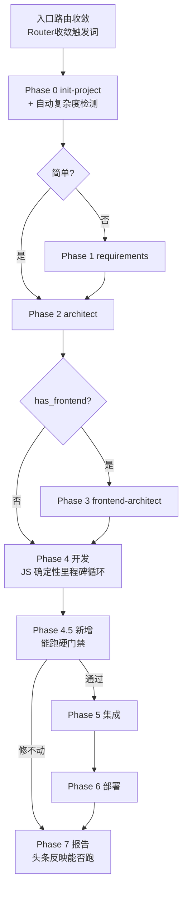

# engineer-job 自主构建加固设计 / Autonomous Build Hardening Design

> **状态**: Draft，待用户评审
> **日期**: 2026-07-13
> **关联**: `2026-07-13-engineer-skills-chain-enhancement-design.md`（前置：新增 requirements / frontend-architect 技能）
> **后续**: 经评审后转入 `writing-plans` 生成实施计划

---

## 1. 背景 / Background

工程师技能链（engineer-* skills chain）已具备完整的 8 阶段管线：

```
init-project → engineer-requirements → engineer-architect
  → engineer-frontend-architect → engineer-orchestrator(+workflow)
  → 集成 → 部署 → 报告
```

入口为 `skills/engineer-job/run.wf.js`。本设计的目标是回答一个问题：

> **一个普通开发，只给出简单的需求说明和项目背景，能否让系统自动、持续地调用相关技能，从 0 构建出项目的"初始版本"，且无需人工指导？**

## 2. 现状评估结论 / Current-State Verdict

**架构完整，但尚未达到"零指导"门槛。** 当前更像一套"扎实的方法论文档"，而非"被验证过能自己跑通的引擎"。

### 2.1 已经可靠（高置信度）
- Phase 0–3 可无人值守产出：脚手架 + `REQUIREMENTS.md` + `CONTEXT.md` + `FRONTEND-DESIGN.md`。
- 文件协议清晰（`project-metadata.json` → `REQUIREMENTS.md` → `CONTEXT.md` → `FRONTEND-DESIGN.md`）。
- 状态持久化（`job.state.json` / 进度账本）支持跨会话恢复。
- auto / silent 模式贯穿"降级优于阻塞"理念。

### 2.2 阻碍"零指导"的六个缺口

| # | 缺口 | 严重度 | 现状证据 |
|:-:|------|:------:|---------|
| 1 | **入口不可靠**：job / orchestrator / architect / init-project 触发词高度重叠，普通开发的措辞不一定路由到 `engineer-job` | 高 | 各 SKILL.md 触发段重叠，靠"触发优先级"判断 |
| 2 | **Phase 4 是一次巨型 agent 调用**，job→orchestrator→workflow→inspector 四层嵌套，全靠每层忠实读 SKILL.md | 高 | `run.wf.js` Phase 4 把全部里程碑压进一次 `agent()` |
| 3 | **`skip_*` 是手动开关**，简单项目仍被强跑前端设计阶段 | 中 | `isSimpleProject` 只看显式 flag；计划文档承诺的"自动检测"未实现 |
| 4 | **无"能跑起来"硬门禁**：Phase 5 集成测试非阻塞，失败只记录 → 可宣布"完成"但项目 build 不过 | 高 | `run.wf.js` Phase 5 注释明写 "DO NOT block on failures" |
| 5 | **依赖 Workflow 工具**：不可用时回退"手动调度"= 人在环里，与无人值守矛盾 | 中 | `engineer-job/SKILL.md` 模式 B |
| 6 | **无端到端验证**：全是文档 + plan，git 历史无"真跑过样例"痕迹 | 高 | 无 evals 目录 |

## 3. 目标与非目标 / Goals & Non-Goals

### 目标
- **G1 入口确定**：存在一个无歧义触发路径，普通开发用一句话稳定进入 `engineer-job` 全链路。
- **G2 简单项目自动适配**：Phase 0 自动判定复杂度，自动设 `skip_requirements` / `skip_frontend`，开发无需懂 flag。
- **G3 Phase 4 确定性化**：里程碑循环与失败处理由 JS 控制，不再依赖单层 agent 的纪律。
- **G4 能跑才算完**：build + test 通过是硬门禁；不能跑的项目，最终报告头条如实标注。
- **G5 回归基线**：3 个标准样例项目 + runbook，固化"能否产出可运行初始版本"的验收标准。

### 非目标
- 不重写 SKILL.md 主体内容（保留方法论文文资产）。
- 不追求企业级多租户/多端系统（AOPA 级）的无人值守——那超出"简单需求 + 初始版本"范围。
- 不消除对 Workflow 工具的依赖（缺口 5 通过提升 P4 鲁棒性间接缓解，不在此 spec 显式处理为硬目标）。

## 4. 架构总览 / Architecture Overview

**核心动作：把可靠性从 SKILL.md 散文搬到 `run.wf.js` 代码。** SKILL.md 保留为能力参考；`run.wf.js` 成为真正的状态机大脑，负责阶段门禁、里程碑循环、运行验收。



## 5. 组件设计 / Component Design

### 组件 1：入口路由收敛（缺口 1）

**机制**：技能触发由各 SKILL.md 的 `description` 决定。通过收敛 4 个描述 + 显式 ROUTING RULE 解决冲突。

**改动文件**：`engineer-job` / `engineer-orchestrator` / `engineer-architect` / `init-project` 的 `SKILL.md`。

**具体规则**：

| 技能 | 强触发信号 | 让位规则（遇到时defer to engineer-job） |
|------|-----------|----------------------------------------|
| `engineer-job` | "从零做一个 / full project from scratch" + "完整的 / whole" + **无 CONTEXT.md** | —（自身即顶层入口） |
| `engineer-orchestrator` | 已有 CONTEXT.md + 多里程碑 + "全部实现" | 用户要"从零一气呵成且无蓝图"→ defer job |
| `engineer-architect` | 需要蓝图但尚未进入开发 | 用户要"完整项目"而非仅设计→ defer job |
| `init-project` | 仅脚手架 | 用户要"完整项目做完"→ defer job |

**普通开发推荐触发短语**（写入 `engineer-job/SKILL.md` 顶部）：`从零做一个 X` / `build X from scratch`。

### 组件 2：Phase 0 自动复杂度检测（缺口 3）

**位置**：`run.wf.js`，在 Phase 0（init）读取需求后、Phase 1 门禁之前。

**判定逻辑**（显式 `args.skip_*` 永远优先；否则启发式）：

```
has_frontend:
  前端信号词命中（前端/界面/页面/UI/web app/小程序/移动端/dashboard）
    → true
  无前端信号词命中（CLI/命令行/library/库/SDK/脚本/纯后端/api only）
    → false
  都未命中 → true（保守，多数"做个 X"含界面）

skip_frontend = !has_frontend

skip_requirements:
  复杂信号词命中（多端/多模块/多个角色/审批/工作流/SaaS/多租户/事件）
    → false（保留需求分析）
  简单信号词命中（CRUD/简单/单个/工具/计算器/todo/脚本）
    → true（跳过需求分析）
  都未命中 → false（保留，安全）
```

**输出**：检测结论 + 理由写日志；并写入 `project-metadata.json`：
```json
"detected_complexity": "simple | moderate | complex",
"has_frontend": <bool>,
"skip_requirements": <bool>,
"skip_frontend": <bool>,
"complexity_reasoning": "<一句话理由>"
```

### 组件 3：Phase 4 确定性里程碑循环（缺口 2，最高杠杆）

**现状**：Phase 4 = 一次 `agent(orchestrator, "execute ALL milestones...")`。

**新设计**：`run.wf.js` 拥有循环。

**步骤**：

1. **解析里程碑**（一次 agent，纯解析任务）：
   - 输入：`CONTEXT.md`（磁盘）。
   - 输出 schema：
     ```json
     [{
       "id": "M1",
       "name": "data-model",
       "deps": [],
       "description": "<从蓝图抽取的里程碑描述>",
       "acceptance": "<验收要点>",
       "frontend": false
     }]
     ```
   - 失败 → 降级为单里程碑 `{id:"M1", name:"implement-all", deps:[]}`（=当前行为）。

2. **JS 算拓扑批次**（纯代码，无 agent）：
   - Kahn 算法拓扑排序；同层无依赖里程碑可批量（保守起见默认串行，并行留作 future）。

3. **逐里程碑执行**（JS 循环）：
   ```
   for each milestone in topo_order:
     result = agent(workflow, {精确里程碑输入: name, description, acceptance, CONTEXT.md 路径})
     if result.status == BLOCKED:
        retry once with degraded scope:
          degraded = "只实现 happy path，跳过边界/异常分支与可选增强，保留核心验收点"
        if still BLOCKED:
           mark SKIPPED → cascade-cancel downstream hard-deps (per orchestrator cascade rules)
     else:
        inspector_result = agent(inspector, {验收: 对照 CONTEXT.md})
        if inspector fail: retry/degrade as above
     persist milestone state → job.state.json (每次)
     commit (每次)
   ```

4. **嵌套层级**：job → workflow / inspector（两层）。orchestrator 的 SKILL.md 降级为"解析提示词 + 集成清单"参考，被相关 agent 加载，但不再作为执行层。

**重试/降级阈值（mode 依赖，编码在 JS）**：

| Mode | 里程碑重试 | 降级后重试 | 跳过后下游 |
|:----:|:---------:|:----------:|:----------:|
| normal | 1 | 1 | 标 BLOCKED，等用户 |
| auto | 1 | 1 | 级联 SKIPPED，记录 |
| silent | 1 | 1 | 级联 SKIPPED，静默 |

### 组件 4：Phase 4.5 "能跑"硬门禁（缺口 4，新增）

**位置**：Develop（P4）与 Integrate（P5）之间。

**步骤**：

1. **确定命令**：从 `project-metadata.json` 的 `language` / `framework` 查"已知 build/test 命令表"（`skills/engineer-job/references/build-commands.json`）。回退：读 `Makefile` / `package.json scripts` / `README`。
2. **真执行**（Bash）：
   - build 命令（如 `npm run build` / `pip install -e .` / `cargo build` / `go build ./...`）。
   - test 命令（如 `npm test` / `pytest` / `cargo test` / `go test ./...`）。
3. **失败 → 强制修复循环**：
   - 把失败输出（build stderr / test failures）喂给 agent："修到 build + test 全过，不许跳过测试"。
   - 重试上限：normal=2 / auto=1 / silent=1。
4. **仍失败 → 标记 `DOES_NOT_RUN`**：写入 `job.state.json.run_gate = {status:"DOES_NOT_RUN", command, last_error}`，并在最终报告**头条**如实标注。**禁止宣称"完成"。**

**已知命令表初版**（`build-commands.json` 节选，完整版在实施时补全）：

```json
{
  "python": {"build": "pip install -e .", "test": "pytest -q"},
  "python/fastapi": {"build": "pip install -e .", "test": "pytest -q"},
  "node": {"build": "npm run build --if-present", "test": "npm test --if-present"},
  "rust": {"build": "cargo build", "test": "cargo test"},
  "go": {"build": "go build ./...", "test": "go test ./..."}
}
```

### 组件 5：Eval 样例（缺口 6）

**位置**：`skills/engineer-job/evals/`。

| 样例 | 栈 | 复杂度 | 验证什么 |
|------|----|--------|----------|
| `simple-cli` | Python | simple, 无前端 | 自动跳过 P1/P3 + 运行门禁 |
| `simple-api` | FastAPI + SQLite | moderate, 无前端 | 跳前端的全链路 + CRUD 测试通过 |
| `web-crud` | Next.js + API | 含前端 | 完整 8 阶段含前端设计 |

每个样例目录含：
- `requirements.md` — 喂给 `engineer-job` 的需求输入。
- `expected.md` — 评分卡：必须存在的文件、必须通过的测试、必须能执行的命令。
- `runbook.md` — 如何执行链路 + 如何打分 pass/fail。

顶层 `evals/README.md` 汇总执行方式与回归基线。

## 6. 数据契约变更 / Data Contract Changes

### `project-metadata.json` 增字段
```json
"detected_complexity": "simple | moderate | complex",
"has_frontend": <bool>,
"skip_requirements": <bool>,
"skip_frontend": <bool>,
"complexity_reasoning": "<string>",
"milestones": [{"id":"M1","name":"...","deps":[],"status":"TODO"}],
"run_gate": {"command":{"build":"...","test":"..."},"status":"PASS|DOES_NOT_RUN|SKIPPED","last_error":"<string|null>"}
```

### `job.state.json` 增
- `phases.development.features[Mx]` 由 **JS 循环**写入（已在原设计内，现明确归属）。
- `phases.run_gate`：`{status, attempts, last_error}`。

### 向后兼容
- 新字段对旧 `run.wf.js` 逻辑透明（不读不写即可）。
- 旧 `job.state.json`（无 `run_gate`）恢复时按 `SKIPPED` 处理，不阻塞。

## 7. 错误处理与降级 / Error Handling

| 场景 | 处理 |
|------|------|
| 检测不确定（信号词都没命中） | 默认不跳（安全）；日志说明 |
| 里程碑解析失败 | 降级单里程碑"implement-all"（=当前行为） |
| 单里程碑 workflow 失败 | 重试 1 次 → 降级范围 → 跳过 + 级联取消 |
| 运行门禁修复循环耗尽 | 标 `DOES_NOT_RUN`，报告头条如实，**不宣称完成** |
| 已知命令表无匹配 | 回退读 Makefile/package.json；再失败则跳过门禁并记录 |

## 8. 测试策略 / Testing

1. **端到端**：3 个 eval 样例即 E2E 测试，按 `expected.md` 评分卡判定 pass/fail。
2. **单元**：复杂度检测启发式用一张样例需求字符串表（`evals/complexity-cases.json`）校验命中预期。
3. **回归基线**：首次跑通 3 样例后，结果快照作为后续改动对照。

## 9. 实施顺序概要 / Implementation Order（高层）

> 详细 step 留给 `writing-plans` 生成。此处仅给依赖顺序。

```
1. 组件 2（自动检测） ← 改 run.wf.js + build-commands 参考表
2. 组件 4（运行门禁 + build-commands.json）← 改 run.wf.js
3. 组件 3（Phase 4 JS 循环）← 改 run.wf.js，最大块
4. 组件 1（入口路由）← 改 4 个 SKILL.md description
5. 组件 5（evals）← 新建目录与样例
6. 跑通 3 样例，固化回归基线
```

1–2 可独立先做并立即见效；3 是最大改动放中间；4 是文档改低风险；5 收尾验证。

## 10. 本增强的验收标准 / Acceptance Criteria for This Enhancement

- [ ] `simple-cli` 样例：`engineer-job` 自动跳过 P1/P3，产出可 `pytest` 通过的 CLI，运行门禁 PASS。
- [ ] `simple-api` 样例：跳过前端，产出可 build + test 通过的 FastAPI 服务。
- [ ] `web-crud` 样例：完整 8 阶段，前端文件存在且 build 通过。
- [ ] 任一样例若产出不能跑的项目，最终报告头条标 `DOES_NOT_RUN`（不谎报）。
- [ ] 普通开发用"从零做一个 X"措辞，稳定进入 `engineer-job`（手动抽样验证 3 次路由正确）。
- [ ] `project-metadata.json` 新字段在 3 样例中均被正确写入。
