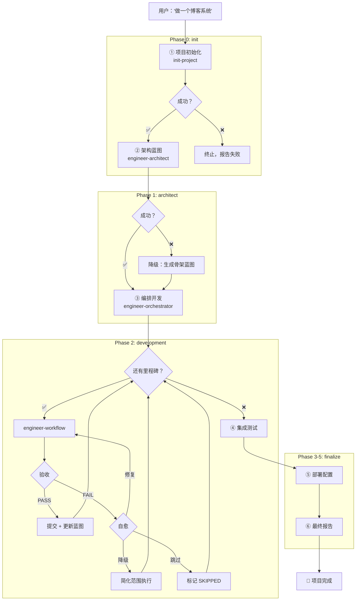

# engineer-job — 全自动项目编排引擎设计文档

> 来源声明: 本设计的方法论来源于《基于实现规划的 AI 辅助编程实战》。更多内容请访问 [zhurongshuo.com]。
> 
> 参考架构: superpowers `subagent-driven-development`、`writing-plans`、`verification-before-completion`

## 一、背景与目标

### 1.1 问题

当前 `skills` 包中的工程开发技能链（`init-project` → `engineer-architect` → `engineer-orchestrator` → `engineer-workflow` → `engineer-inspector`）已经能够覆盖"从需求到代码"的全流程，但存在四个关键缺口：

1. **缺少元编排**：技能之间需要手动触发，无法自动链式调用
2. **缺少自动确认模式**：每个技能在多个节点暂停等待用户确认，无法无人值守运行
3. **缺少自愈机制**：编译失败、测试失败后停在原地等待用户介入
4. **缺少跨技能进度持久化**：进度追踪局限在单个技能内部，无法跨阶段恢复

### 1.2 目标

创建一个新的 `engineer-job` 技能 + 对现有技能的最小修改，使得：

- **普通开发者**只需提供简单的需求说明和项目背景
- **配置 `--auto` 或 `--silent` 模式**后，系统自动完成从脚手架搭建到代码生成到部署配置的全流程
- **遇到异常自动自愈**：编译失败自动修复、重建超阈值自动降级
- **支持跨会话恢复**：任何阶段中断后，新对话能无缝恢复

## 二、整体架构

### 2.1 技能调用关系

```
┌─────────────────────────────────────────────────────────┐
│                    engineer-job                          │
│  (元编排引擎 — 管理技能级生命周期)                         │
│                                                          │
│  ┌──────────┐  ┌────────────┐  ┌────────────────┐       │
│  │ Phase 0  │  │ Phase 1    │  │ Phase 2        │       │
│  │ init     │→ │ architect  │→ │ orchestrate    │       │
│  │          │  │            │  │  ┌──────────┐  │       │
│  │ init-    │  │ engineer-  │  │  │ workflow │×N│       │
│  │ project  │  │ architect  │  │  └──────────┘  │       │
│  └──────────┘  └────────────┘  └───────┬────────┘       │
│                                        ↓                │
│  ┌──────────┐  ┌────────────┐  ┌────────────────┐       │
│  │ Phase 5  │← │ Phase 4    │← │ Phase 3        │       │
│  │ report   │  │ deploy     │  │ integrate      │       │
│  └──────────┘  └────────────┘  └────────────────┘       │
└─────────────────────────────────────────────────────────┘
```

### 2.2 阶段定义

| 阶段 | 名称 | 调用技能 | 输入 → 输出 | 失败处理 |
|:----:|:----:|:---------:|:-----------:|:--------:|
| 0 | init | `init-project` | 用户需求 → 文件树 + 技术栈 | 重试 1 次，失败则终止 |
| 1 | architect | `engineer-architect` | 项目文件树 → CONTEXT.md 蓝图 | 重试 1 次，失败则降级骨架蓝图 |
| 2 | orchestrate | `engineer-orchestrator` + `engineer-workflow` × N | 蓝图 → 完整代码 | 里程碑级自动自愈 |
| 3 | integrate | 内置集成测试 | 代码 → 测试报告 | 记录失败，不阻塞 |
| 4 | deploy | 内置部署生成 | 蓝图部署方案 → 部署配置 | 记录警告，不阻塞 |
| 5 | report | 内置报告生成 | 所有以上 → 最终报告 | — |

### 2.3 子代理调度模式

借鉴 `subagent-driven-development` 的"每个任务一个独立子代理"模式：

```
engineer-job（主会话）
  │  读取 .agents/job.state.json → 确定当前阶段
  │
  ├── [Agent] engineer-orchestrator（阶段 2）
  │   │  读取 CONTEXT.md + job.state.json
  │   │
  │   ├── [Agent] engineer-workflow "M1：数据模型"
  │   ├── [Agent] engineer-workflow "M2：API 开发"
  │   ├── [Agent] engineer-workflow "M3：前端页面"
  │   │
  │   └── → 更新 CONTEXT.md + job.state.json
  │
  └── [Agent] 阶段 3-5 各一个子代理
```

子代理设计约束：
- **每个子代理的工作范围有明确边界**（一个阶段或一个里程碑）
- **子代理的上下文干净**——只承载当前任务所需的最少信息
- **子代理之间的状态通过文件传递**（CONTEXT.md, job.state.json）
- **子代理返回简短状态码**（DONE / DONE_WITH_CONCERNS / BLOCKED），不携带大量文本回主会话

## 三、自动确认模式（三级模式）

### 3.1 级别定义

| 级别 | 标志 | 行为 | 适用场景 |
|:----:|:----:|------|---------|
| **normal** |（默认） | 每个阶段完成后暂停报告，关键决策点（蓝图确认、阻塞处理）等待用户决策 | 普通开发者，希望有参与感 |
| **auto** | `--auto` | 只在阶段级报告进度，低风险决策自动处理，高风险决策（连续 2 次重建失败、阶段失败）暂停 | 有经验的开发者，希望快速推进 |
| **silent** | `--silent` | 所有决策自动处理，仅输出最终报告。遇到终止级失败才停下来 | CI/CD、批量项目生成、完全无人值守 |

### 3.2 各技能在 `--auto` 模式下的暂停点

#### `init-project --auto`

| 决策点 | 默认行为 |
|--------|---------|
| 技术栈选择 | 从需求推断默认技术栈（预定义模板匹配） |
| 项目元信息 | 从目录名/已有配置推断 |
| 许可证 | 默认 MIT（或项目已有许可证） |
| CI/CD | 默认 GitHub Actions（如适用） |
| Docker | 根据项目类型默认决定（服务端=需要，库=不需要） |
| 文件树确认 | 直接生成 |

当推断置信度低于 60% 时，`--auto` 模式仍会提问（不超过 2 个）。

#### `engineer-architect --auto`

| 决策点 | 默认行为 |
|--------|---------|
| 需求理解摘要确认 | 跳过 |
| 技术选型问题 | 使用 AI 推荐的默认技术栈 |
| 领域词汇表确认 | 直接使用 AI 生成 |
| 数据模型确认 | 直接使用 AI 生成 |
| API 契约确认 | 直接使用 AI 生成 |
| 里程碑规划确认 | 直接使用 AI 生成 |
| 完整蓝图审核 | 自动批准，记录决策日志 |
| ADR 创建 | 条件满足时自动创建 |
| 蓝图提交 | 自动 git add + commit |

#### `engineer-orchestrator --auto`

| 决策点 | 默认行为 |
|--------|---------|
| 展示执行计划 | 直接开始第一个里程碑 |
| 功能阻塞 | 自动重试 1 次 → 跳过后记录 |
| 集成问题 | 记录到问题列表，继续下个功能 |
| 上下文重置 | 自动提交 + 重置 |

#### `engineer-workflow --auto`

| 决策点 | 默认行为 |
|--------|---------|
| 里程碑计划确认 | 直接执行 |
| 验收结果决策 | 自动：通过→提交，小问题→修复，重建→回滚 |
| 提交确认 | 自动 git add + commit |

#### `engineer-inspector --auto`

| 决策点 | 默认行为 |
|--------|---------|
| PASS → 下一步 | 自动继续 |
| NEEDS_FIX | 自动下发升维指令修复 |
| REBUILD | 自动 git reset --hard + 重建 |

### 3.3 `--silent` 模式附加行为

- **无进度条输出**：仅记录到日志文件
- **无阶段摘要**：每个阶段完成后不暂停报告
- **无决策询问**：连低置信度推断也不提问——使用最保守的默认值
- **错误静默处理**：非终止级错误只记日志
- **最终输出**：仅最终报告 + 错误摘要

### 3.4 交互示例

```
## --normal 模式:

📋 蓝图已生成，包含了以下内容:
   · 6 个核心领域术语
   · 4 个数据实体
   · 8 个 API 接口
   · 6 个里程碑
是否需要调整任何部分？[y/N] > _

## --auto 模式:

⏩ [auto] 蓝图已生成（6 术语 / 4 实体 / 8 API / 6 里程碑）
⏩ [auto] 自动批准 → 进入里程碑 M1...

## --silent 模式:

（无输出，仅记录日志）
```

## 四、自愈机制

### 4.1 四级自愈层级

```
engineer-job (阶段级) ─── 阶段失败 → 重试/降级/终止
  └── orchestrator (功能级) ── 集成失败 → 记录/继续
        └── workflow (里程碑级) ── 重建失败 → 降级/跳过
              └── 编译/测试 (代码级) ── 自动修复/重建
```

### 4.2 层级 1：代码级 — 编译/测试失败

```
编译错误/测试失败
  ├── 捕获错误输出（完整 stdout/stderr）
  ├── [尝试 1] 发送修复指令给 AI
  │   ├── ✅ 修复成功 → 继续验收流程
  │   └── ❌ 修复失败 → git reset --hard → 重建
  ├── [尝试 2] 重建后再次失败
  │   → 自动降级里程碑范围（移除可选功能）
  └── [尝试 N] 降级后仍然失败 → 标记 SKIPPED
```

降级策略（按激进程度排序）：
1. **简化范围**：移除该里程碑中的非核心功能（如：API 只保留 CRUD 中的 Create+Read，跳过 Update+Delete）
2. **退化为 coach 模式**：如果全自动 workflow 失败，退化为半自动 coach 流程（主会话执行，不再使用子代理）
3. **跳过+记录**：标记为 SKIPPED + 失败原因，继续执行下一个里程碑

### 4.3 层级 2：里程碑级 — 重建阈值

| 模式 | 重建 1 次 | 重建 2 次 | 重建 3 次 |
|:----:|:---------:|:---------:|:---------:|
| `--normal` | 自动重建 | ⏸ 暂停报告用户 | 等待用户决策 |
| `--auto` | 自动重建 | 自动降级 | 跳过，记录原因 |
| `--silent` | 自动重建 | 自动降级 | 跳过，静默记录 |

**重建计数规则**（继承自 workflow 原有规则）：
- 重建后 git commit hash 变化 → 计数重置
- 同一 milestone 跨会话重置不重置计数
- 降级后如果成功 → 通过，但在最终报告标注为"降级通过"

### 4.4 层级 3：功能级 — 集成失败处理

```
orchestrator --auto 遇到跨功能集成检查失败:
  ├── API 不兼容 → 记录到 integration_issues，继续下个功能
  ├── 测试被破坏 → 尝试自动修复 → 失败后记录
  ├── 数据模型冲突 → 记录冲突详情，继续
  └── 术语不一致 → 记录到术语审计，继续
```

集成问题不阻塞后续功能，而是累积到专门的"集成修复里程碑"中统一批量处理。当 `integration_issues` 累积超过 3 个时，自动创建一个修复里程碑插入执行队列。

### 4.5 层级 4：阶段级 — 技能调用失败

```
engineer-job --auto 遇到阶段执行失败:
  ├── init 失败 → 重试 1 次 → 仍失败 → 终止，报告失败原因
  ├── architect 失败 → 重试 1 次 → 仍失败 → 降级生成骨架 CONTEXT.md → 继续
  ├── orchestrate 失败 → 尝试恢复 job.state.json → 恢复失败则输出已完成的里程碑
  ├── integrate 失败 → 记录警告，不阻塞后续
  └── deploy 失败 → 记录警告，不阻塞 report
```

**终止级阶段**：只有 init 和 architect 失败会终止流程，因为后续所有阶段依赖它们的产出。

## 五、跨技能进度持久化

### 5.1 双文件方案

#### 文件 1：`.agents/job.state.json` — 机器可读完整状态

```json
{
  "project": "blog-system",
  "job_version": "2.0",
  "mode": "auto",
  "phases": {
    "init": {
      "status": "DONE",
      "skill": "init-project",
      "started_at": "2026-07-13T10:00:00Z",
      "completed_at": "2026-07-13T10:02:30Z",
      "result": {
        "project_dir": "/path/to/blog",
        "tech_stack": "python/fastapi/sqlite",
        "project_type": "web-app"
      },
      "errors": []
    },
    "architect": {
      "status": "DONE",
      "skill": "engineer-architect",
      "started_at": "2026-07-13T10:02:31Z",
      "completed_at": "2026-07-13T10:15:00Z",
      "result": {
        "blueprint_commit": "abc123",
        "milestone_count": 6,
        "vocabulary_terms": 12
      },
      "errors": []
    },
    "development": {
      "status": "IN_PROGRESS",
      "skill": "engineer-orchestrator",
      "started_at": "2026-07-13T10:15:01Z",
      "features": {
        "M1": {
          "name": "data-model",
          "status": "DONE",
          "dependencies": [],
          "commits": "abc123..def456",
          "rebuild_count": 0,
          "degraded": false,
          "integration_issues": [],
          "completed_at": "2026-07-13T10:25:00Z",
          "summary": "Created 3 models + migration"
        },
        "M2": {
          "name": "article-crud",
          "status": "DONE",
          "dependencies": ["M1"],
          "commits": "def456..ghi789",
          "rebuild_count": 0,
          "degraded": false,
          "integration_issues": [],
          "completed_at": "2026-07-13T10:35:00Z",
          "summary": "5 REST endpoints + tests"
        },
        "M3": {
          "name": "author-auth",
          "status": "IN_PROGRESS",
          "dependencies": ["M1"],
          "commits": null,
          "rebuild_count": 1,
          "degraded": false,
          "integration_issues": [],
          "completed_at": null,
          "summary": null
        }
      },
      "errors": []
    },
    "finalize": { "status": "TODO" },
    "deploy": { "status": "TODO" }
  },
  "checkpoint": {
    "last_commit": "ghi789",
    "last_phase": "development",
    "next_action": "continue milestone M3 (author-auth) — fixing compilation error",
    "session_summary": "Completed M1-M2. M3 in progress with 1 rebuild. 0 integration issues."
  }
}
```

**状态值**：`TODO` / `IN_PROGRESS` / `DONE` / `BLOCKED` / `SKIPPED`

#### 文件 2：`.agents/job.progress.md` — 人类可读追加账本

```
# Project: blog-system
# Mode: auto
# Started: 2026-07-13T10:00:00Z

## 2026-07-13

[10:02] ✅ Phase 0: init — scaffolded (python/fastapi/sqlite)
[10:15] ✅ Phase 1: architect — blueprint + 6 milestones + 12 terms
[10:25] ✅ M1: data-model — commits abc123..def456, 3 files, 2 tests
[10:35] ✅ M2: article-crud — commits def456..ghi789, 5 files, 8 tests
[10:45] ⚠️ M3: author-auth — rebuild 1 (compilation error, auto-fixed)
[10:42] ✅ M3: author-auth — commits ghi789..jkl012, 4 files, 6 tests
```

### 5.2 与现有 progress.json 的兼容

- `job.state.json` **新增**，覆盖完整生命周期
- `progress.json` **保留**，内容被 `job.state.json.development.features` 吸收
- **检测优先级**：`job.state.json` → `progress.json` → 从用户问起

### 5.3 恢复流程

```
新对话开始 → 检测 job.state.json
  ├── 存在 → 读取 → 报告当前进度 → 恢复执行
  │   ├── init: 未完成 → 重新 init-project
  │   ├── architect: 未完成 → 重新 architect
  │   ├── development: 未完成 → 恢复 orchestrator
  │   │   ├── 读取 checkpoint.next_action
  │   │   ├── git log 验证当前 commit
  │   │   └── 从下一个 TODO 里程碑继续
  │   └── finalize 等待 → 执行集成测试
  └── 不存在 → 回退 progress.json → 回退 CONTEXT.md → 从用户确认进度
```

## 六、engineer-job SKILL.md 结构

### 6.1 技能元信息

```yaml
name: engineer-job
description: >
  AI项目全自动构建引擎 — 从零开始自动完成整个项目构建。
  输入简单的需求描述和项目背景，自动执行：
  项目脚手架 → 架构设计 → 多功能编排开发 → 集成验收 → 部署配置生成。
  支持 --auto（自动确认）和 --silent（静默）模式实现无人值守。
  TRIGGERS: 用户说"帮我从零做一个""全自动构建""帮我搭建一个完整的"
  "automate project building""full project from scratch""build project auto"
  "做一个完整的""全链路开发做""自动从头到尾做一个"
  也触发于：用户在 architect 或 init-project 完成后说"继续""自动做下去"。
  比 engineer-orchestrator 更高一级——orchestrator 管项目内功能编排，
  job 管技能间编排（含脚手架和架构设计阶段）。
compatibility: "agent, bash, write, edit, read"
```

### 6.2 工作流



### 6.3 自我修复循环细节

```
对于每个 engineer-workflow 调用:
  
  workflow 启动 → 里程碑拆解 → 编码 → 测试 → 验收
  
                   ↓ 失败
             错误捕获
              /      \
        可修复      不可修复
           |            |
    自动发送修复指令   git reset --hard
           |            |
        ✅ 修复成功  重建(计数+1)
           |            |
        继续验收    ├─ 重建 < 2次 → 重新编码
                    │
                    └─ 重建 >= 2次
                         │
                   ┌─ normal → 暂停报告用户
                   ├─ auto → 降级范围
                   │    ├─ 降级成功 → 继续
                   │    └─ 降级失败 → 跳过
                   └─ silent → 降级 → 跳过 → 静默记录
```

## 七、对现有技能的修改清单

### 7.1 技能接口修改

所有 engineer-* 技能新增统一的 `--mode` 参数：

| 技能 | 需要修改的内容 |
|------|--------------|
| `init-project` | 支持 `--mode auto\|silent`，推断技术栈代替提问 |
| `engineer-architect` | 支持 `--mode auto\|silent`，默认决策代替确认 |
| `engineer-orchestrator` | 支持 `--mode auto\|silent`，自动恢复 `job.state.json` |
| `engineer-workflow` | 支持 `--mode auto\|silent`，自愈逻辑内置 |
| `engineer-inspector` | 支持 `--mode auto\|silent`，自动执行决策 |

### 7.2 `--mode` 在 SKILL.md 中的表达方式

每个技能在 `### 触发条件 / When to Trigger` 之后新增一节：

```markdown
## ⚙️ 模式选择 / Mode Selection

通过 `--mode` 参数控制自动确认程度（默认 normal）：

| 模式 | 行为 |
|:----:|------|
| normal | 每个关键决策点暂停等待用户确认 |
| auto | 使用默认决策自动推进，仅在重大异常时暂停 |
| silent | 全部自动，静默执行，仅输出最终报告 |

auto 模式的默认决策请参考各决策点的"auto 默认行为"标注。
```

## 八、实施计划

### 8.1 实施顺序

| # | 任务 | 前置 | 预估工作量 |
|:-:|------|:----:|:--------:|
| 1 | 创建 `engineer-job` SKILL.md 文件 | 无 | 大（完整编写） |
| 2 | 修改 `init-project` 支持 `--mode` | 无 | 中（修改交互逻辑） |
| 3 | 修改 `engineer-architect` 支持 `--mode` | 无 | 大（修改交互逻辑） |
| 4 | 修改 `engineer-orchestrator` 支持 `--mode` + `job.state.json` | #1 | 大（新增持久化） |
| 5 | 修改 `engineer-workflow` 支持 `--mode` + 自愈 | #1 | 中（增加自愈逻辑） |
| 6 | 修改 `engineer-inspector` 支持 `--mode` | 无 | 小（决策自动化） |
| 7 | 编写 `engineer-job` 配套测试 | #1 | 中（进度恢复测试） |
| 8 | 端到端集成测试（从需求到完成全流程） | #1-#7 | 大 |

### 8.2 风险与缓解

| 风险 | 缓解方案 |
|------|---------|
| auto 模式下技术栈默认选择不符合预期 | 在最终报告中提供"建议修改"清单 |
| 自愈循环陷入无限重试 | 重建计数达到 3 次后强制跳过 |
| job.state.json 与 git 状态不一致 | 恢复时先运行 git log 验证，发现不一致则报告 |
| workflow 子代理执行时间过长 | 设置子代理超时（默认 10 分钟），超时后标记 BLOCKED |
| 多个 engineer-job 同时运行同一项目 | 检测 job.state.json 是否存在，存在则提示恢复 |

## 九、术语表

| 术语 | English | 定义 |
|------|---------|------|
| 元编排 | Meta-orchestration | 管理技能间调用链的编排，区别于管理功能间调用链的 orchestrator |
| 阶段 | Phase | engineer-job 的 6 个大步骤（init → architect → develop → integrate → deploy → report） |
| 里程碑 | Milestone | 功能开发中的单个独立交付节点（orchestrator/workflow 层面） |
| 自愈 | Self-healing | 系统自动检测失败并尝试恢复，无需人工介入 |
| 降级 | Degradation | 当标准方案失败后，使用简化方案继续执行 |
| 自动确认 | Auto-confirm | 使用预定义的默认决策代替用户手动确认 |
| 账本 | Ledger | 追加式的人类可读进度记录（job.progress.md），类比 SDD 的 progress.md |
| 状态文件 | State file | 机器可读的完整项目状态（job.state.json） |
