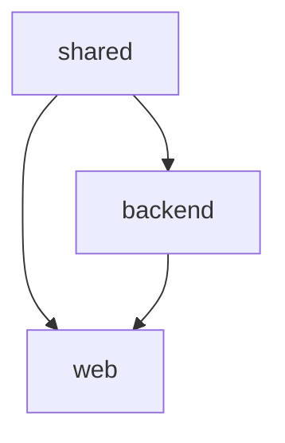

# Skills 工程短板补齐方案设计

**日期**: 2026-07-13
**状态**: 已批准
**对应版本**: iannil/skills v2.x

---

## 背景

iannil/skills 包提供了从项目初始化到部署交付的完整 AI 工程化技能链。评估发现 6 项短板，其中 3 项 P0（影响核心链路质量）、2 项 P1（影响扩展性）、1 项 P2（生产就绪增强）。

本设计采用 **方案 B**：参考文档 + 内联指引，不新增独立技能，不膨胀现有 SKILL.md 篇幅。

---

## 变更清单总览

### 新建 6 个文件

| # | 文件路径 | 对应短板 | 优先级 |
|:-:|----------|:--------:|:-----:|
| 1 | `init-project/references/test-patterns.md` | 测试质量保障 | P0 |
| 2 | `init-project/references/migration-strategy.md` | 数据库迁移管理 | P0 |
| 3 | `engineer-orchestrator/references/cascade-failure.md` | 复杂失败级联恢复 | P0 |
| 4 | `init-project/references/frontend-guide.md` | 前端实现深度不足 | P1 |
| 5 | `engineer-architect/references/context-map-template.md` | 多模块/Monorepo | P1 |
| 6 | `init-project/references/production-readiness.md` | 生产环境加固 | P2 |

### 编辑 5 个 SKILL.md

| # | 文件 | 改动内容 |
|:-:|------|---------|
| 1 | `engineer-architect/SKILL.md` | CONTEXT.md 模板增加迁移策略章节；前端方向章节增加引用；扩展多子系统边界情况 |
| 2 | `engineer-workflow/SKILL.md` | Step 6 增加测试模式引用；增加迁移文件合规性检查 |
| 3 | `engineer-inspector/SKILL.md` | Signal 6 测试合规性增加量化指标 |
| 4 | `engineer-orchestrator/SKILL.md` | 第八步增加级联取消逻辑；增加多模块识别 |
| 5 | `engineer-job/SKILL.md` | Phase 3 增加可选的生产就绪检查步骤 |

---

## 详细设计

### 1️⃣ 测试质量保障 — test-patterns.md

**位置**: `skills/init-project/references/test-patterns.md`

**设计要点**:

按项目类型定义测试"最低覆盖标准"：

```
项目类型        | 单元测试标准                          | 集成测试标准
----------------|--------------------------------------|-------------------------------
API 服务        | 每核心函数: 1 happy + 2 edge         | 每端点: 1 成功 + 2 异常
CLI 工具        | 每子命令: 1 happy + 1 edge           | CLI 输出断言 + 退出码验证
Web 应用        | 每组件: render + interaction          | 关键用户链路 E2E (≤3 条)
数据模型层      | create/query/constraint 三重验证      | 迁移 up/down 验证
库/工具包       | 公共 API 全覆盖                      | — (纯单元测试)
```

**测试分层**（所有类型通用）：
1. **单元测试** — 单函数/单类，mock 外部依赖，覆盖边界
2. **集成测试** — 真实数据库/网络调用，覆盖核心链路
3. **E2E 测试** — 仅 Web 应用，覆盖 1-3 条关键用户链路

**SKILL.md 改动**:
- `engineer-workflow` Step 6: 在"测试生成指令"后追加引用 — "按 `init-project/references/test-patterns.md` 中 `{项目类型}` 的标准选择测试模式。如果是已有项目且没有该文件，至少覆盖：1 个正常路径 + 2 个边界条件。"
- `engineer-inspector` Signal 6: 增加量化指标判定。测试合规性分为三级：充分（按标准全部覆盖）、基本（有测试但覆盖率不足50%）、缺失（无测试文件）。"基本"标记为 ⚠️，"缺失"标记为 🔴。

### 2️⃣ 数据库迁移管理 — migration-strategy.md

**位置**: `skills/init-project/references/migration-strategy.md`

**设计要点**:

三条不可触碰的铁律：

1. **可回滚** — 每个 `up` 迁移必须提供对应的 `down` 迁移。没有 down 的迁移不得提交
2. **不可改写** — 已经合并到主分支的迁移文件**严禁修改**。修正通过新的迁移文件完成
3. **命名规范** — 文件名格式 `YYYYMMDDHHMMSS_description.{lang/ext}`，确保全局有序

**数据库类型适配表**：

| 数据库 | 推荐工具 | 迁移文件位置 | 回滚机制 |
|--------|---------|-------------|---------|
| SQLite | 手动 / `sqlx` migrate | `db/migrations/` | 手写 up/down SQL |
| PostgreSQL | `sqlx` / ` goose` / `Alembic` | `db/migrations/` | 工具原生支持 |
| MySQL | `golang-migrate` / `Flyway` | `db/migrations/` | 工具原生支持 |
| MongoDB | `migrate-mongo` | `db/migrations/` | down 脚本 |

**SKILL.md 改动**:
- `engineer-architect` CONTEXT.md 模板: 在"部署方案"和"架构红线"之间插入"数据库迁移策略"章节：

```markdown
## 数据库迁移策略 / Database Migration Strategy

- **迁移工具**: [工具名，如 sqlx / Alembic / goose]
- **迁移目录**: `db/migrations/`
- **命名规范**: `YYYYMMDDHHMMSS_description.sql`
- **回滚纪律**: 所有 up 迁移必须提供对应 down 迁移
- **已发布迁移**: 严禁修改，修正通过新迁移文件
```

- `engineer-workflow` Step 6: 在验收标准中增加迁移合规检查项："[ ] 所有迁移文件都有对应的 down 迁移？[ ] 没有修改已发布的迁移文件？"

### 3️⃣ 复杂失败级联恢复 — cascade-failure.md

**位置**: `skills/engineer-orchestrator/references/cascade-failure.md`

**设计要点**:

**级联传播规则表**（核心）:

| 上游状态 | 直接下游默认行为 | 间接下游默认行为 | 用户可覆盖 |
|:--------:|:---------------:|:---------------:|:---------:|
| `DONE` | 正常执行 | 正常执行 | — |
| `DEGRADED` | 继续执行（标记"上游降级"） | 继续执行 | 可暂停 |
| `BLOCKED` | 自动标记 `BLOCKED`（依赖不可用） | 自动 `BLOCKED` | 可强制继续 |
| `SKIPPED` | 如果依赖是 **hard** → `BLOCKED` | 同上 | 可改 soft |
| `SKIPPED` | 如果依赖是 **soft** → 继续执行 | 继续执行 | — |
| `IN_PROGRESS` | 排队等待 | 排队等待 | 可调整顺序 |

**依赖类型**（里程碑定义时标注）：
- **hard** — 必须完成才能开始（默认）。例如 M2 的数据库表是 M1 创建的
- **soft** — 建议但非必需。例如 M4 的 UI 不需要 M3 的 API 也能部分工作

**SKILL.md 改动**:
- `engineer-orchestrator` 第八步末尾：增加以下逻辑

```
### 级联取消逻辑 / Cascade Cancel Logic

当某个里程碑被标记为 BLOCKED 或 SKIPPED 后：

1. 扫描依赖图中所有以此里程碑为前置的任务
2. 如果依赖类型为 hard → 自动标记为 BLOCKED（级联阻塞）
3. 如果依赖类型为 soft → 保留 TODO 状态，可继续执行
4. 在最终报告中汇总所有级联跳过的里程碑及其根因
5. 提供"依赖树截断摘要"：

```markdown
## ⛓️ 级联影响 / Cascade Impact

M2 (BLOCKED) ─hard──→ M3 (BLOCKED by cascade)
                      └─soft─→ M5 (TODO, unaffected)

M4 (SKIPPED) ─hard──→ M6 (BLOCKED by cascade)

**摘要**: 4 个里程碑中，因级联影响额外阻塞 2 个。
```
```

### 4️⃣ 前端实现深度不足 — frontend-guide.md

**位置**: `skills/init-project/references/frontend-guide.md`

**设计要点**:

这是一份**轻量指引**（不是完整组件库），覆盖：

1. **组件目录规范**（与 init-project 的 Web 模板一致）：
   ```
   src/
   ├── components/ui/        # 通用 UI 组件（Button, Card, Input...）
   ├── components/features/  # 业务组件（UserCard, OrderTable...）
   ├── layouts/              # 布局组件
   ├── pages/                # 页面组件
   └── hooks/                # 自定义 Hooks
   ```

2. **框架生态集成建议**：
   - React: shadcn/ui + Tailwind CSS（默认推荐）
   - Vue: shadcn-vue + Tailwind CSS
   - 原则：用成熟组件库处理 80% 通用 UI，自定义 20% 业务独特样式

3. **设计方向到代码的映射**（在 architect 的设计方向和 workflow 的编码之间搭桥）：
   - 蓝图的主色 → CSS 变量（`--color-primary`）
   - 排版定义 → `tailwind.config.ts` 的 `fontFamily` 扩展
   - 设计原则 → 组件编写的 Checklist

4. **与 frontend-design 技能的联动**：
   - 如果需要更深入的 UI 设计，调用 `frontend-design` 技能
   - frontend-design 的输出（设计系统 Token / 组件规范）应回写到 `CONTEXT.md`

**SKILL.md 改动**:
- `engineer-architect` 第七步末尾增加一句话：
  > "完整的 UI 组件实现可参考 `init-project/references/frontend-guide.md`。如需更深入的设计系统定义，可调用 `frontend-design` 技能。"

### 5️⃣ 多模块/Monorepo — context-map-template.md

**位置**: `skills/engineer-architect/references/context-map-template.md`

**设计要点**:

CONTEXT-MAP.md 是项目级入口文件，指向多个子 CONTEXT.md：

```markdown
# [项目名称] — Context Map

## 模块概览 / Module Overview

| 模块 | 子目录 | 技术栈 | 描述 |
|------|--------|--------|------|
| [模块1] | `packages/backend/` | [技术栈] | [描述] |
| [模块2] | `packages/web/` | [技术栈] | [描述] |
| [模块3] | `packages/shared/` | [技术栈] | [描述] |

## 模块间依赖 / Inter-Module Dependencies



## 模块间契约 / Inter-Module Contracts

| 提供方 | 消费方 | 契约形式 | 说明 |
|--------|--------|---------|------|
| backend | web | REST API (OpenAPI) | [endpoint 概述] |
| shared | backend, web | TypeScript 类型 | [类型说明] |

## 开发顺序 / Build Order

1. shared（基础类型 + 工具函数）
2. backend（API 服务）
3. web（前端界面）
```

**SKILL.md 改动**:
- `engineer-architect` 边界情况"多个子系统"：扩展为引用 `context-map-template.md`，并将 CONTEXT-MAP.md 的创建纳入 Phase 3 的固化步骤
- `engineer-orchestrator` 第一步：增加 "检查是否存在 CONTEXT-MAP.md，若存在则按模块间依赖顺序编排"

### 6️⃣ 生产环境加固 — production-readiness.md

**位置**: `skills/init-project/references/production-readiness.md`

**设计要点**:

按项目类型的生产就绪检查清单。不作为默认执行步骤，但在 `--auto` 和 `--silent` 模式下可选择执行。

**checklist 设计**（分类型）:

```
服务端应用:
  ☐ 敏感信息已使用环境变量（无硬编码密钥）
  ☐ 健康检查端点 (/health, /ready)
  ☐ 结构化日志（JSON 格式，含 trace_id）
  ☐ 错误追踪（统一错误格式 + 堆栈捕获）
  ☐ CORS 配置（白名单模式）
  ☐ Rate Limiting（如适用）
  ☐ 依赖漏洞扫描（npm audit / cargo audit / pip audit）

Web 应用:
  ☐ 以上全部
  ☐ 安全头（CSP, X-Frame-Options, HSTS）
  ☐ 输入验证 + XSS 防护
  ☐ 构建产物体积优化

CLI 工具:
  ☐ 友好的错误输出
  ☐ 退出码语义（0=成功, 1=运行时错误, 2=参数错误）
  ☐ 帮助文本完整性
```

**SKILL.md 改动**:
- `engineer-job` Phase 3（集成阶段）：增加可选子步骤：

```
[可选] 生产就绪检查（Production Readiness Check）
  如果项目是服务端/Web 应用:
    1. 读取 init-project/references/production-readiness.md
    2. 按项目类型执行对应的检查清单
    3. 将未通过项记录到最终报告的"建议改进"部分
  纯 CLI/库项目:
    跳过此步骤
```

---

## 实施顺序

| 批次 | 内容 | 工作量估计 | 说明 |
|:----:|------|:---------:|------|
| 1 | test-patterns.md + workflow/inspector 编辑 | ~80 行 | P0，最核心 |
| 2 | migration-strategy.md + architect/workflow 编辑 | ~70 行 | P0 |
| 3 | cascade-failure.md + orchestrator 编辑 | ~80 行 | P0 |
| 4 | frontend-guide.md + architect 编辑 | ~60 行 | P1 |
| 5 | context-map-template.md + architect/orchestrator 编辑 | ~80 行 | P1 |
| 6 | production-readiness.md + job 编辑 | ~70 行 | P2 |
