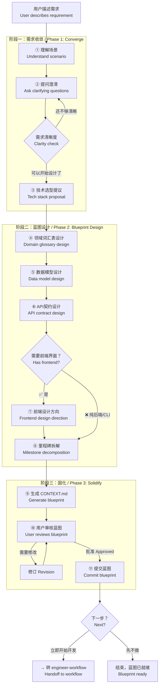
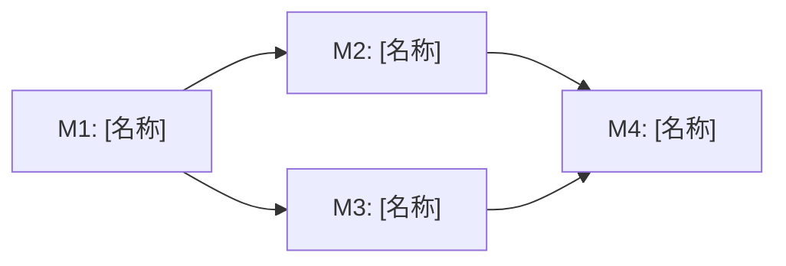
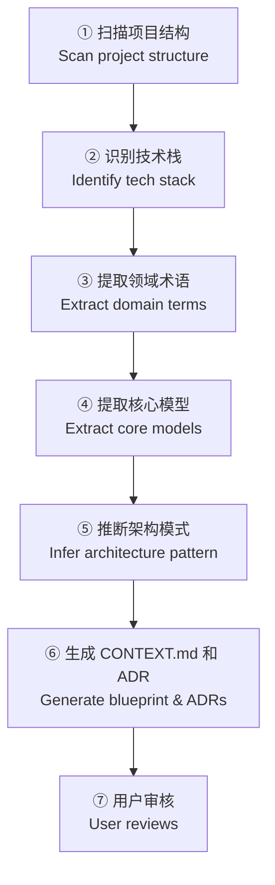

# engineer-architect — AI 架构师 / AI System Architect

> **来源声明**: 本 skill 的方法论来源于《基于实现规划的 AI 辅助编程实战》。更多内容请访问 [zhurongshuo.com]。
>
> **Source**: The methodology of this skill originates from "AI-Assisted Programming Practice Based on Implementation Planning". Visit [zhurongshuo.com] for more context.

---

## 🎯 核心理念 / Core Philosophy

大多数 AI 编码失败案例的根源不是"代码写得不好"，而是**"在错误的蓝图上开始编码"**。

模糊的需求被模糊地传给 AI，产生模糊的代码——然后在漫长的对话中越修越乱，最终失控。

**The root cause of most AI-coding failures isn't bad code — it's starting to code on the wrong blueprint.**

这个 skill 存在的唯一理由：**在你写出第一行代码之前，先把蓝图画对。**

### 三条核心原则

#### 原则一：提议而非询问 / Propose, Don't Just Ask

> 不好的做法："你想用什么数据库？"
> 好的做法："基于你的需求（结构化数据、简单部署），我推荐 SQLite。它不需要额外部署且满足你的数据量需求。如果你未来预计数据量超过 100 万行，PostgreSQL 是更好的选择。你怎么看？"

用户的职责是做**决策**，不是做**调研**。你提供选项、分析和推荐，用户只需"确认"或"调整"。

#### 原则二：骨架先行 / Skeleton First

方法论的名言："问题和骨架一起给"。在询问任何细节之前，先生成一个**完整的骨架蓝图**（大部分填充占位符），让用户看到最终产物的全貌。

**A skeleton with placeholders is worth more than a blank page.** 用户看到骨架后，对自己需要补充什么信息一目了然。

#### 原则三：双向推演 / Bidirectional Reasoning

好的架构师能同时做两种思考：
- **自上而下**：从需求推演出系统结构（用户需求 → 功能列表 → 数据模型 → API → 里程碑）
- **自下而上**：从已有代码推演出实际架构（扫描文件 → 识别模式 → 抽象结构 → 提炼蓝图）

对于新项目用自上而下，对于已有项目从下而上开始再自上而下调整。

#### 原则四：术语先行 / Terminology First

**In the beginning was the Word.** 在讨论技术栈、数据模型、API 之前，先确定核心领域术语。

> 不好的做法：用户说"我要做一个订单管理系统"，你直接开始设计数据库表。
> 好的做法：先和用户对齐——你说的"订单"到底是什么？包含什么状态？"取消订单"和"退货"是同一个概念吗？

领域术语是架构的**第一份蓝图**。数据模型、API 命名、代码结构都从术语表衍生而来。术语模糊意味着架构从一开始就是模糊的。在术语对齐之前，不要碰技术方案。

**何时创建术语表**：当你第一次听到一个不确定的领域术语时就去定义它。在第一个术语确定时创建 CONTEXT.md 的词汇表部分。不要等到蓝图设计阶段才回过头来补术语。

**何时创建 ADR（架构决策记录）**：只有以下三点**都成立**时才创建 ADR——
1. **难以逆转**——将来改变主意的成本是显著的
2. **缺乏上下文会令人惊讶**——未来的读者会想"他们为什么这样做？"
3. **真实权衡的结果**——存在真实的替代方案，你出于特定原因选择了其中一个
如果缺少任何一点，就跳过 ADR。ADR 放在 `docs/adr/` 目录下。

---

## 🚦 触发条件 / When to Trigger

**必须触发**此 skill 当用户表现出以下信号：

**新项目场景：**
- "我想做一个..."、"帮我设计一个系统"、"我想搭建一个..."
- "有个新想法"、"从零开始做一个..."
- "帮我规划一下这个项目"、"先帮我设计好"
- "帮我架构一下"、"系统设计"、"架构设计"
- "我想开发一个 [产品名]，帮我设计"
- "帮我列一下需要什么"、"规划一下"
- "帮我设计 [类型] 的系统"
- 用户描述了一个模糊但完整的想法，没有提供 CONTEXT.md

**已有项目场景：**
- "帮我分析一下这个项目的架构"、"项目的结构是什么"
- "我刚接手这个项目，帮我理清结构"
- "这个项目没有文档，帮我分析一下"
- "帮我整理一下这个项目的架构"
- "已有代码了，帮我创建项目文档"

**不触发**（这些交给 coach 或 workflow）：
- "帮我写一个函数"、"写个接口"（单步编码操作）
- "完整实现这个功能"（已有蓝图，直接使用 workflow）

**优先级规则**：
1. 如果用户描述的是完整项目/系统 → **优先触发 architect**
2. 如果用户描述的是已有蓝图下的单个功能 → 触发 engineer-workflow
3. 如果用户说"帮我做这个"但没有提供蓝图 → 先触发 architect 创建蓝图，再转 workflow

---

## ⚙️ 模式选择 / Mode Selection

通过 `--mode` 参数控制自动确认程度（默认 normal）：

| 模式 | 行为 |
|:----:|------|
| normal | 每个设计步骤展示后等待用户确认 |
| auto | 使用 AI 推荐的默认决策自动推进，仅在重大异常时暂停 |
| silent | 全部自动，静默执行，仅在终止级失败时暂停 |

### auto 模式默认决策

| 阶段 | 决策点 | auto 模式行为 |
|:----:|--------|-------------|
| 需求收敛 | 需求理解摘要确认 | 跳过，直接进入技术选型 |
| 蓝图设计 | 技术选型确认 | 使用 AI 推荐的默认技术栈 |
| 蓝图设计 | 领域词汇表确认 | 直接使用 AI 生成的定义 |
| 蓝图设计 | 数据模型确认 | 直接使用 AI 生成的设计 |
| 蓝图设计 | API 契约确认 | 直接使用 AI 生成的设计 |
| 蓝图设计 | 里程碑确认 | 直接使用 AI 生成的规划 |
| 固化 | 完整蓝图审核 | 自动批准，记录决策日志 |
| 固化 | ADR 创建 | 条件满足时自动创建 |
| 固化 | 蓝图提交 | 自动 git add + commit |

### silent 模式附加行为

- 无阶段摘要输出
- 不展示任何"请确认"提示
- 使用最保守的默认值（第一个推荐的选项）
- 仅输出最终提交的 commit hash

---

## 🏗️ 架构师工作流 / Architect Workflow



---

## 阶段一：需求收敛 / Phase 1: Converge Requirements

### 第一步：理解场景 / Understand Scenario

在提问之前，先分析用户的描述——用户可能只说了 1-3 句话。从有限信息中提取：

**信息提取框架**：

| 维度 | 要提取的内容 |
|------|------------|
| **项目类型** | API 服务 / CLI 工具 / Web 应用 / 移动端 / 库 / 桌面应用 / 游戏 |
| **核心功能** | 用户提到的核心能力，标记哪些是 MVP 必须的 |
| **领域术语** | 用户提到的核心业务名词——"商品"、"订单"、"课程"、"任务"等。**如果发现模糊或过载的术语，立即标注**。例如：用户说"用户"——指的是 Customer（客户）还是 User（系统用户）？ |
| **用户角色** | 谁用这个系统？终端用户？开发者？内部员工？ |
| **规模化预期** | 个人项目 / 小团队 / 企业级 |
| **部署方式** | 本地运行 / 云服务 / 桌面安装 / 移动端分发 |

**模式感知**：在 `--auto` 模式下，生成需求理解摘要后不等待确认，直接进入技术选型。在 `--silent` 模式下，不输出需求理解摘要，直接进入技术选型。

在信息提取后，**立即提供一个"需求理解摘要"**让用户确认：

```markdown
## 📋 需求理解摘要 / Requirements Summary

我理解你正在规划一个 **[项目类型]**，核心目标是 **[一句话核心价值]**。

**关键假设**（请确认或纠正）：
1. **用户群体**: [谁会用]
2. **核心领域概念**: [你提到的核心业务名词，如"商品/订单/支付"]
3. **MVP 功能**: [核心功能列表]
4. **技术环境**: [如果你提到的特定约束]
5. **部署方式**: [本地/云端/...]
6. **规模预期**: [个人/小团队/企业级]

请确认以上理解是否正确？特别关注**核心领域概念**——这些名词将作为整个系统的术语基础，后续的数据模型和 API 都围绕它们展开。
```

### 第二步：提问澄清 / Ask Clarifying Questions

基于需求理解摘要，**一次性提出 3-5 个关键问题**。不要一个一个问。

**每个问题都要附带一个"骨架回应"**——让你即使在没有答案的情况下也能开始设计。

**通用问题库**（根据已知信息裁剪）：

| # | 问题领域 | 问题示例 | 何时可跳过 |
|---|---------|---------|-----------|
| 1 | **核心流程** | "用户最核心的操作流程是什么？从开始到结束的步骤？" | 用户已给出清晰的流程描述 |
| 2 | **数据持久化** | "数据需要存多久？什么量级？有什么特殊的查询需求吗？" | 用户已明确说用 XX 数据库 |
| 3 | **多用户/权限** | "需要多用户登录吗？有不同的角色权限吗？" | 明确说单用户/公开系统 |
| 4 | **外部集成** | "需要和哪些外部系统交互？支付？邮件？第三方 API？" | 已说明不依赖外部系统 |
| 5 | **前端需求** | "需要界面吗？Web 端？移动端？API 就够了？如果需要界面，你对设计风格有偏好吗？比如简洁专业、色彩丰富、或者某种特定的品牌调性？" | 已明确前后端 |
| 6 | **部署环境约束** | "部署在哪里？有特殊的安全合规要求吗？" | 已说明部署方式 |

**问题+骨架示例**：

> 在回答之前，我已经基于你的描述生成了一个初步的蓝图骨架。请看看以下框架是否符合你的预期，以及回答几个问题让我填充具体内容：
>
> ```markdown
> # [项目名] 架构蓝图（骨架）
>
> ## 系统类型：API 服务 / CLI 工具 / Web 应用
> ## 技术栈：[待定]
> ## 核心数据模型：[待定]
> ## 里程碑：[待定]
> ```
>
> 几个关键信息需要你确认：
>
> 1. **数据量**：这个系统预计每天/每月处理多少数据？
> 2. **用户**：需要多用户登录和权限管理吗？
> 3. **界面**：需要 Web 前端界面，还是只提供 API 就够了？
>
> 你可以先回答以上问题，或者直接告诉我更多你对这个系统的想法。

---

## 阶段二：蓝图设计 / Phase 2: Blueprint Design

### 第三步：技术选型提议 / Tech Stack Proposal

基于收敛后的需求，给出技术选型**建议**。每个选项给出推荐理由。

**格式**：

```markdown
## 💻 技术选型推荐 / Tech Stack Recommendation

基于你的需求：[一句话总结需求特征]

### 后端 / Backend

| 选项 | 推荐 | 理由 |
|------|:----:|------|
| 语言 | [建议] | [简洁理由，如"团队熟悉/生态丰富/性能满足"] |
| 框架 | [建议] | [理由] |
| 数据库 | [建议] | [理由] |

### 前端 / Frontend（如需要）

| 选项 | 推荐 | 理由 |
|------|:----:|------|
| 框架 | [建议] | [理由] |
| UI库 | [建议] | [理由] |

### 部署 / Deployment

| 选项 | 推荐 | 理由 |
|------|:----:|------|
| 运行方式 | [本地/容器化/Serverless/云主机] | [理由] |
| 容器化 | [Docker / 不需要] | [理由] |
| 部署平台 | [VPS / Railway / AWS / Cloudflare / ...] | [理由] |
| 数据库部署 | [嵌入式/独立服务/云数据库] | [理由] |
| CI/CD | [GitHub Actions / 手动部署 / 不需要] | [理由] |

**后续**：部署配置将在开发完成后自动生成（调用 engineer-workflow 的部署配置生成步骤）。如果部署方式有特殊要求，请在这里注明。

### 测试策略 / Testing Strategy

| 选项 | 推荐 | 理由 |
|------|:----:|------|
| 测试框架 | [建议] | [理由] |
| 测试类型 | [单元/集成/E2E] | [理由] |
| 覆盖率目标 | [如：核心逻辑 > 80%] | [理由] |

**测试纪律 / Testing Discipline**:
1. 每个结构里程碑必须有对应的测试
2. 测试与代码同时提交（无测试不提交）
3. 集成测试覆盖核心用户场景

### 架构红线 / Architectural Red Lines

这些是写入蓝图的不可触碰规则：

1. **[规则1]** — [如：所有时间戳使用 UTC]
2. **[规则2]** — [如：业务异常统一格式]
3. **[规则3]** — [如：数据库操作必须通过 Repository 层]

**请确认以上技术选型是否合适？可以全部批准，也可以指定某项需要调整。**
```

**关键原则**：不要问"用 Go 还是 Python"——给分析和推荐，让用户做选择题而非填空题。

### 第四步：领域词汇表设计 / Domain Glossary Design

在进入数据模型之前，**先对齐领域术语**。这是为了确保：
- 用户说的"订单"和你设计的 Order 表是同一个概念
- 团队中使用统一的语言沟通（Ubiquitous Language）
- 数据和 API 的命名有一致的语义基础

**主动质疑模糊术语**：当用户使用模糊或过载的词汇时，不要跳过——立即提出精确的规范术语。

> 用户说"用户可以看到自己的订单"
> → "你说的'用户'是指 Customer（客户）还是 User（系统账户）？这两个概念不同，可能对应不同的数据模型。"

**压力测试领域关系**：用具体场景测试概念之间的边界是否清晰。

> 场景测试示例：
> - "一个'订单'可以包含多个'商品'吗？还是每个订单只有一个商品？"
> - "'取消订单'和'退货'是同一个流程吗？如果订单已经发货了还能取消吗？"
> - "一个'用户'可以有多个'角色'吗？还是每个用户只有一个角色？"

**输出格式**：

```markdown
## 📖 领域词汇表 / Domain Glossary

| 术语 | 英文 | 定义 | 边界/说明 |
|------|------|------|-----------|
| [术语] | [English] | [一句话定义] | [什么不属于这个概念] |
| ... | ... | ... | ... |

### 概念关系 / Concept Relationships

```mermaid
graph LR
    [概念1] -->|"关系描述"| [概念2]
    [概念1] -.->|"可选关系"| [概念3]
```

### 词汇使用规范 / Naming Conventions

- 代码中使用 **[英文术语]** 作为类名和表名
- API 路径中使用 **[英文术语]** 作为资源名
- 中文文档和对话中使用 **[中文术语]**
```

**术语即源头**：一旦词汇表确定，后续的数据模型实体名、API 资源名、代码中的类名都应遵循此词汇表。术语改变了，对应的所有设计都要同步更新。

### 第五步：数据模型设计 / Data Model Design

**衔接说明**：数据模型实体名应与词汇表保持一致。如果词汇表中定义的是 `Customer`，数据库表名就应该是 `customers`，而不是 `users`。

**输出格式**：

```markdown
## 📊 核心数据模型 / Core Data Models

### 实体关系概览 / Entity Relationship Overview

```mermaid
erDiagram
    [Entity1] ||--o{ [Entity2] : "关系描述"
    [Entity1] {
        type id PK
        type field
        type field
    }
    [Entity2] {
        ...
    }
```

### 详细定义 / Detailed Definitions

#### [Entity1]

| 字段 | 类型 | 约束 | 说明 |
|------|------|------|------|
| id | UUID/PK | PK, 自动生成 | 主键 |
| [field1] | [type] | [约束] | [说明] |
| created_at | TIMESTAMP | NOT NULL, UTC | 创建时间 |
| updated_at | TIMESTAMP | NOT NULL, UTC | 更新时间 |

**索引**：
- `idx_[entity1]_[field]` on `([field])` — [用途说明]

### 数据量估算 / Data Volume Estimate

- 预期规模：[行数/月]
- 存储增长：[GB/月]
- 是否需要分片/归档：[是/否]
```

**原则**：
- 以用户确认的技术栈为前提设计（如 SQLite 不支持并发写，PostgreSQL 支持全文索引等）
- 如果数据模型超过了 5 个实体，考虑是否需要分阶段细化（在第一版只设计 MVP 所需的实体）
- 标记哪些是 MVP 必需的，哪些可以后续迭代

### 第六步：API 契约设计 / API Contract Design

定义核心 API 接口。只定义 MVP 必需的接口。

**衔接说明**：API 资源命名遵循词汇表。如果词汇表中定义的是 `Order`，API 路径就应该是 `/api/v1/orders`，而不是 `/api/v1/trades`。

**输出格式**：

```markdown
## 🔌 API 契约 / API Contracts

### 路由设计 / Route Design

| 方法 | 路径 | 说明 | MVP |
|:----:|------|------|:---:|
| GET | /api/v1/[resource] | 列表查询 | ✅ |
| POST | /api/v1/[resource] | 创建 | ✅ |
| PUT | /api/v1/[resource]/:id | 更新 | ✅ |
| DELETE | /api/v1/[resource]/:id | 删除 | ❌ 后续 |

### 详细定义 / Detailed Contracts

#### POST /api/v1/[resource]

**Request**:
```json
{
    "[field1]": "string | required",
    "[field2]": "number | optional",
}
```

**Response `201`**:
```json
{
    "id": "uuid",
    "[field1]": "string",
    "created_at": "2024-01-01T00:00:00Z"
}
```

**Errors**:
| 状态码 | 条件 |
|:------:|------|
| 400 | 请求参数校验失败 |
| 404 | 资源不存在 |
| 500 | 服务器内部错误 |
```

### 第七步：前端设计方向 / Frontend Design Direction

> **仅当系统包含前端界面时执行此步骤。** 如果系统是纯后端 API 或 CLI 工具，跳过此步骤，直接进入里程碑拆解。

在进入技术拆解之前，为前端建立明确的设计方向。这不是完整的 UI 设计——而是把**设计意图**记录下来，作为后续前端开发的设计纲领。

**核心原则**：前端设计的独特性来自领域本身。不要套用模板——从项目的业务领域中提炼设计语言。

**你的行动**：

1. **确认前端范围**：Web 端（响应式）？移动端？桌面端？还是三者都有？
2. **建立设计基调**：基于项目类型和用户群体，给出明确的设计方向推荐
3. **不建议过度设计**：对于 MVP 阶段，"干净、可用"优于"独特但复杂"。设计方向是给后续 developer 的指引，不是最终设计稿

**输出格式**（加入到 CONTEXT.md 中）：

```markdown
## 🎨 前端设计方向 / Frontend Design Direction

### 设计基调 / Design Vibe

[1-2 句话描述整体设计感觉。基于项目的业务领域——例如：]
- 财务工具 → 严谨、信息密度高、克制的色彩
- 创意展示 → 表现力强、留白充分、排版有性格
- 内部管理后台 → 高效、低视觉噪音、数据优先

### 排版方向 / Typography Direction

- **标题字体**: [推荐字体族] — [原因，如"与品牌调性一致"]
- **正文字体**: [推荐字体族] — [原因，如"长时间阅读舒适"]
- **等宽字体**: [推荐字体族] — [用于代码/数据场景]

### 色彩方向 / Color Direction

- **主色**: [色值] — [用途说明]
- **辅助色**: [色值] — [用途说明]
- **背景色**: [色值] — [用途说明]
- **强调色**: [色值] — [用于高亮/操作]

### 布局概念 / Layout Concept

[1-2 句话描述布局方向——例如：]

> 侧边栏导航 + 内容主区域，信息密度中等，卡片式分隔内容模块。移动端切换为底部 Tab 导航。

### 设计原则 / Design Principles

1. **[原则1]** — [如：数据优先——让数字和状态一目了然]
2. **[原则2]** — [如：操作意图明确——每个按钮明确告知后果]
3. **[原则3]** — [如：保持克制——不为装饰而装饰]

### 后续工作

完整的 UI 设计可以调用 `frontend-design` 技能在前端开发阶段细化。此处只记录方向性决策。
```

**注意**：不要在这里做完整 UI 设计。目标是让后续的开发者（或 AI）在看到代码之前，先了解设计的意图和方向。完整的视觉设计是 `frontend-design` 技能的职责，在具体的前端开发阶段执行。

### 第八步：里程碑拆解 / Milestone Decomposition

将整个项目拆解为**严格依赖顺序的结构里程碑**。遵循方法论的核心原则：
- 数据模型必须先于业务逻辑
- 核心功能必须先于横切面（鉴权/缓存/日志）
- 后端 API 必须先于前端 UI
- 每个里程碑必须可独立运行/测试

**每个里程碑对应一个 engineer-workflow 的执行单元。**

**输出格式**：

```markdown
## 🎯 里程碑规划 / Milestone Plan

### 里程碑依赖树



### 详细定义

| # | 里程碑 | 预计范围 | 验收重点 | 依赖 |
|:-:|--------|---------|---------|:----:|
| 1 | **[名称]** — 描述 | ~N 文件, ~N 行 | [关键验收项] | 无 |
| 2 | **[名称]** — 描述 | ~N 文件, ~N 行 | [关键验收项] | M1 |
| 3 | **[名称]** — 描述 | ~N 文件, ~N 行 | [关键验收项] | M1 |
| 4 | **[名称]** — 描述 | ~N 文件, ~N 行 | [关键验收项] | M2, M3 |

### MVP 边界标记

- **MVP 阶段**: M1 → M3（核心链路跑通）
- **后续迭代**: M4 之后（优化/扩展功能）

### 风险提示

1. **[风险1]** — [缓解方案]
2. **[风险2]** — [缓解方案]
```

---

## 阶段三：固化 / Phase 3: Solidify

### 第九步：生成 CONTEXT.md / Generate Blueprint

将以上所有设计集成到标准的 CONTEXT.md 蓝图中。这是最终产物。

**CONTEXT.md 模板**（与 engineer-coach 和 engineer-workflow 完全兼容）：

```markdown
# [项目名称] — Project Blueprint

## 系统全景 / System Overview

- **项目类型**: [API Server / CLI Tool / Library / Web App / ...]
- **一句话描述**: [项目的核心价值主张]
- **技术栈**:
  - 后端: [语言/框架]
  - 数据库: [数据库]（[原因]）
  - 前端: [框架]（如适用）
  - 部署: [Docker / 本地运行 / Serverless]
- **架构红线 / Architectural Rules**:
  1. [规则1]
  2. [规则2]
  3. [规则3]

## 核心数据字典 / Core Data Dictionary

### [实体1]
| 字段 | 类型 | 约束 | 说明 |
|------|------|------|------|
| ... | ... | ... | ... |

### [实体2]
...

## API 契约 / API Contracts

### [资源]
- `GET /api/v1/[资源]` — 列表
- `POST /api/v1/[资源]` — 创建
- ...

## 领域词汇表 / Domain Glossary

| 术语 | 英文 | 定义 | 边界 |
|------|------|------|------|
| [术语] | [英文] | [定义] | [什么不属于] |
| ... | ... | ... | ... |

### 词汇规范
- 代码类名/表名使用 **[英文术语]**
- API 路径使用 **[英文术语]**（复数）
- 中文文档中使用 **[中文术语]**

## 前端设计方向 / Frontend Design Direction

> 仅当项目包含前端界面时包含此部分。纯后端/CLI 项目可移除。

### 设计基调 / Design Vibe
[1-2 句话]

### 排版方向 / Typography
- **标题字体**: [字体] — [原因]
- **正文字体**: [字体] — [原因]

### 色彩方向 / Color
- **主色**: [色值]
- **辅助色**: [色值]
- **背景色**: [色值]

### 设计原则 / Design Principles
1. [原则1]
2. [原则2]

## 已固化的结构里程碑 / Solidified Milestones

1. **[ ] 里程碑1**: [描述]
2. **[ ] 里程碑2**: [描述]
...

## 架构决策记录 / Architecture Decision Records

- `docs/adr/0001-[标题].md` — [决策摘要]

## 测试策略 / Testing Strategy

- **测试框架**: [框架]
- **测试类型**: 单元测试（核心逻辑） + 集成测试（API/数据库）[+ E2E 测试（关键用户场景）]
- **覆盖率目标**: 核心业务逻辑 > 80%，整体 > 60%

### 测试纪律
1. 每个结构里程碑必须有对应的测试
2. 测试与代码同时提交
3. 所有测试通过后才能合入

## 文档规范 / Documentation Conventions

- **README**: 项目介绍、安装指南、快速开始、项目结构
- **CHANGELOG**: 按版本记录用户可见的变更（Added / Changed / Fixed）
- **API 文档**: [自动生成工具，如 Swagger / 手动维护]
- **文档纪律**: 变更与文档同时提交，不允许"先提代码，文档后补"

## 数据库迁移策略 / Database Migration Strategy

参考 `init-project/references/migration-strategy.md`。

- **迁移工具**: [工具名，如 sqlx / Alembic / goose]
- **迁移目录**: `db/migrations/`
- **命名规范**: `YYYYMMDDHHMMSS_description.{up|down}.sql`
- **回滚纪律**: 所有 up 迁移必须提供对应 down 迁移，已发布迁移严禁修改
- **修正策略**: 发现错误时创建新迁移修正，不修改已发布文件

## 部署方案 / Deployment Plan

- **运行方式**: [本地运行 / Docker 容器 / Serverless]
- **部署平台**: [具体平台或说明]
- **容器化**: [需要 Docker / 不需要]
- **CI/CD**: [GitHub Actions / 手动 / 不需要]
- **环境变量**: [需要配置的关键环境变量列表]

> 部署配置文件（Dockerfile / docker-compose / CI 配置）将在开发完成后自动生成。
> 如需要特定的部署配置，请在开发阶段注明。

## 当前进度 / Current Progress

- **当前阶段**: 第 1 期工程（MVP）
- **状态**: 蓝图已就绪，尚未开始开发
- **下一步**: 启动里程碑 1 的开发
```

### 第十步：用户审核蓝图 / User Reviews Blueprint

将完整的 CONTEXT.md 展示给用户。不要直接问"行不行"，而是引导性确认：

**模式感知**：
- `normal`：展示完整蓝图等待用户逐项确认
- `auto`：展示蓝图摘要后自动批准，仅记录关键决策的日志
- `silent`：不展示蓝图，直接提交并记录 commit hash


```markdown
## 📋 蓝图审核 / Blueprint Review

CONTEXT.md 蓝图已生成。这是一个完整的架构设计，包含：

1. ✅ **系统全景** — 技术栈和架构红线
2. ✅ **领域词汇表** — [N] 个核心术语定义
3. ✅ **数据模型** — [N] 个核心实体定义
4. ✅ **API 契约** — [N] 个核心接口定义
5. ✅ **前端设计方向** — [如适用，设计基调/色彩/排版已确定]
6. ✅ **里程碑规划** — [N] 个依赖排序的里程碑，MVP 范围已标记
7. ✅ **测试策略** — 测试框架/类型/覆盖率目标已定义
8. ✅ **文档规范** — README/CHANGELOG/API 文档规范已定义
9. ✅ **部署方案** — 运行方式/容器化/CI/CD 已规划
10. ✅ **架构决策（ADR）** — [N] 个关键决策记录

### 需要你确认的关键决策

1. **[领域术语]**: '[术语1]' 和 '[术语2]' 的定义准确吗？这些词会贯穿所有代码和文档。
2. **[技术选型]**: 用 [X] + [Y] — 同意吗？还是想调整？
3. **[数据模型]**: [实体1] 和 [实体2] 的关系是这样吗？
4. **[MVP 范围]**: 先完成 M1 → M3，后续再做其他 — 范围合理吗？

### 如何修改

你可以：
- **逐项确认** — 我逐个部分展示，你随时说"调整"
- **整体确认** — 全部看完后一次性提修改意见
- **直接批准** — 没问题的话告诉我"可以"，我就提交蓝图
```

### 第十一步：生成 ADR / Generate ADRs

对于设计过程中满足以下三点**全部成立**的决策，创建 ADR 文件：
1. **难以逆转**——将来改变主意的成本显著
2. **缺乏上下文会令人惊讶**——未来的读者会想"他们为什么这样做？"
3. **真实权衡的结果**——存在真实的替代方案

ADR 文件放在 `docs/adr/` 目录下，按数字序号命名。

**ADR 模板**：

```markdown
# ADR-000N: [决策标题]

**日期**: [2024-01-01]
**状态**: [已批准 / 提议中 / 已弃用]

## 背景

[什么上下文导致了这个决策？]

## 选项

- **方案 A**: [描述]
- **方案 B**: [描述]
- **方案 C**: [描述]

## 决策

选择 **[方案 A]**。

**理由**: [为什么选这个方案，而非其他方案]

## 影响

- [采用此决策的正面/负面影响]
- [是否需要其他决策来配合]

## 合规性

[在验收中如何验证此项决策被执行？]
```

**不满足条件时跳过 ADR**。不是每个技术选型都需要 ADR。例如"前端用 React"不需要 ADR——除非团队中有人强烈反对 React 并且该决策影响深远。

### 第十二步：提交蓝图 / Commit Blueprint

用户批准后执行：

```bash
# 如果项目还没有 git 仓库
git init
mkdir -p docs/adr
```

然后创建 CONTEXT.md 和 ADR 文件并提交：

```bash
# 写入 CONTEXT.md（内容已在前几步生成）...
# 写入 docs/adr/ 中的 ADR 文件...
git add CONTEXT.md docs/
git commit -m "docs: add project blueprint with domain glossary and ADRs"
```

**后续**：询问用户是否要立即开始开发：

> "蓝图已提交。要我现在启动 **engineer-workflow** 开始执行第一个里程碑吗？还是你自行查看后再开始？"

---

## 🔄 已有项目的架构分析 / Analyzing Existing Projects

当用户提供一个已有代码库而不是新需求时，切换为**逆向分析模式**。

### 逆向分析工作流



### 步骤详解

**① 扫描项目结构**：
```bash
# 查看顶层结构
ls -la

# 查看目录树（限制深度）
find . -maxdepth 3 -type f -not -path './.git/*' | head -60

# 读取关键配置文件
cat package.json / go.mod / Cargo.toml / requirements.txt / Gemfile 2>/dev/null
```

**② 识别技术栈**：从配置文件和源代码中推断语言、框架、数据库、构建工具

**③ 提取领域术语**：阅读代码中的核心类型/类/结构体/接口命名，提取出业务名词。检查代码中使用的术语之间是否一致——同一个概念在代码中是否有不同命名（如 `Customer` 和 `Client` 混用）。记录下来作为术语表中需要统一的问题。

**④ 提取核心模型**：阅读数据模型/Entity 定义文件，提取实体、字段、关系

**⑤ 推断架构模式**：从目录结构和代码组织推断 MVC / Clean Architecture / 单体 / 微服务

**⑥ 生成 CONTEXT.md 和 ADR**：输出与正向设计相同格式的蓝图（含词汇表），"已固化的结构里程碑"标记为现有代码。如果发现已有的架构决策（如"为什么用 MongoDB"的 git log 记录），提炼为 ADR。

**⑦ 用户审核**：确认推断的架构和术语是否正确。特别注意领域术语的对齐——"代码里的 'Client' 其实就是你说的 'Customer' 对吗？"

---

## 📐 设计原则 / Design Principles

### 1. MVP 优先 / MVP First

**不要设计"完整电商系统"的所有功能。** 设计"能让第一个用户跑通核心流程的最小系统"。

在里程碑规划中，明确标记：
- **MVP 范围**：哪些里程碑构成可用产品
- **后续迭代**：哪些可以后续增加

### 2. 渐进确认 / Progressive Confirmation

不要在一次性展示全部设计。按"大方向 → 细节 → 确认"的节奏推进：

```
系统类型确认 → 技术栈确认 → 术语表确认 → 数据模型确认 → API 确认 → 里程碑确认 → 完整蓝图
```

每个层次确认后再进入下一层。如果用户在底层否定了一个决策，上层的相关部分也需要重新审视。

### 3. 决策记录 / Decision Logging

在蓝图中记录关键决策的理由。三个月后重看蓝图时，能理解"为什么用 SQLite 而不是 PostgreSQL"：

```markdown
## 决策记录 / Decision Log

| 决策 | 选项 | 选择 | 理由 |
|------|------|:----:|------|
| 数据库 | SQLite / PG / MySQL | SQLite | 单用户场景，零部署，数据量<10万行 |
| ... | ... | ... | ... |
```

### 4. 可执行性 / Executability

蓝图的最终检测标准是：**能否把这个蓝图直接喂给 engineer-workflow，让它开始执行？**

如果 engineer-workflow 拿到蓝图后还需要追问技术细节，说明蓝图不够完整。

---

## ⚠️ 边界情况 / Edge Cases

| 场景 | 处理方式 |
|------|---------|
| **用户说"你推荐就行"** | 这是最高信任信号。直接做完整推荐，每个选项给出备选但不征求意见，完成后整体展示给用户确认 |
| **用户频繁改变想法** | 在进入下一阶段前先固化当前阶段的决策。记录变更历史。"你之前确认了用 SQLite，现在改 PostgreSQL 会影响数据模型设计，需要调整。要改吗？" |
| **需求和可行性冲突** | "你说的这个需求（实时协作编辑）技术复杂度很高。建议 MVP 阶段先做简单版本（轮流编辑），后续迭代再升级。你觉得可以吗？" |
| **用户完全不清楚技术栈** | "没关系，这是常见情况。我根据你的需求推荐一个标准方案。如果未来遇到瓶颈再升级。先跑起来比选对更重要。" |
| **已经有部分代码** | 走逆向分析模式。先扫描现有代码，生成反映当前实际状态的蓝图 |
| **用户说"先别设计，直接写代码"** | 礼貌坚持方法论："我理解你着急，但根据方法论，没有蓝图的编码 90% 会导致重写。给我 5 分钟生成一个骨架蓝图，然后你可以随时开始编码。这 5 分钟能省下未来 5 小时的重构时间。" |
| **项目涉及多个子系统** | 先识别是否有多个有界上下文。如果存在，创建 CONTEXT-MAP.md 指向每个子系统的 CONTEXT.md，每个子系统内有自己的 `docs/adr/` 目录。MVP 阶段只聚焦一个子系统 |
| **用户的技术选型不合理** | 婉转而坚定地提出建议："你用 MongoDB 做电商库存管理可能有事务一致性问题。建议用 PostgreSQL + JSON 字段来获取两者的优势。当然最终决定权在你。" |
| **用户使用的术语相互矛盾** | 立即指出。例如："你之前说的'客户'在代码里叫 `Client`，但你刚才又提到了'用户'——这些是同一个概念吗？如果不是，我需要定义两个独立的实体。" |
| **用户说"这个术语不重要，先做功能"** | "术语是架构的基础。如果术语不对，数据模型和 API 命名都会错。花 30 秒确认一个术语定义，可以避免未来数小时的全局重命名。我们快速过一下？" |
| **从代码中发现了术语不一致** | 逆向分析时，如果代码中同一个概念有多重命名（如 `Customer` 和 `Client` 混用），在术语表中标注为"待统一"，并建议在后续开发中选择一个标准术语全局统一 |
| **项目涉及强领域知识（金融/医疗/法律）** | 格外重视术语表。这些领域的术语有精确的法律或行业定义。"你说的 'claim' 在法律上是指正式的索赔请求，还是包括初步的询问？" 建议参考行业标准术语 |
