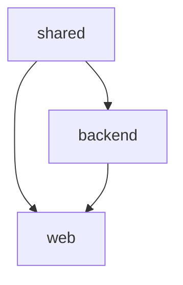

# CONTEXT-MAP.md 模板 / Context Map Template

> 当项目涉及多个子系统/模块时，使用 CONTEXT-MAP.md 作为项目级入口文件，
> 指向每个子系统的 CONTEXT.md。编排器在检测到 CONTEXT-MAP.md 时按模块间依赖顺序编排。

## 模板 / Template

```markdown
# [项目名称] — Context Map

## 模块概览 / Module Overview

| 模块名 | 子目录 | 技术栈 | 描述 |
|--------|--------|--------|------|
| [模块1] | `packages/backend/` | [技术栈] | [一句话描述] |
| [模块2] | `packages/web/` | [技术栈] | [一句话描述] |
| [模块3] | `packages/shared/` | [技术栈] | [一句话描述] |

## 模块间依赖 / Inter-Module Dependencies



## 模块间契约 / Inter-Module Contracts

| 提供方 | 消费方 | 契约形式 | 说明 |
|--------|--------|---------|------|
| backend | web | REST API (OpenAPI) | 后端提供数据 API |
| shared | backend, web | TypeScript 类型 | 共享类型定义 |

## 开发顺序 / Build Order

建议按依赖关系自底向上开发：

1. **shared** — 基础类型 + 工具函数（无外部依赖）
2. **backend** — API 服务（依赖 shared）
3. **web** — 前端界面（依赖 backend + shared）
```

## 使用指引 / Usage Guide

当 architect 检测到项目有多个有界上下文时：

1. 创建项目根目录下的 `CONTEXT-MAP.md`（使用以上模板）
2. 为每个子系统创建独立的 `packages/{name}/CONTEXT.md`
3. 每个子系统的 CONTEXT.md 遵循标准格式
4. 每个子系统有独立的 `docs/adr/` 目录
5. MVP 阶段只聚焦一个子系统

orchestrator 读取 CONTEXT-MAP.md 后：
- 按模块间依赖顺序确定模块开发顺序
- 每个模块内部调用一次 orchestrator 处理其里程碑
- 跨模块集成测试在所有模块完成后执行
