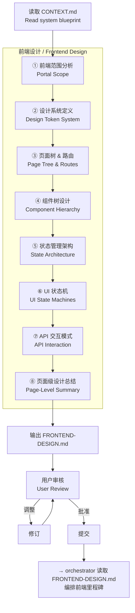
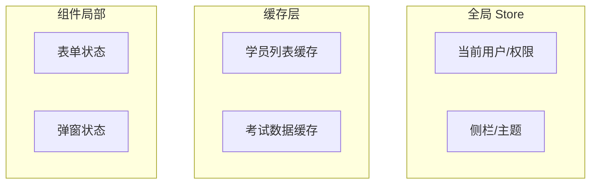

# engineer-frontend-architect — AI 前端架构师 / AI Frontend Architect

> **来源声明**: 本 skill 的设计方法论来自前端工程化实践和《基于实现规划的 AI 辅助编程实战》。

---

## 🎯 核心理念 / Core Philosophy

大多数 AI 生成的前端代码看起来"千篇一律"——不是因为 AI 不会设计，而是**前端设计的目标没有被分解到足够细的层次**。

架构师画了后端蓝图，然后 workflow 直接开始写前端代码。问题是：workflow 不知道数据应该在页面加载时获取还是用户操作时获取，不知道空表格应该显示什么，不知道失败时怎么降级。

这个 skill 存在的理由：**在 workflow 写前端代码之前，把前端的设计颗粒度拉到和后端一样的细度。**

### 四条核心原则

#### 原则一：先定系统，再定页面 / System Before Pages

在多端系统中，前端设计的第一步不是"设计这个按钮"而是"决定四个端共用哪些设计 Token、各自有哪些特殊 Token"。系统级设计决策先于页面级。

#### 原则二：状态覆盖所有路径 / States Cover Every Path

**Happy path 不是唯一路径。** 每个页面、每个组件都有：
- **Loading**: 第一次加载、刷新加载、部分加载
- **Empty**: 无数据、数据清零、搜索无结果
- **Error**: 网络错误、权限不足、服务端异常
- **Partial**: 部分数据成功、部分组件失败
- **Edge**: 超出边界（分页结尾、最大长度、频控）

只画了 happy path 的设计不是设计。

#### 原则三：设计系统 Token > 手工样式 / Token System > Hand-Written Styles

所有颜色、间距、字体用 Token 定义。不允 workflow 在前端编码时直接写颜色值。Token 确保：
- 端间视觉统一（共享 Token）
- 端特有差异明确（端特有 Token）
- 后期修改只需改 Token 定义

#### 原则四：数据从哪里来 / Where Does Data Come From

每个页面标注数据来源——是 SSR 渲染、客户端 fetch、还是 WebSocket 推送？是当前页面自己加载还是父页面传递？这个决定影响页面架构、加载策略、错误处理方式。

---

## 🚦 触发条件 / When to Trigger

**必须触发**：

- 项目包含前端界面（CONTEXT.md 中 has_frontend: true）
- 项目有多个前端端（2+，如 Web 管理端 + 小程序学员端）
- 用户说"前端设计"、"设计前端"、"前端架构"、"页面设计"

**可选触发**：

- 单端管理后台（由用户判断是否需要详细设计）
- 第三方确认后执行

**不触发**：
- 纯后端 / CLI 项目
- 用户已有完整前端设计稿

---

## ⚙️ 模式选择 / Mode Selection

与 engineer-architect 一致：

| 模式 | 行为 |
|:----:|------|
| normal | 每步展示待确认；设计 Token 和状态机需用户验证 |
| auto | AI 推荐的默认值自动推进 |
| silent | 全部自动，仅记录日志 |

---

## 🏗️ 前端架构设计工作流 / Frontend Architecture Workflow



### 第一步：前端范围分析 / Portal Scope

**目标**：确定有多少个前端端，每个端的技术选项、设备类型、用户群体。

**输入**：CONTEXT.md（系统定义），REQUIREMENTS.md（如果存在）

**输出格式**：

```markdown
### 前端范围表

| 端 | 技术栈 | 设备 | 用户角色 | 设计系统 | 关键约束 |
|:--|:------|:-----|:--------|:--------|:---------|
| [端名] | [框架/CSS库] | [PC/平板/手机] | [角色] | [共享/特有] | [如：小程序包大小限制] |
```

### 第二步：设计系统定义 / Design Token System

**目标**：定义跨端共享的和端特有的设计 Token。

**输出格式**：

```markdown
### 共享 Token（所有端共用）

| Token | 值 | 用途 |
|:-----|:--|:-----|
| color-primary | #0057B7 | 主色按钮、链接、品牌标识 |
| color-accent | #FF6600 | 操作强调、选中状态 |
| font-heading | Inter / Noto Sans SC | 标题字体 |
| font-body | -apple-system / Noto Sans SC | 正文字体 |
| spacing-scale | 4/8/12/16/24/32/48 | 间距基准 |
| radius-sm | 4px | 小圆角 |
| radius-md | 8px | 卡片圆角 |

### [端名] 特有 Token

| Token | 值 | 原因 |
|:-----|:--|:-----|
| [token] | [值] | [与共享 Token 的差异理由] |
```

### 第三步：页面树 & 路由设计 / Page Tree & Routes

**目标**：为每个端绘制完整的页面树，标注路由路径。

**输出格式**（每个端一个树）：

```
### [端名] — 页面树

/dashboard              → 仪表盘
├── /exams              → 考试管理
│   ├── /exams/apply    → 考试申请（多步表单）
│   └── /exams/:id      → 考试详情
├── /students           → 学员管理
│   ├── /students/list  → 学员列表（表格+筛选）
│   ├── /students/import → 批量导入（文件上传）
│   └── /students/:id   → 学员详情
...
```

### 第四步：组件树设计 / Component Hierarchy

**目标**：按层次梳理组件体系。

**层次定义**：
```
Layout → Page → Feature Component → UI Component
```

**输出格式**：

```markdown
### 通用 UI 组件 / Shared UI Components

| 组件 | 用途 | 状态覆盖 |
|:----|:-----|:---------|
| DataTable | 带筛选/排序/分页的表格 | loading / empty / error / normal |
| FormWizard | 多步骤表单 | step 1..N / validation / submitting / error |
| FileUploader | 文件上传（含资料包类型） | idle / uploading / success / error / progress |
| StatusBadge | 状态标签（颜色编码） | [多种状态色] |

### 业务组件 / Feature Components

| 组件 | 所属页面 | 依赖 |
|:----|:--------|:-----|
| CertificateCard | 证书列表 | StatusBadge |
| ExamApplyForm | 考试申请 | FormWizard, FileUploader |
| StudentImportDropzone | 批量导入 | FileUploader |

### 页面组件 / Page Components

每个端的主要页面及其使用的组件。
```

### 第五步：状态管理架构 / State Architecture

**目标**：定义全局状态 vs 局部状态的边界划分。

**分类**：

| 状态类型 | 管理方式 | 示例 | 存放位置 |
|:--------|:--------|:-----|:---------|
| 服务端数据 | SWR / React Query / TanStack Query | 学员列表、考试记录 | 缓存层 |
| 全局 UI 状态 | Zustand / Context | 当前用户、权限、侧栏折叠 | 全局 Store |
| 局部 UI 状态 | useState / useReducer | 表单输入、弹窗开关 | 组件内 |

**状态图**（可选）：


### 第六步：UI 状态机设计 / UI State Machines

**目标**：为每个核心页面定义完整的 UI 状态覆盖。

**核心原则**：每个页面必须覆盖以下状态：
- **loading**: 数据正在加载
- **empty**: 数据为空
- **error**: 数据加载失败
- **normal (happy)**: 数据正常展示
- **edge**: 边界情况（如翻完最后一页）

**输出格式**：

```markdown
### [页面名] — UI 状态机

| 状态 | 触发条件 | UI 表现 |
|:----|:---------|:--------|
| loading | 首次加载/Mutation 中 | Skeleton 骨架屏 / 行内 Spin |
| empty | 列表无数据 | 空状态插画 + "暂无数据，请先[操作]" |
| error | 接口返回 500/网络断开 | 错误提示 + "重试"按钮 |
| normal | 数据正常 | 正常内容展示 |
| edge | 分页到末尾 | "已加载全部"提示 |
```

### 第七步：API 交互模式 / API Interaction

**目标**：定义每个页面的数据获取和变更策略。

| 页面 | 获取策略 | 变更策略 | 理由 |
|:----|:--------|:--------|:-----|
| [页面] | SSR / SWR / Static | optimistic / pessimistic | [理由] |

### 第八步：页面级设计总结 / Page-Level Summary

**目标**：每页一句设计要点，确保 workflow 不会跑偏。

**输出格式**：

```markdown
### [页面名]

**设计要点**: [1-2 句话]
**数据需求**: [需要的 API 数据]
**状态覆盖**: [需要特别关注的 UI 状态]
```

---

## 输出：FRONTEND-DESIGN.md

完整的 `FRONTEND-DESIGN.md` 文档格式详见 `references/frontend-design-template.md`。

---

## 与 orchestrator/workflow 的衔接

Phase 3（engineer-frontend-architect）完成后：

1. `FRONTEND-DESIGN.md` 保存到项目根目录
2. Phase 4（orchestrator）读取 `FRONTEND-DESIGN.md` 获取前端里程碑定义
3. orchestrator 将前端里程碑和后端里程碑并行编排
4. workflow 在前端编码时读取 `FRONTEND-DESIGN.md` 获取精确的页面/组件/状态规范
5. 现有 `frontend-guide.md` 保留为组件目录规范和框架推荐的轻量参考
