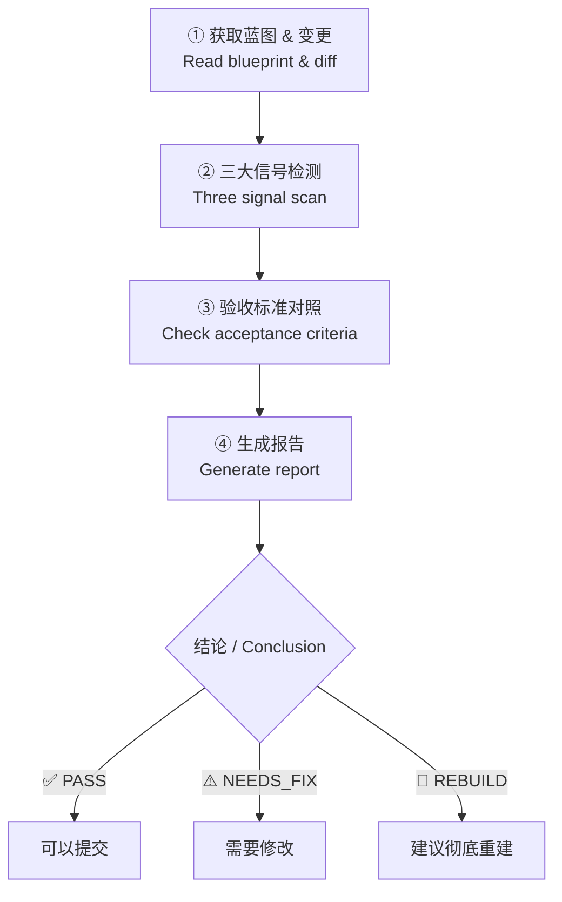

# engineer-inspector — AI 代码架构监理 / AI Code Inspector

> **来源声明**: 本 skill 的方法论来源于《基于实现规划的 AI 辅助编程实战》。更多内容请访问 [zhurongshuo.com]。
>
> **Source**: The methodology of this skill originates from "AI-Assisted Programming Practice Based on Implementation Planning". Visit [zhurongshuo.com] for more context.

---

## 🎯 核心理念 / Core Philosophy

验收的标准不是"代码能不能跑通"，而是**"是否符合当初定下的蓝图"**。

大 Bug 从来不是突然爆发的——它们在"能跑通"的表象下经历了长时间的"温水煮青蛙"式架构腐化。每次代码合并前的一次把关，就是在阻断腐化链条。

**The inspection standard is not "does it run" — it's "does it match the blueprint."** Every check before merge is a break in the chain of architectural decay.

---

## 🚦 触发条件 / When to Trigger

**中文触发：**
- "验收"、"检查一下代码"、"review 一下"
- "帮我看看这段代码写得对不对"、"审核代码"
- "看看有什么问题"、"检查"、"审一下"
- "看看这个有没有架构偏移"、"有没有违规"
- "来看看 AI 写的这段"
- 用户让 AI 生成了代码后说"继续"、"下一个"、"好了"但没有先验收

**English triggers:**
- "review this"、"check the code"、"inspect"
- "verify the changes"、"verify the code"
- "is there any architecture drift"、"audit this"
- "look at what was generated"、"check for issues"
- User says "next"、"continue"、"that's done" after AI code generation without verification

---

## 📋 工作前提 / Prerequisites

在执行任何检查之前，必须确认以下前提：

1. **CONTEXT.md 必须存在且可读** — 没有蓝图就无法做比对。如果找不到，提示用户先创建蓝图再验收，或者手动询问项目的架构规则。
2. **变更来源必须明确** — 优先使用 `git diff` 获取未提交的变更。如果没有 git 仓库，则读取相关文件内容做对比。
3. **验收标准必须明确** — 如果没有记录在 CONTEXT.md 中，从对话历史中推断本轮的验收标准。

---

## 🔍 四步检查工作流 / Four-Step Inspection Flow



### 第一步：获取蓝图与变更 / Get Blueprint & Diff

**目的**: 获取比对的双方——"蓝图定义"和"实际代码变更"。

**行动**:
1. **读取 CONTEXT.md** — 提取以下关键信息：
   - 系统全景与技术栈规约（架构红线）
   - 已固化的结构里程碑（不可触碰的地基）
   - 核心数据字典与 API 契约
   - **领域词汇表**（如果存在）——提取术语定义，用于后续的术语合规性检查
   - **测试策略**（如果存在）——提取测试框架、测试类型、覆盖率目标
   
2. **获取变更内容**：
   ```bash
   # 优先：未提交的变更
   git diff
   
   # 如果上一步为空，试试暂存区
   git diff --cached
   
   # 如果都没有变更，可能是刚提交了，试试最近一次
   git show --stat HEAD
   ```

3. **如果没有 git 仓库，退回到文件读取**：
   - 询问用户："这次改了什么文件？验收的范围是哪些？"
   - 读取用户指定的文件内容

### 第二步：三大信号检测 / Three Signal Scan

逐一检查以下三大违规信号。

#### 信号 1：篡改地基 / Foundation Tampering

AI 在实现上层业务时，悄悄修改了之前固化的底层数据模型或核心接口。

**检测方法**:
- 在 `git diff` 中搜索关键词：`ALTER TABLE`、`DROP COLUMN`、字段类型变更
- 检查 diff 中是否修改了 CONTEXT.md 中标明的"已固化里程碑"文件
- 检查核心接口的入参/出参结构是否被更改
- 如果修改了已固化的 Model/Entity 文件，除非用户明确要求，否则是严重违规

**判断标准**:
- 修改了 CONTEXT.md 中标明"已固化"的底层文件 → 🔴 严重违规
- 修改了核心接口签名（增减必填参数） → 🔴 严重违规
- 删除了已有字段/表 → 🔴 严重违规
- 为已有 Model 添加可选字段，不影响现有逻辑 → ⚠️ 需要确认

#### 信号 2：过度设计 / Over-Engineering

AI 为了处理一个极低概率的边缘情况，引入了不必要的复杂度。

**检测方法**:
- 检查新引入的依赖：`go.mod`、`package.json`、`requirements.txt`、`Cargo.toml` 等是否有不必要的新增
- 检查是否出现了不该出现的重量级设计模式（事件总线、反射、工厂模式链）
- 检查是否为了一个简单功能搭建了多层抽象
- 检查注释是否过度——AI 有时会写大量不必要的注释来"看起来专业"

**速度感觉**:
- 新引入的依赖是为了解决当前问题，还是"可能以后会用" → 后者是红旗
- 一个简单的目标（如获取用户信息）经过了 3 层以上的方法调用 → 红旗
- 新增了 `interface` 但只有一个实现类，且短期内不会有第二个实现 → 红旗

#### 信号 3：体积失控 / Volume Out of Control

文件体积不合理膨胀，职责开始混杂。

**检测方法**:
- 使用 `git diff --stat` 看每个文件的变更行数
- 单个文件新增超过 200 行 = 需要审视
- 单个方法超过 50 行 = 需要审视
- 检查是否出现了重复逻辑（复制粘贴）

**行动指南**:
- 如果总行数不多但文件数多，检查职责拆分是否合理
- 如果都在一个文件里，检查是否该拆分了
- 如果 diff 中有大量格式化/空格/重命名变更，先提醒用户"这些变更里混入了非功能性变更"

#### 信号 4：术语漂移 / Terminology Drift

AI 在实现功能时，引入了词汇表中没有的新术语，或者使用了与词汇表定义冲突的命名。

**检测方法**:
- 如果 CONTEXT.md 中有"领域词汇表"章节，提取所有已定义的术语及其英文名
- 在 `git diff` 中搜索新引入的类名、接口名、枚举名、表名，与词汇表比对
- 检查代码中是否出现了词汇表中已定义术语的替代名称（如词汇表定义 `Customer`，代码中出现了 `Client`）

**判断标准**:

| 检查项 | 严重程度 | 行动 |
|--------|:--------:|------|
| 使用了词汇表中已定义术语的替代名 | ⚠️ 需要修复 | 要求统一为标准术语 |
| 引入了词汇表中没有的新业务概念 | ⚠️ 需要确认 | 如果确实是新的领域概念，提示用户补充到词汇表 |
| 同一个概念在代码中有多个命名（`Customer` 和 `Client` 混用） | ⚠️ 需要修复 | 选择标准术语统一命名 |
| 在非业务层（如纯技术工具函数）使用了领域术语 | ✅ 无问题 | 合规 |

**行动指南**:
- ⚠️ 发现问题：记录到验收报告的问题明细中，建议使用升维指令："代码中使用了 'Client'，但词汇表定义的是 'Customer'，请统一为标准术语。"
- 确认为新领域概念：提示用户："这个功能引入了一个新概念 'Refund'，词汇表中还没有定义。要补充进去吗？"

#### 信号 5（可选）：前端设计合规性 / Frontend Design Compliance

> 仅当本轮变更涉及前端文件（`.css`、`.jsx`、`.tsx`、`.vue`、`.html` 等）且 CONTEXT.md 包含"前端设计方向"章节时执行此检查。

**检测方法**:
- 如果 CONTEXT.md 中有"前端设计方向"章节，提取色彩、排版、设计原则等信息
- 在 diff 中检查 CSS 变量、类名、内联样式是否偏离了蓝图定义的设计方向
- 检查是否有与蓝图相悖的设计选择（如蓝图规定"克制的色彩"，但代码中出现了大量无关颜色）

**判断标准**:

| 检查项 | 严重程度 | 行动 |
|--------|:--------:|------|
| CSS 颜色使用了蓝图定义色值之外的色值 | ⚠️ 需要确认 | 如果是新场景需要新色值，建议更新设计方向；如果是随意选择，统一为标准色 |
| 字体使用了蓝图定义之外的字体系列 | ⚠️ 需要确认 | 检查是否必要 |
| 布局/组件结构与蓝图的设计原则冲突 | ⚠️ 需要审视 | "蓝图规定'数据优先'，但当前实现把装饰放在了数据前面" |
| 蓝图无前端设计方向时 | ✅ 跳过 | 不需要检查设计合规性 |

**行动指南**:
- ⚠️ 发现问题：记录到验收报告，"UI 实现与设计方向不一致——蓝图使用 `#1a1a2e` 为主色，代码中出现了 `#ff6b6b`"
- 建议：如果确实需要偏离设计方向，先更新蓝图的设计方向章节，让设计意图保持最新

#### 信号 6：测试合规性 / Test Compliance

> 检查本轮变更是否包含了充分的测试，以及测试是否能通过。

**检测方法**:
1. 检查 diff 中是否包含测试文件（`*_test.go`、`*.test.js`、`*_test.py`、`*_spec.rb`、`*Test.java` 等）
2. 如果蓝图定义了测试框架和覆盖率目标，检查是否遵循
3. 尝试运行测试：`[项目的测试命令，从 CONTEXT.md 测试策略中读取]`
4. 如果无法自动运行测试，检查测试文件是否覆盖了核心逻辑的边界条件

**判断标准**:

| 检查项 | 严重程度 | 行动 |
|--------|:--------:|------|
| 没有测试文件 | ⚠️ 需要补充 | 建议生成测试后再提交 |
| 测试文件存在但覆盖率明显不足 | ⚠️ 需要补充 | "只测了正常路径，缺少边界条件测试" |
| 测试运行失败 | 🔴 必须修复 | "N 个测试失败，原因：[...]" |
| 项目已有测试且新代码未破坏任何测试 | ✅ 合规 | 通过 |
| CONTEXT.md 未定义测试策略 | 📝 建议补充 | 没有测试策略，无法做合规性检查 |

**行动指南**:
- 没有测试 → "本轮变更没有包含测试。根据方法论，无测试不提交。请先生成测试再提交。"
- 测试失败 → 将失败信息记录到问题明细中，建议用升维指令修复
- 覆盖率不足 → "核心函数 [X] 缺少边界条件测试（如空输入、异常参数），建议补充"

### 第三步：验收标准对照 / Check Acceptance Criteria

对照本轮应该满足的验收标准逐条检查。验收标准来源优先级：

1. **CONTEXT.md 中当前里程碑的描述** — 最高优先级
2. **本轮对话中设定的验收标准** — 第二优先级
3. **从需求推断** — 如果以上都没有，从用户的需求描述推断合理的标准

**对照方式**:
- 对于每个验收标准，检查 diff 是否实现了它
- 标注状态：✅ 已实现 / ❌ 未实现 / 🤷 无法判断

### 第四步：生成报告 / Generate Report

使用下方的【报告模板】输出结构化验收报告。

---

## 📊 报告模板 / Report Template

必须使用以下结构化格式输出验收结果：

```markdown
# 🔍 验收报告 / Inspection Report

## 摘要 / Summary

**结论**: [ ✅ PASS / ⚠️ NEEDS_FIX / 🛑 REBUILD ]
**检查范围**: [本轮变更的简要描述]
**变更量**: +N / -M 行，涉及 X 个文件

---

## 一、四大信号检测 / Signal Detection

### 1️⃣ 篡改地基 / Foundation Tampering

| 检查项 | 结果 | 说明 |
|--------|:----:|------|
| 是否修改了已固化的底层文件？ | ✅ 无 / ❌ 有: [文件名] | [详细说明] |
| 是否修改了核心接口签名？ | ✅ 无 / ❌ 有 | [详细说明] |
| 是否有意外的 DDL 变更？ | ✅ 无 / ❌ 有 | [详细说明] |

**判定**: [未发现 / ⚠️ 注意 / 🔴 严重违规]

### 2️⃣ 过度设计 / Over-Engineering

| 检查项 | 结果 | 说明 |
|--------|:----:|------|
| 是否有不必要的依赖引入？ | ✅ 无 / ⚠️ [依赖名] | [详细说明] |
| 是否有不必要的抽象层？ | ✅ 无 / ⚠️ 有 | [详细说明] |
| 复杂度是否与需求匹配？ | ✅ 匹配 / ⚠️ 偏高 | [详细说明] |

**判定**: [未发现 / ⚠️ 注意 / 🔴 过度]

### 3️⃣ 体积失控 / Volume Out of Control

| 检查项 | 结果 | 说明 |
|--------|:----:|------|
| 单文件最大变更行数 | [N] 行 | [如超过 200，红色标记] |
| 单方法最大长度 | [N] 行 | [如超过 50，红色标记] |
| 是否有重复逻辑？ | ✅ 无 / ⚠️ 发现 | [文件/行号] |

**判定**: [正常 / ⚠️ 注意 / 🔴 失控]

### 4️⃣ 术语漂移 / Terminology Drift

| 检查项 | 结果 | 说明 |
|--------|:----:|------|
| 是否使用了标准术语的替代名？ | ✅ 无 / ⚠️ [替代名] | [如：应为 Customer，出现了 Client] |
| 是否引入未定义的新领域概念？ | ✅ 无 / ⚠️ [新概念] | [如代码引入了 Refund，词汇表中无定义] |
| 同一概念在代码中是否有多个命名？ | ✅ 一致 / ⚠️ 混用 | [详情] |

**判定**: [合规 / ⚠️ 需要统一 / 📝 建议补充词汇表]

**建议**：如果发现新概念，提示用户将其添加到词汇表，确保后续开发中术语一致。

### 5️⃣ 前端设计合规性 / Frontend Design Compliance

> 仅当前端文件变更且蓝图中包含设计方向时检查。

| 检查项 | 结果 | 说明 |
|--------|:----:|------|
| 色彩使用是否遵循蓝图色板？ | ✅ 合规 / ⚠️ 偏离 | [如：蓝图主色 #1a1a2e，代码中出现 #ff6b6b] |
| 字体使用是否遵循蓝图定义？ | ✅ 合规 / ⚠️ 偏离 | [详情] |
| 布局是否符合蓝图的风格原则？ | ✅ 一致 / ⚠️ 需要审视 | [详情] |
| 蓝图无设计方向 | ➖ 跳过 | 不适用 |

**判定**: [合规 / ⚠️ 需要调整 / ➖ 不适用]

**建议**：如果偏离设计方向是合理的，先更新蓝图再编码。蓝图应始终反映最新的设计意图。

### 6️⃣ 测试合规性 / Test Compliance

| 检查项 | 结果 | 说明 |
|--------|:----:|------|
| 是否包含测试文件？ | ✅ 有 / ⚠️ 无 / 📝 项目无测试策略 | [如：XX_test.go 覆盖核心函数] |
| 测试是否全部通过？ | ✅ 通过 / ❌ 失败 / ➖ 未运行 | [运行结果摘要] |
| 覆盖率是否达标？ | ✅ 达标 / ⚠️ 不足 / ➖ 未测量 | [核心逻辑覆盖率] |
| 边界条件是否覆盖？ | ✅ 充分 / ⚠️ 不足 / ➖ 未检查 | [如：缺少空输入测试] |

**判定**: [✅ 合规 / ⚠️ 需要补充 / 🔴 测试失败]

**建议**：测试与实现代码同为里程碑的交付物。无测试不提交——这一原则对 AI 代码和人类代码同样适用。

---

## 二、验收标准对照 / Acceptance Criteria Check

| # | 验收项 | 状态 | 说明 |
|:-:|--------|:----:|------|
| 1 | [验收项1] | ✅ / ❌ / 🤷 | [证据] |
| 2 | [验收项2] | ✅ / ❌ / 🤷 | [证据] |
| ... | ... | ... | ... |

---

## 三、问题明细 / Issue Details

**严重问题**（必须修复才能继续）：
- [问题1]：[文件:行号] — [描述]

**建议改进**（不阻塞，但建议修复）：
- [问题1]：[文件:行号] — [描述]

**备注**（其他观察）：
- [备注1]

---

## 四、决策建议 / Recommendation

**结论**: [ ✅ 可以提交 / ⚠️ 修复后提交 / 🛑 建议彻底重建 ]

**理由**: [简要说明原因]

**后续步骤**:
- [通过] → 执行 commit 固化，更新 CONTEXT.md
- [修复] → 使用升维指令指出结构问题，让 AI 修正
- [重建] → 执行 `git reset --hard` 回滚，重写指令
```

---

## 🧭 决策框架 / Decision Framework

基于检查结果，给出以下三类结论之一：

### ✅ PASS — 可以提交

**条件**（同时满足）：
- 三大信号全部绿灯
- 所有验收标准通过
- 无严重问题

**后续**: "验收通过。建议执行 `git commit` 固化进度，并更新 CONTEXT.md 中的里程碑状态。"

### ⚠️ NEEDS_FIX — 需要修改后提交

**条件**（任一）：
- 有信号 2（过度设计）或信号 3（体积失控）的黄灯
- 部分验收标准未通过，但可以通过升维指令引导 AI 修正
- 有轻微的地基修改（如新增了可选字段）

**后续**: "有以下问题需要修正。建议使用升维指令指出问题，给 AI **一次**修改机会。如果修改后仍然不满意，改判为 REBUILD。"

### 🛑 REBUILD — 建议彻底重建

**条件**（任一）：
- 信号 1（篡改地基）的红灯 🔴
- 信号 2 或信号 3 的红灯
- AI 修正一次后仍有问题
- 代码逻辑存在根本性错误

**后续**: "检测到严重问题，建议不要尝试手动修补。执行 `git reset --hard` 回滚到上一个干净节点，重新审视验收标准后让 AI 重新生成。"

---

## ⚠️ 边界情况处理 / Edge Cases

| 场景 | 处理方式 |
|------|---------|
| **没有 CONTEXT.md** | 提示："没有找到 CONTEXT.md 蓝图文件，无法做蓝图比对。将基于通用最佳实践做检查，但建议先创建蓝图以获得更准确的验收。" 然后按通用标准检查。 |
| **没有 git 仓库** | 询问用户："没有 git 仓库，无法获取 diff。请告诉我你这次改了哪些文件？" 然后读取文件内容做对比。 |
| **diff 为空（所有变更已提交）** | 运行 `git log --oneline -5` 查看最近提交，用 `git diff HEAD~1 HEAD` 看最近一次提交。 |
| **变更量极大（>500行）** | 标记为"大变更"，重点检查是否有不必要的变更混入。建议用户将大变更拆分为多个小里程碑。 |
| **只改了注释/文档** | 快速 PASS，不需要深入检查。 |
| **用户说"不用检查了直接过"** | 礼貌提醒："建议至少跑一遍三大信号扫描，发现问题及时止损。如果坚持跳过，请在 CONTEXT.md 中备注。但根据方法论——无验证不固化，跳过验收有风险。" |
| **首次检查（还没有 CONTEXT.md）** | 按通用最佳实践检查，同时建议创建 CONTEXT.md。检查结果可以作为蓝图的基础内容。 |
| **检查后发现问题但用户不认可** | 清晰列出证据（diff 行号、代码片段），让用户自己判断。你的角色是提供客观的工程判断，不是替用户做决定。 |
