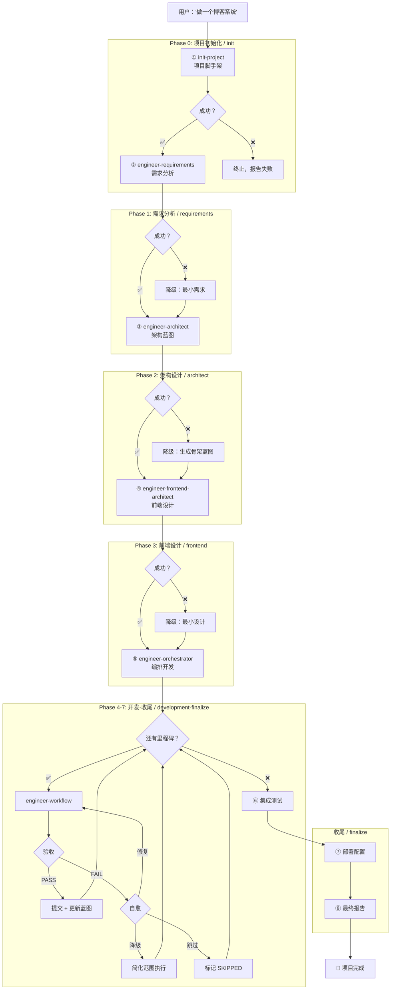

# engineer-job — AI 项目全自动构建引擎 / AI Project Auto-Build Engine

> **来源声明**: 本 skill 的方法论来源于《基于实现规划的 AI 辅助编程实战》。更多内容请访问 [zhurongshuo.com]。
>
> **Source**: The methodology of this skill originates from "AI-Assisted Programming Practice Based on Implementation Planning". Visit [zhurongshuo.com] for more context.
>
> **参考架构**: superpowers `subagent-driven-development`、`writing-plans`、`verification-before-completion`

---

## 🎯 核心理念 / Core Philosophy

如果把 AI 编码项目比作建一栋楼：

| 角色 | 对应技能 | 职责 |
|------|---------|------|
| **业主** | 用户 | 说"我要一栋楼" |
| **总包工头** | engineer-job | 管整个工程从头到尾：先叫测绘队→再叫设计院→再安排施工→最后验收交付 |
| **包工头** | engineer-orchestrator | 管施工进度、协调各队、检查质量 |
| **施工队长** | engineer-workflow | 带一队人砌一堵墙 |
| **监理** | engineer-inspector | 验收每堵墙是否符合图纸 |
| **顾问** | engineer-advisor | 出问题了给建议 |

**orchestrator 管项目内功能编排。engineer-job 管技能间编排，还管脚手架搭建和架构设计。**

> **orchestrator orchestrates features. engineer-job orchestrates skills — and handles scaffolding and architecture too.**

### 三条核心原则

#### 原则一：阶段即子代理 / Phases Are Sub-Agents

每个阶段（Phase）作为一个独立的子代理通过 Agent 工具执行。主会话只做两件事：
1. **读取 job.state.json** — 确定当前阶段
2. **调度子代理** — 启动下一阶段，收集结果

子代理的上下文干净——只包含当前阶段所需的最少信息。这防止了长对话中的质量衰减。

#### 原则二：状态即文件 / State Is Files

所有进度状态写入文件系统，不活在对话上下文中：
- `.agents/job.state.json` — 机器可读的完整项目状态（跨技能、跨会话）
- `.agents/job.progress.md` — 人类可读的追加式进度账本
- `REQUIREMENTS.md` — 需求文档（Phase 1 写入，Phase 2/3 读取）
- `CONTEXT.md` — 项目蓝图（Phase 2 写入，Phase 3/4 读取）
- `FRONTEND-DESIGN.md` — 前端设计文档（Phase 3 写入，Phase 4 读取）

即使整个对话上下文丢失，从这些文件也能完全恢复项目进度。

#### 原则三：降级优于阻塞 / Degrade Over Block

遇到无法自动解决的失败时，默认行为是"降级后继续"，而不是"停下来等人"：

- `--normal` 模式：报告用户，等待决策
- `--auto` 模式：降级方案自动执行
- `--silent` 模式：静默降级

---

## 🚦 触发条件 / When to Trigger

**必须触发**此 skill 当以下条件满足：

**直接触发：**
- 用户说"帮我从零做一个[项目]"、"全自动构建"
- "帮我搭建一个完整的[项目]"、"做一个完整的[系统]"
- "全链路开发"、"自动从头到尾做一个"
- "automate project building"、"full project from scratch"
- "build project auto"、"build everything from zero"

**链式触发（来自其他技能）：**
- engineer-architect 完成蓝图后，用户说"继续"、"自动做下去"
- init-project 完成后，用户说"继续"、"接下来自动化"
- 检测到 CONTEXT.md 中存在未完成的里程碑，用户说"自动做完"

**不触发**（这些交给 orchestrator 或 workflow）：
- "帮我实现这个功能"、"写一个 API"（单功能开发）
- "启动项目"、"开始开发"（已有蓝图下的多功能开发 → orchestrator）

**触发优先级**：
1. 用户描述了一个完整的项目想法但没有任何代码和蓝图 → 触发 engineer-job
2. 已经有 CONTEXT.md 且用户说"全部自动完成" → 触发 orchestrator
3. 只有单个功能需求 → 直接触发 engineer-workflow

---

## 🏃 快速执行 / Quick Start

触发 engineer-job 后，**首要行动**是调用 Workflow 脚本自动执行全部 8 个阶段：

```javascript
Workflow({
  script: "skills/engineer-job/run.wf.js",
  args: {
    requirements: "<用户的需求描述>",
    mode: "auto",              // normal | auto | silent
    projectName: "<项目名>",
    skip_requirements: false,  // 简单项目设为 true
    skip_frontend: false,      // 无前端界面时设为 true
    skip_poc: false,           // 跳过 POC 阶段（默认 false；无前端自动跳过）
    stop_at_poc: false,        // 工程停在 POC，不进入正式实现
  }
})
```

> **这是 engineer-job 的主执行路径。** 所有阶段（init → requirements → architect → frontend → orchestrate → integrate → deploy → report）
> 在 Workflow 引擎中自动推进。详情参见 `skills/engineer-job/references/engine.md`。
>
> 如果 Workflow 工具不可用，回退到下方"手动子代理调度"模式。

### 快速路演

```
用户: "帮我做一个博客系统"
        │
        ▼
engineer-job: Workflow({ script: "run.wf.js", args: { requirements: "...", mode: "auto" }})
        │
        ▼ 自动推进 8 个 Phase (约 5-15 分钟)
        │
    🎉 输出: 完整可运行的项目 + 最终报告
```

### 恢复已中断的项目

如果项目中途中断（如对话超时），重新调用完全相同的 Workflow：

```javascript
// 自动检测 .agents/job.state.json 并恢复进度
Workflow({
  script: "skills/engineer-job/run.wf.js",
  args: { requirements: "...", mode: "auto", projectName: "...", skip_requirements: false, skip_frontend: false }
})
```

Workflow 会跳过已完成的阶段，从中断处继续。

---

## ⚙️ 模式选择 / Mode Selection

通过 `--mode`（Workflow 为 `args.mode`）参数控制自动确认程度（默认 normal）：

| 模式 | Phase 间推进 | 异常时行为 |
|:----:|-------------|-----------|
| normal | Phase 间自动推进（Workflow 自带节流），报告阶段完成 | 报告错误，降级后继续，最终报告中标明 |
| auto | 自动推进，最终报告输出降级记录 | 自动降级/跳过，记录到最终报告 |
| silent | 全部自动，无中间输出 | 静默处理，只记日志 |

---

## 🏗️ 八阶段编排工作流 / 8-Phase Orchestration Workflow



### 阶段总览 / Phase Overview

| 阶段 | 名称 | 调用技能 | 输入 → 输出 | 失败处理 |
|:----:|:----:|:---------:|:-----------:|:--------:|
| 0 | init | `init-project` | 用户需求 → 文件树 + project-metadata.json | 重试 1 次，失败则终止 |
| 1 | requirements | `engineer-requirements` | project-metadata.json → REQUIREMENTS.md | 重试 1 次，失败则降级最小需求 |
| 2 | architect | `engineer-architect` | project-metadata.json + REQUIREMENTS.md → CONTEXT.md | 重试 1 次，失败则降级骨架蓝图 |
| 3 | frontend | `engineer-frontend-architect` | CONTEXT.md + REQUIREMENTS.md → FRONTEND-DESIGN.md | 重试 1 次，失败则降级最小设计 |
| 3.5 | poc | `engineer-poc` | REQUIREMENTS.md + FRONTEND-DESIGN.md → 可运行 POC + POC-MANIFEST.md + POC-FIDELITY.md | 重试 1 次，失败则降级最小 POC；无前端或 skip_poc 时跳过 |
| 4 | orchestrate | `engineer-orchestrator` + `engineer-workflow` × N | 蓝图 + 前端设计 → 完整代码 | 里程碑级自动自愈 |
| 4.5 | run gate | 内置运行门禁 | 代码 → build+test 通过 | 失败强制修复循环；修不动标 DOES_NOT_RUN |
| 5 | integrate | 内置集成测试 | 代码 → 测试报告 | 记录失败，不阻塞 |
| 6 | deploy | 内置部署生成 | 蓝图部署方案 → 部署配置 | 记录警告，不阻塞 |
| 7 | report | 内置报告生成 | 所有以上 → 最终报告 | — |

### 三文档体系 / Three-Document System

engineer-job 在 Phase 1-3 构建三份核心文档，串联整个构建流程：

```
REQUIREMENTS.md   ← Phase 1 (需求分析)
    ↓ 架构师读取
CONTEXT.md         ← Phase 2 (架构蓝图)
    ↓ 前端架构师读取
FRONTEND-DESIGN.md ← Phase 3 (前端设计)
    ↓ 编排器/工作流读取
工程代码
```

**可选 POC 阶段（Phase 3.5）**：在 frontend 之后、orchestrate 之前，`engineer-poc` 可生成高保真纯前端 POC，产出 `POC-MANIFEST.md`（供 Phase 4 演进消费）与 `POC-FIDELITY.md`。默认对有前端的项目生成（`skip_poc=false`）；`stop_at_poc=true` 时工程停在 POC；`skip_poc=true` 或无前端时跳过。Phase 4 orchestrate 读取 `POC-MANIFEST.md` 时做**演进**（替换 mock 层）而非重建。

**各文档职责**：
- **REQUIREMENTS.md**: 回答"要做什么"——角色旅程、功能清单、状态机、验收条件
- **CONTEXT.md**: 回答"怎么做"——技术栈、数据模型、API 契约、架构模式、里程碑
- **FRONTEND-DESIGN.md**: 回答"前端长什么样"——页面树、组件树、状态管理、UI 状态机

**简单项目跳过**：当项目没有前端界面或模块较少时，自动跳过 Phase 1 和 Phase 3。

**可选增强 — Phase 5 生产就绪检查**：
在 `--auto` 或 `--silent` 模式下，如果项目是服务端/Web 应用，Phase 5 会额外执行生产就绪检查。
读取 `init-project/references/production-readiness.md` 按项目类型运行检查清单，
未通过项记录到最终报告的"建议改进"部分，不阻塞流程。
纯 CLI/库项目自动跳过此步骤。

---

## 🤖 执行模式选择 / Execution Mode

engineer-job 提供两种执行模式。**Workflow 脚本是默认推荐的主执行路径。**

### 模式 A（推荐）：Workflow 脚本自动执行

通过 Workflow 工具自动执行全部 8 个阶段。各阶段子代理在 Workflow 引擎管理下自动推进，
无需手动调度。

**使用方式**：
```javascript
Workflow({
  script: "skills/engineer-job/run.wf.js",
  args: {
    requirements: "做一个博客系统，CRUD 功能，Python FastAPI + SQLite",
    mode: "auto",              // normal | auto | silent
    projectName: "blog-system",
    skip_requirements: false,  // 简单项目设为 true
    skip_frontend: true,       // 无前端界面时设为 true
  }
})
```

**关键特性**：
- **标准协议**：Phase 0 写入 `project-metadata.json`，Phase 1 写入 `REQUIREMENTS.md`，Phase 2 写入 `CONTEXT.md`，Phase 3 写入 `FRONTEND-DESIGN.md`。所有阶段通过文件传递结构化数据，不靠自然语言摘要
- **自动恢复**：重启时自动检测 `.agents/job.state.json`，跳过已完成阶段
- **降级继续**：非终止级失败自动降级，不在等待用户上浪费时间
- **最终报告**：所有阶段完成后自动生成完整报告

详情参见 `references/engine.md`。

### 模式 B（回退）：手动子代理调度

当 Workflow 工具不可用时，可以在主会话中手动调度各阶段：

```
engineer-job（主会话）
  │  读取 .agents/job.state.json → 确定当前阶段
  │
  ├── [Agent] Phase 0: init-project
  │     └── → 写入文件树 + project-metadata.json
  │
  ├── [Agent] Phase 1: engineer-requirements
  │     └── → 写入 REQUIREMENTS.md
  │
  ├── [Agent] Phase 2: engineer-architect
  │     └── → 写入 CONTEXT.md + ADRs + 更新 project-metadata.json
  │
  ├── [Agent] Phase 3: engineer-frontend-architect
  │     └── → 写入 FRONTEND-DESIGN.md
  │
  ├── [Agent] Phase 4: engineer-orchestrator
  │   │  读取 CONTEXT.md + FRONTEND-DESIGN.md + job.state.json
  │   │
  │   ├── [Agent] engineer-workflow "M1"
  │   ├── [Agent] engineer-workflow "M2"
  │   ├── [Agent] engineer-workflow "M3"
  │   │
  │   └── → 更新 CONTEXT.md + job.state.json + progress.json
  │
  ├── [Agent] Phase 5: 集成测试
  │     └── → 写入测试报告
  │
  ├── [Agent] Phase 6: 部署配置
  │     └── → 写入 Dockerfile/CI 配置
  │
  └── [Agent] Phase 7: 最终报告
        └── → 输出完成报告
```

### 子代理约束条件

1. **边界明确** — 每个子代理的工作范围严格限制在一个阶段或一个里程碑内
2. **上下文干净** — 子代理只包含当前任务所需的最少信息，不继承主会话的对话历史
3. **标准协议传递** — 子代理之间的状态通过文件传递（`project-metadata.json` → `REQUIREMENTS.md` → `CONTEXT.md` → `FRONTEND-DESIGN.md` → `job.state.json`），不通过对话参数传递
4. **简短状态码** — 子代理返回以下三种状态之一，不携带大量文本：
   - `DONE` — 成功完成
   - `DONE_WITH_CONCERNS` — 完成但有备注
   - `BLOCKED` — 无法继续

---

## 🔧 自愈机制 / Self-Healing

engineer-job 在阶段级别处理失败。功能级和里程碑级的自愈由 orchestrator 和 workflow 处理。

### 阶段级自愈

```
engineer-job --auto 遇到阶段执行失败:
  ├── init 失败 → 重试 1 次 → 仍失败 → 终止，报告失败原因
  ├── requirements 失败 → 重试 1 次 → 仍失败 → 降级最小需求 → 继续
  ├── architect 失败 → 重试 1 次 → 仍失败 → 降级生成骨架 CONTEXT.md → 继续
  ├── frontend 失败 → 重试 1 次 → 仍失败 → 降级最小设计 → 继续
  ├── orchestrate 失败 → 尝试恢复 job.state.json → 恢复失败则输出已完成的里程碑
  ├── integrate 失败 → 记录警告，不阻塞后续
  └── deploy 失败 → 记录警告，不阻塞 report
```

**终止级阶段**：只有 init（Phase 0）失败会终止流程，因为后续所有阶段依赖它的产出。其他阶段失败时以降级/跳过为默认行为。

### 自愈循环流程

```
对于每个 engineer-workflow 调用（Phase 4 内部）:
  
  workflow 启动 → 里程碑拆解 → 编码 → 测试 → 验收
  
                   ↓ 失败
             错误捕获
              /      \
        可修复      不可修复
           |            |
    自动发送修复指令   git reset --hard
           |            |
        ✅ 修复成功  重建(计数+1)
           |            |
        继续验收    ├─ 重建 < 2次 → 重新编码
                    │
                    └─ 重建 >= 2次
                         │
                   ┌─ normal → 暂停报告用户
                   ├─ auto → 降级范围
                   │    ├─ 降级成功 → 继续
                   │    └─ 降级失败 → 跳过
                   └─ silent → 降级 → 跳过 → 静默记录
```

### 重建阈值

| 模式 | 重建 1 次 | 重建 2 次 | 重建 3 次 |
|:----:|:---------:|:---------:|:---------:|
| `--normal` | 自动重建 | ⏸ 暂停报告用户 | 等待用户决策 |
| `--auto` | 自动重建 | 自动降级 | 跳过，记录原因 |
| `--silent` | 自动重建 | 自动降级 | 跳过，静默记录 |

---

## 🔄 跨会话恢复 / Cross-Session Recovery

### 恢复流程

```
新对话 → 检测 .agents/job.state.json
  ├── 存在 → 读取 → 报告当前进度 → 恢复执行
  │   ├── init: 未完成 → 重新 init-project
  │   ├── requirements: 未完成 → 重新 requirements
  │   ├── architect: 未完成 → 重新 architect
  │   ├── frontend: 未完成 → 重新 frontend
  │   ├── development: 未完成 → 恢复 orchestrator
  │   │   ├── 读取 checkpoint.next_action
  │   │   ├── git log 验证当前 commit
  │   │   └── 从下一个 TODO 里程碑继续
  │   └── finalize 等待中 → 执行集成测试
  └── 不存在 → 回退 .agents/progress.json
       └── 也不存在 → 回退 CONTEXT.md
            └── CONTEXT.md 也没有 → 从用户确认需求
```

### 恢复报告模板

```markdown
## 🔄 项目进度恢复 / Project Recovery

检测到 job.state.json，从持久化文件恢复项目进度：

**项目**: [名称]
**阶段**: [当前阶段名]
**完成进度**: [N/N 里程碑完成]
**上次验证的 commit**: [hash]（[message]）

### 已完成
1. ✅ 阶段 0: init — [时间]
2. ✅ 阶段 1: architect — [时间]
3. ✅ M1: [名称] — [时间]
4. ⚠️ M2: [名称]（降级通过）

### 待完成
5. [ ] M3: [名称]

### 恢复操作
1. git 状态验证: [hash] ✅
2. 测试运行: [N/N 通过] ✅
3. 从 M3 继续...
```

---

## 📁 进度持久化 / Progress Persistence

### 三文件方案

engineer-job 使用三文件方案来追踪跨技能、跨会话的项目进度。

#### 文件 1：`project-metadata.json` — 技能间标准协议文件（新增）

用于 init-project → engineer-requirements → engineer-architect → engineer-orchestrator 之间的结构化数据传递。
由 init-project（Phase 0）创建，architect（Phase 2）补充，orchestrator（Phase 4）消费。

- **Schema 定义**：`references/project-metadata.schema.json`
- **协议文档**：`references/skill-protocol.md`

#### 文件 2：`.agents/job.state.json` — 机器可读完整状态

```json
{
  "project": "blog-system",
  "job_version": "2.0",
  "mode": "auto",
  "phases": {
    "init": {
      "status": "DONE",
      "skill": "init-project",
      "started_at": "2026-07-13T10:00:00Z",
      "completed_at": "2026-07-13T10:02:30Z",
      "result": {
        "project_dir": "/path/to/blog",
        "tech_stack": "python/fastapi/sqlite",
        "project_type": "web-app"
      },
      "errors": []
    },
    "architect": {
      "status": "DONE",
      "skill": "engineer-architect",
      "started_at": "2026-07-13T10:02:31Z",
      "completed_at": "2026-07-13T10:15:00Z",
      "result": {
        "blueprint_commit": "abc123",
        "milestone_count": 6,
        "vocabulary_terms": 12
      },
      "errors": []
    },
    "development": {
      "status": "IN_PROGRESS",
      "skill": "engineer-orchestrator",
      "started_at": "2026-07-13T10:15:01Z",
      "features": {
        "M1": {
          "name": "data-model",
          "status": "DONE",
          "dependencies": [],
          "commits": "abc123..def456",
          "rebuild_count": 0,
          "degraded": false,
          "integration_issues": [],
          "completed_at": "2026-07-13T10:25:00Z",
          "summary": "Created 3 models + migration"
        },
        "M2": {
          "name": "article-crud",
          "status": "IN_PROGRESS",
          "dependencies": ["M1"],
          "commits": null,
          "rebuild_count": 1,
          "degraded": false,
          "integration_issues": [],
          "completed_at": null,
          "summary": null
        }
      },
      "errors": []
    },
    "finalize": { "status": "TODO" },
    "deploy": { "status": "TODO" }
  },
  "checkpoint": {
    "last_commit": "def456",
    "last_phase": "development",
    "next_action": "continue milestone M2 (article-crud) — fixing failing test",
    "session_summary": "Completed M1. M2 in progress with 1 rebuild. 0 integration issues."
  }
}
```

**状态值定义**：

| 状态 | 含义 |
|:----:|------|
| `TODO` | 未开始 |
| `IN_PROGRESS` | 正在执行 |
| `DONE` | 已完成 |
| `BLOCKED` | 阻塞，无法继续 |
| `SKIPPED` | 跳过（如降级失败后） |

#### 文件 2：`.agents/job.progress.md` — 人类可读追加账本

```markdown
# Project: blog-system
# Mode: auto
# Started: 2026-07-13T10:00:00Z

## 2026-07-13

[10:02] ✅ Phase 0: init — scaffolded (python/fastapi/sqlite)
[10:08] ✅ Phase 1: requirements — REQUIREMENTS.md created
[10:15] ✅ Phase 2: architect — blueprint + 6 milestones + 12 terms
[10:20] ✅ Phase 3: frontend — FRONTEND-DESIGN.md created
[10:25] ✅ M1: data-model — commits abc123..def456, 3 files, 2 tests
[10:35] ✅ M2: article-crud — commits def456..ghi789, 5 files, 8 tests
[10:45] ⚠️ M3: author-auth — rebuild 1 (compilation error, auto-fixed)
[10:52] ✅ M3: author-auth — commits ghi789..jkl012, 4 files, 6 tests
```

### 与现有 progress.json 的兼容

- `job.state.json` **新增**，覆盖完整生命周期。其 `development.features` 结构兼容现有的 progress.json
- `.agents/progress.json` **保留**，由 orchestrator 向下兼容
- **检测优先级**：`job.state.json` → `progress.json` → `CONTEXT.md` → 从用户问起

---

## 📊 最终报告 / Final Report

所有阶段完成后，engineer-job 输出以下最终报告：

```markdown
# 🎉 项目开发完成 / Project Development Complete

**项目**: [项目名]
**模式**: [normal / auto / silent]
**总阶段**: 8/8 ✅
**总里程碑**: [N/N] 
**总变更**: +N / -M 行
**总文件**: N 个

## 完成清单

| # | 阶段/里程碑 | 状态 | 说明 |
|:-:|------------|:----:|------|
| 0 | 项目初始化 | ✅ | [技术栈] |
| 1 | 需求分析 | ✅ | [N 个功能区域] |
| 2 | 架构设计 | ✅ | [N 个术语, N 个里程碑] |
| 3 | 前端设计 | ✅ | [N 个页面, N 个组件] |
| 4 | M1: [名称] | ✅ | N 文件, N 测试 |
| 4 | M2: [名称] | ✅ | N 文件, N 测试 |
| ... | ... | ... | ... |
| 5 | 集成测试 | ✅ | N/N 测试通过 |
| 6 | 部署配置 | ✅ | [Dockerfile/CI/...] |

## 降级记录

| 里程碑 | 降级原因 | 最终处理 |
|--------|---------|---------|
| [名称] | 重建 2 次后降级范围 | 降级通过 |

## 部署配置

- **Dockerfile**: [已生成 / 不需要]
- **CI/CD**: [已生成 / 不需要]
- **运行命令**: `[命令]`

## 建议的后续工作

1. [建议 1]
2. [建议 2]
```

---

## ⚠️ 边界情况 / Edge Cases

| 场景 | 处理方式 |
|------|---------|
| **job.state.json 不存在但 project-metadata.json 存在** | 回退到 metadata → 重建 job.state.json → 从 metadata 推断当前阶段 |
| **job.state.json 与 git 状态不一致** | 运行 `git log --oneline -3` 验证，报告差异，询问用户 |
| **子代理超时** | 默认 10 分钟超时，超时后标记 BLOCKED |
| **同一项目重复启动** | 检测 job.state.json 存在，提示用户恢复而非重新开始 |
| **用户中途说"暂停"** | 记录当前进度到 job.state.json + project-metadata.json，commit 当前工作，输出恢复指令 |
| **引擎在 --auto 模式下技术栈默认选择不符合预期** | 在最终报告中提供"建议修改"清单，但开发阶段不暂停 |
| **用户提供了部分代码但没有 CONTEXT.md** | 先扫描现有代码（调用 engineer-architect 的逆向分析模式）生成蓝图，再继续 |
| **用户说"不要部署配置"** | 在 init 或 deploy 阶段提供选项。auto 模式下根据项目类型默认决定是否生成 |
| **所有功能完成后还有集成问题堆积** | 在最终报告中列出，并作为第一条建议 |
| **project-metadata.json 与 CONTEXT.md 不一致** | 以 CONTEXT.md 为准，重建 metadata。记录差异日志 |
