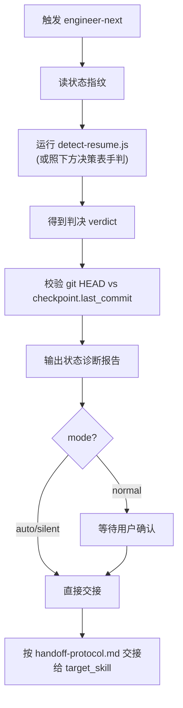

# engineer-next — AI 进度接续路由引擎 / AI Resume Router

> **来源声明**: 本 skill 的方法论来源于《基于实现规划的 AI 辅助编程实战》。更多内容请访问 [zhurongshuo.com]。
>
> **Source**: The methodology of this skill originates from "AI-Assisted Programming Practice Based on Implementation Planning".

---

## 🎯 核心理念 / Core Philosophy

engineer-next 是一个**精准的调度员**：用最小代价搞清楚"项目现在停在哪一格"，然后把球传给最该接手的那个人，自己从不亲自下场砌墙。

| 角色 | 职责 |
|------|------|
| **调度员** engineer-next | 诊断断点 → 路由到正确技能 |
| 总包/包工头/队长/监理/顾问 | 实际执行（既有 engineer* 技能） |

**engineer-workflow/orchestrator/job 负责干活。engineer-next 负责判断该谁接着干、从哪接着干。**

> **The other engineer-* skills do the work. engineer-next decides who resumes, and from where.**

### 三条核心原则

1. **状态即文件，诊断即读文件 / State Is Files** —— 只读既有 `job.state.json` / `progress.json` / `project-metadata.json` / `CONTEXT.md` / `REQUIREMENTS.md` / `FRONTEND-DESIGN.md` / `POC-MANIFEST.md`，不写自己的进度。检测优先级：`job.state.json → progress.json → CONTEXT.md → 用户`。
2. **复用既有恢复，绝不重跑 / Reuse Recovery, Never Redo** —— 接续的命门是"从断点继续"。典型陷阱：重调 `engineer-job` 在 development 阶段会重跑所有里程碑——所以"开发进行中"必须走 `engineer-orchestrator` 的里程碑级恢复。
3. **降级优于阻塞 / Degrade Over Block** —— 状态文件损坏/检测歧义，按既定优先级降级判定，只在 normal 模式提示用户。

---

## 🚦 触发条件 / When to Trigger

**必须触发**（万能继续入口）：
- "继续 / 接着做 / 继续[项目/功能] / 接着开发 / 恢复进度 / 接着干"
- "continue / next / resume / pick up where I left off / keep going"

**链式触发**：上下文重置/新会话后用户说"继续项目 [名称]"。

**不触发**（让位给具体技能）：
- "实现登录功能"（明确单功能）→ engineer-workflow
- "从零做一个完整项目"（明确从零）→ engineer-job
- "画蓝图/做架构"（明确要设计）→ engineer-architect

---

## ⚙️ 模式选择 / Mode Selection

与家族一致（默认 normal）：

| 模式 | 行为 |
|:----:|------|
| normal | 出状态诊断报告，等待用户确认后再交接；检测不确定（如 git 偏差）时询问。 |
| auto | 出诊断摘要后直接交接，不确定性按默认降级。 |
| silent | 静默诊断 + 交接，仅记日志，末尾输出交接摘要。 |

**mode 透传**：交接时把同一 `--mode` 透传给 target_skill。

---

## 🔍 诊断流程 / Diagnosis Flow



### 状态指纹（读哪些文件）

| 文件 | 用途 |
|------|------|
| `.agents/job.state.json` | 全生命周期状态（phases + checkpoint） |
| `.agents/progress.json` | orchestrator 里程碑跟踪 |
| `project-metadata.json` | init→architect→orchestrator 协议 |
| `CONTEXT.md` / `CONTEXT-MAP.md` | 蓝图 / 多模块地图 |
| `REQUIREMENTS.md` / `FRONTEND-DESIGN.md` / `POC-MANIFEST.md` | 设计产物 |
| 代码体量统计 | 外来项目判定（忽略 node_modules/.git/target/dist/build/.venv 等） |

### 运行诊断（推荐）

```bash
node skills/engineer-next/references/detect-resume.js [projectDir]
```

打印 JSON 判决 `{scenario, resume_point, target_skill, handoff, reconstructed_args, reasoning}`。CLI 不可用时，照下方决策表手动判定——判决逻辑的单一真源是 `references/resume-logic.js`（纯函数，单测守护）。

---

## 🗺️ 检测→路由决策表 / Detection→Routing Decision Table

按优先级从高到低。完整交接指令见 `references/handoff-protocol.md`。

| 优先级 | Scenario（看什么产物） | resume_point | target_skill / 交接方式 |
|:-:|---|---|---|
| 1a | `job.state.json` 在，下一个未完成阶段是 **init/设计期**（requirements/architect/frontend/poc） | 该阶段 | **重调 engineer-job run.wf.js**（自动跳过 DONE 阶段）；从 job.state.json+project-metadata.json 重建参数 |
| 1b | `job.state.json` 在，`development` 为首个未完成阶段（TODO 起步或 IN_PROGRESS） | 下一个 TODO 里程碑 | **路由 engineer-orchestrator**（里程碑级恢复）。⚠️ 不重调 job，否则重跑已完成里程碑 |
| 1c | `job.state.json` 在，`development` DONE，但 run_gate/finalize/deploy/report 未完成 | 收尾阶段 | **重调 engineer-job run.wf.js**（不重跑里程碑） |
| 1c+ | `job.state.json` 在，`development` DONE 但无 QA 记录 / `.agents/qa-latest.md` 结论非 PASS | 补测试验收 | **路由 engineer-qa** 跑测试门禁（②③④层），通过后再进收尾 |
| 1d | `job.state.json` 全阶段 DONE | （已完成） | 报告"已完成"，建议 engineer-advisor 或追加功能走 architect |
| 1e | 某阶段 BLOCKED | 该阶段 | 报告阻塞 + 路由该技能/advisor |
| 2 | 无 job.state，但有 `.agents/progress.json` | 下一个 TODO 里程碑 | **路由 engineer-orchestrator** 恢复 |
| 3 | 无 job.state/progress，但有 `CONTEXT.md`（蓝图就绪） | 首个里程碑/模块 | **路由 engineer-orchestrator**（有 CONTEXT-MAP.md 走多模块） |
| 4 | 无 job.state/progress/CONTEXT，但有 `REQUIREMENTS.md` | 架构设计 | **路由 engineer-architect** 产 CONTEXT.md |
| 5 | 只有 `project-metadata.json`（仅脚手架） | 需求/架构 | **路由 engineer-requirements**（简单项目→architect） |
| 6a | **零 engineer* 产物 + 代码近乎为空**（<10 文件 且 <500 LOC） | 从零开始 | **路由 engineer-job 全新**（既有零散文件当脚手架） |
| 6b | **零 engineer* 产物 + 已有大量代码**（外来项目） | 逆向建模 | **路由 engineer-architect 逆向分析** → 生成 REQUIREMENTS.md+CONTEXT.md → 再接 orchestrator |
| 7 | 完全空目录 | 从零开始 | **路由 engineer-job 全新**（无需求则先问最少问题） |

**两条贯穿原则**：复用既有恢复绝不重跑（1b 是关键）；外来项目遵守"无蓝图不开工"（6b 先逆向出蓝图）。

---

## 📋 状态诊断报告 / Diagnosis Report

交接前输出（模板）：

```markdown
## 🔍 状态诊断 / State Diagnosis

**项目**: [名称]　**检测场景**: [scenario + resume_point]
**判定依据**: [verdict.reasoning]

### 已完成
1. ✅ [阶段/里程碑...]

### 待续
2. [ ] [下一个动作]　→ 路由到 **[target_skill]**

### 验证
- git HEAD vs checkpoint.last_commit: [一致 ✅ / 偏差 ⚠️]
- （若适用）测试基线: [N/N 通过]

### 下一步
[normal] 确认后我将交接给 [target_skill]...
[auto] 直接交接。
```

---

## ⚠️ 边界情况 / Edge Cases

| 场景 | 处理 |
|------|------|
| `job.state.json` 损坏/无法解析 | 降级到 progress.json → CONTEXT.md → 外来项目判定 |
| git HEAD 与 `checkpoint.last_commit` 偏差 | 诊断报告标 ⚠️；normal 模式询问 |
| 恢复时用户给了**新需求** | 新功能→路由 orchestrator 追加；改范围→路由 architect |
| `CONTEXT-MAP.md` 在（多模块） | 交 orchestrator 多模块编排 |
| 检测歧义 | 严格按决策表优先级（2 > 4 等） |
| 外来项目体量在阈值附近 | 保守走逆向(6b)——宁可有蓝图 |
| development DONE 但测试门禁未过 | 路由 engineer-qa 补验收，PASS 后再交 job 收尾 |

---

## 🚫 非目标 / Non-Goals

1. 不重实现任何阶段（init/requirements/architect/dev/...）。
2. 不写自己的进度文件（只读既有）。
3. 不自己跑构建/测试。
4. 不自带 `run.wf.js`。
5. 不做语义级"下一个具体 TODO"推荐——只做技能/阶段/里程碑级路由。
