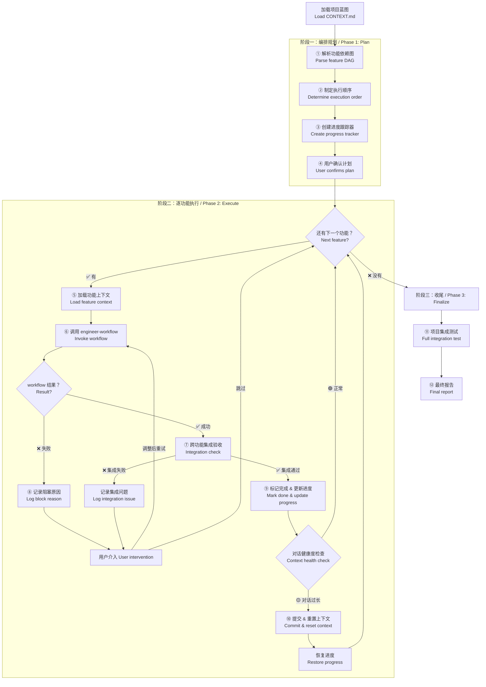
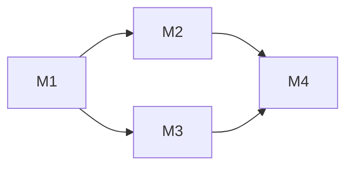
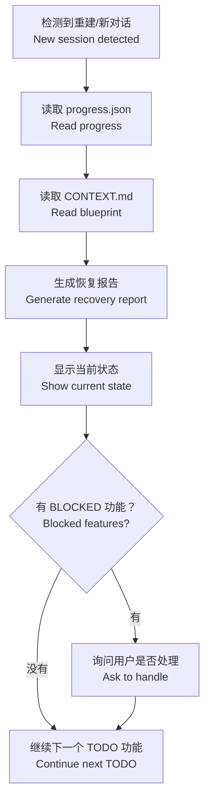

# engineer-orchestrator — AI 项目编排引擎 / AI Project Orchestrator

> **来源声明**: 本 skill 的方法论来源于《基于实现规划的 AI 辅助编程实战》。更多内容请访问 [zhurongshuo.com]。
>
> **Source**: The methodology of this skill originates from "AI-Assisted Programming Practice Based on Implementation Planning". Visit [zhurongshuo.com] for more context.

---

## 🎯 核心理念 / Core Philosophy

如果把 AI 编码比作盖楼：

| 角色 | 对应技能 | 职责 |
|------|---------|------|
| **建筑师** | engineer-architect | 画好设计图纸（蓝图） |
| **包工头** | engineer-orchestrator | 安排施工进度、协调各队、检查质量 |
| **施工队长** | engineer-workflow | 带一小队人砌一堵墙 |
| **监理** | engineer-inspector | 验收每堵墙是否符合图纸 |
| **顾问** | engineer-advisor | 出问题了给建议 |

**engineer-workflow 擅长盖一堵墙。engineer-orchestrator 擅长盖整栋楼。**

> **engineer-workflow builds one feature. engineer-orchestrator builds the whole project.**

### 三条核心原则

#### 原则一：功能即任务 / Features Are Tasks

对 orchestrator 来说，最小的执行单元不是"代码行"或"文件"，而是**一个完整的功能**。每个功能由 engineer-workflow 以"全自动工作流"的方式完成。

Orchestrator 只问三个问题：
1. 这个功能依赖哪些前置功能？（**依赖排序**）
2. 这个功能验收通过了吗？（**质量门禁**）
3. 这个功能完成后，整体项目集成测试通过吗？（**集成验证**）

#### 原则二：进度即状态 / Progress Is State

Orchestrator 管理跨会话的项目状态。每次上下文重置后，能从持久化记录中恢复进度。

进度状态机：
```
待办(TODO) → 进行中(IN_PROGRESS) → 已完成(DONE)
                                    ↘ 阻塞(BLOCKED)
```

关键规则：**只有 engineer-inspector 验收通过的功能才能标记为 DONE。**

#### 原则三：集成即红线 / Integration Is the Red Line

每个功能单独验收通过后，orchestrator 必须做**跨功能集成检查**：
- 功能 A 的 API 输出是否能被功能 B 正确消费？
- 功能 A 新增的数据模型是否和功能 B 的兼容？
- 整体测试是否通过？

**单个功能没问题 ≠ 整个系统没问题。**

---

## 🚦 触发条件 / When to Trigger

**必须触发**此 skill 当以下条件满足：

**直接触发：**
- 用户说"开始做这个项目"、"完整实现"、"启动项目"
- "把所有功能都做了"、"项目整体开发"
- "build the whole project"、"start the project"
- "implement everything"、"complete all features"
- "全功能开发"、"全部实现"

**链式触发（来自其他技能）：**
- engineer-architect 完成蓝图后，用户说"开始做吧"、"开始开发"
- CONTEXT.md 已存在且包含多个未完成的里程碑，用户说"继续"、"接着做"

**不触发**（这些交给 workflow）：
- "实现登录功能"（单个功能的实现）
- "帮我写一个 API"（单个操作）

**触发优先级判断**：

```
1. 检查 CONTEXT.md 是否存在且含多个里程碑
2. 检查是否有多个未完成的功能（里程碑 > 1）
3. 如果只有一个未完成的功能 → 直接转 engineer-workflow
4. 如果有多个未完成的功能 → 触发 orchestrator
```

---

## ⚙️ 模式选择 / Mode Selection

通过 `--mode` 参数控制自动确认程度（默认 normal）：

| 模式 | 行为 |
|:----:|------|
| normal | 展示执行计划等待确认；每个功能阻塞时等待用户决策 |
| auto | 直接开始执行；功能阻塞时自动重试/跳过；上下文自动重置 |
| silent | 全部自动，静默执行，仅记录日志 |

### auto 模式默认决策

| 决策点 | auto 模式行为 |
|--------|-------------|
| 展示执行计划 | 直接开始第一个里程碑 |
| 功能阻塞 | 自动重试 1 次 → 跳过后记录 |
| 集成问题 | 记录到问题列表，继续下个功能 |
| 上下文重置 | 自动提交 + 重置 |

### silent 模式附加行为

- 不输出执行计划
- 里程碑完成时不输出摘要
- 仅输出最终完成报告

---

## 🏗️ 编排工作流 / Orchestration Workflow



---

## 📁 跨技能进度持久化 / Cross-Skill Progress Persistence

### 双文件方案

orchestrator 新增对 `.agents/job.state.json` 的支持，用于跨技能、跨会话的进度追踪。

#### 文件 1：`.agents/job.state.json` — 机器可读完整状态

```json
{
  "project": "<project_name>",
  "job_version": "2.0",
  "mode": "auto",
  "phases": {
    "init": { "status": "DONE" },
    "architect": { "status": "DONE" },
    "development": {
      "status": "IN_PROGRESS",
      "skill": "engineer-orchestrator",
      "features": {
        "M1": { "name": "...", "status": "DONE", "commits": "abc..def", "rebuild_count": 0, "degraded": false },
        "M2": { "name": "...", "status": "IN_PROGRESS" }
      }
    },
    "finalize": { "status": "TODO" },
    "deploy": { "status": "TODO" }
  },
  "checkpoint": {
    "last_commit": "def456",
    "last_phase": "development",
    "next_action": "continue milestone M2",
    "session_summary": "Completed M1. Starting M2."
  }
}
```

**状态值**：`TODO` / `IN_PROGRESS` / `DONE` / `BLOCKED` / `SKIPPED`

#### 文件 2：`.agents/job.progress.md` — 人类可读追加账本

追加格式，每行一个事件：
```
[10:25] ✅ M1: data-model — commits abc..def, 3 files, 2 tests
```

#### 与现有 progress.json 的兼容

- `job.state.json` **新增**，覆盖完整生命周期
- `progress.json` **保留**，内容被 `job.state.json.development.features` 吸收
- **检测优先级**：`job.state.json` → `progress.json` → 从用户问起

### 跨会话恢复流程

当 orchestrator 检测到 job.state.json 存在时，执行恢复流程：

1. **读取 job.state.json** → 确定当前阶段和下一个动作
2. **验证 git 状态** → 运行 `git log --oneline -3`，与 `checkpoint.last_commit` 比对
3. **运行测试** → 确认现有代码的状态正常
4. **读取 CONTEXT.md** → 获取最新的蓝图状态
5. **生成恢复报告** → 展示当前进度和下一个动作

**恢复报告模板**：

```markdown
## 🔄 项目进度恢复 / Project Recovery

检测到 job.state.json，从持久化文件恢复进度：

**项目**: [名称]
**阶段**: development（M1 完成，M2 待开始）
**上次验证的 commit**: [hash]

### 已完成
1. ✅ M1: data-model — 3 files, 2 tests

### 待完成
2. [ ] M2: article-crud

### 恢复操作
1. git 状态验证: [hash] matches ✅
2. 测试运行: [N/N 通过] ✅
3. 从 M2 继续...
```

---

## 阶段一：编排规划 / Phase 1: Orchestration Plan

### 第一步：解析功能依赖图 / Parse Feature DAG

从 CONTEXT.md 中提取"已固化的结构里程碑"列表和技术栈信息。

```markdown
## 📋 项目全景分析 / Project Analysis

**项目**: [从 CONTEXT.md 读取]
**技术栈**: [从 CONTEXT.md 读取]

### 词汇表检查 / Glossary Check

在开始编排前，先检查 CONTEXT.md 词汇表是否完整可用：

- [ ] 词汇表章节存在，核心术语已定义
- [ ] 所有里程碑的名称与词汇表术语一致（名称中使用的业务名词在词汇表中都有定义）
- [ ] 跨里程碑的相同概念使用了相同的术语

如果词汇表缺失或不完整，**建议先调用 engineer-architect 补全词汇表后再编排**。

### 设计方向检查 / Design Direction Check

如果项目包含前端里程碑，检查设计方向是否已确立：

- [ ] CONTEXT.md 包含"前端设计方向"章节
- [ ] 设计基调、色彩、排版已定义
- [ ] 所有前端里程碑的计划与设计方向不冲突

如果缺少设计方向但有前端功能，**建议先调用 engineer-architect 补充设计方向**。前端代码在缺少设计纲领的情况下编写，后续一半以上的 CSS 需要重写。

### 多模块检查 / Multi-Module Check

在解析功能依赖图之前，检查是否存在 `CONTEXT-MAP.md`：

- [ ] 如果存在 → 这是多模块项目。按 CONTEXT-MAP.md 中定义的"开发顺序"字段确定模块执行顺序
- [ ] 如果不存在 → 单模块项目，正常解析 CONTEXT.md 中的里程碑

**多模块编排流程**（仅当 CONTEXT-MAP.md 存在时）：
1. 读取 CONTEXT-MAP.md，获取模块列表和依赖关系
2. 按依赖顺序逐个模块编排（每个模块执行完整的 orchestrator 流程）
3. 跨模块集成测试在最后一个模块完成后执行
4. 最终报告汇总所有模块的完成状态

### 里程碑清单 / Milestone List

提取 CONTEXT.md 中的里程碑，构建依赖关系图：

| # | 里程碑 | 描述 | 术语对齐 | 依赖 | 状态 |
|:-:|--------|------|:--------:|:----:|:----:|
| M1 | [名称] | [描述] | 术语已定义 | 无 | [ ] / [✅] |
| M2 | [名称] | [描述] | 术语已定义 | M1 | [ ] / [✅] |
| M3 | [名称] | [描述] | ⚠️ 新术语"Refund"未在词汇表中 | M1 | [ ] / [✅] |
| ... | ... | ... | ... | ... | ... |

### 依赖图



### 已完成 / Already Done
- [里程碑列表] — 已完成的里程碑（CONTEXT.md 中标记为 ✅ 的）

### 待完成 / Pending
- [里程碑列表] — 需要执行的里程碑
```

### 第二步：制定执行顺序 / Determine Execution Order

基于依赖图确定执行序列。**拓扑排序**——只有所有依赖完成后才能执行当前功能。

**并行预判**（可选）：如果有独立的里程碑分支（如 M2 和 M3 都只依赖 M1），可以并行调用两个 workflow。但要保守——只在依赖路径完全没有交叉时才并行。

**执行序列输出**：

```
批次 1（可并行）: M1
批次 2（依赖 M1）: M2 → M3（无交叉依赖，可并行）
批次 3（依赖 M2, M3）: M4
批次 4（依赖 M4）: M5
```

### 第三步：创建进度跟踪器 / Create Progress Tracker

创建一个 `.agents/progress.json` 文件用于跨会话进度持久化。这个文件是 orchestrator 在上下文重置后的"锚点"——它记录了一切在重置后恢复所需的信息。

**进度文件必须在每次功能完成、每次上下文重置前更新**。不允许跳过更新。

```json
{
  "project": "[项目名]",
  "blueprint_version": "1.0",
  "progress": {
    "total_features": 5,
    "completed": 0,
    "blocked": 0
  },
  "checkpoint": {
    "last_git_commit_hash": "[从 git rev-parse HEAD 获取]",
    "last_git_commit_message": "[最近的 commit message]",
    "last_verified_commit_hash": "[上次通过验收的 commit hash]"
  },
  "features": {
    "M1": {
      "name": "[里程碑名称]",
      "status": "TODO",
      "dependencies": [],
      "workflow_result": null,
      "integration_issues": [],
      "completed_at": null,
      "summary": null
    },
    "M2": {
      "name": "[里程碑名称]",
      "status": "TODO",
      "dependencies": ["M1"],
      "workflow_result": null,
      "integration_issues": [],
      "completed_at": null,
      "summary": null
    }
  },
  "context": {
    "last_session_date": "[日期]",
    "last_session_summary": "上一次对话完成了 [功能X]，还剩下 [功能Y, Z] 待完成。注：对话约 18 轮时重置，AI 输出质量开始下降。",
    "total_rounds": 0,
    "last_feature": null,
    "next_action": "启动 [下一个功能名] 的 engineer-workflow"
  }
}
```

**状态值**：
- `TODO` — 未开始
- `IN_PROGRESS` — 正在执行
- `DONE` — 已完成并通过集成验收
- `BLOCKED` — 阻塞，需要用户介入
- `SKIPPED` — 用户选择跳过

### 第四步：用户确认计划 / User Confirms Plan

展示完整执行计划并等待确认：

**模式感知**：
- `normal`：展示执行计划，等待用户确认
- `auto`：展示执行计划摘要后直接开始执行
- `silent`：不展示执行计划，直接开始执行


```markdown
## 📐 执行计划 / Execution Plan

**[项目名]** 共有 **N** 个功能里程碑待完成。以下是按依赖排序的执行计划：

### 执行批次

**批次 1** — M1: [名称]
- 预计 [N] 个里程碑内部步骤
- 前置条件：无（起始点）

**批次 2** — M2: [名称]（M1 完成后）
- 预计 [N] 个里程碑内部步骤
- 前置条件：M1 完成

**批次 N** ...

### 进度条 / Progress Bar

`[░░░░░░░░░░] 0/N 完成`

### 风险提示
- [项目级风险，如：技术栈不熟悉、外部依赖可用性]

### 确认
是否按以上顺序开始执行？我可以自动推进每个功能，并在每个功能完成后向您报告进度。
```

---

## 阶段二：逐功能执行 / Phase 2: Execute Features

### 第五步：加载功能上下文 / Load Feature Context

在启动 engineer-workflow 之前，准备该功能的专属上下文：

1. **检查依赖是否已全部完成** — 如果有依赖未完成，跳过该功能（标记为 BLOCKED）
2. **加载 CONTEXT.md** — 确保蓝图是最新的
3. **准备功能描述** — 从蓝图提取该里程碑的具体描述
4. **检查进度持久化** — 如果是恢复的会话，从 progress.json 加载最新状态

### 第六步：调用 engineer-workflow / Invoke Workflow

向 engineer-workflow 下发指令，格式如下：

```markdown
## engineer-workflow 启动指令 / Workflow Launch Command

**功能**: [里程碑名称]
**蓝图文件**: CONTEXT.md（当前目录）

### 功能描述

[从蓝图复制的里程碑描述和验收重点]

### 约束条件

1. 请遵循工程方法论的标准六步流程
2. 验收标准已在蓝图中定义，请对照执行
3. 不可触碰的地基：
   - [来自蓝图的红线列表]
4. 完成后请提交代码并更新 CONTEXT.md
```

**执行方式**（按可用性优先级）：
1. **子 Agent 执行** — 使用 Agent 工具创建子代理运行 workflow，主会话保持干净
2. **工作区隔离** — 对高复杂度功能，使用 git worktree 隔离开发
3. **当前会话** — 如果功能很小且对话健康，直接在对话中执行

**关键**：每次只启动一个 engineer-workflow。不要在 orchestrator 对话中同时运行多个 workflow。

### 第七步：跨功能集成验收 / Cross-Feature Integration Check

engineer-workflow 完成单个功能后，orchestrator 不能只是"哦好，下一个"。必须做跨功能检查。

**检查清单**：

```markdown
## 🔗 跨功能集成验收 / Integration Check

**新完成功能**: [里程碑名称]
**依赖的功能**: [依赖列表]
**被依赖的功能**（受影响）: [列表]

### 1️⃣ API 兼容性检查

| 检查项 | 预期 | 实际 | 结果 |
|--------|------|------|:----:|
| 新增 API 路径是否按蓝图定义 | [路径] | [实际路径] | ✅/❌ |
| 已有 API 响应格式是否变化 | [格式] | [实际格式] | ✅/❌ |
| 新功能调用的依赖 API 是否可用 | [是] | [是] | ✅/❌ |

### 2️⃣ 数据模型兼容性检查

| 检查项 | 结果 |
|--------|:----:|
| 是否修改了其他功能的底层表结构 | ✅ 无 / ❌ [详情] |
| 新增表是否与其他功能已有表有命名冲突 | ✅ 无 / ❌ [详情] |
| 数据库迁移脚本是否可安全回滚 | ✅ / ❌ |

### 3️⃣ 术语一致性检查

| 检查项 | 结果 | 说明 |
|--------|:----:|------|
| 新功能引入的命名是否遵循词汇表？ | ✅ 合规 / ⚠️ 不一致 | [如应使用 Order，实际使用了 Trade] |
| 新功能是否引入了未定义的领域概念？ | ✅ 无 / 📝 新概念: [术语] | [建议补充到词汇表] |
| 跨功能是否存在同义术语混用？ | ✅ 一致 / ⚠️ 混用 | [如 M2 用 Customer，M3 用 Client] |

**行动**:
- ⚠️ 发现不一致：记录到 integration_issues，在启动下一个功能前先统一术语
- 📝 新概念：询问用户是否需要补充到词汇表："这个功能引入了 'Refund' 的概念，词汇表中还没有。要加进去吗？"

### 4️⃣ 项目级红线检查

| 红线 | 结果 |
|------|:----:|
| [红线1] | ✅/❌ |
| [红线2] | ✅/❌ |

### 5️⃣ 项目编译/构建检查

```bash
# 运行编译检查
[项目相关命令，如 go build / npm run build / cargo check]
```

### 6️⃣ 项目测试运行

```bash
# 运行所有测试
[项目测试命令]
```

| 检查项 | 结果 |
|--------|:----:|
| 新增功能测试是否全部通过？ | ✅ / ❌ |
| 已有功能测试是否被破坏？ | ✅ 无破坏 / ❌ [测试数] |
| 总体测试数 | 通过 N / 总 N |

### 判断

| 结果 | 行动 |
|:----:|------|
| ✅ 全部通过 | 进入第九步（标记完成） |
| ⚠️ 小问题 | 记录问题，尝试在下一个功能中修正，或提示用户 |
| 🔴 严重不兼容 | 记录到 progress.json 的 integration_issues 中，标记该功能为 BLOCKED |
```

### 第八步：记录阻塞原因 / Log Block Reason

如果 engineer-workflow 返回失败或集成验收发现严重问题：

**模式感知**：
- `normal`：展示选项等待用户选择
- `auto`：执行自动重试 1 次 → 标记为 BLOCKED → 继续下个功能
- `silent`：记录阻塞原因到 checkpoint，静默跳过


1. 在 progress.json 中将该功能标记为 `BLOCKED`
2. 记录阻塞原因
3. 向用户报告：

```markdown
## ⛔ 功能阻塞 / Feature Blocked

**功能**: [名称]
**原因**: [workflow 失败 / 集成验收不通过 / 依赖未就绪]

**详情**:
[具体问题描述]

### 选项

1. **修复后重试** — 我调整后重新执行 workflow
2. **手动干预** — 您检查后告诉我怎么调整
3. **暂时跳过** — 先做后面的功能，回头再处理

请选择处理方式。
```

### 级联取消逻辑 / Cascade Cancel Logic

当一个里程碑被标记为 `BLOCKED` 或 `SKIPPED` 后，自动执行以下级联处理（参考 `engineer-orchestrator/references/cascade-failure.md`）：

1. **识别受影响的下游** — 扫描依赖图，找出所有直接或间接依赖本里程碑的任务
2. **按依赖类型处理**：
   - **hard 依赖**（默认）→ 自动标记为 `BLOCKED (cascade)`，记录根因里程碑 ID
   - **soft 依赖** → 保留 `TODO` 状态，标注"上游 [里程碑ID] 已阻塞"
3. **更新依赖树状态** — 在 progress.json / job.state.json 中标记所有级联阻塞的任务
4. **生成级联摘要**（追加到当前错误报告末尾）：

```markdown
### 级联影响 / Cascade Impact

[BLOCKED/SKIPPED 里程碑] ─[hard/soft]──→ [受影响里程碑] → [受影响里程碑状态]

**总计**: N 个里程碑受级联影响
```

**用户可覆盖**：在 `normal` 模式下，用户可选择将 hard 依赖临时降级为 soft，继续执行下游。

### 第九步：标记完成 & 更新进度 / Mark Done & Update Progress

功能通过集成验收后，**立即更新进度文件**——这是跨会话恢复的关键：

1. **更新 progress.json** — 标记为 DONE，记录完成时间、变更摘要、当前 git commit hash（从 `git rev-parse HEAD` 获取）、以及 `last_session_summary`（简要描述本轮对话做了什么、遇到什么问题、建议下一步怎么做）
2. **更新 CONTEXT.md** — 将该功能在"已固化的结构里程碑"中标记为 `[✅]`
3. **更新 checkpoint** — 在 progress.json 的 checkpoint 中记录 `last_verified_commit_hash`
4. **输出进度摘要**：

```markdown
## ✅ 功能完成 / Feature Complete

**功能**: [名称] | **状态**: ✅ 通过集成验收
**变更**: +N / -M 行
**workflow 内部重建次数**: N
**集成验收**: ✅ 通过

### 进度更新

`[████░░░░░░] 2/5 完成`

**已完成**:
1. ✅ [功能1]
2. ✅ [功能2] ← 刚完成

**进行中（下一个）**:
3. [ ] [功能3]

**待完成**:
4. [ ] [功能4]
5. [ ] [功能5]
```

### 第十步：提交 & 重置上下文 / Commit & Reset Context

对话健康度检查发生在每个功能完成后。基于检查结果决定是否重置上下文。

**模式感知**：
- `normal`：展示重置建议，等待用户确认
- `auto`：自动执行提交 → 重置上下文
- `silent`：静默提交 + 重置，不输出重置报告


**健康度检查标准**（与 engineer-advisor 一致）：

| 指标 | 🟢 健康 | 🟡 注意 | 🔴 需要重置 |
|------|---------|---------|------------|
| 对话轮数 | <10 轮 | 10-20 轮 | >20 轮 |
| AI 质量 | 输出稳定 | 偶有偏差 | 开始兜圈子 |
| 功能完成数 | <3 个功能 | 3-5 个功能 | >5 个功能 |

**重置步骤**：

```markdown
## 🔄 上下文重置 / Context Reset

当前对话已进行 [N] 轮，已完成 [N] 个功能。建议重置上下文以保持 AI 输出质量。

### 重置前提交

```bash
git add -A
git commit -m "feat: [刚完成的功能名] — [描述]"
```

### 词汇表同步

重置前确保 CONTEXT.md 的词汇表已同步：
- 新引入的术语已添加
- 有冲突的定义已解决
- 跨功能的术语用法已统一

这样下一个对话加载蓝图时，所有领域概念都是一致的。

### 重置后恢复

新对话开启后，加载以下文件即可恢复项目上下文：

1. **CONTEXT.md** — 项目蓝图（已更新到最新，含词汇表）
2. **progress.json** — 进度跟踪器（`.agents/progress.json`）
3. 然后调用 orchestrator 并告知："继续项目 [名称] 的开发，下一个功能是 [功能名]"

### 项目级提交纪律

每次重置前必须确保：
- [ ] 当前功能已通过 engineer-inspector 验收
- [ ] 集成验收已通过
- [ ] CONTEXT.md 已更新
- [ ] progress.json 已更新
- [ ] 所有变更已 commit

**纪律**: 不允许为了"先重置再补提交"而跳过验收。**无验证不固化、无提交不重置。**
```

---

## 阶段三：收尾 / Phase 3: Finalize

### 第十一步：项目集成测试 / Full Integration Test

所有功能完成后，执行全项目级别的整体验证：

1. **编译/构建检查** — 确认整个项目可构建
2. **全面测试运行** — 运行项目的所有测试
3. **全 API 端点检查** — 确认所有接口可访问
4. **完整的集成场景测试** — 按用户主流场景从头跑到尾

```markdown
## 🧪 全项目集成测试 / Full Integration Test

### 1️⃣ 编译检查 / Build Check

```bash
[编译命令]
```

结果: ✅ / ❌

### 2️⃣ 测试运行 / Test Run

```bash
[测试命令]
```

结果: ✅ / ❌
通过: N/N 测试

### 3️⃣ 端到端场景 / E2E Scenario

**场景**: [核心用户场景描述]

| 步骤 | 操作 | 预期结果 | 实际结果 |
|:----:|------|---------|:--------:|
| 1 | [操作] | [预期] | ✅/❌ |
| 2 | [操作] | [预期] | ✅/❌ |
| ... | ... | ... | ... |

### 集成状态: ✅ 全部通过 / ⚠️ 有小问题 / 🔴 严重问题
```

### 第十二步：最终报告 / Final Report

输出全项目开发完成报告：

```markdown
# 🎉 项目开发完成 / Project Development Complete

**项目**: [项目名]
**总功能数**: N
**总变更**: +N / -M 行
**总耗时**: N 轮对话
**总重建次数**: N

## 完成清单

| # | 功能 | 状态 | 重建次数 | 集成问题 |
|:-:|------|:----:|:--------:|:--------:|
| 1 | [功能名] | ✅ | N | 无 |
| 2 | [功能名] | ✅ | N | 无 |
| ... | ... | ... | ... | ... |

**完成率**: [N/N] (N%)

## 项目结构 / Project Structure

```
[最终的项目目录树]
```

## 创建的文件 / Files Created

- `[路径]` — [说明]
- ...

## 📖 词汇表最终审计 / Glossary Final Audit

**术语总数**: N

| 术语 | 定义 | 跨功能一致性 | 代码覆盖率 |
|------|------|:-----------:|:----------:|
| [术语] | [定义] | ✅ 所有功能一致 | ✅ 代码中使用标准命名 |
| [术语] | [定义] | ⚠️ M2 和 M3 命名不一致 | 待统一 |
| ... | ... | ... | ... |

**审计结论**: [✅ 术语体系完整/⚠️ 部分术语待统一/🔴 需要整体术语重构]

## 🎨 前端设计一致性审计 / Frontend Design Audit

> 仅适用于包含前端的项目。

| 检查项 | 结果 |
|--------|:----:|
| 设计方向是否贯穿所有前端功能？ | ✅ 一致 / ⚠️ 部分偏离 / ❌ 未遵循 |
| 前端色彩是否按蓝图色板执行？ | ✅ 一致 / ⚠️ 有偏离 |
| 排版是否按蓝图定义执行？ | ✅ 一致 / ⚠️ 有偏离 |
| 整体视觉风格是否统一？ | ✅ 统一 / ⚠️ 部分不统一 |

**建议**: [如果发现不一致，给出修复建议]

## 📄 文档完整性审计 / Documentation Audit

| 文件 | 状态 | 说明 |
|------|:----:|------|
| README.md | ✅ 已更新 / ⚠️ 需要更新 / ❌ 缺失 | 项目安装/运行/功能介绍 |
| CHANGELOG.md | ✅ 已更新 / ⚠️ 需要更新 / ❌ 缺失 | 各功能的变更记录 |
| API 文档 | ✅ 已生成 / ⚠️ 部分缺失 / ❌ 未生成 | 接口定义与使用说明 |
| CONTEXT.md | ✅ 已同步 | 蓝图与代码一致 |
| docs/adr/ | ✅ 完整 / ⚠️ 部分决策未记录 | 架构决策记录 |

**审计结论**: [✅ 文档完整 / ⚠️ 部分缺失 / 🔴 严重缺失]

## 🚀 部署审计 / Deployment Audit

| 检查项 | 状态 | 说明 |
|--------|:----:|------|
| Dockerfile | ✅ 已生成 / ❌ 未生成 / ➖ 不需要 | [路径/说明] |
| docker-compose.yml | ✅ 已生成 / ❌ 未生成 / ➖ 不需要 | [路径/说明] |
| CI/CD 配置 | ✅ 已生成 / ❌ 未生成 / ➖ 不需要 | [如 .github/workflows/] |
| 部署方案在蓝图中定义 | ✅ 已定义 / ❌ 未定义 | 部署方案完整性 |
| 构建验证 | ✅ 构建成功 / ❌ 构建失败 / ➖ 未验证 | [编译/构建结果] |

**审计结论**: [✅ 可部署 / ⚠️ 需要修复 / ➖ 无需部署配置 / 📝 建议补充部署方案]

## 未完成 / Not Done

- [如果有跳过的功能或已知问题，列在这里]

## 建议的后续工作

1. **[建议1]** — [说明]
2. **[建议2]** — [说明]

## 最后提醒

1. **CONTEXT.md（含词汇表）已更新到最新状态** — 随时可以开始新功能
2. **所有变更均已通过验收并提交**
3. **所有文档（README / CHANGELOG / API 文档）已同步更新**
4. **部署配置已生成**（如适用）— Dockerfile / CI 配置 / 部署脚本就绪
4. **progress.json 已记录最终状态**
5. `docs/adr/` 目录记录了关键架构决策
6. **[如适用] 运行 `[部署命令]` 启动服务**
```

---

## 📁 进度持久化 / Progress Persistence

### progress.json 结构

```
.agents/
├── progress.json    # orchestrator 进度跟踪
├── CONTEXT.md       # 项目蓝图（由 architect 创建，workflow 更新）
```

### 恢复流程 / Recovery Flow

当检测到上下文重置后（用户说"继续"、"接着做"、"恢复进度"）：



**恢复报告模板**：

```markdown
## 🔄 项目进度恢复 / Project Recovery

检测到新对话。已从持久化文件中恢复项目进度：

**项目**: [名称]
**完成进度**: N/N 个功能
**上次验证的代码节点**: [git commit hash]（`[commit message]`）
**上次对话摘要**: [从 progress.json context.last_session_summary 读取]

### 已完成

1. ✅ [功能1]
2. ✅ [功能2]

### 待完成

3. [ ] [功能3]
4. [ ] [功能4]

### 阻塞中（需要您确认）

5. ⛔ [功能5] — [阻塞原因]

### 恢复操作

1. **代码状态验证**: 运行 `git log --oneline -3` 确认当前处于正确的 commit
2. **测试验证**: 运行 `[测试命令]` 确认所有已有测试仍通过
3. 确认后，我从 **[下一个功能]** 开始继续执行

请确认是否继续？
```

---

## 🧩 与 engineer-workflow 的协作 / Collaboration with Workflow

### 职责边界

| 维度 | orchestrator | workflow |
|------|:-----------:|:--------:|
| 管理粒度 | **功能级**（整个登录功能） | **代码级**（数据模型 → API → 测试） |
| 蓝图使用 | 读取并分发 | 逐条对照执行 |
| 验收范围 | 跨功能集成 | 单功能内部 |
| 上下文管理 | 跨会话持久化 | 单会话内管理 |
| 失败处理 | 标记 BLOCKED，请求用户决策 | 内部重建（最多 2 次） |
| 输出 | progress.json + 最终报告 | 提交代码 + 更新 CONTEXT.md |

### 调用关系

```
orchestrator（项目级管理）
  └── workflow（功能级执行，每个功能调用一次）
        ├── coach（引导流程，自动化内部使用）
        ├── inspector（验收，检查三大信号）
        └── advisor（重建时决策，workflow 内部判断）
```

### 并行策略

当依赖图允许时（两个功能无共同依赖冲突），orchestrator **可以**并行启动多个 workflow。但默认行为是**串行**——并行只适用于以下条件同时满足：

1. 两个功能的依赖都已全部完成
2. 两个功能修改的文件集合没有重叠
3. 项目不是用 git worktree 管理的（并行修改同一仓库可能冲突）

---

## ⚠️ 边界情况 / Edge Cases

| 场景 | 处理方式 |
|------|---------|
| **CONTEXT.md 不存在** | 不能启动编排。提示："没有找到 CONTEXT.md 蓝图。请先描述你的项目需求，让我调用 engineer-architect 为你创建蓝图，然后再开始项目开发。" |
| **CONTEXT.md 中只有一个里程碑** | "蓝图中只有一个功能待实现。这更适合使用 engineer-workflow 直接完成。要我现在启动它吗？"（退化到 workflow） |
| **用户中途说"先做那个功能"** | "当前按照依赖顺序在推进。如果要做 [功能X]，需要先完成它的前置依赖 [功能A, 功能B]。你可以选择：1) 加速完成前置依赖；2) 暂停当前序列，先做其他批次。" |
| **用户说"这个功能不需要了"** | 在 progress.json 中标记为 SKIPPED。从依赖图中移除。如果有功能依赖它，将它们也标记为 BLOCKED 并说明原因。 |
| **用户说"今天先到这"** | "好的，当前进度已保存。CONTEXT.md 和 progress.json 已更新。下次开始新对话时，加载这两个文件并说'继续项目开发'即可恢复。" 然后执行 git commit 当前工作。 |
| **workflow 连续失败** | 同一个 workflow 连续失败 2 次 → orchestrator 介入分析原因。如果是因为蓝图问题 → 返回 architect 修订蓝图。如果是因为技术难题 → 提示用户介入。 |
| **多个功能的集成问题堆积** | 如果 integration_issues 累积超过 3 个，创建一个专门的"集成修复"功能添加到执行队列末尾，统一批量修复。 |
| **项目完成但用户想加新功能** | "可以新增功能。请描述需求，我先更新 CONTEXT.md，然后追加到执行队列中。新功能将排在最后，不影响已完成的功能。" |
| **切换技术栈中途** | "项目已经完成了一部分功能，现在切换技术栈风险极高。已有功能需要全部重做。你确定要切换吗？" 如果用户坚持，清空 progress.json，重新从 engineer-architect 开始。 |
| **用户直接提供完整 CONTEXT.md** | 跳过 architect 阶段，直接解析 CONTEXT.md 中的里程碑，进入编排规划阶段一。 |
