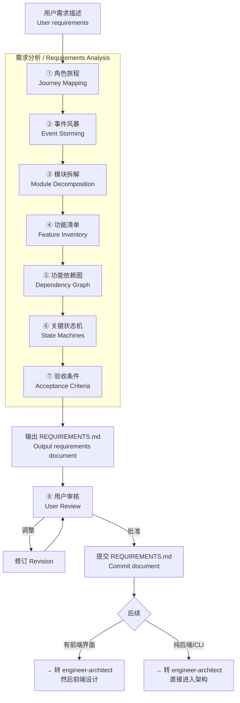
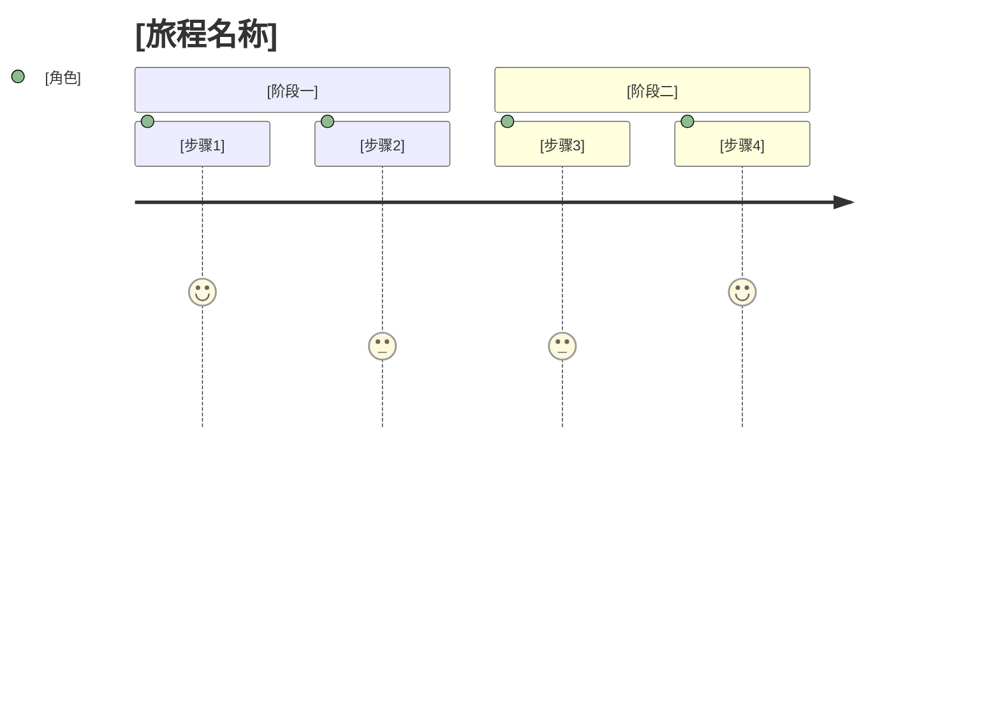
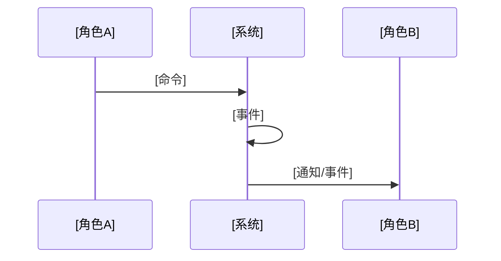
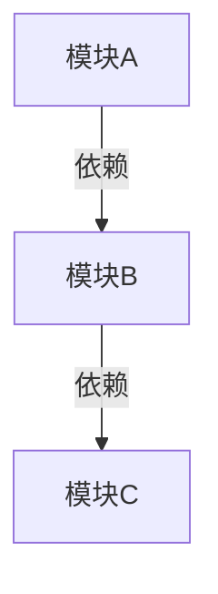
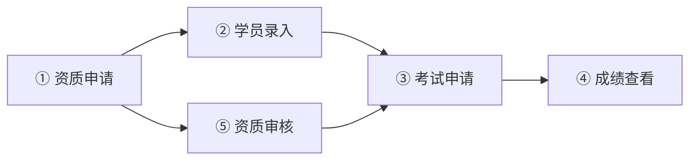
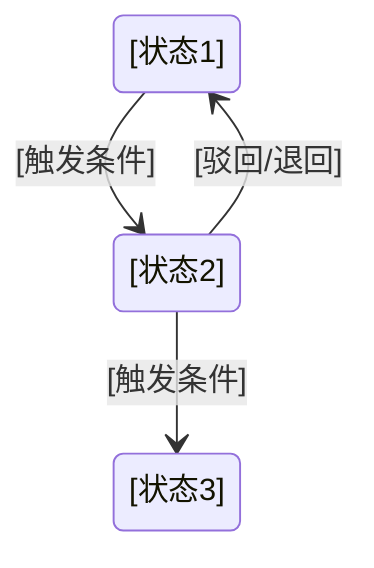

# engineer-requirements — AI 需求分析师 / AI Requirements Analyst

> **来源声明**: 本 skill 的方法论结合了 Event Storming 和《基于实现规划的 AI 辅助编程实战》。
>
> **参考文档**: `references/requirements-template.md`（REQUIREMENTS.md 模板）

---

## 🎯 核心理念 / Core Philosophy

大多数 AI 编码项目失败不是因为代码写得不好，而是**需求没有被充分分解**。

模糊的需求 → 模糊的架构 → 模糊的代码 → 漫长的返工。

这个 skill 存在的唯一理由：**在架构师开始画蓝图之前，先把需求的每一层纹理摊开。**

### 四条核心原则

#### 原则一：角色旅程先行 / Journey First

不同角色看到的是不同的系统。先按角色走通核心旅程，再谈功能拆解。

AOPA 示例 — 机构管理员旅程：
> 注册/资质申请 → 学员录入 → 考试申请 → 上传资料包 → 查看成绩 → 财务对账

AOPA 示例 — AOPA 管理员旅程：
> 审核机构资质 → 审核考试申请 → 审核视频 → 管理证书打印 → 财务报表

#### 原则二：事件驱动发现 / Events Drive Discovery

业务事件是理解系统的入口。先找出"发生了什么"，再往回推导"为什么会发生"和"发生后会怎样"。

**什么是业务事件？** 领域专家关心的、有业务意义的事情。不是技术事件（"数据库写入成功"），而是业务事件（"考试申请已提交"）。

#### 原则三：状态即骨架 / States Are the Skeleton

有审批流转的系统，状态机是需求文档的核心骨架。确定一个业务对象的所有可能状态和合法转移，比列出所有功能更重要。

**AOPA 关键状态机示例 — 考试申请**：
```
草稿 → 已提交 → 审核中 → 审核通过 → 已安排考试 → 考试完成 → 成绩已同步
                  ├→ 审核驳回 → 草稿（修改后可重新提交）
```

#### 原则四：可验证性 / Verifiability

每条需求都应附带一个可验证的验收条件。验收条件是"一句人话"——让人类（和 AI）都能判断这个功能是否已完成。

> ✅ 机构提交提现申请 → 管理端审核通过 → 财务打款 → 机构端看到流水记录
> ❌ "提现功能完整"

---

## 🚦 触发条件 / When to Trigger

**必须触发**此 skill 当以下条件满足：

**新项目场景（与 architect 配合）：**
- 用户描述了一个多模块/多端系统（2+ 前端端，或 5+ 功能模块）
- 用户说"需求拆解"、"分析需求"、"梳理需求"
- 用户提供了较长的需求文档（如本文档的 AOPA 需求长度）
- engineer-architect 在初步需求收敛后判断复杂度较高

**不触发：**
- 单功能需求（直接转 engineer-workflow）
- 用户已经提供了结构清晰的需求文档，只需开始设计
- 用户明确说"不用分析，直接做"

---

## ⚙️ 模式选择 / Mode Selection

通过 `--mode` 参数控制确认程度（默认 normal）：

| 模式 | 行为 |
|:----:|------|
| normal | 每步展示待确认；关键状态机需要用户验证 |
| auto | 使用 AI 推荐的默认值自动推进 |
| silent | 全部自动，仅记录日志 |

---

## 🏗️ 需求分析工作流 / Requirements Analysis Workflow



### 第一步：角色旅程 / Journey Mapping

**目标**：识别所有用户角色，为每个角色绘制端到端核心业务流程。

**行动**：
1. 从需求中提取所有用户角色
2. 为每个角色画出 1-2 个核心旅程
3. 标记每个旅程涉及的系统端

**输出格式**：

```markdown
## 角色旅程 / User Journeys

### 角色总览

| 角色 | 使用端 | 核心目标 |
|:----|:------|:---------|
| [角色名] | [PC / 小程序 / 移动端] | [一句话描述核心目标] |

### [角色名] — 核心旅程


```

示例（AOPA — 机构管理员核心旅程）：
```markdown
### 机构管理员 — 考试申请旅程

1. 登录机构端 → 2. 管理学员（确认学员已录入） → 3. 选择考试类型
→ 4. 提交考试申请 → 5. 上传资料包（合同+名单+培训资料）
→ 6. 等待管理端审核 → 7. 查看考次安排 → 8. 通知学员参加考试
→ 9. 查看考试成绩
```

### 第二步：事件风暴 / Event Storming

**目标**：识别关键业务事件，建立事件流。

**行动**：
1. 列出所有业务事件（橙色便签）
2. 每个事件追溯触发它的命令（蓝色便签）
3. 每个事件识别由哪个聚合处理（黄色便签）
4. 对事件按时间线排序

**输出格式**：

```markdown
## 事件风暴 / Event Storming

### 关键业务事件

| 事件 | 触发命令 | 处理聚合 | 后续事件 |
|:----|:--------|:--------|:---------|
| [事件名] | [命令] | [聚合名] | [下一个事件] |

### 事件流


```

### 第三步：模块拆解 / Module Decomposition

**目标**：识别有界上下文（Bounded Context），将系统拆分为独立模块。

**行动**：
1. 按业务领域而非技术层次划分模块
2. 识别模块间的关系（上下游、共享内核、发布语言等）
3. 模块数量 3-8 个为宜，超过 8 个考虑是否需要合并

**输出格式**：

```markdown
## 模块拆解 / Module Decomposition

### 模块总览

| 模块 | 英文名 | 核心职责 | 涵盖功能数 | 涉及端 |
|:----|:------|:--------|:---------:|:------|
| [模块名] | [English] | [一句话职责] | N | [端列表] |

### 模块间依赖



### 模块间契约
| 提供模块 | 消费模块 | 契约形式 | 说明 |
|---------|---------|---------|------|
| [模块A] | [模块B] | [API/事件/共享模型] | [说明] |
```

如果模块超过 3 个，**自动生成 CONTEXT-MAP.md** 作为副产品。

### 第四步：功能清单 / Feature Inventory

**目标**：完整列出每条功能，标注归属端、CRUD 类型、优先级。

**行动**：
1. 按模块列出所有功能
2. 每条功能标注所属端
3. 标注 CRUD 类型
4. MVP 优先

**输出格式**：

```markdown
## 功能清单 / Feature Inventory

### [模块名]

| # | 功能 | 归属端 | CRUD | 优先级 | 备注 |
|:-:|:----|:------|:----:|:------:|:-----|
| 1 | [功能名] | [机构端/管理端/...] | C/R/U/D | P0/P1/P2 | [补充说明] |
```

### 第五步：功能依赖图 / Dependency Graph

**目标**：识别功能之间的依赖关系，计算 DAG。

**行动**：
1. 对每条功能，确定其前置功能
2. 构建有向无环图
3. 标记关键路径（最长依赖链）

**输出格式**：

```markdown
## 功能依赖图 / Dependency Graph


```

### 第六步：关键状态机 / State Machines

**目标**：定义核心业务对象的状态流转。

**行动**：
1. 识别有状态流转的业务对象
2. 列出所有可能状态
3. 定义合法转移路径
4. 定义每个状态下的可见操作

**输出格式**：

```markdown
## 关键状态机 / State Machines

### [业务对象名] — 状态机



| 当前状态 | 允许操作 | 下一状态 | 触发条件 | 执行者 |
|---------|:--------|:--------|---------|:------|
| [状态1] | [操作] | [状态2] | [条件] | [角色] |
```

AOPA 示例 — 考试申请状态机：
```markdown
stateDiagram-v2
    draft --> submitted : 机构提交申请
    submitted --> under_review : 管理端开始审核
    under_review --> approved : 审核通过
    under_review --> rejected : 审核驳回
    rejected --> draft : 机构修改后重提
    approved --> exam_scheduled : 安排考试
    exam_scheduled --> exam_completed : 考试完成
    exam_completed --> results_synced : 成绩同步
```

### 第七步：验收条件 / Acceptance Criteria

**目标**：每条功能附带可验证的验收条件。

**原则**：
- 一句话描述（不写 Given/When/Then）
- 可以被人类和非技术人员理解
- 覆盖核心路径 + 1 个主要异常路径

**异常路径示例**：
> 机构提交考试申请时缺少资料包 → 系统提示"请上传完整资料包" → 申请无法提交

**输出格式**：

```markdown
## 验收条件 / Acceptance Criteria

| # | 功能 | 核心验收条件 | 异常路径 |
|:-:|:----|:------------|:---------|
| 1 | [功能名] | [核心路径描述] | [异常1: 处理方式] |
```

---

## 输出：REQUIREMENTS.md

完整的 `REQUIREMENTS.md` 文档格式详见 `references/requirements-template.md`。

---

## 与 engineer-architect 的衔接

Phase 1（engineer-requirements）完成后：

1. `REQUIREMENTS.md` 保存到项目根目录
2. Phase 2（engineer-architect）读取 `REQUIREMENTS.md` 作为输入
3. architect 的"词汇表"直接从 REQUIREMENTS.md 的模块拆解和业务事件中提取

---
