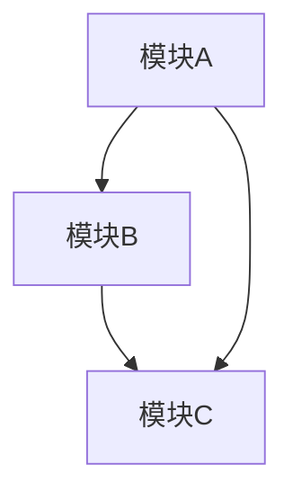
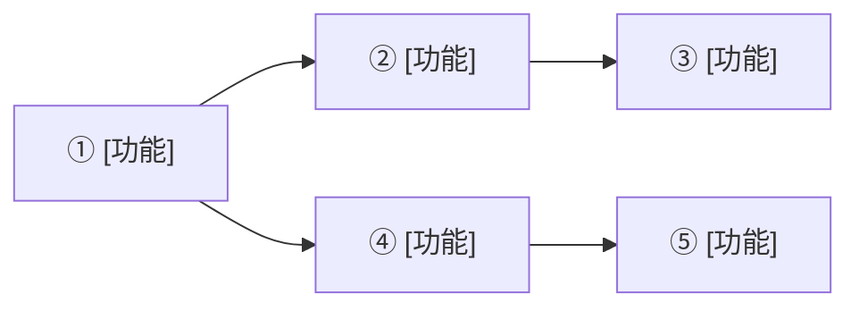
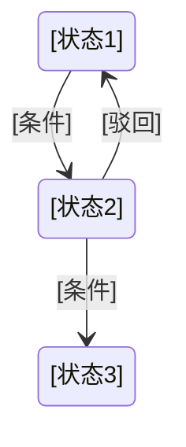

# REQUIREMENTS.md 模板 / Requirements Document Template

> 由 engineer-requirements 技能在 Phase 1 生成。
> 用作 engineer-architect（Phase 2）的输入文档。

---

# [项目名称] — 需求分析文档 / Requirements Analysis

## 1. 角色定义 / User Roles

| 角色 | 使用端 | 核心职责 |
|:----|:------|:---------|
| [角色A] | [PC / Mobile / 小程序] | [一句话职责] |
| [角色B] | [PC / Mobile / 小程序] | [一句话职责] |

## 2. 角色旅程 / User Journeys

### [角色A] — 核心旅程

```
[步骤1] → [步骤2] → [步骤3] → [步骤4]
```

### [角色B] — 核心旅程

```
[步骤1] → [步骤2] → [步骤3]
```

...

## 3. 事件风暴 / Event Storming

### 关键业务事件

| 事件 | 触发者 | 触发命令 | 后续事件 |
|:----|:------|:--------|:---------|
| [事件名] | [角色] | [操作] | [下一个事件] |

### 事件流

[事件流描述或图表]

## 4. 模块拆解 / Module Decomposition

### 模块总览

| 模块 | 英文名 | 核心职责 | 功能数 | 涉及端 |
|:----|:------|:--------|:------:|:------|
| [模块名] | [English] | [一句话职责] | N | [端列表] |

### 模块间依赖



### 模块间契约

| 提供方 | 消费方 | 契约形式 | 说明 |
|--------|--------|---------|------|
| [模块A] | [模块B] | API / Events | [说明] |

## 5. 功能清单 / Feature Inventory

### [模块名]

| # | 功能 | 归属端 | CRUD | 优先级 |
|:-:|:----|:------|:----:|:------:|
| 1 | [功能名] | [端] | C | P0 |
| 2 | [功能名] | [端] | R | P0 |
| ... | ... | ... | ... | ... |

## 6. 功能依赖图 / Dependency Graph



**关键路径**: [最长依赖链的描述]

## 7. 关键状态机 / State Machines

### [业务对象] — 状态机



| 当前状态 | 允许操作 | 下一状态 | 条件 | 执行者 |
|---------|:--------|:--------|------|:------|
| [状态1] | [操作] | [状态2] | [条件] | [角色] |

## 8. 验收条件 / Acceptance Criteria

| # | 功能 | 核心路径 | 异常路径 |
|:-:|:----|:---------|:---------|
| 1 | [功能名] | [核心路径描述] | [异常及处理] |
| 2 | [功能名] | [核心路径描述] | [异常及处理] |

---

## 附录：术语表 / Glossary

| 领域术语 | 英文 | 定义 | 所属模块 |
|---------|------|:----|:--------|
| [术语] | [English] | [定义] | [模块] |
