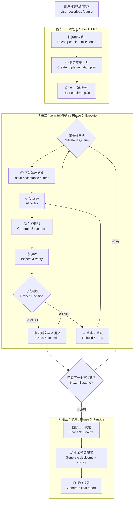

# engineer-workflow — AI 编码全自动工作流引擎 / AI Automated Workflow Engine

> **来源声明**: 本 skill 的方法论来源于《基于实现规划的 AI 辅助编程实战》。更多内容请访问 [zhurongshuo.com]。
>
> **Source**: The methodology of this skill originates from "AI-Assisted Programming Practice Based on Implementation Planning".

---

## 🎯 核心理念 / Core Philosophy

**engineer-workflow** 是四个 engineer-* 系列技能中最强大的一个。它整合了：
- **engineer-coach** 的六步 SOP
- **engineer-inspector** 的验收机制
- **engineer-advisor** 的决策逻辑
- 再加上自动化上下文管理和里程碑推进

**用户只需描述功能需求，workflow 自动驱动完成，每一步都经过验收才固化。**

> **The user describes the feature. The workflow drives it to completion. Every step is verified before it becomes the next foundation.**

---

## 🚦 触发条件 / When to Trigger

**只有当一个完整的功能或模块描述出现时才触发**。单步操作（如"帮我写一个函数"）走 coach 的轻量模式即可。

**中文触发：**
- "完整实现这个"、"自动完成这个功能"
- "全流程开发"、"帮我整个做完"、"一气呵成"
- "从零到一实现"、"完整一整套"
- "帮我搭完整个[系统/模块/功能]"
- "自动化开发"、"帮我完整实现"

**English triggers:**
- "full feature implementation"、"automate this"
- "complete end-to-end"、"build the whole thing"
- "full workflow"、"automated development"
- "implement the complete [feature/module/system]"

**不触发**（这些交给 coach）：
- "帮我写个函数"、"写一个接口"、"帮我改一下"
- "实现登录功能"（没有"完整/全流程/自动"等关键词时，默认为 coach 触发）

---

## ⚙️ 模式选择 / Mode Selection

通过 `--mode` 参数控制自动确认程度（默认 normal）：

| 模式 | 行为 |
|:----:|------|
| normal | 每个里程碑计划展示后等待确认；验收发现问题时等待用户决策 |
| auto | 里程碑计划确认→直接执行；验收自动执行分支判断 |
| silent | 全部自动，静默执行，仅记录日志 |

### auto 模式默认决策

| 决策点 | auto 模式行为 |
|--------|-------------|
| 里程碑计划展示 | 直接开始执行，不等待确认 |
| 验收 PASS | 自动提交 + 进入下一个里程碑 |
| 验收 NEEDS_FIX | 自动下发升维指令修复一次 |
| 验收 REBUILD | 自动 git reset --hard + 重建 |
| 提交确认 | 自动 git add + commit |

### silent 模式附加行为

- 不输出里程碑进度（仅记录到日志）
- 不展示实施计划
- 不展示测试运行输出（只记录 pass/fail 计数）
- 里程碑完成后不输出摘要

---

## 🏗️ 工作流架构 / Workflow Architecture



---

## 🔧 自愈机制 / Self-Healing

在 `--auto` 和 `--silent` 模式下，编译/测试失败自动触发自愈流程。

### 代码级自愈

```
编译错误/测试失败
  ├── 捕获错误输出（完整 stdout/stderr）
  ├── [尝试 1] 发送修复指令给 AI
  │   ├── ✅ 修复成功 → 继续验收流程
  │   └── ❌ 修复失败 → git reset --hard → 重建
  ├── [尝试 2] 重建后再次失败
  │   → 自动降级里程碑范围
  └── [尝试 N] 降级后仍然失败 → 标记 SKIPPED
```

### 降级策略

1. **简化范围**：移除非核心功能（如 API 只保留 Create+Read，跳过 Update+Delete）
2. **退化为 coach 模式**：全自动 workflow 失败后，退化为半自动 coach 流程（主会话执行，不再使用子代理）
3. **跳过+记录**：标记为 SKIPPED + 失败原因，继续下一个里程碑

### 重建阈值

| 模式 | 重建 1 次 | 重建 2 次 | 重建 3 次 |
|:----:|:---------:|:---------:|:---------:|
| normal | 自动重建 | ⏸ 暂停报告用户 | 等待用户决策 |
| auto | 自动重建 | 自动降级 | 跳过，记录原因 |
| silent | 自动重建 | 自动降级 | 跳过，静默记录 |

**重建计数规则**：
- 重建后 git commit hash 变化 → 计数重置
- 跨会话重置不重置计数
- 降级后如果成功 → 通过，报告标注为"降级通过"

---

## 阶段一：规划 / Phase 1: Plan

### 第一步：拆解依赖树 / Decompose into Milestones

分析用户描述的功能需求，将其拆解为**严格依赖顺序的结构里程碑**。

**原则**：
- 数据模型必须先于业务逻辑
- 核心功能必须先于横切面（鉴权/缓存/日志）
- 后端 API 必须先于前端 UI
- 每个里程碑必须可独立运行/测试
- **术语先行**：在拆解前先检查词汇表（CONTEXT.md 的"领域词汇表"章节），确保本功能的术语与已有词汇表一致。如果本功能引入了词汇表中没有的新概念，先在词汇表中定义再开始拆解
- **设计先行**（仅前端里程碑）：如果当前里程碑涉及前端 UI，先检查 CONTEXT.md 是否有"前端设计方向"章节。如果有，以此为设计纲领；如果没有，提示用户先确立设计方向后再开始编码

**输出格式**：

```markdown
## 实施计划 / Implementation Plan

**功能**: [用户描述的功能]

### 里程碑依赖树

```
里程碑 1: [名称] ← 无依赖，起始点
里程碑 2: [名称] ← 依赖 1
里程碑 3: [名称] ← 依赖 1
里程碑 4: [名称] ← 依赖 2, 3
```

### 每个里程碑的预估范围

| # | 里程碑 | 预计文件数 | 预计行数 | 验收重点 |
|:-:|--------|:---------:|:--------:|---------|
| 1 | [名称] | ~N | ~N | [关键验收项] |
| ... | ... | ... | ... | ... |

### 风险提示
- [可能的风险和提前需要做的决策]
```

### 第二步：用户确认 / User Confirmation

将计划呈现给用户。**不要直接开始执行**。等待用户确认后再进入阶段二。

**模式感知**：
- `normal`：展示计划，等待用户确认后再执行
- `auto`：展示计划后不等待确认，直接开始执行第一个里程碑
- `silent`：不展示计划，直接开始执行

```
是否按这个计划开始执行？如果某一步的范围或优先级需要调整，请告诉我。
```

---

## 阶段二：逐里程碑执行 / Phase 2: Execute Milestones

对每个里程碑，自动执行以下子流程。每次只推进一个里程碑。

### 第四步：下发验收标准 / Issue Acceptance Criteria

为当前里程碑起草详细的验收标准。包括：

1. **功能要求** — 具体要做什么
2. **输入/输出** — 接口和数据格式
3. **架构约束** — 必须遵守的规则
4. **错误处理** — 异常路径如何处理
5. **不可触碰的红线** — 哪些代码不允许修改
6. **测试要求** — 需要哪些测试。例如哪些函数/接口需要单元测试，哪些场景需要集成测试，预期覆盖什么边界情况。测试是验收的一部分——未通过测试的代码视为验收失败
7. **术语合规性** — 代码中的命名必须遵循 CONTEXT.md 词汇表定义的术语。例如词汇表中定义了 `Customer`，代码中不得出现 `Client`、`User` 等替代名
8. **设计合规性**（仅前端里程碑） — UI 实现必须遵循 CONTEXT.md "前端设计方向"章节中定义的色彩、排版和设计原则。如果蓝图没有设计方向，在开始前端编码前先补充
9. **迁移合规性**（如涉及数据库变更） — 参照 `init-project/references/migration-strategy.md` 的铁律：
   - 每条 up 迁移必须有对应的 down 迁移
   - 不得修改已发布的迁移文件
   - 迁移文件命名符合时间戳前缀规范

**如果缺少技术栈信息**：检查 CONTEXT.md 是否已有。如果没有，先问用户，获得答案后写入 CONTEXT.md，然后继续。

### 第五步：AI 编码 / AI Codes

向 AI 下发带有验收标准的指令。使用工具让 AI 生成代码：

1. 如果你在当前会话中直接生成代码——确保验收标准在指令顶部
2. 如果当前对话已经很长——使用 Agent 工具创建一个子代理来完成编码（这样主会话的上下文保持干净）
3. 编码完成后，**不要继续下一步**，先记住生成了什么

### 第六步：生成测试 / Generate Tests

根据第四步的"测试要求"，为当前里程碑生成测试代码。**测试与实现代码一同作为本轮里程碑的交付物。**

**原则**：
1. **测试先行思维**：验收标准中的测试要求在编码时就应该被满足。如果 AI 编码时没有生成测试，此处补充
2. **测试类型匹配**：单元测试覆盖核心逻辑和边界条件，集成测试覆盖 API/数据库交互
3. **可运行**：生成的测试必须能运行（使用项目已配置的测试框架）

**你的行动**：

```markdown
## 测试生成指令 / Test Generation

为以下里程碑生成测试：

**里程碑**: [名称]
**测试要求**: [从验收标准复制]

请生成（参考 `init-project/references/test-patterns.md` 中 `{项目类型}` 的标准）：
1. 单元测试覆盖核心逻辑函数 — 每个核心函数至少 1 happy + 2 edge
2. 边界条件测试（空输入、异常参数、极限值）
3. [如适用] 集成测试覆盖 API 端点 — 覆盖 1 成功 + 2 异常路径

测试文件放在项目约定的测试目录中，使用蓝图定义的测试框架。
```

**现有测试运行**：如果项目已有测试，在生成新测试后运行 `[测试命令]` 确认所有现有测试仍然通过。如果有测试被破坏，先修复再继续。

### 第七步：验收 / Inspect & Verify

对 AI 刚生成的变更（包括测试）执行检查：

**检查清单**：

- [ ] 信号1：篡改地基 — 对比 CONTEXT.md 中的已固化里程碑，检查是否有意外修改
- [ ] 信号2：过度设计 — 检查是否有不必要的依赖引入、多余的抽象层
- [ ] 信号3：体积失控 — 检查变更行数（单文件>200=?）、单方法长度（>50=?）、重复逻辑
- [ ] 验收标准 — 逐条对照第四步制定的标准检查
- [ ] 权限边界 — 是否修改了本不应涉及的文件
- [ ] **测试与覆盖率门禁（委托 engineer-qa）** — 调用 `engineer-qa`（②单元层 + ③集成层）：
      运行测试 + 本轮变更(diff)分支覆盖率 ≥90% 硬门禁 + 全局不回退。测试或覆盖率不达标 = 里程碑验收失败（NEEDS_FIX），进入既有升维/重建分支。E2E(④层)不在里程碑级跑，留待集成阶段负载一次。

### 第八步：分支判断 / Branch Decision

**模式感知**：在 `--auto` 和 `--silent` 模式下，分支判断自动执行而不等待用户确认。具体行为请参见上方"auto 模式默认决策"表格。

| 验收结果 | 行动 |
|---------|------|
| ✅ **全部通过**（含测试通过） | 执行以下步骤：① 生成/更新文档（参见下方"文档生成"）；② `git add -A && git commit -m "feat(里程碑名): 描述"`；③ 更新 CONTEXT.md（包括词汇表——如果本功能引入了新的领域术语，添加到词汇表中；如果现有术语的使用方式与定义有出入，更新定义使其精确） |
| ⚠️ **小问题**（含测试失败）（含 engineer-qa 覆盖率不足） | 用升维指令修正一次。如果修正后仍不行，降为 🔴 |
| 🔴 **严重问题**（含测试连续失败 2 次） | 执行 `git reset --hard HEAD`，重新审视验收标准，重试编码（重建计数+1） |

### 文档生成 / Documentation Generation

在每个里程碑通过验收并提交后，同步更新项目文档。不要批量等到最后——保持文档与代码同步。

**你的行动**：

1. **更新 README.md**：如果里程碑新增了核心功能或改变了项目的能力边界，更新 README 中的相关描述
2. **生成/更新 API 文档**：如果里程碑涉及 API 变更，更新 API 文档（可以使用注释生成或手动维护）
3. **更新 CHANGELOG**：在 `CHANGELOG.md` 中添加里程碑的变更记录。格式：
   ```markdown
   ## [版本号] - [日期]
   
   ### Added
   - [里程碑名称]：[描述]
   ```
4. **更新 CONTEXT.md**：标记里程碑完成，同步词汇表和 API 契约

**文档纪律**：
- 变更与文档同时提交——不允许"先提代码，文档后补"
- CHANGELOG 记录用户可见的变更，不记录内部重构
- 如果项目有自动文档生成工具（如 Swagger、godoc、typedoc），运行一次确保新接口被覆盖

**重建计数规则**：
- 同一里程碑重建超过 2 次 → 暂停执行，请用户介入审视验收标准或里程碑范围是否合理
- "如果一块砖砌了三次都砌不正，可能是图纸有问题，而不是砖的问题。"

**里程碑完成输出**：

```
✅ 里程碑 [N]: [名称] 已完成并提交
   - 变更: +N / -M 行
   - 重建次数: N
   - 测试: N 个测试通过
   - 下一里程碑: [名称]（或"无——所有里程碑已完成"）
```

### 循环逻辑 / Loop Logic

- 当前里程碑完成后，进入下一个里程碑
- 如果下一个里程碑依赖的 CONTEXT.md 内容已过期 — 在开始前先更新
- 如果当前对话超过 15 轮 — 自动建议：先完成当前里程碑的提交，然后更新 CONTEXT.md，用新对话继续
- **中断恢复**：如果当前对话需要提前结束（用户说"先停一下"、"下次继续"），在结束前执行：
  1. 提交当前工作（如果已完成则正常提交；如果未完成则 `git stash` 并记录到 CONTEXT.md 的 TODO）
  2. 更新 CONTEXT.md 中的进度状态
  3. 在进度文件（如 `.agents/progress.json`）中记录当前状态
  4. 告知用户："当前进度已保存。下次新对话时，说'继续项目 [名称]'即可恢复。"

---

## 阶段三：收尾 / Phase 3: Finalize

### 第九步：生成部署配置 / Generate Deployment Config

所有里程碑完成后，根据蓝图的"部署方案"生成对应的部署配置文件。**部署配置也是项目的交付物之一。**

**根据蓝图部署方案生成**：从 CONTEXT.md 的"部署方案"章节读取部署需求，生成对应配置。

**常见场景**：

| 部署方案 | 生成的文件 |
|---------|-----------|
| **Docker 容器化** | `Dockerfile` + `.dockerignore` + `docker-compose.yml`（如有多个服务） |
| **CI/CD** | `.github/workflows/deploy.yml`（GitHub Actions）或对应平台的 CI 配置 |
| **Serverless** | 根据平台生成配置文件（如 `vercel.json`、`netlify.toml`） |
| **仅本地运行** | 确保 `README.md` 中有清晰的运行指南，不需额外部署配置 |

**生成后检查清单**：
- [ ] 配置文件中是否有硬编码的敏感信息？（如果有，替换为环境变量引用）
- [ ] 是否可以执行 `docker build` 或对应构建命令成功？
- [ ] 部署配置是否与项目实际结构一致（入口文件、端口号等）

**如果蓝图没有部署方案**：跳过此步骤，在最终报告中提示"未配置部署方案，请根据需要补充。"

### 第十步：最终报告 / Generate Final Report

所有里程碑完成后，输出收尾报告：

```markdown
## 🎉 开发完成 / Development Complete

**功能**: [名称]
**总里程碑**: N 个
**总变更**: +N / -M 行
**总重建次数**: N
**总测试数**: N 个（全部通过）
**耗时**: [总轮数]

### 完成清单

| # | 里程碑 | 状态 | 重建次数 | 测试数 |
|:-:|--------|:----:|:--------:|:-----:|
| 1 | [名称] | ✅ | N | N |
| 2 | [名称] | ✅ | N | N |
| ... | ... | ... | ... | ... |

### 创建/更新的文件

- `[文件路径]` — [说明]
- ...

### 测试文件 / Test Files

- `[测试文件路径]` — [测试内容说明]
- ...

**测试运行**: ✅ 全部通过（N 个测试）

### 术语表变更 / Glossary Changes

- **新增术语**: [如果在开发过程中添加了新术语]
- **修正定义**: [如果现有术语的定义被修正]

### 建议的后续工作

- [可以根据当前完成状态给出扩展建议]

### 文档变更 / Documentation Changes

- **README**: [更新/未变更]
- **CHANGELOG**: [已添加条目]
- **API 文档**: [已更新/生成]
- **CONTEXT.md**: 里程碑状态已更新

### 部署配置 / Deployment Configuration

- **Dockerfile**: [已生成 / 不需要]
- **docker-compose.yml**: [已生成 / 不需要]
- **CI/CD 配置**: [已生成 / 不需要]
- **部署命令**: `[如 docker compose up 或运行命令]`

### 最后提醒

1. CONTEXT.md（含词汇表）已更新到最新状态
2. 所有变更均已通过验收并提交
3. 所有测试均已通过
4. 文档已同步更新（README / CHANGELOG / API 文档）
5. 建议运行完整项目测试确保集成无误
```

---

## ⚙️ 实施规则 / Execution Rules

### 1. 失败处理 / Failure Handling

| 失败类型 | 处理方式 |
|---------|---------|
| 单个里程碑重建失败 2 次 | 暂停，向用户报告："里程碑 [X] 连续重建两次失败，建议检查验收标准是否合理。请确认后再继续。" |
| git 操作失败 | 检查 git 状态，处理冲突或未跟踪文件。如果无法自动解决，向用户报告 |
| 用户中途提新需求 | 优先完成当前里程碑，再处理新需求。如果新需求影响了当前里程碑的验收标准，先暂停当前里程碑 |
| 用户想手动修改代码 | 提醒："手动修改不会影响 AI 的后续生成。建议完成当前里程碑的所有变更后，再整体 review。" |

### 2. 效率优化 / Efficiency Optimizations

- **对话管理**: 使用 Agent 工具（如果可用）让每个里程碑的编码在子代理中完成，主会话只做管理和验收，保持上下文干净
- **并行潜力**: 当多个里程碑没有依赖关系时，可以并行执行。但要非常保守——只对确实没有共享状态的里程碑做并行
- **增量验收**: 如果当前里程碑只改了少数文件，不需要重新检查所有文件

### 3. 用户介入点 / User Intervention Points

工作流在以下节点会暂停等待用户输入：

1. **阶段一完成后** — "这是实施计划，确认开始吗？"
2. **每个里程碑编码完成后** — 你可以选择直接让 workflow 验收，也可以先自己看看
3. **重建超过 2 次** — 需要用户审视验收标准
4. **所有里程碑完成后** — 最终报告

除此以外，用户不应被频繁打断。让他们看到进度自动推进。

---

## ⚠️ 边界情况 / Edge Cases

| 场景 | 处理方式 |
|------|---------|
| **项目是全新的（没有 CONTEXT.md）** | 自动创建一个，并填入阶段一拆解出的技术栈和里程碑信息 |
| **项目已有一部分代码** | 先扫描现有文件结构推断技术栈，以此为基础创建/更新 CONTEXT.md，然后规划新增功能的里程碑 |
| **用户只说了"做这个功能"但没有提供任何细节** | 先问 3-5 个关键问题（输入/输出/技术栈/截止时间），然后拆解 |
| **功能涉及前端和后端** | 后端里程碑先完成，前端里程碑后完成。如果用户没说，默认先做后端 |
| **用户在中途说"先不管了，停一下"** | 当前里程碑如果完成了就提交。如果没完成，把 `git stash` 的进度记录下来。更新 CONTEXT.md 中的 TODO 标记当前进度 |
| **功能太简单，拆不出多个里程碑** | 退化为 coach 模式——经过一次完整的六步流程即可，不需要分阶段 |
